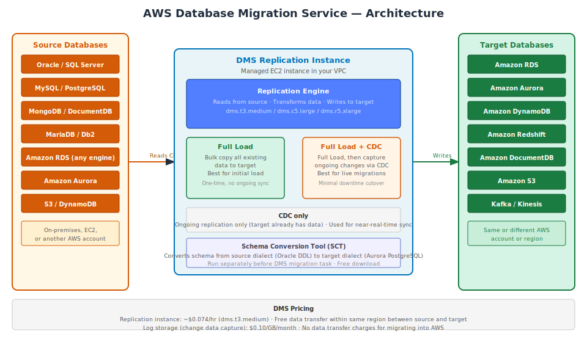

# Part 1: AWS Database Migration Service (DMS)

---

## Table of Contents

1. [What is AWS DMS](#1-what-is-aws-dms)
2. [How DMS Works — Components](#2-how-dms-works--components)
3. [Migration Types](#3-migration-types)
4. [Source and Target Support Matrix](#4-source-and-target-support-matrix)
5. [AWS Schema Conversion Tool (SCT)](#5-aws-schema-conversion-tool-sct)
6. [Setting Up a Migration Task — Step by Step](#6-setting-up-a-migration-task--step-by-step)
7. [Change Data Capture (CDC) in Depth](#7-change-data-capture-cdc-in-depth)
8. [Common Migration Scenarios](#8-common-migration-scenarios)
9. [Data Validation and Monitoring](#9-data-validation-and-monitoring)
10. [DMS Limitations](#10-dms-limitations)
11. [Pricing](#11-pricing)
12. [Migration Checklist](#12-migration-checklist)

---

## 1. What is AWS DMS

**AWS Database Migration Service (DMS)** is a managed service that migrates databases to AWS with minimal downtime. It supports homogeneous migrations (e.g., MySQL → MySQL on RDS), heterogeneous migrations (e.g., Oracle → Aurora PostgreSQL), and ongoing replication for near-real-time data sync between systems.

DMS runs as a managed replication instance (an EC2 instance) inside your VPC. You do not manage the server — AWS handles patching, monitoring, and failover. You configure the migration task (source, target, type) and DMS handles the rest.

**Key capabilities:**
- Migrate from on-premises, EC2-hosted, or cloud databases to AWS
- Support for over 20 source and target database engines
- Near-zero downtime for live production database migrations using CDC
- Heterogeneous migration with schema conversion via the Schema Conversion Tool
- Continuous replication for ongoing sync (multi-region, multi-account)



---

## 2. How DMS Works — Components

### Replication Instance

A managed EC2 instance that runs the migration engine. It connects to both the source and target, reads data from the source, applies transformations, and writes to the target.

**Sizing the replication instance:**

| Instance Class | vCPU | RAM | Use Case |
|---|---|---|---|
| `dms.t3.micro` | 2 | 1 GB | Testing only |
| `dms.t3.medium` | 2 | 4 GB | Small migrations (<100 GB) |
| `dms.c5.large` | 2 | 4 GB | CPU-intensive transformations |
| `dms.r5.large` | 2 | 16 GB | Large datasets, LOB columns |
| `dms.r5.xlarge` | 4 | 32 GB | High-throughput ongoing replication |

Multi-AZ replication instances: DMS provisions a standby in a second AZ. Automatic failover in ~1–2 minutes. Recommended for ongoing CDC tasks.

### Endpoints

DMS connects to your databases via **endpoints** — configurations that define the connection details, engine type, credentials, and SSL settings.

```bash
# Create a source endpoint (MySQL on-premises)
aws dms create-endpoint \
  --endpoint-identifier source-mysql \
  --endpoint-type source \
  --engine-name mysql \
  --username migrationuser \
  --password "YourPassword" \
  --server-name mysql-server.yourcompany.com \
  --port 3306 \
  --database-name appdb \
  --region us-east-1

# Create a target endpoint (Aurora PostgreSQL)
aws dms create-endpoint \
  --endpoint-identifier target-aurora-pg \
  --endpoint-type target \
  --engine-name aurora-postgresql \
  --username migrationuser \
  --password "YourPassword" \
  --server-name aurora-pg.cluster-abc.us-east-1.rds.amazonaws.com \
  --port 5432 \
  --database-name appdb \
  --region us-east-1
```

### Replication Task

A task defines:
- Source endpoint
- Target endpoint
- Migration type (full load, CDC, full load + CDC)
- Table mappings (include/exclude rules, column transformations)

```bash
# Create a replication task
aws dms create-replication-task \
  --replication-task-identifier app-migration \
  --source-endpoint-arn arn:aws:dms:us-east-1:123456789012:endpoint:source-mysql \
  --target-endpoint-arn arn:aws:dms:us-east-1:123456789012:endpoint:target-aurora-pg \
  --replication-instance-arn arn:aws:dms:us-east-1:123456789012:rep:prod-replication-instance \
  --migration-type full-load-and-cdc \
  --table-mappings file://table-mappings.json \
  --replication-task-settings file://task-settings.json \
  --region us-east-1
```

---

## 3. Migration Types

### Full Load

Copies all existing data from the source to the target. No ongoing sync. The source database is still being written to during the migration, so the target will be out of sync by the time the load completes.

**Use when:** Source database can be taken offline for a maintenance window, or the dataset is small enough to re-sync manually.

### Full Load + CDC

Performs a full load first, then switches to CDC to apply all changes that occurred during and after the full load. This keeps the target current while the full load runs.

**Use when:** This is the standard approach for production migrations with minimal downtime.

**Process:**
1. Full load starts — all existing rows are copied
2. DMS records a start position in the source transaction log (binlog/redo log/WAL)
3. Full load completes
4. DMS switches to CDC mode — applies all changes since the recorded start position
5. Replication lag approaches zero — target is nearly current
6. Cutover window: stop writes to source, wait for lag to reach 0, switch application to target

### CDC Only

Applies ongoing changes from source to target. Assumes the target already contains the base data (either migrated via a separate process or existing copy).

**Use when:**
- Source and target databases are already in sync
- You need ongoing near-real-time replication (e.g., replicating RDS to a different region)
- You are using DMS as a continuous sync pipeline rather than a one-time migration

---

## 4. Source and Target Support Matrix

### Supported Sources

| Engine | Full Load | CDC |
|---|---|---|
| Oracle | ✓ | ✓ (using LogMiner or Binary Reader) |
| SQL Server | ✓ | ✓ (MS-REPLICATION or MS-CDC) |
| MySQL / MariaDB | ✓ | ✓ (binlog required) |
| PostgreSQL | ✓ | ✓ (pglogical or test_decoding) |
| MongoDB | ✓ | ✓ (using oplog) |
| Amazon RDS (any engine) | ✓ | ✓ |
| Amazon Aurora | ✓ | ✓ |
| Amazon S3 | ✓ | ✓ (S3 as source for data load) |
| IBM Db2 | ✓ | ✓ |
| SAP ASE | ✓ | ✓ |

### Supported Targets

| Engine | Support |
|---|---|
| Amazon RDS (MySQL, PostgreSQL, Oracle, SQL Server, MariaDB) | Full Load + CDC |
| Amazon Aurora (MySQL, PostgreSQL) | Full Load + CDC |
| Amazon DynamoDB | Full Load + CDC |
| Amazon Redshift | Full Load + CDC |
| Amazon DocumentDB | Full Load + CDC |
| Amazon S3 | Full Load + CDC |
| Amazon Kinesis Data Streams | CDC |
| Amazon MSK (Kafka) | CDC |
| Amazon OpenSearch | Full Load + CDC |
| On-premises databases | Full Load + CDC |

---

## 5. AWS Schema Conversion Tool (SCT)

For **heterogeneous migrations** (e.g., Oracle → Aurora PostgreSQL, SQL Server → MySQL), the database schema, stored procedures, triggers, and views need to be converted from the source dialect to the target dialect. DMS does not perform schema conversion — that is SCT's job.

### When SCT is Required

| Migration | SCT Needed? |
|---|---|
| Oracle → Aurora PostgreSQL | Yes |
| SQL Server → Aurora MySQL | Yes |
| Oracle → RDS Oracle | No (same engine) |
| MySQL → Aurora MySQL | No (same engine) |
| MySQL → Aurora PostgreSQL | Yes |
| On-premises PostgreSQL → RDS PostgreSQL | No |

### SCT Process

1. **Download and install SCT** (free tool, runs on your local machine)
2. **Connect to source database** — SCT analyzes the schema
3. **View assessment report** — SCT categorizes objects as:
   - Automatically converted (no action required)
   - Action items (require manual intervention — marked with risk level)
4. **Convert the schema** — SCT generates DDL for the target engine
5. **Fix action items manually** — stored procedures, complex PL/SQL, non-portable code
6. **Apply converted schema** to the target database
7. **Run DMS migration task** to migrate data

```
Download SCT: aws.amazon.com/dms/schema-conversion-tool

SCT Assessment Report example output:
  Total objects: 2,450
  Automatically converted: 1,890 (77%)
  Action items: 560 (23%)
    High: 45 objects (require significant manual work)
    Medium: 180 objects
    Low: 335 objects
```

---

## 6. Setting Up a Migration Task — Step by Step

### Step 1: Prerequisites

**On the source database:**

For MySQL/RDS MySQL — enable binary logging:
```sql
-- Check if binlog is enabled
SHOW VARIABLES LIKE 'log_bin';
-- Should return: log_bin = ON

-- Required binlog format
SHOW VARIABLES LIKE 'binlog_format';
-- Should return: binlog_format = ROW

-- Grant replication permissions to DMS user
CREATE USER 'dmsuser'@'%' IDENTIFIED BY 'password';
GRANT REPLICATION SLAVE, REPLICATION CLIENT, SELECT ON *.* TO 'dmsuser'@'%';
```

For PostgreSQL/Aurora PostgreSQL — enable logical replication:
```sql
-- Requires: wal_level = logical (set in parameter group, requires restart)
-- Check:
SHOW wal_level;  -- Should return 'logical'

-- Grant permissions
CREATE USER dmsuser WITH PASSWORD 'password';
GRANT rds_replication TO dmsuser;
GRANT SELECT ON ALL TABLES IN SCHEMA public TO dmsuser;
```

For Oracle — enable archivelog and supplemental logging:
```sql
-- Enable supplemental logging
ALTER DATABASE ADD SUPPLEMENTAL LOG DATA;
ALTER TABLE schema.table ADD SUPPLEMENTAL LOG DATA ALL COLUMNS;
```

### Step 2: Create the Replication Instance

```bash
aws dms create-replication-instance \
  --replication-instance-identifier prod-migration \
  --replication-instance-class dms.r5.large \
  --allocated-storage 100 \
  --vpc-security-group-ids sg-abc12345 \
  --replication-subnet-group-identifier my-subnet-group \
  --multi-az \
  --publicly-accessible false \
  --engine-version 3.5.1 \
  --region us-east-1
```

### Step 3: Test Endpoint Connections

```bash
# Test the source endpoint
aws dms test-connection \
  --replication-instance-arn arn:aws:dms:...:rep:prod-migration \
  --endpoint-arn arn:aws:dms:...:endpoint:source-mysql \
  --region us-east-1

# Check the test result
aws dms describe-connections \
  --filters Name=endpoint-arn,Values=arn:aws:dms:...:endpoint:source-mysql \
  --region us-east-1
```

### Step 4: Create Table Mapping Rules

Table mappings control which tables are migrated and how they are transformed.

```json
{
  "rules": [
    {
      "rule-type": "selection",
      "rule-id": "1",
      "rule-name": "include-all-tables",
      "object-locator": {
        "schema-name": "appdb",
        "table-name": "%"
      },
      "rule-action": "include"
    },
    {
      "rule-type": "selection",
      "rule-id": "2",
      "rule-name": "exclude-logs-table",
      "object-locator": {
        "schema-name": "appdb",
        "table-name": "application_logs"
      },
      "rule-action": "exclude"
    },
    {
      "rule-type": "transformation",
      "rule-id": "3",
      "rule-name": "lowercase-schema",
      "rule-action": "convert-lowercase",
      "rule-target": "schema",
      "object-locator": {
        "schema-name": "%"
      }
    }
  ]
}
```

### Step 5: Monitor Task Progress

```
AWS Console → DMS → Database migration tasks → [your task]
→ Table statistics tab: shows per-table row counts (loaded, inserts, deletes, updates)
→ Task monitoring tab: latency, CDCLatencySource, CDCLatencyTarget
```

```bash
# Check replication lag
aws cloudwatch get-metric-statistics \
  --namespace AWS/DMS \
  --metric-name CDCLatencyTarget \
  --dimensions Name=ReplicationInstanceIdentifier,Value=prod-migration \
  --start-time $(date -u -d '1 hour ago' +%Y-%m-%dT%H:%M:%SZ) \
  --end-time $(date -u +%Y-%m-%dT%H:%M:%SZ) \
  --period 60 \
  --statistics Average \
  --region us-east-1
```

---

## 7. Change Data Capture (CDC) in Depth

CDC tracks changes to the source database and applies them to the target in near-real-time. DMS reads from the source database's transaction log.

### How CDC Works by Engine

| Source Engine | CDC Method | Prerequisite |
|---|---|---|
| MySQL / MariaDB | Binary log (binlog) | `log_bin=ON`, `binlog_format=ROW` |
| PostgreSQL | Logical Replication (pglogical) | `wal_level=logical` |
| Aurora MySQL | Binary log | Enabled by default in Aurora |
| Aurora PostgreSQL | Logical Replication | `rds.logical_replication=1` |
| Oracle | LogMiner or Binary Reader | Archivelog mode + supplemental logging |
| SQL Server | MS-REPLICATION or MS-CDC | CDC enabled on database |
| MongoDB | Oplog | Replica set required |

### CDC Lag

CDC lag has two components:
- `CDCLatencySource`: lag between changes occurring in source and DMS reading them
- `CDCLatencyTarget`: lag between DMS reading changes and writing them to target

Monitor both in CloudWatch. Target lag should be under 1 second for near-real-time replication.

**Factors that increase CDC lag:**
- Large transaction batches on source (DMS must wait for commit before applying)
- High write throughput on source exceeding replication instance capacity
- Large LOB (Large Object) columns — DMS processes LOBs differently (requires extra reads)
- Network latency between source and replication instance

---

## 8. Common Migration Scenarios

### Scenario 1: MySQL on EC2 → RDS MySQL (Homogeneous, Minimal Downtime)

No schema conversion needed. Straightforward migration.

**Process:**
1. Create RDS MySQL target with same engine version
2. Create DMS endpoints for EC2 MySQL source and RDS target
3. Create task: Full Load + CDC
4. Monitor until replication lag approaches 0 (typically 1–5 seconds steady state)
5. Cutover window (off-peak):
   - Stop application writes
   - Wait for CDC lag to reach 0 seconds
   - Point application connection string to RDS endpoint
   - Confirm reads/writes working
   - Decommission EC2 MySQL

**Downtime:** ~30 seconds (application stop + connection string update)

### Scenario 2: Oracle On-Premises → Aurora PostgreSQL (Heterogeneous)

Schema conversion required. The most complex migration type.

**Process:**
1. Run SCT: Oracle → Aurora PostgreSQL
   - Export DDL: tables, views, indexes
   - Convert stored procedures (PL/SQL → PL/pgSQL)
   - Review and fix action items manually
   - Apply converted schema to Aurora PostgreSQL
2. Create DMS task: Full Load + CDC (Oracle source, Aurora PostgreSQL target)
3. Run full load — DMS handles data type conversions
4. Apply CDC to sync ongoing changes
5. Validate data (row counts, checksums via DMS data validation feature)
6. Cutover

**Migration effort:** Medium to high (depends on PL/SQL complexity). AWS estimates 75–90% of schema objects can be auto-converted by SCT for Oracle → PostgreSQL.

### Scenario 3: MySQL/PostgreSQL → DynamoDB

Requires careful data modeling — you must design DynamoDB keys before migration.

```json
{
  "rules": [
    {
      "rule-type": "object-mapping",
      "rule-id": "1",
      "rule-name": "map-orders",
      "rule-action": "map-record-to-record",
      "object-locator": {
        "schema-name": "appdb",
        "table-name": "orders"
      },
      "target-table-name": "Orders",
      "mapping-parameters": {
        "partition-key-name": "UserID",
        "sort-key-name": "OrderDate",
        "attribute-mappings": [
          {
            "target-attribute-name": "UserID",
            "attribute-type": "scalar",
            "value": "${user_id}"
          },
          {
            "target-attribute-name": "OrderDate",
            "attribute-type": "scalar",
            "value": "${created_at}"
          }
        ]
      }
    }
  ]
}
```

### Scenario 4: On-Premises Database → RDS (Ongoing Sync)

For ongoing replication (not a one-time migration), use CDC-only mode. Source and target are kept in sync continuously.

**Use case:** Gradual migration — run both systems in parallel, route some traffic to AWS, gradually shift 100% to AWS.

```bash
# Start CDC-only task (assumes full load was done separately)
aws dms create-replication-task \
  --migration-type cdc \
  --cdc-start-time "2024-01-15T10:00:00Z" \
  [other parameters]
```

### Scenario 5: Cross-Region Database Replication

Replicate an RDS database from `us-east-1` to `eu-west-1` using DMS.

```bash
# Source endpoint in us-east-1
# Target endpoint in eu-west-1
# Replication instance can be in either region
# Recommended: replication instance in target region (reduces transfer costs)
```

**Note:** For cross-region RDS replication within the same engine, consider RDS Read Replicas first — they are simpler to configure. DMS cross-region replication is appropriate when you need heterogeneous engines or need to replicate to a non-RDS target.

---

## 9. Data Validation and Monitoring

### DMS Data Validation Feature

DMS can compare row counts and data checksums between source and target during and after migration.

```bash
# Enable validation in task settings
{
  "ValidationSettings": {
    "EnableValidation": true,
    "ValidationOnly": false,
    "ThreadCount": 5,
    "FailureMaxCount": 10000,
    "TableFailureMaxCount": 1000,
    "ValidationQueryCdcDelaySeconds": 0,
    "ValidationMode": "ROW_LEVEL"
  }
}
```

After enabling, DMS reports:
- Tables validated: number that passed
- Tables suspended: tables with validation issues
- Mismatched rows: rows that differ between source and target

### CloudWatch Metrics

| Metric | Description | Alert Threshold |
|---|---|---|
| `CDCLatencySource` | Seconds behind source transaction log | Alert if > 60 seconds sustained |
| `CDCLatencyTarget` | Seconds between DMS reading and writing | Alert if > 30 seconds |
| `FreeableMemory` | Available RAM on replication instance | Alert if < 10% |
| `CPUUtilization` | Replication instance CPU | Alert if > 80% sustained |
| `WriteIOPS` | I/O write ops per second | Baseline for sizing |
| `FullLoadThroughputRowsTarget` | Rows written per second (full load) | Monitor for performance |

---

## 10. DMS Limitations

### What DMS Does NOT Migrate

- **Secondary indexes:** Only the primary key is created. All secondary indexes must be created on the target separately (after migration, for performance — creating indexes on a populated table is faster than maintaining them during data load).
- **Stored procedures and triggers:** Not migrated by DMS. Use SCT or migrate manually.
- **Views:** Not migrated by DMS in full load mode. Must be recreated on the target.
- **Sequences:** Oracle sequences must be recreated manually.
- **Constraints:** Foreign key constraints — DMS does not enforce them during migration. Create them after the full load completes.
- **Database users and permissions:** Not migrated. Must be recreated on the target.

### LOB (Large Object) Column Handling

Tables with BLOB, CLOB, TEXT, BYTEA, or IMAGE columns require special configuration. DMS has three LOB modes:

| Mode | Behavior | Use When |
|---|---|---|
| Limited LOB mode | Truncates LOBs to `LobMaxSize` | Most LOBs are small; truncation acceptable |
| Full LOB mode | Migrates full LOB content (slower) | LOBs must be preserved completely |
| Inline LOB mode | Migrates LOBs ≤ inline limit inline; larger LOBs via lookup | Balance of speed and completeness |

Large LOBs significantly reduce migration throughput. For tables with many large LOBs, size the replication instance with more RAM.

### Engine-Specific Limitations

| Engine | Limitation |
|---|---|
| MySQL | CDC requires binlog retention > task duration |
| PostgreSQL | Replication slots must be cleaned up after migration |
| Oracle | Requires `LOGMINER_PRIVILEGES` or `DBA` role |
| MongoDB | Array types migrated as string (JSON) in relational targets |

---

## 11. Pricing

| Component | Price |
|---|---|
| Replication instance (dms.t3.medium) | $0.074/hr (~$53/month) |
| Replication instance (dms.r5.large) | $0.228/hr (~$164/month) |
| Replication instance Multi-AZ surcharge | 2× single-AZ price |
| Change data capture log storage | $0.10/GB/month |
| Data transfer (inbound to AWS) | Free |
| Data transfer (between AZs, same region) | $0.01/GB |
| DMS Free Tier | 750 hrs/month of `dms.t2.micro` for first 6 months |

**Cost for a typical migration (1 week, `dms.r5.large`, Multi-AZ):**
```
7 days × 24 hrs × $0.456/hr (Multi-AZ) = ~$76.61
Log storage: 10 GB × $0.10 = $1.00
Total: ~$78
```

After migration completes, delete the replication instance — it accrues costs even when idle.

---

## 12. Migration Checklist

### Pre-Migration

- [ ] Document all database objects (tables, views, procedures, triggers, indexes, sequences)
- [ ] Run SCT for heterogeneous migrations; resolve all action items
- [ ] Enable CDC prerequisites on source (binlog, WAL level, archivelog)
- [ ] Create DMS user with required permissions on source and target
- [ ] Create target database with converted schema
- [ ] Create indexes on target **without data** initially (add after full load)
- [ ] Test DMS endpoint connections
- [ ] Size replication instance based on dataset size and LOB presence
- [ ] Plan the cutover window (off-peak, stakeholder notification)

### During Migration

- [ ] Monitor `CDCLatencySource` and `CDCLatencyTarget` — should approach 0
- [ ] Monitor replication instance CPU and memory
- [ ] Check table validation status if data validation is enabled
- [ ] Keep source database binlog/WAL retention long enough for the full load duration

### Cutover

- [ ] Confirm CDC lag is < 5 seconds
- [ ] Stop application writes to source
- [ ] Wait for CDC lag to reach 0
- [ ] Create remaining indexes on target (if deferred)
- [ ] Update application connection string to point to target
- [ ] Verify application functionality on target
- [ ] Stop DMS replication task
- [ ] Delete replication instance (ends billing)

### Post-Migration

- [ ] Monitor target database performance for 24–48 hours
- [ ] Clean up: DMS endpoints, replication instance, SCT assessment reports
- [ ] For PostgreSQL: drop replication slot on source (`SELECT pg_drop_replication_slot('slot_name')`)
- [ ] Decommission source database after verification period

---

**Where DMS Fits in the Database Services Section:**

Database Migration Service applies to all database migrations — RDS, Aurora, DynamoDB, DocumentDB, Redshift. It is placed here as a standalone section rather than under any specific database because it serves as the bridge between all of them. When migrating TO a specific service, refer to both this section and the destination service's notes for database-specific preparation steps (e.g., RDS parameter group setup, DynamoDB data modeling, Aurora PostgreSQL WAL configuration).
