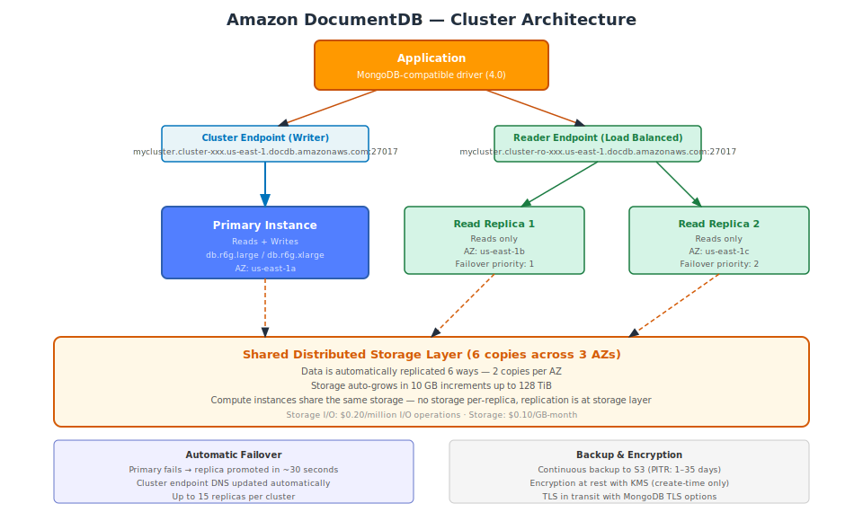

# Part 1 — Amazon DocumentDB Fundamentals & Architecture

## Table of Contents

1. [What is Amazon DocumentDB](#1-what-is-amazon-documentdb)
2. [MongoDB Compatibility](#2-mongodb-compatibility)
3. [Core Concepts — Documents, Collections, Databases](#3-core-concepts--documents-collections-databases)
4. [Cluster Architecture](#4-cluster-architecture)
5. [Storage Layer](#5-storage-layer)
6. [Endpoints and Connectivity](#6-endpoints-and-connectivity)
7. [DocumentDB vs Alternatives](#7-documentdb-vs-alternatives)
8. [Pricing Overview](#8-pricing-overview)
9. [When to Use and When to Avoid](#9-when-to-use-and-when-to-avoid)

---

## 1. What is Amazon DocumentDB

Amazon DocumentDB is a **fully managed document database** built for storing, querying, and indexing JSON documents. It is designed to be API-compatible with MongoDB, which means existing MongoDB applications and drivers can connect to DocumentDB with minimal configuration changes.

Under the hood, DocumentDB is not a fork of MongoDB. Amazon built it from the ground up using the same distributed storage architecture that powers Aurora. The MongoDB-compatible API layer is built on top of this custom storage engine. The implication: DocumentDB provides Aurora-level availability and durability (6-way storage replication), but the query execution engine may behave differently from MongoDB on complex aggregation pipelines or advanced features.

### Core Properties

- **Document model**: Data is stored as JSON documents (internally stored as BSON — Binary JSON).
- **Schema-flexible**: Each document in a collection can have a different structure.
- **MongoDB API compatibility**: Works with MongoDB 4.0-compatible drivers.
- **Fully managed**: AWS handles patching, backups, replication, and failover.
- **Serverless option**: DocumentDB Elastic Clusters scale compute capacity automatically based on workload (separate from the standard cluster model).

---

## 2. MongoDB Compatibility

DocumentDB implements a subset of the MongoDB 4.0 API. Most CRUD operations, aggregation pipeline stages, and indexing options work identically. Some advanced MongoDB features are not supported.

### Supported

- CRUD operations: `insertOne`, `insertMany`, `find`, `findOne`, `updateOne`, `updateMany`, `deleteOne`, `deleteMany`, `replaceOne`
- Aggregation pipeline: `$match`, `$group`, `$sort`, `$project`, `$unwind`, `$lookup` (basic join), `$limit`, `$skip`, `$count`, `$addFields`, `$facet`, `$bucket`, `$bucketAuto`
- Indexing: single-field, compound, multi-key (arrays), sparse, unique, partial, TTL indexes
- Transactions: multi-document ACID transactions (MongoDB 4.0 transactions API)
- Array operators: `$push`, `$pull`, `$addToSet`, `$pop`, `$each`
- Operators: `$inc`, `$set`, `$unset`, `$rename`, `$currentDate`, `$mul`

### Not Supported or Partially Supported

| Feature | Status |
|---|---|
| MongoDB Atlas Search (Lucene full-text) | Not supported — use OpenSearch for full-text |
| `$graphLookup` (recursive graph traversal) | Not supported — use Neptune for graph queries |
| `changeStreams` (real-time change feed) | Supported via native DocumentDB change streams (different event structure than MongoDB) |
| MongoDB 5.0+ features (time-series collections, native JSON Schema validation) | Not supported |
| `$lookup` with pipeline (MongoDB 3.6+) | Partially supported |
| Map-reduce | Deprecated path — use aggregation pipeline |
| Geospatial (2dsphere, `$near`, `$geoWithin`) | Supported |

Always test your specific workload against DocumentDB before migrating. AWS provides a [MongoDB compatibility checklist](https://docs.aws.amazon.com/documentdb/latest/developerguide/mongo-apis.html) in the official documentation.

---

## 3. Core Concepts — Documents, Collections, Databases

### Document

A document is a JSON object stored in DocumentDB. Fields can be nested objects or arrays. There is no required schema — documents in the same collection can have different fields.

```json
{
  "_id": "ORDER-001",
  "customerId": "CUST-123",
  "status": "shipped",
  "createdAt": "2024-12-01T10:00:00Z",
  "items": [
    {"productId": "PROD-A", "quantity": 2, "price": 29.99},
    {"productId": "PROD-B", "quantity": 1, "price": 49.99}
  ],
  "shippingAddress": {
    "street": "123 Main St",
    "city": "Seattle",
    "state": "WA",
    "zip": "98101"
  },
  "totalAmount": 109.97
}
```

The `_id` field is the primary identifier. If you do not provide it, DocumentDB generates an `ObjectId`. `_id` values must be unique within a collection.

### Collection

A collection is a group of documents. It is equivalent to a table in relational databases. Collections do not enforce a schema. You can insert a document with any structure into any collection.

Collections are created implicitly when you insert the first document:

```javascript
// No CREATE TABLE equivalent — insert creates the collection
db.orders.insertOne({ _id: "ORDER-001", status: "pending" });
```

### Database

A DocumentDB cluster can contain multiple databases. Each database contains its own set of collections. Databases are also created implicitly:

```javascript
use myapp;  // Selects/creates the database named "myapp"
```

### BSON Types

DocumentDB stores documents in BSON format, which extends JSON with additional types:

| BSON Type | Description | Example |
|---|---|---|
| `ObjectId` | 12-byte unique identifier | Auto-generated `_id` |
| `String` | UTF-8 string | `"hello"` |
| `Int32` / `Int64` | 32 or 64-bit integer | `42` |
| `Double` | 64-bit floating point | `3.14` |
| `Boolean` | `true` / `false` | |
| `Date` | UTC datetime | `ISODate("2024-12-01")` |
| `Array` | Ordered list | `[1, 2, 3]` |
| `Object` (embedded document) | Nested document | `{"key": "value"}` |
| `Null` | Null value | `null` |
| `Decimal128` | 128-bit decimal (currency) | `NumberDecimal("19.99")` |

---

## 4. Cluster Architecture

A DocumentDB cluster consists of one **primary instance** (handles reads and writes) and up to **15 read replicas** (handle reads only). All instances share the same underlying distributed storage layer.



### Instances

Each instance is a compute node (EC2 instance managed by AWS). Instance types follow the same `db.r6g.*` / `db.r5.*` family as RDS.

| Instance Type | vCPU | Memory | Suitable For |
|---|---|---|---|
| `db.t3.medium` | 2 | 4 GB | Development, testing |
| `db.r6g.large` | 2 | 16 GB | Small production |
| `db.r6g.xlarge` | 4 | 32 GB | Medium production |
| `db.r6g.2xlarge` | 8 | 64 GB | Large production |
| `db.r6g.4xlarge` | 16 | 128 GB | High-throughput |
| `db.r6g.8xlarge` | 32 | 256 GB | Memory-intensive |

### Failover

When the primary instance fails:
1. DocumentDB detects the failure (typically within 10 seconds).
2. The read replica with the highest failover priority tier is promoted to primary.
3. The cluster endpoint DNS is updated to point to the new primary.
4. Total failover time: approximately **30 seconds**.

You control which replica is promoted first by setting **Failover Priority Tier** (0 = highest priority, 15 = lowest) on each replica. A replica with the same tier as another is chosen randomly.

---

## 5. Storage Layer

DocumentDB's storage layer is independent of the compute instances. This is the critical architectural difference from a traditional MongoDB replica set:

- Data is **automatically replicated 6 times** across **3 Availability Zones** (2 copies per AZ).
- Writes are acknowledged after **4 of 6 copies** confirm the write (quorum write). This ensures durability even if one AZ fails.
- Storage capacity **auto-grows in 10 GB increments** up to **128 TiB**. You never provision storage upfront.
- Read replicas do not have their own copy of data — they read from the same shared storage. Adding replicas adds compute capacity (more connections, more read parallelism) without adding storage cost.

### Replication Lag

Because read replicas access the same storage as the primary, replication lag is minimal (typically **< 100ms**). Data changes are propagated to replicas by the storage layer, not by network replication of writes.

This is different from MongoDB replica sets, where each member maintains its own copy of data and replication happens over the network.

---

## 6. Endpoints and Connectivity

### Cluster Endpoint

Points to the current primary instance. Always use this endpoint for write operations. After failover, this endpoint automatically redirects to the new primary.

```
Format: <cluster-id>.cluster-<uuid>.<region>.docdb.amazonaws.com
Port:   27017
```

### Reader Endpoint

Load-balances read connections across all available read replicas. Use this endpoint for read-heavy workloads to distribute the load.

```
Format: <cluster-id>.cluster-ro-<uuid>.<region>.docdb.amazonaws.com
Port:   27017
```

### Instance Endpoints

Each instance has its own endpoint for directing connections to a specific node. Used when you need to control which instance handles a request (e.g., pin an analytics workload to a specific replica).

```
Format: <instance-id>.<uuid>.<region>.docdb.amazonaws.com
```

### Connecting with Python (pymongo)

```python
import pymongo
import certifi

# DocumentDB requires TLS with the Amazon CA certificate
client = pymongo.MongoClient(
    host='mycluster.cluster-xyz.us-east-1.docdb.amazonaws.com',
    port=27017,
    username='admin',
    password='mypassword',
    tls=True,
    tlsCAFile=certifi.where(),  # or path to rds-combined-ca-bundle.pem
    retryWrites=False  # DocumentDB does not support retryWrites=true with transactions in all cases
)

db = client['myapp']
orders = db['orders']

# Insert
result = orders.insert_one({'_id': 'ORD-001', 'status': 'pending'})
print(result.inserted_id)

# Find
order = orders.find_one({'_id': 'ORD-001'})
print(order)

# Update
orders.update_one(
    {'_id': 'ORD-001'},
    {'$set': {'status': 'shipped'}}
)
```

**Important**: Always set `retryWrites=False` in the connection string for DocumentDB. DocumentDB handles write retries differently from MongoDB and some MongoDB drivers' automatic retry logic conflicts with DocumentDB's behavior.

### Download the CA Certificate

```bash
# Download Amazon's CA bundle for TLS verification
wget https://truststore.pki.rds.amazonaws.com/global/global-bundle.pem \
  -O rds-combined-ca-bundle.pem
```

---

## 7. DocumentDB vs Alternatives

| Criteria | DocumentDB | MongoDB Atlas | DynamoDB | RDS PostgreSQL (JSONB) |
|---|---|---|---|---|
| Data model | JSON documents | JSON documents | Key-value + document | Relational + JSONB columns |
| MongoDB compatibility | API-compatible (subset) | Full MongoDB | None | None |
| Schema | Schema-flexible | Schema-flexible | Schema-flexible | Mixed (relational + JSONB) |
| Query language | MongoDB query syntax | MongoDB query syntax (full) | PartiQL or DynamoDB API | SQL |
| Scale model | Vertical + read replicas | Vertical + sharding | Serverless, infinite scale | Vertical + read replicas |
| Max storage | 128 TiB | Configurable | Unlimited | 64 TiB |
| Serverless option | DocumentDB Elastic | Atlas Serverless | Yes (PAY_PER_REQUEST) | Aurora Serverless v2 |
| Full-text search | Limited | Atlas Search (Lucene) | None | pg_trgm, pg_fts |
| Graph queries | None | `$graphLookup` | None | None |
| Multi-region | Via DMS / manual | Atlas Global Clusters | Global Tables | Aurora Global Database |
| Managed backup | PITR (1–35 days) | PITR | PITR (35 days) | PITR (0–35 days) |
| Pricing model | Instance + storage I/O | Instance + storage | Pay per request | Instance + storage |
| AWS-native integration | Strong (IAM, VPC, CloudWatch) | Requires Atlas connector | Native | Native |
| Best fit | AWS-native MongoDB migration | New MongoDB-native apps | Serverless, key-value | Complex relational + some JSON |

### DocumentDB vs MongoDB Atlas Key Trade-off

Choose **DocumentDB** when:
- You are migrating an existing MongoDB application to AWS and want managed infrastructure.
- Your application uses MongoDB 4.0 APIs and does not rely on features added in MongoDB 5.0+.
- You want tight AWS integration (IAM, VPC, CloudWatch, AWS Backup, Security Hub).
- Operational simplicity (no Atlas account management, billing consolidated on AWS).

Choose **MongoDB Atlas** when:
- You need full MongoDB compatibility, including features in MongoDB 5.0, 6.0, 7.0 (time-series, native SBSON, Atlas Search).
- You need Atlas Search for full-text search on document fields.
- You need multi-cloud or on-premises deployment flexibility.
- You are building a new application and MongoDB Atlas features are required.

---

## 8. Pricing Overview

DocumentDB pricing has three components: **instance hours**, **storage**, and **I/O**.

| Component | Price (us-east-1) |
|---|---|
| `db.t3.medium` instance | ~$0.076/hr |
| `db.r6g.large` instance | ~$0.277/hr |
| `db.r6g.xlarge` instance | ~$0.555/hr |
| Storage | $0.10/GB-month |
| I/O | $0.20/million I/O requests |
| Backup storage (beyond free tier) | $0.023/GB-month |
| Data transfer (same region) | Free |

### Free Backup Tier

DocumentDB provides backup storage free of charge equal to the size of your cluster's storage. Only backup storage exceeding the cluster storage size incurs the $0.023/GB-month charge.

### Cost Example

A 3-instance cluster (1 primary + 2 replicas) with `db.r6g.large` nodes, 100 GB storage, and 50 million I/O operations per month:

```
Instance cost:   3 × $0.277 × 730 hours   = $606.81/month
Storage:         100 GB × $0.10            = $10.00/month
I/O:             50M × $0.20/1M            = $10.00/month
Total:           ≈ $627/month
```

The I/O cost can be significant for write-heavy workloads. Monitor `VolumeReadIOPs` and `VolumeWriteIOPs` in CloudWatch to project costs.

---

## 9. When to Use and When to Avoid

### Use DocumentDB When

- Your application uses **MongoDB APIs** and you want a fully managed AWS-native service.
- You need **flexible document storage** where different records have different structures.
- Your data is **hierarchical or nested** (orders with embedded items, user profiles with nested preferences) and JOIN-heavy SQL queries would be cumbersome.
- You need **horizontal read scaling** via read replicas for read-heavy analytical queries.
- Your team prefers to stay within the AWS ecosystem and avoid a separate Atlas subscription.

### Avoid DocumentDB When

- You need **full MongoDB feature parity** (MongoDB 5.0+ features, Atlas Search, `$graphLookup`) — use MongoDB Atlas.
- Your workload is **simple key-value** with no complex querying — use DynamoDB for lower cost and higher scale.
- You need **full-text search** on document content — integrate with OpenSearch.
- You need **graph traversal** between entities — use Neptune.
- Your schema is **well-defined and relational** — a relational database (RDS PostgreSQL, Aurora) is a better fit.
- You need **global multi-region writes** — DocumentDB does not have a Global Tables equivalent.

---

## Key Takeaways

- DocumentDB is MongoDB API-compatible but not a MongoDB fork. It is built on a distributed storage layer shared with Aurora.
- The storage layer replicates data 6 ways across 3 AZs automatically. You pay for storage and I/O, not for replicas' storage.
- Read replicas read from the shared storage layer — replication lag is typically under 100ms and adding replicas does not multiply storage costs.
- Always use the cluster endpoint for writes and the reader endpoint for reads. Set `retryWrites=False` in MongoDB driver connection strings.
- DocumentDB is best suited for migrating existing MongoDB 4.0 applications to AWS. For new applications requiring full MongoDB features, evaluate MongoDB Atlas.
