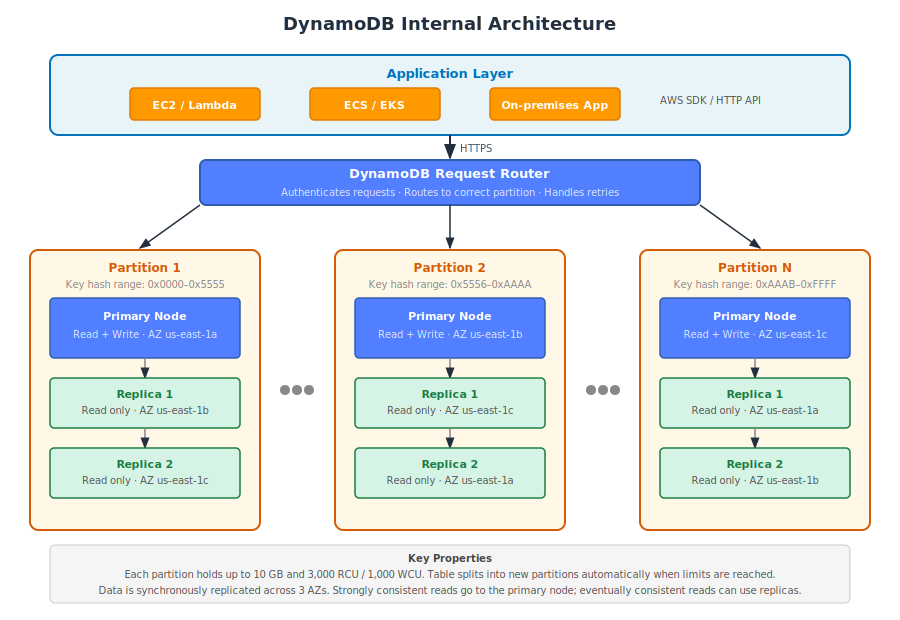
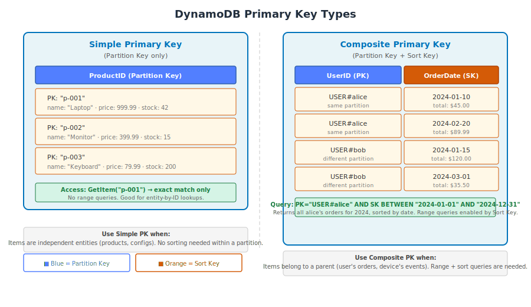

# Part 1: DynamoDB Fundamentals & Data Model

---

## Table of Contents

1. [What is Amazon DynamoDB](#1-what-is-amazon-dynamodb)
2. [How DynamoDB Differs from Relational Databases](#2-how-dynamodb-differs-from-relational-databases)
3. [Core Concepts: Tables, Items, Attributes](#3-core-concepts-tables-items-attributes)
4. [Primary Key Types](#4-primary-key-types)
5. [Attribute Data Types](#5-attribute-data-types)
6. [Capacity Modes: Provisioned vs On-Demand](#6-capacity-modes-provisioned-vs-on-demand)
7. [DynamoDB Internal Architecture: Partitions](#7-dynamodb-internal-architecture-partitions)
8. [DynamoDB vs RDS vs Aurora — Comparison](#8-dynamodb-vs-rds-vs-aurora--comparison)
9. [Pricing Overview](#9-pricing-overview)
10. [When to Use DynamoDB](#10-when-to-use-dynamodb)
11. [Key Terminology](#11-key-terminology)

---

## 1. What is Amazon DynamoDB

**Amazon DynamoDB** is a fully managed, serverless, NoSQL database service that delivers single-digit millisecond performance at any scale. It is designed for applications that require consistent low-latency access to data regardless of the traffic volume.

DynamoDB manages the following automatically — you do not configure any of it:
- Hardware provisioning and server management
- Data replication across three Availability Zones
- Software patching and upgrades
- Storage partitioning and scaling
- Backups (automated daily, point-in-time recovery)

You focus on:
- Designing your data model and access patterns
- Configuring capacity (provisioned or on-demand)
- Defining indexes and TTL policies
- Managing security (IAM policies, VPC endpoints, encryption)

DynamoDB is a **key-value and document store**. It supports flexible item schemas where each item can have a different set of attributes. There is no SQL, no JOINs, and no foreign key constraints.



---

## 2. How DynamoDB Differs from Relational Databases

The fundamental design philosophy differs from relational databases in one critical way:

| Aspect | Relational DB (RDS/MySQL) | DynamoDB |
|---|---|---|
| **Design Approach** | Schema first → write queries as needed | Access patterns first → schema follows |
| **Scaling** | Vertical (larger instance) + read replicas | Horizontal (automatic partition split) |
| **Query Language** | SQL — any query the engine can execute | API calls — key-based only (no ad-hoc queries) |
| **JOINs** | Core feature | Not supported |
| **Schema** | Fixed columns defined at creation | Per-item flexible (only primary key required) |
| **Connections** | Persistent TCP connection pool | HTTP API calls (no connection limits) |
| **Capacity** | Bound by instance size | Effectively unlimited (horizontal partitioning) |
| **Consistency** | Strong by default | Eventual by default; strong consistency opt-in |

### The Access-Pattern-First Requirement

In DynamoDB, every query must specify the Partition Key. The database does not have a query optimizer that can figure out how to retrieve data — you tell it exactly where to look through your key design and indexes. This means **you must know how your application will query the data before you design the table**.

This is the single most important concept in DynamoDB. Skipping this step leads to:
- Full table Scans (reads every item — expensive and slow)
- Costly table restructuring after launch
- Hot partitions and throttling

---

## 3. Core Concepts: Tables, Items, Attributes

### Tables

A **table** is the top-level container for data. There is no concept of a database namespace as in SQL — all tables exist at the account + region level. You reference them directly by name.

You must define:
- Table name
- Primary Key (Partition Key, and optionally Sort Key)
- Capacity mode (provisioned or on-demand)

You do not define columns, schema, or relationships.

### Items

An **item** is a single record in a table, equivalent to a row in SQL. Items in the same table do not need to have the same attributes — only the primary key attributes are required on every item.

Item size limit: **400 KB** per item. This includes all attribute names and values.

### Attributes

An **attribute** is a data field on an item, equivalent to a SQL column. An item can have any number of attributes beyond the primary key.

```json
{
  "UserID": "u-001",
  "OrderID": "ord-2024-0115",
  "Status": "PENDING",
  "TotalAmount": 89.99,
  "Items": [
    { "ProductID": "p-101", "Quantity": 2, "Price": 34.99 },
    { "ProductID": "p-205", "Quantity": 1, "Price": 20.01 }
  ],
  "ShippingAddress": {
    "Street": "123 Main St",
    "City": "New York",
    "State": "NY",
    "Zip": "10001"
  },
  "CreatedAt": "2024-01-15T10:00:00Z"
}
```

Notice:
- `Items` is a List of Maps — fully nested JSON-like structure
- `ShippingAddress` is a Map attribute
- Attributes like `Status` and `TotalAmount` exist on this item but are not required on every item in the table

---

## 4. Primary Key Types

Every item is uniquely identified by its **Primary Key**. DynamoDB supports two forms.



### Simple Primary Key (Partition Key only)

The item is identified by a single attribute — the **Partition Key** (also called Hash Key).

```
Table: Products
Primary Key: ProductID (Partition Key only)

Items:
  { ProductID: "p-001", Name: "Laptop", Price: 999.99 }
  { ProductID: "p-002", Name: "Monitor", Price: 399.99 }
  { ProductID: "p-003", Name: "Keyboard", Price: 79.99 }
```

To retrieve: `GetItem(ProductID="p-001")` — exact match only.

**Use when:** Items are independent entities (products, configs, users) and you only ever access them by a single identifier.

### Composite Primary Key (Partition Key + Sort Key)

The item is identified by **two** attributes — the Partition Key (Hash Key) and the **Sort Key** (Range Key). Two items can share the same Partition Key as long as their Sort Keys differ.

```
Table: UserOrders
Primary Key: UserID (PK) + OrderDate (SK)

Items:
  { UserID: "u-001", OrderDate: "2024-01-10", OrderID: "ord-001", Total: 45.00 }
  { UserID: "u-001", OrderDate: "2024-02-20", OrderID: "ord-002", Total: 89.99 }
  { UserID: "u-002", OrderDate: "2024-01-15", OrderID: "ord-003", Total: 120.00 }
```

Within a Partition Key value (e.g., all items for `u-001`), items are stored sorted by the Sort Key. This enables range queries:

```
Query: UserID = "u-001" AND OrderDate BETWEEN "2024-01-01" AND "2024-12-31"
```

**Use when:** Items belong to a parent entity (orders per user, events per device, messages per conversation). Sort Key enables ordered retrieval and range filtering within a partition.

### Creating a Table via CLI

```bash
# Simple primary key
aws dynamodb create-table \
  --table-name Products \
  --attribute-definitions AttributeName=ProductID,AttributeType=S \
  --key-schema AttributeName=ProductID,KeyType=HASH \
  --billing-mode PAY_PER_REQUEST \
  --region us-east-1

# Composite primary key
aws dynamodb create-table \
  --table-name UserOrders \
  --attribute-definitions \
      AttributeName=UserID,AttributeType=S \
      AttributeName=OrderDate,AttributeType=S \
  --key-schema \
      AttributeName=UserID,KeyType=HASH \
      AttributeName=OrderDate,KeyType=RANGE \
  --billing-mode PAY_PER_REQUEST \
  --region us-east-1
```

### AWS Console Path

```
AWS Console → DynamoDB → Create table
→ Table name: [name]
→ Partition key: [attribute name] + [type: String / Number / Binary]
→ Sort key: [optional]
→ Settings: Default settings or Customize settings
```

---

## 5. Attribute Data Types

DynamoDB supports the following attribute types:

| Type Code | Type | Notes |
|---|---|---|
| **S** | String | Any UTF-8 text. Max 400 KB per item. |
| **N** | Number | Integers and decimals. Stored as string internally; precision up to 38 digits. |
| **B** | Binary | Raw bytes (Base64-encoded when sent via API). |
| **BOOL** | Boolean | `true` or `false`. |
| **NULL** | Null | Explicit null value. |
| **M** | Map | Nested key-value structure (equivalent to JSON object). Keys must be strings. |
| **L** | List | Ordered collection of any types (can mix strings, numbers, maps). |
| **SS** | String Set | Unordered set of unique strings. No duplicates. |
| **NS** | Number Set | Unordered set of unique numbers. |
| **BS** | Binary Set | Unordered set of unique binary values. |

**Important constraints:**
- Primary key attributes can only be String (S), Number (N), or Binary (B)
- Set types cannot be empty — a set with zero elements cannot be stored
- Attribute names count toward the 400 KB item size limit

### Atomic Counters

DynamoDB supports atomic increment/decrement on Number attributes without reading the value first:

```bash
aws dynamodb update-item \
  --table-name Products \
  --key '{"ProductID": {"S": "p-001"}}' \
  --update-expression "ADD ViewCount :inc" \
  --expression-attribute-values '{":inc": {"N": "1"}}' \
  --region us-east-1
```

This is safe under concurrent writes — no read-modify-write race condition.

---

## 6. Capacity Modes: Provisioned vs On-Demand

DynamoDB uses two units to measure throughput:
- **RCU (Read Capacity Unit):** 1 strongly consistent read of up to 4 KB per second. Eventually consistent reads consume 0.5 RCU.
- **WCU (Write Capacity Unit):** 1 write of up to 1 KB per second.

Items larger than 4 KB (reads) or 1 KB (writes) consume proportionally more units.


### Provisioned Capacity Mode

You specify the exact number of RCUs and WCUs your table should support. Requests exceeding provisioned capacity are throttled with a `ProvisionedThroughputExceededException`.

```bash
aws dynamodb create-table \
  --table-name Orders \
  --attribute-definitions AttributeName=OrderID,AttributeType=S \
  --key-schema AttributeName=OrderID,KeyType=HASH \
  --billing-mode PROVISIONED \
  --provisioned-throughput ReadCapacityUnits=100,WriteCapacityUnits=50 \
  --region us-east-1
```

**Auto Scaling (recommended for provisioned):** Configure Application Auto Scaling to automatically adjust capacity based on CloudWatch metrics. Target utilization is typically set to 70%.

```bash
# Register table as a scalable target
aws application-autoscaling register-scalable-target \
  --service-namespace dynamodb \
  --resource-id "table/Orders" \
  --scalable-dimension "dynamodb:table:ReadCapacityUnits" \
  --min-capacity 10 \
  --max-capacity 500

# Set scaling policy
aws application-autoscaling put-scaling-policy \
  --service-namespace dynamodb \
  --resource-id "table/Orders" \
  --scalable-dimension "dynamodb:table:ReadCapacityUnits" \
  --policy-name "ReadScalingPolicy" \
  --policy-type TargetTrackingScaling \
  --target-tracking-scaling-policy-configuration '{
    "TargetValue": 70.0,
    "PredefinedMetricSpecification": {
      "PredefinedMetricType": "DynamoDBReadCapacityUtilization"
    }
  }'
```

**Limitation:** Auto Scaling reacts to sustained load (typically 1–3 minutes). It will not protect you from a sudden spike lasting under 1 minute.

### On-Demand Capacity Mode

No capacity planning required. DynamoDB automatically handles any request volume.

```bash
# Create table with on-demand mode
aws dynamodb create-table \
  --table-name Orders \
  --attribute-definitions AttributeName=OrderID,AttributeType=S \
  --key-schema AttributeName=OrderID,KeyType=HASH \
  --billing-mode PAY_PER_REQUEST \
  --region us-east-1

# Switch existing provisioned table to on-demand
aws dynamodb update-table \
  --table-name Orders \
  --billing-mode PAY_PER_REQUEST \
  --region us-east-1
```

**Switching between modes:** You can switch once every 24 hours.

### Capacity Mode Comparison

| Attribute | Provisioned | On-Demand |
|---|---|---|
| **Capacity planning** | Required (set RCU/WCU) | None |
| **Throttling** | Yes, if exceeded | No (scales automatically) |
| **Auto Scaling** | Supported (minutes to react) | Not applicable |
| **Cost (read)** | $0.00013 per RCU-hour (~$0.09/RCU/month) | $0.25 per million reads |
| **Cost (write)** | $0.00065 per WCU-hour (~$0.47/WCU/month) | $1.25 per million writes |
| **Best for** | Steady, predictable load | Spiky, unpredictable load |
| **Reserved Capacity** | Available (up to 76% discount) | Not available |

**Cost crossover point:** At approximately 200 million reads/month, provisioned (1,000 RCU provisioned) costs the same as on-demand. Above that, provisioned is cheaper.

---

## 7. DynamoDB Internal Architecture: Partitions

Understanding how DynamoDB physically stores data is essential for avoiding the most common production issue: **hot partitions**.

### How Partitioning Works

DynamoDB applies a hash function to each item's Partition Key value to determine which **storage partition** that item lives on. A storage partition:
- Holds up to **10 GB** of data
- Supports up to **3,000 RCU** and **1,000 WCU** per second
- Is replicated across **3 Availability Zones** (1 primary + 2 replicas)

When a partition reaches its storage or throughput limit, DynamoDB **automatically splits** it into two partitions. Partitions are never merged back — a table that experienced high traffic will retain more partitions even if traffic drops.

Your table's total throughput is distributed across its partitions. If a table has 300 RCU provisioned across 3 partitions, each partition handles up to 100 RCU. If one partition receives all the traffic, it is limited to 100 RCU regardless of the other partitions being idle.

### Hot Partitions

A **hot partition** occurs when the majority of reads or writes go to items with the same Partition Key value (or the same hash range bucket). Symptoms:
- `ProvisionedThroughputExceededException` on some items, not others
- High latency on specific key values
- Table-wide throttling even though overall utilization appears low

**Common causes:**
- Sequential IDs or timestamps as the Partition Key (all new writes go to the latest partition)
- A single highly popular item (celebrity product, viral post)
- Status fields with few distinct values used as Partition Key

**Prevention:**
- Use high-cardinality Partition Keys (UUIDs, user IDs, not status or date)
- Add random suffix or prefix to distribute hot keys (e.g., `PRODUCT#p-001#3` where `3` is a random shard 0–9)
- Use On-Demand mode — it has better burst handling, though hot partitions still cap per-key throughput

---

## 8. DynamoDB vs RDS vs Aurora — Comparison

| Dimension | DynamoDB | RDS (MySQL/PostgreSQL) | Aurora |
|---|---|---|---|
| **Type** | NoSQL (key-value + document) | Relational | Relational (MySQL/PostgreSQL compatible) |
| **JOINs** | Not supported | Supported | Supported |
| **Schema** | Flexible per item | Fixed columns | Fixed columns |
| **Scale** | Horizontal (unlimited) | Vertical + read replicas | Vertical + 15 read replicas |
| **Max throughput** | Effectively unlimited | Instance-bound | ~5× RDS, instance-bound |
| **Latency** | Single-digit ms (guaranteed) | 1ms–10s (query-dependent) | 1ms–5s (query-dependent) |
| **Global replication** | Active-active (Global Tables) | Read-only secondary regions | Read-only secondary regions |
| **Transactions** | Supported (max 25 items) | Full ACID | Full ACID |
| **Ad-hoc queries** | Scan only (expensive) | Any SQL query | Any SQL query |
| **Connection model** | HTTP API (no pool needed) | TCP pool (connection limits) | TCP pool (connection limits) |
| **Serverless option** | Yes (native) | No | Aurora Serverless v2 |
| **Managed level** | Fully serverless | Semi-managed (pick instance) | Semi-managed (pick instance) |

**Decision summary:**
- Use DynamoDB for: high-throughput key-based lookups, event-driven/serverless architectures, global active-active, unpredictable traffic
- Use RDS/Aurora for: complex SQL queries, relational integrity, ad-hoc reporting, OLTP with JOINs

---

## 9. Pricing Overview

DynamoDB pricing has three components: storage, read/write requests, and optional features.

### Storage

| Component | Price |
|---|---|
| Storage (Standard class) | $0.25 per GB / month |
| Storage (Standard-IA class) | $0.10 per GB / month (for infrequently accessed data) |

### Read/Write Costs

**Provisioned:**
| Unit | Price |
|---|---|
| 1 RCU (provisioned) | $0.00013 per hour (~$0.094/month) |
| 1 WCU (provisioned) | $0.00065 per hour (~$0.468/month) |

**On-Demand:**
| Operation | Price |
|---|---|
| Read Request Unit | $0.25 per million |
| Write Request Unit | $1.25 per million |
| Transactional Read | $0.50 per million (2× standard) |
| Transactional Write | $2.50 per million (2× standard) |

**Note:** Prices above are for `us-east-1`. Other regions are slightly higher (up to 30%).

### Additional Features (Optional)

| Feature | Price |
|---|---|
| DynamoDB Streams | $0.02 per 100,000 stream read requests |
| Global Tables (replicated writes) | $1.875 per million replicated WRUs (1.5× standard) |
| DAX (caching) | Instance-hour pricing (starts at ~$0.04/hr for `dax.t3.small`) |
| On-demand backup | $0.10 per GB / month |
| Point-in-time recovery (PITR) | $0.20 per GB / month |
| Export to S3 | $0.10 per GB exported |

### Cost Example

**Scenario:** E-commerce orders table — 2 million reads/day, 200,000 writes/day, 50 GB data

**On-Demand:**
- Reads: 60M × $0.25/million = $15.00/month
- Writes: 6M × $1.25/million = $7.50/month
- Storage: 50GB × $0.25 = $12.50/month
- **Total: ~$35/month**

**Provisioned (sized at ~30 RCU + 3 WCU sustained):**
- 30 RCU: 30 × $0.094 = $2.82/month
- 3 WCU: 3 × $0.468 = $1.40/month
- Storage: $12.50/month
- **Total: ~$17/month** (53% cheaper for predictable workload)

---

## 10. When to Use DynamoDB

### Use DynamoDB When

- **Traffic is unpredictable or bursty:** Gaming leaderboards, flash sales, ticketing systems, social feeds during viral events
- **Access patterns are well-defined and simple:** Key lookups, range queries by user or session ID — not ad-hoc analytics
- **Performance SLA requires consistent low latency:** p99 < 10ms regardless of concurrent users
- **Global active-active replication is needed:** DynamoDB Global Tables provides multi-region active-active with ~1 second replication lag
- **Integration with serverless architecture:** Native DynamoDB Streams integration with Lambda; no connection pool management
- **Dataset is large:** Petabyte-scale tables that would not fit on a single RDS instance

### Do Not Use DynamoDB When

- **Queries require JOINs or complex aggregations:** Report generation, analytics, GROUP BY queries — use RDS, Redshift, or Athena
- **Access patterns are not yet defined:** If you are building an internal tool and analysts will write ad-hoc SQL, start with RDS
- **Strict relational integrity is required:** Banking systems, ERP, anywhere you need foreign key constraints enforced by the database
- **Small dataset with complex query needs:** A `db.t3.small` RDS instance ($25/month) handles 10 GB of complex queries more flexibly than DynamoDB
- **The team has no DynamoDB experience and the timeline is short:** DynamoDB modeling mistakes are costly to fix. Budget time for proper design

---

## 11. Key Terminology

| Term | Definition |
|---|---|
| **Table** | Top-level data container. No schema beyond the primary key. |
| **Item** | Single record. Max 400 KB. Only primary key attributes required. |
| **Attribute** | Data field on an item. Can vary per item. |
| **Partition Key (PK)** | Required. Determines storage partition via hash function. Must have high cardinality. |
| **Sort Key (SK)** | Optional. Enables range queries and sorting within a partition. |
| **RCU** | Read Capacity Unit. 1 strongly consistent read up to 4 KB/sec. |
| **WCU** | Write Capacity Unit. 1 write up to 1 KB/sec. |
| **Provisioned Mode** | Pre-defined RCU/WCU. Throttles on excess. Lower cost for steady load. |
| **On-Demand Mode** | Auto-scales. Pay per request. Higher per-request cost. |
| **GSI** | Global Secondary Index. Alternate PK+SK combination. Queryable separately. Eventually consistent. |
| **LSI** | Local Secondary Index. Alternate SK with same PK. Must be created at table creation. |
| **Query** | Retrieves items by Partition Key (exact) and optional Sort Key condition. Efficient. |
| **Scan** | Reads every item in the table. Expensive at scale. |
| **GetItem** | Retrieves a single item by its exact primary key. Fastest read operation. |
| **PutItem** | Writes a single item (creates or replaces). |
| **UpdateItem** | Modifies specific attributes of an existing item. |
| **Conditional Write** | Write succeeds only if a specified condition is true. Used for optimistic locking. |
| **TTL** | Time to Live. Items are automatically deleted after a specified Unix timestamp attribute expires. |
| **DynamoDB Streams** | Ordered changelog of item changes. Used to trigger Lambda functions on data changes. |
| **Global Tables** | Multi-region active-active replication. |
| **DAX** | DynamoDB Accelerator. In-memory cache with microsecond read latency. |
| **Hot Partition** | Partition receiving disproportionate traffic. Causes throttling even when table has available capacity. |
| **Single-Table Design** | Pattern of storing multiple entity types in one table using key prefixes. |

---

**Next:** Part 2 covers Data Modeling and Access Pattern Design — including single-table design, key prefix patterns, and how to model one-to-many and many-to-many relationships without JOINs.
