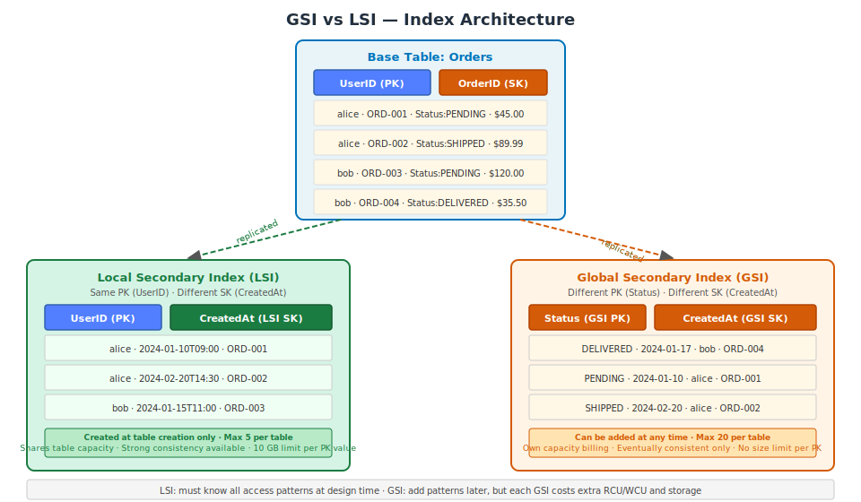

# Part 4: Secondary Indexes — GSI and LSI

---

## Table of Contents

1. [Why Secondary Indexes Exist](#1-why-secondary-indexes-exist)
2. [Local Secondary Index (LSI)](#2-local-secondary-index-lsi)
3. [Global Secondary Index (GSI)](#3-global-secondary-index-gsi)
4. [GSI Write Throttling — Critical Production Issue](#4-gsi-write-throttling--critical-production-issue)
5. [Projection Types: ALL, KEYS_ONLY, INCLUDE](#5-projection-types-all-keys_only-include)
6. [Sparse Indexes](#6-sparse-indexes)
7. [Full Design Example: Orders Table with GSIs](#7-full-design-example-orders-table-with-gsis)
8. [When NOT to Use a GSI](#8-when-not-to-use-a-gsi)
9. [GSI Cost Analysis](#9-gsi-cost-analysis)
10. [IAM Permissions for GSI Queries](#10-iam-permissions-for-gsi-queries)
11. [LSI vs GSI — Decision Reference](#11-lsi-vs-gsi--decision-reference)

---

## 1. Why Secondary Indexes Exist

Every DynamoDB `Query` operation must specify the Partition Key. If your application needs to retrieve items by an attribute other than the primary key, it would need to do a full table `Scan` — which reads every item in the table and filters results client-side. This is expensive at scale.

Secondary indexes provide additional key-based access paths into the same data.

```
Without index:
  "Get all orders with Status=PENDING"
  → Scan entire table (reads all items, filters on Status)
  → Cost: (total_table_items × avg_item_size / 4 KB × 0.5 RCU)
  → 200 GB table = potentially millions of RCU per scan

With GSI on Status:
  → Query GSI partition Status="PENDING"
  → Cost: only the PENDING items' RCU
```

DynamoDB supports two types of secondary indexes:

| Type | Abbreviation | PK Requirement | SK Requirement | Created When | Max per Table |
|---|---|---|---|---|---|
| Local Secondary Index | LSI | Same as base table | Different from base | At table creation only | 5 |
| Global Secondary Index | GSI | Any attribute | Any attribute (optional) | Any time | 20 |



---

## 2. Local Secondary Index (LSI)

### What an LSI Provides

An LSI lets you query with the same Partition Key as the base table but with a different Sort Key. It adds an alternative sort dimension within an existing partition.

**Example:** Base table is `UserOrders` with PK=`UserID` and SK=`OrderID`. An LSI on `CreatedAt` allows queries like "All orders for UserID=alice, sorted by date" — without changing the base table's PK design.

### LSI Constraints

- **Created at table creation only.** This is an immutable constraint. You cannot add an LSI to an existing table. If you need one later, you must create a new table and migrate data.
- **Same Partition Key as base table.** The LSI always uses the same PK attribute.
- **Different Sort Key.** The LSI Sort Key must be a different attribute than the base table Sort Key.
- **Maximum 5 LSIs per table.**
- **10 GB storage limit per Partition Key value.** The total size of all items with the same PK value, across the base table and all its LSIs, cannot exceed 10 GB. Writes that would exceed this limit fail with `ItemCollectionSizeLimitExceededException`.
- **Shares the table's provisioned capacity.** LSI reads and writes consume from the base table's RCU/WCU. No separate billing for LSI.
- **Supports strongly consistent reads.** Because LSI data is co-located with the base table partition, you can request strongly consistent LSI reads. GSIs do not support this.

### Creating a Table with an LSI

```bash
aws dynamodb create-table \
  --table-name UserOrders \
  --attribute-definitions \
      AttributeName=UserID,AttributeType=S \
      AttributeName=OrderID,AttributeType=S \
      AttributeName=CreatedAt,AttributeType=S \
  --key-schema \
      AttributeName=UserID,KeyType=HASH \
      AttributeName=OrderID,KeyType=RANGE \
  --local-secondary-indexes '[
    {
      "IndexName": "UserID-CreatedAt-lsi",
      "KeySchema": [
        {"AttributeName": "UserID", "KeyType": "HASH"},
        {"AttributeName": "CreatedAt", "KeyType": "RANGE"}
      ],
      "Projection": {
        "ProjectionType": "ALL"
      }
    }
  ]' \
  --billing-mode PAY_PER_REQUEST \
  --region us-east-1
```

### Querying via LSI

```bash
# Get all orders for alice, sorted by date (newest first)
aws dynamodb query \
  --table-name UserOrders \
  --index-name UserID-CreatedAt-lsi \
  --key-condition-expression "UserID = :uid AND CreatedAt BETWEEN :start AND :end" \
  --expression-attribute-values '{
    ":uid": {"S": "alice"},
    ":start": {"S": "2024-01-01T00:00:00Z"},
    ":end": {"S": "2024-12-31T23:59:59Z"}
  }' \
  --scan-index-forward false \
  --consistent-read \
  --region us-east-1
```

---

## 3. Global Secondary Index (GSI)

### What a GSI Provides

A GSI creates an entirely separate index with its own Partition Key and optional Sort Key, which can be any attributes in the table. DynamoDB maintains this index automatically, replicating the relevant data asynchronously from the base table.

A GSI behaves like a separate table — it has its own key schema, its own capacity, and its own item collection. Items from the base table are projected into the GSI when the GSI's key attributes are present on the item.

### GSI Key Properties

- **Can be created on any existing table at any time.**
- **Own Partition Key and Sort Key.** Completely independent of the base table's key schema.
- **Own capacity billing.** In provisioned mode, you set RCU and WCU for each GSI separately. These are billed in addition to the base table capacity.
- **Eventually consistent reads only.** GSI data is replicated asynchronously. Strongly consistent reads are not available on GSIs.
- **No 10 GB per-partition limit** (unlike LSI).
- **Maximum 20 GSIs per table.**

### Creating a GSI on an Existing Table

```bash
aws dynamodb update-table \
  --table-name Orders \
  --attribute-definitions \
      AttributeName=Status,AttributeType=S \
      AttributeName=CreatedAt,AttributeType=S \
  --global-secondary-index-updates '[
    {
      "Create": {
        "IndexName": "Status-CreatedAt-gsi",
        "KeySchema": [
          {"AttributeName": "Status", "KeyType": "HASH"},
          {"AttributeName": "CreatedAt", "KeyType": "RANGE"}
        ],
        "Projection": {
          "ProjectionType": "INCLUDE",
          "NonKeyAttributes": ["UserID", "OrderID", "TotalAmount"]
        },
        "ProvisionedThroughput": {
          "ReadCapacityUnits": 20,
          "WriteCapacityUnits": 20
        }
      }
    }
  ]' \
  --region us-east-1
```

When you add a GSI to an existing table, DynamoDB backfills it by scanning the entire base table. During this backfill the table remains fully available, but read consumption increases. The GSI status shows `CREATING` until backfill completes, then becomes `ACTIVE`.

```bash
# Monitor GSI creation progress
aws dynamodb describe-table --table-name Orders \
  --query "Table.GlobalSecondaryIndexes[?IndexName=='Status-CreatedAt-gsi'].{Status:IndexStatus,Backfilling:Backfilling}" \
  --region us-east-1
```

### Querying via GSI

```bash
# Get all PENDING orders created after a date
aws dynamodb query \
  --table-name Orders \
  --index-name Status-CreatedAt-gsi \
  --key-condition-expression "#s = :status AND CreatedAt > :date" \
  --expression-attribute-names '{"#s": "Status"}' \
  --expression-attribute-values '{
    ":status": {"S": "PENDING"},
    ":date": {"S": "2024-01-01T00:00:00Z"}
  }' \
  --scan-index-forward false \
  --region us-east-1
```

Note: `Status` is a DynamoDB reserved word. Use `ExpressionAttributeNames` to alias it.

```python
import boto3
from boto3.dynamodb.conditions import Key

dynamodb = boto3.resource('dynamodb')
table = dynamodb.Table('Orders')

# Query GSI with pagination
response = table.query(
    IndexName='Status-CreatedAt-gsi',
    KeyConditionExpression=Key('Status').eq('PENDING'),
    ScanIndexForward=True,
    Limit=100
)

items = response['Items']
while 'LastEvaluatedKey' in response:
    response = table.query(
        IndexName='Status-CreatedAt-gsi',
        KeyConditionExpression=Key('Status').eq('PENDING'),
        ScanIndexForward=True,
        Limit=100,
        ExclusiveStartKey=response['LastEvaluatedKey']
    )
    items.extend(response['Items'])
```

### Deleting a GSI

```bash
aws dynamodb update-table \
  --table-name Orders \
  --global-secondary-index-updates '[
    {"Delete": {"IndexName": "Status-CreatedAt-gsi"}}
  ]' \
  --region us-east-1
```

Deletion is immediate. Ensure all application code has migrated away from this index before deleting.

---

## 4. GSI Write Throttling — Critical Production Issue

### The Problem

GSI throttling is one of the most common DynamoDB production incidents. The behavior is non-obvious:

**When a GSI's write capacity is exhausted, DynamoDB also throttles writes to the base table.**

DynamoDB cannot commit a write to the base table without also updating all affected GSIs. If any GSI is at capacity, the entire write chain is blocked.

This creates a scenario where your base table write utilization appears low (e.g., 10%), but your table is receiving `ProvisionedThroughputExceededException` errors because a GSI is saturated.

### Monitoring GSI Throttling

In CloudWatch, GSI metrics are separate from base table metrics. You must check them explicitly:

```bash
# Check GSI write throttle events
aws cloudwatch get-metric-statistics \
  --namespace AWS/DynamoDB \
  --metric-name WriteThrottleEvents \
  --dimensions \
      Name=TableName,Value=Orders \
      Name=GlobalSecondaryIndexName,Value=Status-CreatedAt-gsi \
  --start-time $(date -u -d '1 hour ago' +%Y-%m-%dT%H:%M:%SZ) \
  --end-time $(date -u +%Y-%m-%dT%H:%M:%SZ) \
  --period 60 \
  --statistics Sum \
  --region us-east-1
```

```
AWS Console → DynamoDB → Tables → Orders → Monitor tab
→ Scroll to "Throttled write events by GSI"
```

### Fixes

**Option 1: Increase GSI write capacity (provisioned mode)**

```bash
aws dynamodb update-table \
  --table-name Orders \
  --global-secondary-index-updates '[
    {
      "Update": {
        "IndexName": "Status-CreatedAt-gsi",
        "ProvisionedThroughput": {
          "ReadCapacityUnits": 20,
          "WriteCapacityUnits": 100
        }
      }
    }
  ]' \
  --region us-east-1
```

**Option 2: Switch to on-demand mode (eliminates manual capacity management)**

```bash
aws dynamodb update-table \
  --table-name Orders \
  --billing-mode PAY_PER_REQUEST \
  --region us-east-1
```

**Option 3: Redesign to reduce write amplification** — if a GSI key attribute is updated on every write, every write hits the GSI. Consider whether this access pattern can be served differently.

### Required Alarm

```bash
# Set zero-tolerance alarm on GSI write throttling
aws cloudwatch put-metric-alarm \
  --alarm-name "DynamoDB-Orders-GSI-WriteThrottle" \
  --metric-name WriteThrottleEvents \
  --namespace AWS/DynamoDB \
  --dimensions \
      Name=TableName,Value=Orders \
      Name=GlobalSecondaryIndexName,Value=Status-CreatedAt-gsi \
  --statistic Sum \
  --period 60 \
  --evaluation-periods 1 \
  --threshold 1 \
  --comparison-operator GreaterThanOrEqualToThreshold \
  --alarm-actions arn:aws:sns:us-east-1:123456789012:oncall-alerts \
  --region us-east-1
```

---

## 5. Projection Types: ALL, KEYS_ONLY, INCLUDE

When creating an index, you specify which attributes from the base table are "projected" into the index. This is a cost vs. convenience trade-off.

### ALL

Every attribute from the base table is projected into the index.

```json
"Projection": {"ProjectionType": "ALL"}
```

- **Pro:** Any query on the index returns all attributes with no additional lookups.
- **Con:** Storage cost doubles — each item is stored once in the base table and once in the index. Every attribute update triggers a GSI update.
- **Use when:** Queries on this index regularly read many different attributes and storage cost is not a primary concern.

### KEYS_ONLY

Only the base table's primary key attributes and the index's key attributes are projected.

```json
"Projection": {"ProjectionType": "KEYS_ONLY"}
```

- **Pro:** Minimal storage cost. Attribute-only updates (changes to non-key attributes) do not update the GSI.
- **Con:** To read full item data, you must do a secondary `GetItem` or `BatchGetItem` on the base table using the projected keys. This adds latency and additional RCU.
- **Use when:** The index is only used to find item IDs, which are then fetched from the base table. Works well when the result set is small (BatchGetItem covers up to 100 items).

### INCLUDE

The index contains key attributes plus a specific list of additional attributes you define.

```json
"Projection": {
  "ProjectionType": "INCLUDE",
  "NonKeyAttributes": ["Status", "TotalAmount", "CreatedAt", "CustomerName"]
}
```

- **Pro:** Lower storage than ALL. You project exactly what your access pattern needs.
- **Con:** If requirements change and new attributes are needed from this index, you must rebuild the index. Cannot add projected attributes after index creation.
- **Use when:** The access pattern using this index consistently reads a known, stable set of attributes.

### Storage Cost Comparison

Assume a 50 GB table with 10 million items and one GSI covering all items:

| Projection | GSI Storage Overhead | Additional Monthly Cost |
|---|---|---|
| ALL | ~50 GB | ~$12.50 |
| KEYS_ONLY | ~200 MB (keys only) | ~$0.05 |
| INCLUDE (4 attrs, ~200 bytes avg) | ~2 GB | ~$0.50 |

---

## 6. Sparse Indexes

A sparse index contains only items that have the GSI's Partition Key attribute. Items that do not have this attribute are simply not included in the index.

### How Sparseness Works

If a GSI has `PendingFlag` as its Partition Key, only items that have a `PendingFlag` attribute appear in the index. Items without this attribute are invisible to the GSI — they exist in the base table but are not indexed.

This is not a configuration option — it is the default DynamoDB behavior. An item is included in a GSI if and only if it has the GSI's Partition Key attribute.

### Practical Pattern: Processing Queues

Use case: Background worker processes all orders with `Status=PENDING`. The table has 10 million orders, but only 50,000 are PENDING at any time.

**Without sparse index:** GSI on `Status` contains all 10 million items. Querying for `Status=PENDING` is efficient, but the GSI stores 10 million items and every status change updates the GSI.

**With sparse index:**

1. Add a `PendingFlag` attribute (value: `"Y"`) only to items with `Status=PENDING`
2. Create GSI on `PendingFlag`
3. The GSI contains only ~50,000 items (not 10 million)
4. When an order is fulfilled, remove the `PendingFlag` attribute — the item automatically leaves the GSI

```python
import boto3

dynamodb = boto3.resource('dynamodb')
table = dynamodb.Table('Orders')

# Mark order as pending (adds to sparse GSI)
table.update_item(
    Key={'UserID': 'alice', 'OrderID': 'ord-001'},
    UpdateExpression='SET #status = :pending, PendingFlag = :flag',
    ExpressionAttributeNames={'#status': 'Status'},
    ExpressionAttributeValues={
        ':pending': 'PENDING',
        ':flag': 'Y'
    }
)

# Fulfill order (removes from sparse GSI)
table.update_item(
    Key={'UserID': 'alice', 'OrderID': 'ord-001'},
    UpdateExpression='SET #status = :shipped REMOVE PendingFlag',
    ExpressionAttributeNames={'#status': 'Status'},
    ExpressionAttributeValues={':shipped': 'SHIPPED'}
)

# Query only pending orders (efficient — GSI is small)
response = table.query(
    IndexName='PendingFlag-CreatedAt-gsi',
    KeyConditionExpression='PendingFlag = :flag',
    ExpressionAttributeValues={':flag': 'Y'}
)
```

### Other Sparse Index Use Cases

| Attribute | Items Indexed | Use Case |
|---|---|---|
| `AdminFlag` | Accounts with admin role only | Query all admin users |
| `ErrorCode` | Failed items only | Query all items in error state |
| `DeletedAt` | Soft-deleted items only | Query deleted item archive |
| `FeaturedUntil` | Featured content only | Query currently featured items |
| `EscalatedAt` | Escalated support tickets only | Query escalation queue |

---

## 7. Full Design Example: Orders Table with GSIs

### Access Patterns Required

1. Get all orders for a user, sorted by date (newest first)
2. Get a specific order by UserID + OrderID
3. Get all PENDING orders (for fulfillment worker)
4. Get all orders created on a specific date (for ops dashboard)
5. Look up an order by OrderID alone (for customer service)

### Table Design

```
Base Table: Orders
  Partition Key: UserID (String)
  Sort Key: OrderID (String — format: reverse-timestamp#UUID for newest-first sort)

Attributes: Status, CreatedAt, TotalAmount, Items, ShippingAddress, DatePartition
Optional: PendingFlag (present only on PENDING orders)
```

### GSI Design

**GSI 1: PendingOrders (sparse)**
```
PK: PendingFlag  SK: CreatedAt
Projection: INCLUDE [UserID, OrderID, TotalAmount, Status]
Covers pattern: #3
```

**GSI 2: DailyOrders**
```
PK: DatePartition (value: "2024-01-15")  SK: CreatedAt
Projection: KEYS_ONLY
Covers pattern: #4 (then BatchGetItem for full data if needed)
```

**GSI 3: OrderByID**
```
PK: OrderID  SK: (none)
Projection: ALL
Covers pattern: #5
```

### Creating the Full Table

```bash
aws dynamodb create-table \
  --table-name Orders \
  --attribute-definitions \
      AttributeName=UserID,AttributeType=S \
      AttributeName=OrderID,AttributeType=S \
      AttributeName=PendingFlag,AttributeType=S \
      AttributeName=CreatedAt,AttributeType=S \
      AttributeName=DatePartition,AttributeType=S \
  --key-schema \
      AttributeName=UserID,KeyType=HASH \
      AttributeName=OrderID,KeyType=RANGE \
  --global-secondary-indexes '[
    {
      "IndexName": "PendingOrders-gsi",
      "KeySchema": [
        {"AttributeName": "PendingFlag", "KeyType": "HASH"},
        {"AttributeName": "CreatedAt", "KeyType": "RANGE"}
      ],
      "Projection": {
        "ProjectionType": "INCLUDE",
        "NonKeyAttributes": ["UserID", "TotalAmount", "Status"]
      }
    },
    {
      "IndexName": "DailyOrders-gsi",
      "KeySchema": [
        {"AttributeName": "DatePartition", "KeyType": "HASH"},
        {"AttributeName": "CreatedAt", "KeyType": "RANGE"}
      ],
      "Projection": {"ProjectionType": "KEYS_ONLY"}
    },
    {
      "IndexName": "OrderByID-gsi",
      "KeySchema": [
        {"AttributeName": "OrderID", "KeyType": "HASH"}
      ],
      "Projection": {"ProjectionType": "ALL"}
    }
  ]' \
  --billing-mode PAY_PER_REQUEST \
  --region us-east-1
```

### Example Queries

```python
import boto3
from boto3.dynamodb.conditions import Key
from datetime import date

dynamodb = boto3.resource('dynamodb')
table = dynamodb.Table('Orders')

# Pattern 1: All orders for a user, newest first
def get_user_orders(user_id: str) -> list:
    response = table.query(
        KeyConditionExpression=Key('UserID').eq(user_id),
        ScanIndexForward=False
    )
    return response['Items']

# Pattern 3: All pending orders
def get_pending_orders() -> list:
    response = table.query(
        IndexName='PendingOrders-gsi',
        KeyConditionExpression=Key('PendingFlag').eq('Y'),
        ScanIndexForward=True
    )
    return response['Items']

# Pattern 4: Today's orders
def get_todays_orders() -> list:
    today = str(date.today())
    response = table.query(
        IndexName='DailyOrders-gsi',
        KeyConditionExpression=Key('DatePartition').eq(today),
        ScanIndexForward=False
    )
    # KEYS_ONLY — need to BatchGetItem for full data
    keys = [{'UserID': item['UserID'], 'OrderID': item['OrderID']}
            for item in response['Items']]
    if not keys:
        return []
    batch_response = dynamodb.batch_get_item(
        RequestItems={'Orders': {'Keys': keys}}
    )
    return batch_response['Responses']['Orders']

# Pattern 5: Look up order by OrderID (customer service)
def get_order_by_id(order_id: str) -> dict:
    response = table.query(
        IndexName='OrderByID-gsi',
        KeyConditionExpression=Key('OrderID').eq(order_id)
    )
    return response['Items'][0] if response['Items'] else None
```

---

## 8. When NOT to Use a GSI

### Small Tables Where Scan Is Acceptable

For tables under ~100,000 small items, a full scan costs very little. Adding a GSI adds management complexity, storage cost, and write amplification that may not be justified.

At 50,000 items averaging 500 bytes:
```
Scan cost = 50,000 × 0.5 KB / 4 KB × 0.5 RCU = ~3,125 RCU
At $0.25/million RCU: $0.00078 per scan
Even 1,000 scans/day = $0.78/day
```

Compare this against the GSI storage cost ($0.25/GB/month) and increased write cost.

### High-Update-Frequency Attributes

If a GSI key attribute changes on nearly every write, the GSI receives a write for every base table write. This doubles (or more) your write costs and risks GSI throttling.

Avoid GSIs on attributes like:
- `LastUpdatedAt` (updated every time the item changes)
- `ViewCount` (incremented on every page view)
- `SessionToken` (rotated frequently)

### Low-Cardinality Partition Keys

A GSI with a Partition Key that has few distinct values creates hot partitions in the GSI. A `Status` attribute with values PENDING/SHIPPED/DELIVERED will concentrate reads on 3 partitions. Use sparse indexes instead.

### Strongly Consistent Read Requirements

GSIs are always eventually consistent. For financial or inventory data where reads must reflect the absolute latest state, use the base table with its actual primary key, or use an LSI (which supports strong consistency).

---

## 9. GSI Cost Analysis

### Storage Cost

Each GSI stores a copy of the projected attributes. At $0.25/GB/month:

| 50 GB table, 1 GSI | ALL projection | INCLUDE (500 bytes avg) | KEYS_ONLY |
|---|---|---|---|
| Additional storage | 50 GB | ~5 GB | ~0.5 GB |
| Monthly cost | $12.50 | $1.25 | $0.13 |

### Write Amplification

Every write that touches a GSI key attribute triggers a write to the GSI. With on-demand pricing at $1.25/million writes:

| Scenario | Base table writes | Per GSI writes | 3 GSI total cost |
|---|---|---|---|
| 10M writes/month | $12.50 | $12.50 | $37.50 (3× base) |
| 100M writes/month | $125.00 | $125.00 | $375.00 (3× base) |

**Sparse indexes** significantly reduce this — a sparse GSI covering 5% of items only receives 5% of the write amplification.

---

## 10. IAM Permissions for GSI Queries

DynamoDB GSI queries require permission on both the table ARN and the index ARN. Forgetting the index ARN is a common source of authorization errors.

```json
{
  "Version": "2012-10-17",
  "Statement": [
    {
      "Effect": "Allow",
      "Action": ["dynamodb:Query"],
      "Resource": [
        "arn:aws:dynamodb:us-east-1:123456789012:table/Orders",
        "arn:aws:dynamodb:us-east-1:123456789012:table/Orders/index/*"
      ]
    }
  ]
}
```

The `/index/*` suffix grants access to all indexes on the table. To restrict to a specific index, replace `*` with the index name.

```bash
# Verify effective permissions
aws iam simulate-principal-policy \
  --policy-source-arn arn:aws:iam::123456789012:role/AppRole \
  --action-names dynamodb:Query \
  --resource-arns arn:aws:dynamodb:us-east-1:123456789012:table/Orders/index/Status-CreatedAt-gsi \
  --region us-east-1
```

---

## 11. LSI vs GSI — Decision Reference

| Decision Point | Use LSI | Use GSI |
|---|---|---|
| **Table already exists?** | No — must use GSI | Yes — can add GSI anytime |
| **Need different sort key, same partition?** | Yes | Possible, but LSI is simpler |
| **Need different partition key entirely?** | No — not possible | Yes |
| **Need strongly consistent reads?** | Yes | No — GSI is eventually consistent only |
| **Data per partition key exceeds 10 GB?** | No — LSI blocks at 10 GB | Yes — no limit |
| **Separate capacity billing acceptable?** | No — shares base table capacity | Yes |
| **Need to add after table creation?** | No | Yes |

---

**Next:** Part 5 covers Advanced DynamoDB Features — DynamoDB Streams, Global Tables, DAX, Transactions, and TTL.
