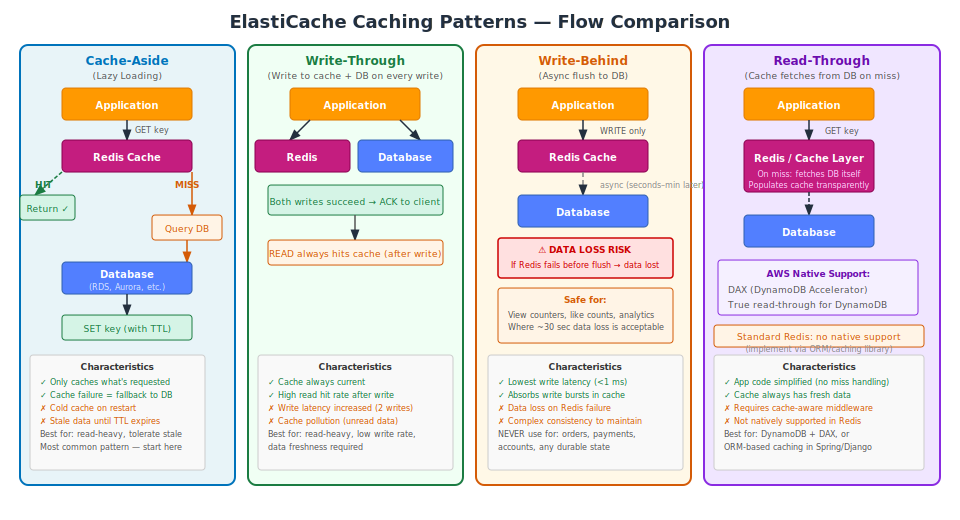

# Part 3: Caching Patterns & Code Examples

---

## Table of Contents

1. [Overview: The Four Core Patterns](#1-overview-the-four-core-patterns)
2. [Cache-Aside (Lazy Loading)](#2-cache-aside-lazy-loading)
3. [Write-Through](#3-write-through)
4. [Write-Behind (Write-Back)](#4-write-behind-write-back)
5. [Read-Through](#5-read-through)
6. [Cache Stampede — The Thundering Herd Problem](#6-cache-stampede--the-thundering-herd-problem)
7. [Cache Invalidation Strategies](#7-cache-invalidation-strategies)
8. [TTL Strategy Guide](#8-ttl-strategy-guide)
9. [Monitoring Cache Effectiveness](#9-monitoring-cache-effectiveness)
10. [Pattern Selection Reference](#10-pattern-selection-reference)

---

## 1. Overview: The Four Core Patterns



| Pattern | Who manages the cache on miss | Consistency | Complexity | Common Usage |
|---|---|---|---|---|
| Cache-Aside | Application | Eventual (TTL-based) | Low | Most common; start here |
| Write-Through | Application (on write) | High | Medium | Read-heavy, fresh data required |
| Write-Behind | Application (async flush) | Eventual | High | Analytics counters only |
| Read-Through | Cache layer | Eventual | Medium | DAX + DynamoDB; ORM caching |

The choice of pattern depends on your read/write ratio, tolerance for stale data, and whether data loss on cache failure is acceptable.

---

## 2. Cache-Aside (Lazy Loading)

The application checks the cache before querying the database. On a cache miss, the application fetches from the database and populates the cache.

### Flow

1. Application requests data by key
2. Cache HIT → return data immediately
3. Cache MISS → query database → store result in cache with TTL → return data

### Code Examples

**Python (redis-py):**

```python
import redis
import json

cache = redis.Redis(
    host='prod-cache.abc123.ng.0001.use1.cache.amazonaws.com',
    port=6379,
    password='your-auth-token',
    ssl=True,
    decode_responses=True
)

def get_user_profile(user_id: str) -> dict:
    cache_key = f'user:{user_id}:profile'
    
    cached = cache.get(cache_key)
    if cached:
        return json.loads(cached)
    
    user = db.query_one('SELECT * FROM users WHERE id = %s', user_id)
    if user:
        cache.setex(cache_key, 600, json.dumps(user))  # 10-minute TTL
    return user

def invalidate_user_profile(user_id: str):
    cache.delete(f'user:{user_id}:profile')
```

**Node.js (ioredis):**

```javascript
const Redis = require('ioredis');

const cache = new Redis({
  host: 'prod-cache.abc123.ng.0001.use1.cache.amazonaws.com',
  port: 6379,
  password: 'your-auth-token',
  tls: {}
});

async function getProduct(productId) {
  const cacheKey = `product:${productId}`;
  const cached = await cache.get(cacheKey);
  if (cached) {
    return JSON.parse(cached);
  }
  
  const product = await db.query('SELECT * FROM products WHERE id = $1', [productId]);
  if (product) {
    await cache.setex(cacheKey, 300, JSON.stringify(product));  // 5-minute TTL
  }
  return product;
}
```

**Java (Jedis):**

```java
import redis.clients.jedis.Jedis;

public Optional<User> getUserProfile(String userId) {
    String cacheKey = "user:" + userId + ":profile";
    
    try (Jedis jedis = jedisPool.getResource()) {
        String cached = jedis.get(cacheKey);
        if (cached != null) {
            return Optional.of(objectMapper.readValue(cached, User.class));
        }
        
        Optional<User> user = userRepository.findById(userId);
        user.ifPresent(u -> jedis.setex(cacheKey, 600, objectMapper.writeValueAsString(u)));
        return user;
    }
}
```

### Advantages and Disadvantages

| Advantage | Disadvantage |
|---|---|
| Only caches data that is actually requested | First request always misses (cold cache) |
| Cache failure is non-fatal (falls back to DB) | Stale data until TTL expires or explicit invalidation |
| Works with any data store | Three network round trips on a miss |
| Simple to implement and understand | Race condition on concurrent misses (thundering herd) |

---

## 3. Write-Through

Every write to the database is also written to the cache simultaneously. The cache is always current.

### Flow

1. Application writes data
2. Write to **both** database and cache atomically (or sequentially)
3. Reads from cache are always current (after the first write)

### Code Example

```python
def update_user_profile(user_id: str, data: dict) -> dict:
    cache_key = f'user:{user_id}:profile'
    
    # Write to database (source of truth first)
    db.execute(
        'UPDATE users SET name=%s, email=%s WHERE id=%s',
        data['name'], data['email'], user_id
    )
    
    # Update cache (write-through)
    cache.setex(cache_key, 600, json.dumps(data))
    
    return data

def get_user_profile(user_id: str) -> dict:
    cache_key = f'user:{user_id}:profile'
    cached = cache.get(cache_key)
    if cached:
        return json.loads(cached)
    
    # Only misses if the item was never written through, or TTL expired
    user = db.query_one('SELECT * FROM users WHERE id = %s', user_id)
    if user:
        cache.setex(cache_key, 600, json.dumps(user))
    return user
```

### Handling Write Failures

If the database write succeeds but the cache write fails, the cache becomes stale. The safest approach is to invalidate the cache key rather than trying to write it:

```python
def update_user_profile_safe(user_id: str, data: dict) -> dict:
    cache_key = f'user:{user_id}:profile'
    
    # Write to DB
    db.execute('UPDATE users SET name=%s, email=%s WHERE id=%s',
               data['name'], data['email'], user_id)
    
    try:
        cache.setex(cache_key, 600, json.dumps(data))
    except redis.RedisError:
        # Cache write failed — invalidate to prevent serving stale data
        cache.delete(cache_key)
    
    return data
```

### When to Use Write-Through

- Read-heavy workloads where the same data is written once and read many times
- User accounts, product details, configuration data
- When cache staleness is unacceptable (e.g., permissions, access tokens)
- Combined with Cache-Aside: use Write-Through on updates, Cache-Aside on reads

### When to Avoid Write-Through

- Write-heavy workloads where most writes are never subsequently read
- When write latency is more critical than read freshness
- When cache memory is limited — all writes populate the cache regardless of future demand

---

## 4. Write-Behind (Write-Back)

The application writes to cache only. A background process flushes cache writes to the database asynchronously.

### Flow

1. Application writes to cache only → immediate acknowledgment
2. Background job flushes accumulated writes to database (seconds or minutes later)

### When It Is Acceptable

Write-behind is appropriate **only** for data where approximate accuracy is acceptable and data loss on cache failure is tolerable.

```python
from datetime import datetime

def increment_page_view(page_id: str):
    # Acceptable: losing a few seconds of view counts is fine
    today = datetime.utcnow().strftime('%Y-%m-%d')
    key = f'views:{page_id}:{today}'
    cache.incr(key)
    cache.expire(key, 86400)  # 24-hour expiry

# Background flush job (runs every 30 seconds via cron or Lambda)
def flush_view_counts():
    pattern = 'views:*'
    cursor = 0
    while True:
        cursor, keys = cache.scan(cursor, match=pattern, count=100)
        for key in keys:
            count = cache.getset(key, 0)  # Atomic read-and-reset
            if count and int(count) > 0:
                parts = key.split(':')
                page_id, date = parts[1], parts[2]
                db.execute(
                    'INSERT INTO page_views (page_id, date, views) VALUES (%s, %s, %s) '
                    'ON CONFLICT (page_id, date) DO UPDATE SET views = views + EXCLUDED.views',
                    page_id, date, int(count)
                )
        if cursor == 0:
            break
```

### Data Safety Warning

Write-behind should **never** be used for:
- Financial transactions or payments
- Orders or bookings
- User account state changes
- Any data where loss would have business consequences

If a Redis node fails before the background flush, all unflushed writes are permanently lost. ElastiCache does not provide a built-in flush mechanism — you implement it yourself, which means you are responsible for its reliability.

---

## 5. Read-Through

The cache sits in the direct read path. On a miss, the **cache layer** fetches from the database — the application only ever talks to the cache.

Standard Redis does not support read-through natively. It requires either:
- A caching library that implements the pattern (Spring Cache, Django Cache Machine)
- AWS DAX (for DynamoDB specifically)

### AWS DAX — Native Read-Through for DynamoDB

DAX is a DynamoDB-compatible, fully managed in-memory cache. Applications send API calls to the DAX cluster endpoint instead of DynamoDB. DAX handles cache misses transparently.

```python
import amazondax
import boto3

dax = amazondax.AmazonDaxClient.resource(
    endpoint_url='daxs://your-dax-cluster.abc123.dax-clusters.us-east-1.amazonaws.com'
)
table = dax.Table('Products')

# Same code as DynamoDB — DAX is transparent
response = table.get_item(Key={'ProductID': 'p-001'})
product = response.get('Item')
# DAX served this from cache if available; fetched from DynamoDB if not
```

**DAX latency:** ~microseconds for cache hits vs single-digit milliseconds for DynamoDB. Use DAX when DynamoDB latency is a bottleneck for extremely read-heavy workloads.

**DAX limitations:**
- Only works with DynamoDB
- Eventually consistent reads only (consistent with DynamoDB eventually consistent behavior)
- Does not support all DynamoDB API operations (Scan and writes go through DAX to DynamoDB)
- Node-hour pricing (~$0.04/hr for dax.t3.small — separate from DynamoDB costs)

```bash
# Create DAX cluster
aws dax create-cluster \
  --cluster-name prod-dax \
  --node-type dax.r4.large \
  --replication-factor 3 \
  --iam-role-arn arn:aws:iam::123456789012:role/DAXRole \
  --subnet-group-name prod-subnets \
  --security-group-ids sg-abc12345 \
  --region us-east-1
```

### ORM-Based Read-Through (Application Pattern)

For RDS/Aurora, implement read-through via a repository abstraction:

```python
class CachedUserRepository:
    def __init__(self, cache, db):
        self.cache = cache
        self.db = db
    
    def find_by_id(self, user_id: str) -> dict:
        key = f'user:{user_id}'
        cached = self.cache.get(key)
        if cached:
            return json.loads(cached)
        # Cache handles the miss — application code just calls find_by_id
        user = self.db.query_one('SELECT * FROM users WHERE id = %s', user_id)
        if user:
            self.cache.setex(key, 600, json.dumps(user))
        return user
```

---

## 6. Cache Stampede — The Thundering Herd Problem

A cache stampede occurs when a popular cache key expires simultaneously for many concurrent requests. All requests find a cache miss and query the database at the same moment, overwhelming it.

**Scenario:** 10,000 concurrent users access a product page. The cache key expires. All 10,000 requests simultaneously hit the database. Database CPU: 0% → 100% in under 1 second.

### Solution 1: Mutex Locking

Only one request fetches the data on a miss. All others wait and retry.

```python
import time

def get_product_with_mutex(product_id: str) -> dict:
    cache_key = f'product:{product_id}'
    lock_key = f'lock:{cache_key}'
    
    # Try cache first
    data = cache.get(cache_key)
    if data:
        return json.loads(data)
    
    # Attempt to acquire lock (SET NX = only if not exists)
    acquired = cache.set(lock_key, '1', ex=10, nx=True)
    
    if acquired:
        try:
            product = db.query_one('SELECT * FROM products WHERE id = %s', product_id)
            cache.setex(cache_key, 300, json.dumps(product))
            return product
        finally:
            cache.delete(lock_key)
    else:
        # Lock held by another thread — wait briefly and retry
        time.sleep(0.05)
        return get_product_with_mutex(product_id)
```

**Limitation:** Under extreme concurrency, waiting threads pile up. If the lock holder fails, the lock TTL must expire before recovery.

### Solution 2: Probabilistic Early Expiration

Refresh the cache before it expires, using a probabilistic formula that triggers early with increasing probability as the TTL approaches zero.

```python
import random
import math
import time

def get_product_per(product_id: str, ttl: int = 300, beta: float = 1.0) -> dict:
    """
    beta: aggressiveness of early expiry (0.5 = conservative, 2.0 = aggressive)
    """
    cache_key = f'product:{product_id}'
    
    pipeline = cache.pipeline()
    pipeline.get(cache_key)
    pipeline.ttl(cache_key)
    data_raw, remaining_ttl = pipeline.execute()
    
    if data_raw is None:
        # Hard miss
        product = db.query_one('SELECT * FROM products WHERE id = %s', product_id)
        cache.setex(cache_key, ttl, json.dumps(product))
        return product
    
    # Early expiry decision: P(refresh) increases as TTL approaches 0
    compute_time = ttl - remaining_ttl  # Approximation
    if -beta * compute_time * math.log(random.random()) > remaining_ttl:
        # This request wins the refresh lottery — refresh early
        product = db.query_one('SELECT * FROM products WHERE id = %s', product_id)
        cache.setex(cache_key, ttl, json.dumps(product))
        return product
    
    return json.loads(data_raw)
```

### Solution 3: Stale-While-Revalidate (Background Refresh)

Serve existing (slightly stale) data immediately and refresh in the background.

```python
from concurrent.futures import ThreadPoolExecutor

executor = ThreadPoolExecutor(max_workers=10)

def get_product_swr(product_id: str, ttl: int = 300, stale_window: int = 30) -> dict:
    cache_key = f'product:{product_id}'
    data_raw = cache.get(cache_key)
    remaining = cache.ttl(cache_key)
    
    if data_raw is None:
        # Hard miss — synchronous fetch required
        product = db.query_one('SELECT * FROM products WHERE id = %s', product_id)
        cache.setex(cache_key, ttl, json.dumps(product))
        return product
    
    # If within stale window, trigger background refresh
    if remaining < stale_window:
        def refresh():
            fresh = db.query_one('SELECT * FROM products WHERE id = %s', product_id)
            if fresh:
                cache.setex(cache_key, ttl, json.dumps(fresh))
        executor.submit(refresh)
    
    # Return current data immediately (may be slightly stale)
    return json.loads(data_raw)
```

### Solution 4: TTL Jitter

Prevent synchronized expiry by adding random jitter to TTLs when setting many similar keys.

```python
import random

def cache_user_profile(user_id: str, data: dict, base_ttl: int = 600):
    jitter = random.randint(-60, 60)  # ±1 minute
    ttl = base_ttl + jitter
    cache.setex(f'user:{user_id}:profile', ttl, json.dumps(data))

# Bulk cache population with jitter (e.g., pre-warming cache)
for user in users:
    cache_user_profile(user['id'], user)
    # Each key now expires at a slightly different time — no synchronized expiry
```

---

## 7. Cache Invalidation Strategies

### Strategy 1: TTL-Based (Passive Invalidation)

Set a TTL and accept that data may be stale for up to TTL seconds. The simplest strategy.

```python
# Product catalog — 5-minute TTL, stale for max 5 minutes after a price change
cache.setex('product:p-001', 300, json.dumps(product_data))
```

Appropriate when: slight staleness is acceptable (product catalog, blog posts, search results).

### Strategy 2: Explicit Delete on Write (Active Invalidation)

Delete the cache key when data changes in the database. The next read will repopulate from the database.

```python
def update_product(product_id: str, new_data: dict):
    # 1. Update database
    db.execute('UPDATE products SET price=%s, name=%s WHERE id=%s',
               new_data['price'], new_data['name'], product_id)
    
    # 2. Invalidate all cache keys that reference this product
    cache.delete(f'product:{product_id}')
    cache.delete(f'product:{product_id}:details')
    cache.delete(f'category:{new_data["category"]}:listing')  # Composite key
    cache.delete('homepage:featured_products')
```

**Challenge:** You must know all cache keys that reference the changed data. Missed keys result in stale data. As the application grows, this becomes difficult to maintain.

### Strategy 3: Version-Based Keys

Include a version number in the cache key. Incrementing the version effectively invalidates all old keys without needing to track them.

```python
def get_version(entity_type: str, entity_id: str) -> int:
    version = cache.get(f'version:{entity_type}:{entity_id}')
    if version is None:
        version = db.query_one('SELECT cache_version FROM entities WHERE id = %s', entity_id)
        cache.setex(f'version:{entity_type}:{entity_id}', 3600, version or 1)
    return int(version)

def get_product(product_id: str) -> dict:
    version = get_version('product', product_id)
    cache_key = f'product:{product_id}:v{version}'
    cached = cache.get(cache_key)
    if cached:
        return json.loads(cached)
    product = db.query_one('SELECT * FROM products WHERE id = %s', product_id)
    cache.setex(cache_key, 600, json.dumps(product))
    return product

def update_product(product_id: str, new_data: dict):
    db.execute('UPDATE products SET ..., cache_version = cache_version + 1 WHERE id=%s', product_id)
    cache.incr(f'version:product:{product_id}')
    # Old versioned keys become orphans and expire via TTL — no explicit deletion needed
```

### Strategy 4: Redis Keyspace Notifications

Subscribe to Redis key events to trigger downstream invalidation when keys change.

```python
# Enable in parameter group: notify-keyspace-events = KEA
# Then subscribe in your service

import redis
import threading

def watch_cache_events():
    sub = redis.Redis(host='...', ssl=True, password='...').pubsub()
    sub.psubscribe('__keyevent@0__:del', '__keyevent@0__:expired')
    
    for message in sub.listen():
        if message['type'] == 'pmessage':
            key = message['data']
            if key.startswith('product:'):
                product_id = key.split(':')[1]
                notify_downstream_services(product_id)

threading.Thread(target=watch_cache_events, daemon=True).start()
```

---

## 8. TTL Strategy Guide

TTL must balance freshness (short TTL) against database load (long TTL).

| Data Type | Recommended TTL | Notes |
|---|---|---|
| User session | 30–60 min (rolling) | Extend TTL on each access to keep active sessions alive |
| User profile | 10–30 min | Explicitly invalidate on profile update |
| User permissions / roles | 5–10 min | Security-sensitive; short TTL limits exposure window |
| Product detail | 5–15 min | Invalidate on price or inventory change |
| Category listing | 2–5 min | Changes when any product in it changes |
| Search results | 1–5 min | Expensive to compute; tolerate slight staleness |
| Homepage featured | 1–2 min | Marketing team updates frequently |
| Static config / feature flags | 5 min | Predictable refresh cycle |
| Rate limit counters | = window | e.g., 60 sec for per-minute limits |
| OAuth access tokens | = token TTL | Match the token's own expiry exactly |
| API response cache | 30–300 sec | Depends on API data freshness SLA |
| Computed aggregates | 1–5 min | Depends on how frequently source data changes |

### Anti-Pattern: No TTL

```python
# WRONG — key lives forever until explicitly deleted or evicted
cache.set('user:123', json.dumps(user))

# CORRECT — always set a TTL
cache.setex('user:123', 600, json.dumps(user))
```

Without a TTL, keys accumulate indefinitely. If your invalidation logic has any bug, stale data is served permanently.

### Anti-Pattern: Uniform TTL Without Jitter

```python
# WRONG — all sessions expire at exactly the same time if created simultaneously
for user_id in user_ids:
    cache.setex(f'session:{user_id}', 1800, session_data)

# CORRECT — add jitter to spread expiry across time
import random
for user_id in user_ids:
    ttl = 1800 + random.randint(-300, 300)  # 25–35 minutes
    cache.setex(f'session:{user_id}', ttl, session_data)
```

---

## 9. Monitoring Cache Effectiveness

### Cache Hit Rate

The most important single metric. Target: >85% for a healthy cache.

```bash
# Via redis-cli
redis-cli -h your-endpoint -p 6379 -a "token" --tls INFO stats | \
  grep -E "keyspace_hits|keyspace_misses"
```

Output:
```
keyspace_hits:4821032
keyspace_misses:142
```

Hit rate = hits / (hits + misses) = 4,821,032 / 4,821,174 = 99.99%

```bash
# Via CloudWatch
aws cloudwatch get-metric-statistics \
  --namespace AWS/ElastiCache \
  --metric-name CacheHitRate \
  --dimensions Name=CacheClusterId,Value=prod-cache-0001-001 \
  --start-time $(date -u -d '1 hour ago' +%Y-%m-%dT%H:%M:%SZ) \
  --end-time $(date -u +%Y-%m-%dT%H:%M:%SZ) \
  --period 300 \
  --statistics Average \
  --region us-east-1
```

### Eviction Monitoring

Non-zero evictions mean the cache is full and dropping keys.

```bash
redis-cli -h your-endpoint --tls -a "token" INFO stats | grep evicted_keys
```

If evictions are occurring regularly:
1. Increase node type to get more RAM
2. Review your cache keys — are you caching data that's never read?
3. Reduce TTLs to allow old data to expire before being evicted

### Memory Usage

```bash
redis-cli -h your-endpoint --tls -a "token" INFO memory | grep -E "used_memory_human|maxmemory_human|mem_fragmentation_ratio"
```

Alert when `used_memory` exceeds 80% of `maxmemory`. Fragmentation ratio > 1.5 indicates memory fragmentation (restart may help if severe).

---

## 10. Pattern Selection Reference

```
What is your primary concern?
│
├── Read performance (reads >> writes)?
│   ├── Tolerate slightly stale data?
│   │   └── Cache-Aside ← start here for most applications
│   └── Data must be current on every read?
│       └── Write-Through + Cache-Aside reads
│
├── Write performance (writes >> reads)?
│   ├── Data loss on failure is catastrophic (orders, payments, accounts)?
│   │   └── Do NOT use Write-Behind. Use Write-Through or skip caching.
│   └── Losing seconds of data is acceptable (counters, analytics, view counts)?
│       └── Write-Behind (document the risk explicitly)
│
├── Transparent to application code?
│   ├── Using DynamoDB?
│   │   └── DAX (native read-through, fully managed)
│   └── Using RDS or another DB?
│       └── Implement Read-Through via repository abstraction or ORM
│
└── High concurrency + synchronized TTL expiry?
    └── Cache-Aside + TTL jitter + probabilistic early expiration or mutex locking
```

### Failure Mode Reference

| Pattern | Failure Mode | Symptom | Fix |
|---|---|---|---|
| Cache-Aside | Cold cache after restart | DB CPU spike, all requests slow | Pre-warm cache; add mutex for hot keys |
| Cache-Aside | Missing invalidation | Reads return stale data | Audit all write paths for invalidation |
| Write-Through | Redis failure during write | Write errors reaching application | Invalidate key on cache write failure |
| Write-Through | Cache pollution | Memory fills with unread data, evictions spike | Add TTL; audit which writes need caching |
| Write-Behind | Cache node failure before flush | Data loss, DB inconsistency | Avoid for durable data; use Write-Through instead |
| Any pattern | Thundering herd at TTL expiry | DB overwhelmed at predictable intervals | TTL jitter; early expiry; mutex |

---

**Next:** Part 4 covers Redis Data Structures and Use Cases — Strings, Hashes, Lists, Sets, Sorted Sets, Pub/Sub, HyperLogLog, and Streams — with production code examples for each.
