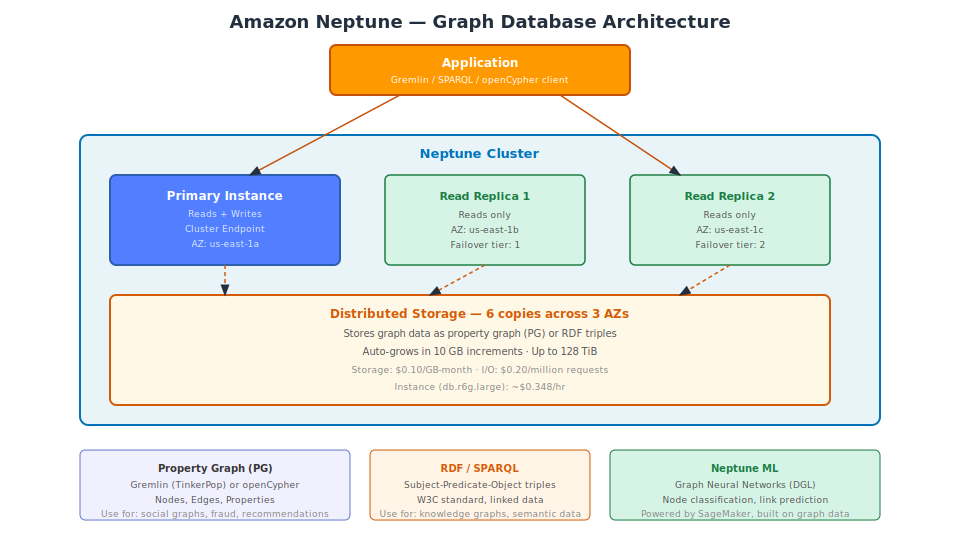

# Part 1 — Amazon Neptune Graph Database

## Table of Contents

1. [What is Neptune](#1-what-is-neptune)
2. [Graph Models — Property Graph vs RDF](#2-graph-models--property-graph-vs-rdf)
3. [Cluster Architecture](#3-cluster-architecture)
4. [Gremlin — Property Graph Queries](#4-gremlin--property-graph-queries)
5. [openCypher — Property Graph Queries](#5-opencypher--property-graph-queries)
6. [SPARQL — RDF Queries](#6-sparql--rdf-queries)
7. [Loading Data into Neptune](#7-loading-data-into-neptune)
8. [Indexes and Performance](#8-indexes-and-performance)
9. [Security and Backup](#9-security-and-backup)
10. [Neptune ML](#10-neptune-ml)
11. [Pricing and When to Use](#11-pricing-and-when-to-use)

---

## 1. What is Neptune

Amazon Neptune is a **fully managed graph database** optimized for storing and querying highly connected data. It is designed for use cases where the relationships between entities are as important as the entities themselves — social networks, fraud detection, knowledge graphs, recommendation engines, and identity graphs.

Neptune supports two graph models:
- **Property Graph (PG)**: Queried with **Gremlin** (Apache TinkerPop) or **openCypher**
- **RDF (Resource Description Framework)**: Queried with **SPARQL** (W3C standard)

A single Neptune cluster supports both models simultaneously, though most applications use one or the other.

### Why a Graph Database?

In a relational database, finding connections between entities requires JOINs. Finding "all friends of friends who purchased the same product" in SQL requires multiple self-joins and grows exponentially with traversal depth. In a graph database, the same traversal is O(log n) because relationships are stored as first-class objects with direct pointers.

```sql
-- SQL: Friends who also bought product X (3 hops = 2 joins)
SELECT DISTINCT u3.name
FROM users u1
JOIN friendships f1 ON u1.id = f1.user_id
JOIN users u2 ON f1.friend_id = u2.id
JOIN friendships f2 ON u2.id = f2.user_id
JOIN users u3 ON f2.friend_id = u3.id
JOIN purchases p ON u3.id = p.user_id
WHERE u1.id = 'USER-001' AND p.product_id = 'PROD-X';
```

```gremlin
// Gremlin: Same query — traversal, not JOINs
g.V('USER-001').out('FRIENDS').out('FRIENDS').where(out('PURCHASED').hasId('PROD-X')).values('name')
```

The performance advantage of graph databases increases as traversal depth grows.



---

## 2. Graph Models — Property Graph vs RDF

### Property Graph (PG)

A property graph has:
- **Vertices (nodes)**: Entities (Person, Product, Order, etc.)
- **Edges**: Directed relationships between vertices (`KNOWS`, `PURCHASED`, `LIVES_IN`)
- **Properties**: Key-value pairs on both vertices and edges (`name: "Alice"`, `since: "2020-01-01"`)

```
(Alice:Person {age:30}) --[KNOWS {since:"2020"}]--> (Bob:Person {age:25})
         |
    [PURCHASED {date:"2024-12-01"}]
         |
         v
   (Laptop:Product {price:999})
```

### RDF (Resource Description Framework)

RDF represents data as **triples**: Subject → Predicate → Object.

```
<http://example.com/Alice>  <http://schema.org/knows>    <http://example.com/Bob>
<http://example.com/Alice>  <http://schema.org/age>      "30"
<http://example.com/Alice>  <http://schema.org/purchased> <http://example.com/Laptop>
```

RDF is the W3C standard for linked data and knowledge graphs. It is more verbose than PG but provides formal semantics, ontology support, and interoperability with other RDF datasets.

### Choosing Between Property Graph and RDF

| Criteria | Property Graph (Gremlin/openCypher) | RDF (SPARQL) |
|---|---|---|
| Primary use case | Application graph queries (social, fraud, rec) | Knowledge graphs, semantic data, linked open data |
| Data source | Application-generated | Ontologies, enterprise data catalogs |
| Query style | Traversal-oriented | Pattern-matching (SQL-like) |
| Learning curve | Lower for developers | Higher (requires RDF/OWL knowledge) |
| Standards | Apache TinkerPop (Gremlin), openCypher | W3C (RDF, SPARQL, OWL) |
| Multi-hop efficiency | Optimized | Optimized |

For most application developers building social networks, recommendation engines, or fraud detection, the **Property Graph model with Gremlin or openCypher** is the right choice.

---

## 3. Cluster Architecture

Neptune uses the same distributed storage architecture as Aurora and DocumentDB — 6 copies of data across 3 AZs, shared by all instances in the cluster.

- One **primary instance** handles reads and writes.
- Up to **15 read replicas** handle reads.
- Failover promotes the highest-priority replica in approximately **30 seconds**.
- Storage auto-grows in **10 GB increments** up to **128 TiB**.

### Instance Types

| Instance | Memory | vCPU | Suitable For |
|---|---|---|---|
| `db.t3.medium` | 4 GB | 2 | Development, testing |
| `db.r6g.large` | 16 GB | 2 | Small production graphs |
| `db.r6g.xlarge` | 32 GB | 4 | Medium graphs |
| `db.r6g.2xlarge` | 64 GB | 8 | Large graphs |
| `db.r6g.8xlarge` | 256 GB | 32 | Very large, high-query-rate graphs |

Neptune caches frequently accessed graph data in the buffer pool (instance memory). Large graphs benefit significantly from larger instances.

### Creating a Neptune Cluster

```bash
# Create subnet group
aws neptune create-db-subnet-group \
  --db-subnet-group-name neptune-subnet-group \
  --db-subnet-group-description "Neptune subnet group" \
  --subnet-ids subnet-aaa111 subnet-bbb222 subnet-ccc333

# Create cluster
aws neptune create-db-cluster \
  --db-cluster-identifier my-neptune-cluster \
  --engine neptune \
  --db-subnet-group-name neptune-subnet-group \
  --vpc-security-group-ids sg-xxxxxxxx \
  --storage-encrypted \
  --backup-retention-period 7

# Add primary instance
aws neptune create-db-instance \
  --db-instance-identifier my-neptune-primary \
  --db-cluster-identifier my-neptune-cluster \
  --db-instance-class db.r6g.large \
  --engine neptune
```

Neptune listens on **port 8182** (not the MongoDB or PostgreSQL port). Gremlin WebSocket: `wss://endpoint:8182/gremlin`. SPARQL: `https://endpoint:8182/sparql`. openCypher: `https://endpoint:8182/openCypher`.

---

## 4. Gremlin — Property Graph Queries

Gremlin is a graph traversal language. A Gremlin query is a pipeline of steps — each step traverses from the current position in the graph (vertices or edges) to an adjacent position.

### Basic Concepts

```gremlin
// g = graph traversal source
// V() = start from vertices
// E() = start from edges
// has() = filter
// out() = traverse outgoing edges
// in() = traverse incoming edges
// both() = traverse in and out edges
// values() = get property values
// limit() = limit results
```

### Loading Sample Data

```python
from gremlin_python.driver import client, serializer

# Connect to Neptune
gremlin_client = client.Client(
    'wss://my-neptune.cluster-xyz.us-east-1.neptune.amazonaws.com:8182/gremlin',
    'g',
    message_serializer=serializer.GraphSONSerializersV2d0()
)

# Add vertices and edges
queries = [
    # Add person vertices
    "g.addV('Person').property('id','p1').property('name','Alice').property('age',30)",
    "g.addV('Person').property('id','p2').property('name','Bob').property('age',25)",
    "g.addV('Person').property('id','p3').property('name','Carol').property('age',35)",
    # Add product vertices
    "g.addV('Product').property('id','prod1').property('name','Laptop').property('price',999)",
    # Add edges
    "g.V('p1').addE('KNOWS').to(g.V('p2'))",
    "g.V('p2').addE('KNOWS').to(g.V('p3'))",
    "g.V('p1').addE('PURCHASED').to(g.V('prod1')).property('date','2024-12-01')",
    "g.V('p3').addE('PURCHASED').to(g.V('prod1')).property('date','2024-11-15')",
]

for q in queries:
    gremlin_client.submit(q).all().result()
```

### Common Gremlin Traversal Patterns

```gremlin
// Find all people Alice knows
g.V('p1').out('KNOWS').values('name')
// → ['Bob']

// Find Alice's friends of friends (2 hops)
g.V('p1').out('KNOWS').out('KNOWS').values('name')
// → ['Carol']

// Find all people who purchased Laptop
g.V('prod1').in('PURCHASED').values('name')
// → ['Alice', 'Carol']

// Product recommendation: people who bought the same thing as Alice
g.V('p1').out('PURCHASED').in('PURCHASED').where(neq('p1')).values('name').dedup()
// → ['Carol']  (Carol also bought Laptop)

// Filter vertices by property
g.V().hasLabel('Person').has('age', gt(28)).values('name')
// → ['Alice', 'Carol']

// Count outgoing edges per vertex
g.V().hasLabel('Person').group().by('name').by(out('KNOWS').count())
// → {Alice: 1, Bob: 1, Carol: 0}

// Path — return the full traversal path
g.V('p1').out('KNOWS').out('KNOWS').path().by('name')
// → [[Alice, Bob, Carol]]

// Find shortest path between two vertices
g.V('p1').repeat(out().simplePath()).until(hasId('p3')).path().limit(1)
```

### Gremlin Python Client

```python
from gremlin_python.process.anonymous_traversal import traversal
from gremlin_python.driver.driver_remote_connection import DriverRemoteConnection

connection = DriverRemoteConnection(
    'wss://my-neptune.cluster-xyz.us-east-1.neptune.amazonaws.com:8182/gremlin',
    'g'
)
g = traversal().with_(connection)

# Find recommendations for user p1
recommendations = (
    g.V('p1')
     .out('PURCHASED')         # Products Alice bought
     .in_('PURCHASED')         # Other users who bought those products
     .where(P.neq('p1'))       # Exclude Alice herself
     .out('PURCHASED')         # Products those users bought
     .where(P.without(g.V('p1').out('PURCHASED').to_list()))  # Not already bought
     .values('name')
     .dedup()
     .limit(10)
     .to_list()
)

connection.close()
```

---

## 5. openCypher — Property Graph Queries

openCypher is a declarative graph query language (similar to SQL's declarative approach but for graphs). It uses pattern matching with ASCII art to express graph patterns.

```cypher
// ASCII art pattern: (node)-[:EDGE]->(node)
// Match all friends of Alice
MATCH (alice:Person {name: 'Alice'})-[:KNOWS]->(friend:Person)
RETURN friend.name

// Friends of friends
MATCH (alice:Person {name: 'Alice'})-[:KNOWS]->(:Person)-[:KNOWS]->(fof:Person)
WHERE fof.name <> 'Alice'
RETURN DISTINCT fof.name

// People who bought Laptop
MATCH (p:Person)-[:PURCHASED]->(prod:Product {name: 'Laptop'})
RETURN p.name, p.age
ORDER BY p.age DESC

// Product recommendations
MATCH (me:Person {name: 'Alice'})-[:PURCHASED]->(prod:Product)<-[:PURCHASED]-(other:Person)
WHERE other <> me
MATCH (other)-[:PURCHASED]->(rec:Product)
WHERE NOT (me)-[:PURCHASED]->(rec)
RETURN rec.name, count(other) AS score
ORDER BY score DESC
LIMIT 10

// Create relationships
MATCH (a:Person {name: 'Alice'}), (b:Person {name: 'Bob'})
MERGE (a)-[:KNOWS {since: '2024-01-01'}]->(b)
```

### openCypher via HTTP

```python
import requests
import json

endpoint = 'https://my-neptune.cluster-xyz.us-east-1.neptune.amazonaws.com:8182/openCypher'

query = """
MATCH (p:Person)-[:PURCHASED]->(prod:Product)
RETURN p.name AS customer, prod.name AS product
LIMIT 10
"""

response = requests.post(endpoint, json={'query': query})
results = response.json()['results']
for row in results:
    print(f"{row['customer']} → {row['product']}")
```

---

## 6. SPARQL — RDF Queries

SPARQL queries match triple patterns against the RDF graph. It reads like SQL but operates on subject-predicate-object patterns.

```sparql
PREFIX schema: <http://schema.org/>
PREFIX ex: <http://example.com/>

# Find all people who know Alice
SELECT ?personName WHERE {
  ex:Alice schema:knows ?person .
  ?person schema:name ?personName .
}

# Find products purchased by friends of Alice
SELECT ?productName WHERE {
  ex:Alice schema:knows ?friend .
  ?friend schema:purchased ?product .
  ?product schema:name ?productName .
}

# Count purchases per person
SELECT ?name (COUNT(?product) AS ?purchaseCount) WHERE {
  ?person schema:name ?name .
  ?person schema:purchased ?product .
}
GROUP BY ?name
ORDER BY DESC(?purchaseCount)
```

---

## 7. Loading Data into Neptune

### Bulk Load from S3

Neptune's bulk loader is the fastest way to load large datasets. Data must be staged in S3 in one of the supported formats: CSV (vertex/edge lists), JSON (PG), Turtle/N-Quads/RDF-XML (RDF).

**Vertex CSV format:**

```csv
~id,~label,name:String,age:Int
p1,Person,Alice,30
p2,Person,Bob,25
```

**Edge CSV format:**

```csv
~id,~from,~to,~label,since:String
e1,p1,p2,KNOWS,2020-01-01
```

```bash
# Trigger Neptune bulk loader
curl -X POST https://my-neptune.cluster-xyz.us-east-1.neptune.amazonaws.com:8182/loader \
  -H 'Content-Type: application/json' \
  -d '{
    "source": "s3://my-bucket/graph-data/",
    "format": "csv",
    "iamRoleArn": "arn:aws:iam::123456789012:role/NeptuneS3Role",
    "region": "us-east-1",
    "failOnError": "FALSE",
    "parallelism": "MEDIUM",
    "queueRequest": "TRUE"
  }'

# Check load status
curl https://my-neptune.cluster-xyz.us-east-1.neptune.amazonaws.com:8182/loader/<job-id>
```

The IAM role must have `s3:GetObject` and `s3:ListBucket` on the source bucket.

### Streaming Data via Gremlin

For incremental loads, use the Gremlin API to add vertices and edges programmatically (as shown in Section 4).

---

## 8. Indexes and Performance

Neptune automatically maintains multiple indexes for efficient graph traversal. You do not create indexes manually. Neptune uses the following internal index types:

- **SPOG** (Subject-Predicate-Object-Graph): Primary index, used for most traversals
- **POGS**: Predicate-first, useful for finding all edges of a specific type
- **GPSO**, **GPOS**, **GOSP**: Graph-prefixed indexes for named graph queries

### Performance Tips

- **Filter early**: Apply `has()` filters close to the traversal source to reduce the number of vertices/edges traversed.
- **Use `limit()`**: Always limit results unless you need all matching records.
- **Avoid `repeat()` without `times()` or `until()`**: Unbounded traversals can scan the entire graph.
- **Profile queries**: Use the `profile()` step in Gremlin to see execution statistics.

```gremlin
// Profile a query to see step-by-step traversal statistics
g.V().hasLabel('Person').has('age', gt(28)).out('PURCHASED').profile()
```

---

## 9. Security and Backup

### IAM Authentication

Neptune supports IAM authentication for all HTTP-based queries (SPARQL, openCypher) and for Gremlin WebSocket connections. Enable it via the cluster parameter `neptune_enable_audit_log` and by setting `DBCluster.IAMDatabaseAuthenticationEnabled=true`.

```bash
aws neptune modify-db-cluster \
  --db-cluster-identifier my-neptune-cluster \
  --enable-iam-database-authentication \
  --apply-immediately
```

With IAM authentication, the driver signs requests with SigV4. No passwords are sent over the wire.

### VPC and Security Groups

Neptune is not publicly accessible. Connections must come from within the VPC (or via VPN/Direct Connect). Port **8182** must be open in the security group from application nodes.

### Encryption and Backup

- Encryption at rest: KMS (must be enabled at creation).
- TLS in transit: Always enabled on port 8182.
- PITR: 1–35 days retention.
- Manual snapshots: Retained until deleted.

---

## 10. Neptune ML

Neptune ML integrates Graph Neural Networks (GNN) using the Deep Graph Library (DGL) and Amazon SageMaker. It enables ML inference directly on the graph without exporting data.

### Use Cases

| Task | Description |
|---|---|
| Node classification | Predict a property of a vertex (e.g., fraud score for a user node) |
| Link prediction | Predict whether an edge should exist (e.g., product recommendation) |
| Edge classification | Classify an existing edge (e.g., is this transaction legitimate?) |

### Training Flow

```bash
# Step 1: Export graph data to S3 for training
curl -X POST https://neptune-endpoint:8182/ml/dataprocessing \
  -d '{"s3OutputEncryptionKMSKey": "arn:...", "outputS3Path": "s3://my-bucket/neptune-ml/"}'

# Step 2: Train the model (runs on SageMaker)
curl -X POST https://neptune-endpoint:8182/ml/modeltraining \
  -d '{"dataProcessingJobId": "<job-id>", "trainModelS3Location": "s3://my-bucket/model/"}'

# Step 3: Create an inference endpoint
curl -X POST https://neptune-endpoint:8182/ml/endpoints \
  -d '{"mlModelTrainingJobId": "<training-job-id>"}'

# Step 4: Query with ML predictions
g.with("Neptune#ml.endpoint", "<endpoint-id>")
 .V('p1')
 .properties('Neptune#ml.score')  # Get the ML-predicted score for this vertex
```

---

## 11. Pricing and When to Use

### Pricing (us-east-1)

| Component | Cost |
|---|---|
| `db.r6g.large` instance | ~$0.348/hr |
| Storage | $0.10/GB-month |
| I/O | $0.20/million requests |
| Backup storage (beyond free tier) | $0.021/GB-month |
| Neptune ML (SageMaker) | Standard SageMaker pricing |

### When to Use Neptune

Use Neptune when:
- Your data has **complex, many-to-many relationships** and you need to traverse those relationships efficiently.
- Use cases include: **social networks**, **fraud detection** (transaction graph analysis), **recommendation engines** (collaborative filtering), **identity and access graphs**, **knowledge graphs**, **supply chain graphs**.
- You need to perform **multi-hop traversals** that would require expensive recursive SQL queries.

Avoid Neptune when:
- Your data is primarily key-value or document-oriented — use DynamoDB or DocumentDB.
- You need full-text search — use OpenSearch.
- You have simple parent-child relationships that a relational database handles well — use RDS.
- Graph traversal depth is limited to 1-2 hops — relational JOIN performance may be sufficient.

### Neptune vs Neo4j

| Aspect | Amazon Neptune | Neo4j (self-managed or AuraDB) |
|---|---|---|
| Query language | Gremlin, openCypher, SPARQL | Cypher (openCypher superset) |
| Management | Fully managed | Self-managed or managed cloud (Aura) |
| AWS integration | Native (IAM, VPC, CloudWatch) | Requires integration work |
| Horizontal scale | Vertical + read replicas | Horizontal sharding (Enterprise) |
| APOC procedures | Not supported | Supported (extensive library) |
| Graph algorithms | Neptune ML / Neptune Analytics | Built-in GDS library |

---

## Key Takeaways

- Neptune supports Property Graph (Gremlin, openCypher) and RDF (SPARQL) in a single cluster.
- Use Gremlin for traversal-heavy graph applications. Use openCypher if your team is more familiar with SQL-like declarative syntax. Use SPARQL for W3C-standard linked data and knowledge graphs.
- Graph databases excel at multi-hop traversals. For simple parent-child relationships or flat data, relational databases are more efficient.
- Neptune shares the Aurora/DocumentDB storage architecture — 6-way replication, auto-scaling storage, automatic failover.
- Bulk-load graph data from S3 using Neptune's loader API. Incremental writes go through the Gremlin or openCypher HTTP/WebSocket API.
