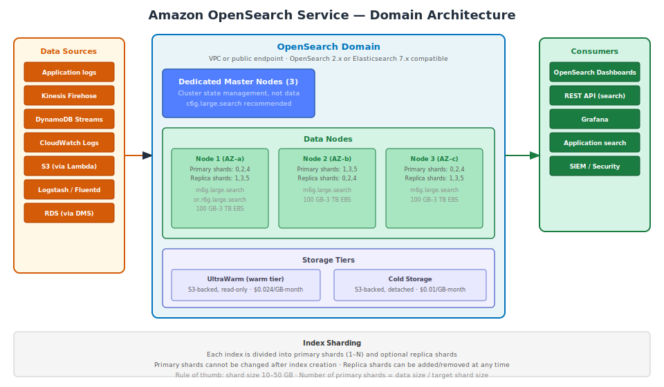

# Part 1 — Amazon OpenSearch Service

## Table of Contents

1. [What is OpenSearch Service](#1-what-is-opensearch-service)
2. [Core Concepts — Clusters, Indexes, Shards](#2-core-concepts--clusters-indexes-shards)
3. [Domain Configuration](#3-domain-configuration)
4. [Indexing Documents](#4-indexing-documents)
5. [Search and Query DSL](#5-search-and-query-dsl)
6. [Aggregations and Analytics](#6-aggregations-and-analytics)
7. [Index Lifecycle and Storage Tiers](#7-index-lifecycle-and-storage-tiers)
8. [OpenSearch Dashboards](#8-opensearch-dashboards)
9. [Security — Authentication and Encryption](#9-security--authentication-and-encryption)
10. [Integrations with AWS Services](#10-integrations-with-aws-services)
11. [Pricing and When to Use](#11-pricing-and-when-to-use)

---

## 1. What is OpenSearch Service

Amazon OpenSearch Service is a **managed search and analytics engine** based on OpenSearch (the open-source fork of Elasticsearch). It is used for full-text search, log analytics, application monitoring, security information and event management (SIEM), and real-time data analysis.

OpenSearch is not a traditional database. Its primary purpose is **fast search and aggregation** across large volumes of text and semi-structured data, not transactional data storage. It complements databases (DynamoDB, RDS, DocumentDB) by providing search capabilities that those databases do not.

### What OpenSearch Excels At

- **Full-text search**: Find documents containing specific words, phrases, or patterns with relevance scoring.
- **Log analytics**: Ingest millions of log lines per second and query them within seconds.
- **Aggregations**: Count, sum, average, histogram, and statistical analysis on any field.
- **Autocomplete and suggestions**: Prefix search, fuzzy matching, spell correction.
- **Geospatial search**: Find documents within a geographic area or near a point.

### OpenSearch vs Elasticsearch

Amazon OpenSearch Service was originally "Amazon Elasticsearch Service." In 2021, Amazon forked Elasticsearch under the Apache License 2.0 (after Elastic changed the license), creating OpenSearch. OpenSearch maintains API compatibility with Elasticsearch 7.10.

If your application uses Elasticsearch 7.x client libraries, it will work with OpenSearch Service with minimal changes.



---

## 2. Core Concepts — Clusters, Indexes, Shards

### Domain

A domain is an OpenSearch cluster — the managed collection of compute and storage resources. Each domain has a unique endpoint.

### Index

An index is the primary organizational unit, analogous to a table in a database. An index stores documents of a similar type. Each index has:
- A **mapping** (schema definition of field types).
- A **settings** configuration (number of shards, replicas, analysis configuration).

An index is distributed across the cluster as **shards**.

### Shard

A shard is a unit of data and compute. Each index is divided into:
- **Primary shards**: Contain the actual data. Number set at index creation and cannot be changed.
- **Replica shards**: Copies of primary shards. Can be added or removed. Provide redundancy and additional read throughput.

```
Index: logs-2024-12
  ├── Primary shard 0  → stored on Node 1
  ├── Primary shard 1  → stored on Node 2
  ├── Primary shard 2  → stored on Node 3
  ├── Replica of shard 0 → stored on Node 2
  ├── Replica of shard 1 → stored on Node 3
  └── Replica of shard 2 → stored on Node 1
```

### Document

A document is a JSON object stored in an index. Each document has a unique `_id` within the index.

```json
{
  "_index": "products",
  "_id": "PROD-001",
  "_source": {
    "name": "Wireless Headphones",
    "description": "Premium noise-canceling headphones with 30-hour battery life",
    "category": "Electronics",
    "price": 299.99,
    "tags": ["audio", "wireless", "noise-canceling"],
    "inStock": true
  }
}
```

### Mapping

A mapping defines field data types and how fields are analyzed (tokenized for search). OpenSearch can infer mappings dynamically or you can define them explicitly.

```json
{
  "mappings": {
    "properties": {
      "name": {
        "type": "text",
        "analyzer": "english",
        "fields": {
          "keyword": {"type": "keyword"}
        }
      },
      "description": {"type": "text", "analyzer": "english"},
      "category": {"type": "keyword"},
      "price": {"type": "float"},
      "tags": {"type": "keyword"},
      "inStock": {"type": "boolean"},
      "createdAt": {"type": "date", "format": "strict_date_optional_time"}
    }
  }
}
```

**Text** fields are analyzed (tokenized, lowercased, stemmed) and support full-text search. **Keyword** fields are stored as-is and support exact-match filtering, aggregations, and sorting.

The `.keyword` sub-field on the `name` field above allows both full-text search on `name` and exact/aggregation queries on `name.keyword`.

---

## 3. Domain Configuration

### Creating a Domain

```bash
aws opensearch create-domain \
  --domain-name my-search-domain \
  --engine-version OpenSearch_2.11 \
  --cluster-config '{
    "InstanceType": "m6g.large.search",
    "InstanceCount": 3,
    "ZoneAwarenessEnabled": true,
    "ZoneAwarenessConfig": {"AvailabilityZoneCount": 3},
    "DedicatedMasterEnabled": true,
    "DedicatedMasterType": "c6g.large.search",
    "DedicatedMasterCount": 3
  }' \
  --ebs-options '{
    "EBSEnabled": true,
    "VolumeType": "gp3",
    "VolumeSize": 500,
    "Iops": 3000
  }' \
  --vpc-options '{
    "SubnetIds": ["subnet-aaa111", "subnet-bbb222", "subnet-ccc333"],
    "SecurityGroupIds": ["sg-xxxxxxxx"]
  }' \
  --encrypt-at-rest '{"Enabled": true}' \
  --node-to-node-encryption-options '{"Enabled": true}' \
  --advanced-security-options '{
    "Enabled": true,
    "InternalUserDatabaseEnabled": true,
    "MasterUserOptions": {
      "MasterUserName": "admin",
      "MasterUserPassword": "Admin@123456"
    }
  }' \
  --domain-endpoint-options '{"EnforceHTTPS": true, "TLSSecurityPolicy": "Policy-Min-TLS-1-2-2019-07"}'
```

### Node Types Reference

| Node Type | Memory | vCPU | Suitable For |
|---|---|---|---|
| `t3.small.search` | 2 GB | 2 | Development |
| `m6g.large.search` | 8 GB | 2 | Small production, logs |
| `m6g.xlarge.search` | 16 GB | 4 | Medium production |
| `r6g.large.search` | 16 GB | 2 | Memory-intensive search |
| `r6g.4xlarge.search` | 128 GB | 16 | Large indexes |
| `i3.2xlarge.search` | 61 GB | 8 | High I/O (NVMe SSD) |

### Dedicated Master Nodes

Dedicated master nodes manage cluster state (index mapping, shard allocation, cluster health) without storing data or handling search requests. They are strongly recommended for production:
- 3 dedicated masters for most clusters (quorum requires 2 of 3 to agree).
- Use `c6g.large.search` or `c6g.xlarge.search` — they only need CPU, not memory.
- Without dedicated masters, data nodes perform cluster management — increasing instability during high load.

---

## 4. Indexing Documents

### Index a Document

```python
from opensearchpy import OpenSearch

client = OpenSearch(
    hosts=[{'host': 'my-search-domain.us-east-1.es.amazonaws.com', 'port': 443}],
    http_auth=('admin', 'Admin@123456'),
    use_ssl=True,
    verify_certs=True
)

# Create an index with explicit mapping
client.indices.create(index='products', body={
    'settings': {
        'number_of_shards': 3,
        'number_of_replicas': 1
    },
    'mappings': {
        'properties': {
            'name': {
                'type': 'text',
                'analyzer': 'english',
                'fields': {'keyword': {'type': 'keyword'}}
            },
            'description': {'type': 'text', 'analyzer': 'english'},
            'category': {'type': 'keyword'},
            'price': {'type': 'float'},
            'tags': {'type': 'keyword'},
            'inStock': {'type': 'boolean'}
        }
    }
})

# Index a single document
response = client.index(
    index='products',
    id='PROD-001',
    body={
        'name': 'Wireless Headphones',
        'description': 'Premium noise-canceling headphones with 30-hour battery',
        'category': 'Electronics',
        'price': 299.99,
        'tags': ['audio', 'wireless', 'noise-canceling'],
        'inStock': True
    }
)

# Bulk index (efficient for large volumes)
from opensearchpy.helpers import bulk

documents = [
    {'_index': 'products', '_id': f'PROD-{i:03}', 'name': f'Product {i}', 'price': i * 10.0}
    for i in range(1, 1001)
]
success, failed = bulk(client, documents, chunk_size=500)
print(f"Indexed: {success}, Failed: {failed}")
```

### Refresh and Flush

OpenSearch writes to an in-memory buffer first, then to a segment on disk during a **refresh** (every 1 second by default). Until a refresh, newly indexed documents are not searchable.

```python
# Force a refresh to make documents immediately searchable (use sparingly in production)
client.indices.refresh(index='products')

# For bulk loads, disable refresh for speed, then re-enable
client.indices.put_settings(index='products', body={'index': {'refresh_interval': '-1'}})
# ... bulk load ...
client.indices.put_settings(index='products', body={'index': {'refresh_interval': '1s'}})
```

---

## 5. Search and Query DSL

OpenSearch uses a JSON-based **Query DSL** (Domain Specific Language). Queries are either:
- **Full-text queries**: Analyze the query string and search analyzed text fields (`match`, `multi_match`, `query_string`).
- **Term-level queries**: Exact-match on keyword, numeric, boolean fields (`term`, `terms`, `range`, `exists`).
- **Compound queries**: Combine queries with boolean logic (`bool` query with `must`, `should`, `must_not`, `filter`).

### Match (Full-Text Search)

```python
# Full-text search — analyzes the query string
response = client.search(index='products', body={
    'query': {
        'match': {
            'description': 'noise-canceling headphones battery'
        }
    }
})

# Search across multiple fields
response = client.search(index='products', body={
    'query': {
        'multi_match': {
            'query': 'wireless headphones',
            'fields': ['name^3', 'description'],  # ^3 boosts name field 3x
            'type': 'best_fields'
        }
    }
})

for hit in response['hits']['hits']:
    print(f"Score: {hit['_score']:.2f}  |  {hit['_source']['name']}")
```

### Bool Query — Combining Conditions

```python
# Find Electronics under $200 matching "wireless" with optional "audio" tag
response = client.search(index='products', body={
    'query': {
        'bool': {
            'must': [
                {'match': {'name': 'wireless'}}          # Must match (affects score)
            ],
            'filter': [
                {'term': {'category': 'Electronics'}},   # Must match (no scoring)
                {'range': {'price': {'lte': 200}}}        # Must match (no scoring)
            ],
            'should': [
                {'term': {'tags': 'audio'}}              # Nice to have (boosts score)
            ],
            'must_not': [
                {'term': {'inStock': False}}             # Must not match
            ]
        }
    },
    'sort': [
        {'_score': 'desc'},     # Sort by relevance first
        {'price': 'asc'}        # Then by price
    ],
    'from': 0,
    'size': 20
})
```

**`filter` vs `must`**: `filter` clauses are exact (no scoring) and are cached for performance. Use `filter` for exact conditions (category, price range, boolean flags). Use `must` for full-text conditions that should affect relevance scoring.

### Fuzzy Search and Autocomplete

```python
# Fuzzy search — tolerates typos (headphons → headphones)
response = client.search(index='products', body={
    'query': {
        'fuzzy': {
            'name': {
                'value': 'headphons',
                'fuzziness': 'AUTO'  # Automatically sets edit distance based on string length
            }
        }
    }
})

# Prefix search (autocomplete)
response = client.search(index='products', body={
    'query': {
        'prefix': {
            'name.keyword': 'Wireless'
        }
    }
})

# Match phrase prefix (better for autocomplete)
response = client.search(index='products', body={
    'query': {
        'match_phrase_prefix': {
            'name': 'wire'
        }
    }
})
```

---

## 6. Aggregations and Analytics

Aggregations perform analytics on search results. They run alongside a search query and return computed results without fetching all matching documents.

```python
# Total, average, and min/max price by category
response = client.search(index='products', body={
    'size': 0,  # Don't return documents, only aggregation results
    'query': {
        'term': {'inStock': True}
    },
    'aggs': {
        'by_category': {
            'terms': {'field': 'category', 'size': 10},  # Group by category
            'aggs': {
                'avg_price': {'avg': {'field': 'price'}},
                'max_price': {'max': {'field': 'price'}},
                'product_count': {'value_count': {'field': 'price'}}
            }
        },
        'price_histogram': {
            'histogram': {
                'field': 'price',
                'interval': 50  # Bucket by $50 intervals
            }
        },
        'stats': {
            'extended_stats': {'field': 'price'}  # count, min, max, avg, std_dev, variance
        }
    }
})

for bucket in response['aggregations']['by_category']['buckets']:
    print(f"Category: {bucket['key']}, "
          f"Count: {bucket['product_count']['value']}, "
          f"Avg Price: ${bucket['avg_price']['value']:.2f}")
```

### Date Histogram (Log Analytics Pattern)

```python
# Count log entries per hour
response = client.search(index='application-logs-*', body={
    'size': 0,
    'query': {
        'range': {'@timestamp': {'gte': 'now-24h', 'lte': 'now'}}
    },
    'aggs': {
        'errors_over_time': {
            'date_histogram': {
                'field': '@timestamp',
                'calendar_interval': '1h'
            },
            'aggs': {
                'error_count': {
                    'filter': {'term': {'level': 'ERROR'}}
                }
            }
        }
    }
})
```

---

## 7. Index Lifecycle and Storage Tiers

### Index Naming Convention for Time-Based Data

Use date-suffixed index names for log data. This allows you to manage retention per day/week:

```
application-logs-2024-12-01
application-logs-2024-12-02
application-logs-2024-12-03
```

Use an **alias** to abstract the current index from query clients:

```python
# Create an alias that always points to today's index
client.indices.put_alias(index='application-logs-2024-12-01', name='application-logs-current')

# When rolling over to a new day, update the alias
client.indices.update_aliases(body={
    'actions': [
        {'remove': {'index': 'application-logs-2024-12-01', 'alias': 'application-logs-current'}},
        {'add':    {'index': 'application-logs-2024-12-02', 'alias': 'application-logs-current'}}
    ]
})
```

### UltraWarm and Cold Storage

OpenSearch Service provides three storage tiers:

| Tier | Type | Query Latency | Cost | Use Case |
|---|---|---|---|---|
| **Hot** (default) | EBS SSD per node | Milliseconds | ~$0.135/GB-month | Active data, frequent queries |
| **UltraWarm** | S3-backed, cached | Seconds | $0.024/GB-month | Logs older than a few days |
| **Cold** | S3-backed, detached | Minutes (must attach) | $0.01/GB-month | Compliance, rarely queried archives |

Moving indexes to UltraWarm reduces cost by ~80% for read-only historical data:

```bash
# Move an index to UltraWarm
aws opensearch update-domain-config \
  --domain-name my-search-domain \
  --cluster-config '{"WarmEnabled": true, "WarmType": "ultrawarm1.medium.search", "WarmCount": 2}'

# Migrate a specific index to UltraWarm
curl -X POST 'https://my-domain.us-east-1.es.amazonaws.com/_ultrawarm/migration/application-logs-2024-11-01/_warm'
```

### ISM — Index State Management

ISM automates index lifecycle: close, move to UltraWarm, delete based on age:

```json
{
  "policy": {
    "description": "Log retention policy",
    "default_state": "hot",
    "states": [
      {
        "name": "hot",
        "actions": [],
        "transitions": [
          {"state_name": "warm", "conditions": {"min_index_age": "7d"}}
        ]
      },
      {
        "name": "warm",
        "actions": [{"warm_migration": {}}],
        "transitions": [
          {"state_name": "delete", "conditions": {"min_index_age": "90d"}}
        ]
      },
      {
        "name": "delete",
        "actions": [{"delete": {}}],
        "transitions": []
      }
    ]
  }
}
```

---

## 8. OpenSearch Dashboards

OpenSearch Dashboards (formerly Kibana) is a web UI bundled with OpenSearch Service. Access it at `https://<domain-endpoint>/_dashboards`.

Key features:
- **Discover**: Browse and filter raw indexed documents. The primary tool for log analysis.
- **Visualize**: Create charts, graphs, histograms, pie charts, maps from aggregation queries.
- **Dashboard**: Combine multiple visualizations into a single view for monitoring.
- **Dev Tools**: Console for running OpenSearch API queries interactively (useful for development).

### Connecting Dashboards to SAML or Cognito

For production, integrate OpenSearch Dashboards with **Amazon Cognito** for user authentication instead of the internal user database:

```bash
aws opensearch update-domain-config \
  --domain-name my-search-domain \
  --advanced-security-options '{
    "SAMLOptions": {
      "Enabled": true,
      "Idp": {
        "EntityId": "https://sso.company.com",
        "MetadataContent": "<base64-encoded-saml-metadata>"
      },
      "RolesKey": "Role",
      "SubjectKey": "email"
    }
  }'
```

---

## 9. Security — Authentication and Encryption

### Fine-Grained Access Control (FGAC)

OpenSearch Service's Fine-Grained Access Control provides **index-level**, **document-level**, and **field-level** security.

```bash
# Create a role that only allows searching the "products" index
curl -X PUT 'https://domain/_plugins/_security/api/roles/products-reader' \
  -H 'Content-Type: application/json' -u admin:password \
  -d '{
    "index_permissions": [{
      "index_patterns": ["products*"],
      "allowed_actions": ["read", "search"]
    }]
  }'

# Map an IAM role to this OpenSearch role
curl -X PUT 'https://domain/_plugins/_security/api/rolesmapping/products-reader' \
  -H 'Content-Type: application/json' -u admin:password \
  -d '{
    "backend_roles": ["arn:aws:iam::123456789012:role/ProductsSearchRole"]
  }'
```

### IAM Access Policy

The domain-level access policy controls which IAM principals can call the domain's HTTP endpoint:

```json
{
  "Version": "2012-10-17",
  "Statement": [
    {
      "Effect": "Allow",
      "Principal": {"AWS": "arn:aws:iam::123456789012:role/AppSearchRole"},
      "Action": "es:ESHttp*",
      "Resource": "arn:aws:es:us-east-1:123456789012:domain/my-search-domain/*"
    }
  ]
}
```

### Encryption

- **Encryption at rest**: KMS (AWS-owned or CMK) — enable at domain creation.
- **Encryption in transit (node-to-node)**: Encrypts traffic between cluster nodes — enable at domain creation.
- **HTTPS enforcement**: Set `EnforceHTTPS: true` to reject HTTP connections.

All three encryption options must be enabled at domain creation time. They cannot be added to an existing domain.

---

## 10. Integrations with AWS Services

| Service | Integration | Use Case |
|---|---|---|
| **Kinesis Data Firehose** | Firehose delivery stream → OpenSearch | Real-time log ingestion, high-throughput events |
| **CloudWatch Logs** | Log subscription filter → Lambda → OpenSearch | Centralized log search from all AWS services |
| **DynamoDB Streams** | Streams → Lambda → OpenSearch | Search on DynamoDB data without full scans |
| **S3** | Lambda triggered by S3 events | Index S3 object content or metadata |
| **AWS IoT** | IoT rule action | Index IoT device data for real-time monitoring |
| **Lambda** | Lambda → OpenSearch SDK | Custom ingestion pipelines |

### DynamoDB + OpenSearch Pattern

A common pattern: store primary data in DynamoDB, sync to OpenSearch for search:

```python
import boto3
from opensearchpy import OpenSearch

def lambda_handler(event, context):
    os_client = OpenSearch(
        hosts=[{'host': 'my-domain.us-east-1.es.amazonaws.com', 'port': 443}],
        http_auth=('admin', 'password'),
        use_ssl=True
    )

    for record in event['Records']:
        if record['eventName'] == 'INSERT' or record['eventName'] == 'MODIFY':
            new_image = deserialize_dynamo_item(record['dynamodb']['NewImage'])
            os_client.index(
                index='products',
                id=new_image['ProductId'],
                body=new_image
            )
        elif record['eventName'] == 'REMOVE':
            item_id = record['dynamodb']['Keys']['ProductId']['S']
            os_client.delete(index='products', id=item_id, ignore=[404])
```

---

## 11. Pricing and When to Use

### Pricing (us-east-1)

| Component | Price |
|---|---|
| `m6g.large.search` instance | ~$0.128/hr |
| `r6g.large.search` instance | ~$0.216/hr |
| EBS storage (gp3) | ~$0.135/GB-month |
| UltraWarm (`ultrawarm1.medium.search`) | ~$0.238/hr + $0.024/GB-month |
| Cold storage | $0.01/GB-month |
| Data transfer (same region ingest) | Free |

### When to Use OpenSearch

Use OpenSearch when:
- You need **full-text search** with relevance scoring, fuzzy matching, or phrase search.
- You are building a **search feature** for an application (product search, document search, job search).
- You need **log analytics** — searching, filtering, and visualizing application or infrastructure logs.
- You need **security monitoring** — SIEM, detecting anomalies in access logs, threat intelligence.
- You need **aggregations on large unstructured datasets** without predefined query patterns.

Avoid OpenSearch when:
- You need **transactional guarantees** — OpenSearch is not ACID-compliant.
- Your primary use case is **key-value lookups** — DynamoDB is faster and cheaper.
- You need **SQL JOINs across multiple tables** — OpenSearch has limited JOIN support.
- Data **rarely changes** and you only need simple queries — an RDS or DynamoDB with scan may be sufficient.
- You need an **operational database** — OpenSearch is a search index, not a primary data store.

### OpenSearch vs CloudSearch vs Elasticsearch on EC2

| Aspect | OpenSearch Service | Self-managed Elasticsearch (EC2) |
|---|---|---|
| Management | Fully managed (patching, backup, scaling) | Full management responsibility |
| Scaling | Change instance type or count via console | Manual configuration |
| Cost | Higher per node vs EC2 | Lower base cost, higher ops cost |
| Upgrades | AWS handles minor; major = snapshot + restore | Manual |
| HA | Multi-AZ built-in | Requires careful configuration |
| Use when | Production, AWS-native, no ops burden | Custom configurations, cost optimization at scale |

---

## Key Takeaways

- OpenSearch is a search and analytics engine, not a transactional database. Use it alongside a primary database (DynamoDB, RDS) to add search capabilities.
- The `bool` query with `must`/`filter`/`should`/`must_not` is the core of all production queries. Use `filter` for non-scoring conditions (faster, cached).
- Always define explicit mappings. Dynamic mapping works for prototypes but produces unoptimized field types in production.
- Primary shard count is fixed at index creation. Plan shard sizing (target 10–50 GB per shard) before creating production indexes.
- Use UltraWarm for log data older than 7 days to reduce storage cost by ~80%. Use ISM policies to automate the tiering.
- Enable all three security features at domain creation (encryption at rest, node-to-node encryption, HTTPS enforcement) — they cannot be added later.
- The DynamoDB + Lambda + OpenSearch pattern is the standard way to add search to DynamoDB-backed applications.
