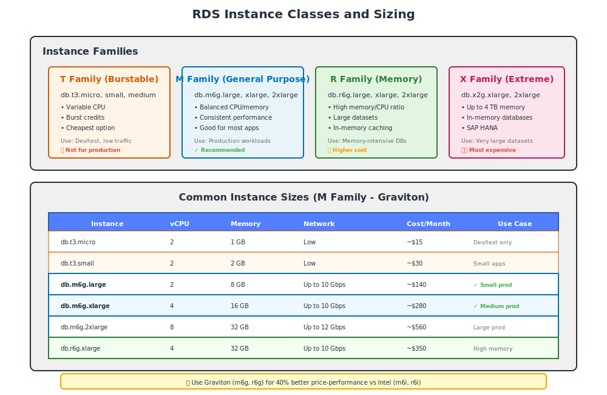

# Part 1: RDS Fundamentals & Database Basics

---

## Table of Contents

1. [What is Amazon RDS](Part%201%20RDS%20Fundamentals%20&%20Database%20Basics%2033bd9daa12b580ed89c2dcb003835a11.md)
2. [Why Use RDS Instead of Self-Managed Databases](Part%201%20RDS%20Fundamentals%20&%20Database%20Basics%2033bd9daa12b580ed89c2dcb003835a11.md)
3. [Relational vs Non-Relational Databases](Part%201%20RDS%20Fundamentals%20&%20Database%20Basics%2033bd9daa12b580ed89c2dcb003835a11.md)
4. [RDS Supported Database Engines](Part%201%20RDS%20Fundamentals%20&%20Database%20Basics%2033bd9daa12b580ed89c2dcb003835a11.md)
5. [RDS vs Aurora — When to Use Each](Part%201%20RDS%20Fundamentals%20&%20Database%20Basics%2033bd9daa12b580ed89c2dcb003835a11.md)
6. [Database Instance Classes](Part%201%20RDS%20Fundamentals%20&%20Database%20Basics%2033bd9daa12b580ed89c2dcb003835a11.md)
7. [Storage Types (General Purpose, Provisioned IOPS, Magnetic)](Part%201%20RDS%20Fundamentals%20&%20Database%20Basics%2033bd9daa12b580ed89c2dcb003835a11.md)
8. [RDS Deployment Options Overview](Part%201%20RDS%20Fundamentals%20&%20Database%20Basics%2033bd9daa12b580ed89c2dcb003835a11.md)
9. [RDS Pricing Model](Part%201%20RDS%20Fundamentals%20&%20Database%20Basics%2033bd9daa12b580ed89c2dcb003835a11.md)
10. [Key Terminology for RDS](Part%201%20RDS%20Fundamentals%20&%20Database%20Basics%2033bd9daa12b580ed89c2dcb003835a11.md)

---

## 1. What is Amazon RDS

**Amazon Relational Database Service (RDS)** is a managed database service that makes it easy to set up, operate, and scale a relational database in the cloud.

When you use RDS, AWS handles:
- Hardware provisioning
- Database setup
- Patching and updates
- Automated backups
- Operating system maintenance
- Database software installation

You focus on:
- Your application
- Query optimization
- Database schema design
- Access control

Think of RDS as **"database infrastructure as a service"** — you get the benefits of running a powerful database without managing the underlying servers, storage, or OS.

---

## 2. Why Use RDS Instead of Self-Managed Databases

Running a database on EC2 gives you full control, but it also means you are responsible for everything. Here is the comparison:

| Responsibility | RDS (Managed) | Database on EC2 (Self-Managed) |
|:---------------|:--------------|:-------------------------------|
| Hardware provisioning | AWS manages | You provision EC2 instance |
| OS installation & patching | AWS manages | You manage |
| Database software installation | AWS manages | You install |
| Database engine updates | AWS manages (can be automated) | You apply manually |
| Automated backups | Built-in, automatic | You configure manually |
| Point-in-time recovery | Built-in | You implement |
| High availability (Multi-AZ) | One-click setup | You architect and implement |
| Read replicas | Built-in, easy to create | You configure replication manually |
| Monitoring | CloudWatch integration automatic | You set up monitoring |
| Storage scaling | Can be done online | Requires downtime and manual steps |
| Disaster recovery | Automated snapshots, cross-region replication | You design and manage |

**When to use RDS:**
- You want to focus on application development, not database administration
- You need built-in high availability, backup, and disaster recovery
- You want automated patching and updates
- Your workload fits standard database configurations

**When to use EC2 with self-managed database:**
- You need complete control over database configuration
- You are using a database engine not supported by RDS
- You need root/system-level access to the OS
- You have very specific compliance requirements requiring custom configurations

---

## 3. Relational vs Non-Relational Databases

### Relational Databases (SQL)

Relational databases store data in **tables** with rows and columns. Each table has a defined schema (structure), and relationships between tables are established using **foreign keys**.

**Characteristics:**
- Structured data with predefined schema
- ACID compliance (Atomicity, Consistency, Isolation, Durability)
- Supports complex queries with JOINs
- Enforces data integrity through constraints
- Vertical scaling (scale up with more powerful hardware)

**Example use cases:**
- Financial transactions (banking, payment systems)
- E-commerce order management
- Customer Relationship Management (CRM) systems
- Enterprise Resource Planning (ERP) systems
- Any application requiring complex relationships between data

**SQL query example:**
```sql
SELECT customers.name, orders.total
FROM customers
JOIN orders ON customers.id = orders.customer_id
WHERE orders.date > '2024-01-01';
```

### Non-Relational Databases (NoSQL)

Non-relational databases (covered by Amazon DynamoDB, not RDS) store data in flexible formats like key-value pairs, documents, graphs, or wide-column stores.

**Characteristics:**
- Flexible schema (can vary between records)
- Horizontal scaling (add more servers)
- Eventually consistent (trade-off for performance)
- Optimized for specific access patterns
- Higher throughput for simple queries

**When to choose:**
- Rapid, unpredictable growth
- Semi-structured or unstructured data
- Simple access patterns (key-value lookups)
- Need massive horizontal scale

> **Note:** RDS is for relational databases only. For NoSQL, AWS offers DynamoDB, DocumentDB, Neptune, and ElastiCache.

---

## 4. RDS Supported Database Engines

RDS supports six database engines. Each has different features, pricing, and use cases:

### MySQL

**Type:** Open-source relational database  
**Current version on RDS:** 8.x (check AWS docs for latest)  
**Best for:** Web applications, content management systems, e-commerce

**Why choose MySQL:**
- Most popular open-source database
- Huge community support
- Works well with PHP, Python, Ruby, Java
- Cost-effective for startups and small to mid-size applications
- WordPress, Drupal, Magento all use MySQL by default

**Limitations:**
- Not as feature-rich as PostgreSQL or commercial databases
- Less advanced query optimization

---

### PostgreSQL

**Type:** Open-source object-relational database  
**Current version on RDS:** 16.x (check AWS docs for latest)  
**Best for:** Data warehousing, analytics, GIS applications, complex queries

**Why choose PostgreSQL:**
- Most advanced open-source database
- Supports JSON, XML, arrays, custom data types
- Excellent support for complex queries and analytics
- Strong standards compliance (SQL standard)
- Better for applications with complex business logic
- Supports full-text search, geospatial data (PostGIS extension)

**Limitations:**
- Slightly steeper learning curve than MySQL
- Historically slower for simple read-heavy workloads (gap has narrowed)

---

### MariaDB

**Type:** Open-source relational database (MySQL fork)  
**Current version on RDS:** 10.x  
**Best for:** MySQL users wanting more open governance and features

**Why choose MariaDB:**
- Created by original MySQL developers after Oracle acquired MySQL
- Drop-in replacement for MySQL (mostly compatible)
- Some performance improvements over MySQL
- More storage engines available
- Fully open-source (no commercial-only features)

**When to use:**
- Migrating from MySQL and want better performance
- Want to avoid Oracle's MySQL governance

---

### Oracle Database

**Type:** Commercial relational database  
**Editions on RDS:** Standard Edition (SE2), Enterprise Edition (EE)  
**Best for:** Enterprise applications, legacy systems, Oracle-dependent apps

**Why choose Oracle:**
- Industry-leading feature set
- Required if your application is built for Oracle (PL/SQL, Oracle-specific features)
- Advanced features: partitioning, Real Application Clusters (RAC-like with Multi-AZ), advanced security
- Extensive tooling and enterprise support

**Limitations:**
- Most expensive RDS option (bring your own license, or license included pricing)
- Vendor lock-in

**Licensing:**
- **License Included:** You pay AWS for both infrastructure and Oracle license
- **BYOL (Bring Your Own License):** You provide your own Oracle licenses, AWS charges only for infrastructure

---

### SQL Server

**Type:** Commercial relational database (Microsoft)  
**Editions on RDS:** Express, Web, Standard, Enterprise  
**Best for:** .NET applications, Windows-centric environments, enterprise apps

**Why choose SQL Server:**
- Deep integration with Microsoft ecosystem (.NET, Azure Active Directory, Power BI)
- Excellent tooling (SQL Server Management Studio, Visual Studio integration)
- Strong for business intelligence and reporting (SQL Server Reporting Services, Integration Services)
- Required if your app uses T-SQL or SQL Server-specific features

**Editions:**
- **Express:** Free, up to 10 GB database size
- **Web:** Low-cost for internet-facing workloads
- **Standard:** Mid-tier, suitable for most enterprise apps
- **Enterprise:** Advanced features (Always On, compression, partitioning)

**Licensing:**
- **License Included:** AWS provides the license
- **BYOL:** Bring your own SQL Server licenses

---

### Amazon Aurora

**Type:** AWS-proprietary, MySQL and PostgreSQL-compatible  
**Versions:** Aurora MySQL, Aurora PostgreSQL  
**Best for:** High performance, scalability, and availability requirements

**Why choose Aurora:**
- Up to 5x faster than MySQL, 3x faster than PostgreSQL (AWS claims)
- Storage automatically grows up to 128 TB (vs 64 TB for regular RDS)
- Up to 15 low-latency read replicas (vs 5 for MySQL/PostgreSQL RDS)
- Fault-tolerant, self-healing storage across 3 Availability Zones
- Continuous backup to S3 (no performance impact)
- Backtrack: Rewind database to a prior state without restoring from backup
- Aurora Serverless: Auto-scaling, pay-per-second, no capacity planning

**When to choose Aurora over standard RDS:**
- You need higher throughput and better performance
- You need more than 5 read replicas
- You want automated failover with < 30 seconds downtime
- You want storage that grows automatically without downtime

**Trade-offs:**
- More expensive than standard RDS MySQL/PostgreSQL (~20% higher cost)
- Fully managed by AWS (less customization than standard RDS)

---

## 5. RDS vs Aurora — When to Use Each

| Factor | RDS (MySQL/PostgreSQL) | Aurora (MySQL/PostgreSQL Compatible) |
|:-------|:-----------------------|:-------------------------------------|
| **Performance** | Standard | Up to 5x faster |
| **Storage max** | 64 TB | 128 TB |
| **Read replicas** | Up to 5 | Up to 15 |
| **Failover time** | 1-2 minutes | < 30 seconds |
| **Backup impact** | Can affect performance | No performance impact (continuous) |
| **Storage growth** | Manual (can be automated) | Automatic, in 10 GB increments |
| **Cost** | Lower | ~20% higher |
| **Serverless option** | No | Yes (Aurora Serverless) |
| **Backtrack** | No | Yes (point-in-time rewind without restore) |
| **Cross-region replicas** | Requires manual setup | Built-in global database option |

**Decision guide:**

**Choose RDS standard MySQL/PostgreSQL when:**
- Cost is a primary concern
- Your workload is moderate and doesn't need extreme performance
- You don't need more than 5 read replicas
- You are okay with 1-2 minute failover times

**Choose Aurora when:**
- You need maximum performance and low latency
- You need more than 5 read replicas
- You want sub-30-second automated failover
- You have unpredictable workloads (Aurora Serverless)
- You need global database spanning multiple regions

---

## 6. Database Instance Classes

Instance classes determine the compute and memory resources available to your RDS database. They follow a naming pattern:

```
db.<family><generation>.<size>

Example: db.t3.micro
         │   │  │
         │   │  └── size (micro, small, medium, large, xlarge, 2xlarge, etc.)
         │   └── generation (3, 4, 5, etc.)
         └── family (t = burstable, m = general purpose, r = memory-optimized, x = extreme memory)
```

### Instance Classes Overview



### Instance Families

**Burstable (T family)** — `db.t3.micro`, `db.t3.small`, `db.t3.medium`
- Variable CPU performance with burst capability
- Credits accumulate when CPU usage is low
- Good for development, testing, low-traffic applications
- **Cheapest option**
- Not recommended for production with consistent load

**General Purpose (M family)** — `db.m6g.large`, `db.m6i.xlarge`
- Balanced compute, memory, and network
- Good for most production workloads
- Medium-level traffic web/mobile apps

**Memory Optimized (R family)** — `db.r6g.large`, `db.r6i.2xlarge`
- High memory-to-CPU ratio
- Best for database-intensive applications
- Large datasets that don't fit in cache
- High-performance queries and analytics

**Optimized for Storage-Intensive (X family)** — `db.x2g.xlarge`
- Extreme memory capacity (up to 4 TB per instance)
- For in-memory databases and massive datasets
- Most expensive

### Processor Types

- **i** (Intel) — General availability, widely compatible
- **g** (Graviton2/Graviton3, ARM-based) — Up to 40% better price-performance, newer, recommended for most workloads
- **a** (AMD) — Cost-effective alternative

**Example sizes:**

| Instance | vCPUs | Memory | Network Performance | Use Case |
|:---------|:------|:-------|:--------------------|:---------|
| db.t3.micro | 2 | 1 GB | Low | Dev/test |
| db.t3.small | 2 | 2 GB | Low | Small apps |
| db.m6g.large | 2 | 8 GB | Up to 10 Gbps | Small production |
| db.m6g.xlarge | 4 | 16 GB | Up to 10 Gbps | Medium production |
| db.r6g.2xlarge | 8 | 64 GB | Up to 15 Gbps | High-memory workload |
| db.r6g.16xlarge | 64 | 512 GB | 25 Gbps | Very large databases |

---

## 7. Storage Types (General Purpose, Provisioned IOPS, Magnetic)

RDS offers three storage types, each optimized for different workloads:

### General Purpose SSD (gp3 / gp2)

**Type:** SSD (Solid State Drive)  
**Use case:** Most workloads  
**Performance:** Baseline 3 IOPS per GB, burstable  

**gp3 (newest, recommended):**
- 3,000 IOPS baseline (regardless of size)
- 125 MB/s throughput baseline
- Can scale IOPS and throughput independently from storage size
- More cost-effective than gp2

**gp2 (older generation):**
- 3 IOPS per GB (100 GB = 300 IOPS)
- Burst up to 3,000 IOPS using burst credits
- Performance scales with storage size

**When to use:**
- Most production workloads
- Applications with moderate, predictable I/O
- Cost-sensitive environments

---

### Provisioned IOPS SSD (io1 / io2)

**Type:** High-performance SSD  
**Use case:** I/O-intensive workloads  
**Performance:** You specify exact IOPS (up to 64,000 IOPS per instance)

**io2 (recommended, more durable):**
- 500 IOPS per GB
- 99.999% durability (io1 is 99.9%)
- Same price as io1 for up to 32,000 IOPS

**When to use:**
- Latency-sensitive applications (financial transactions, gaming)
- Sustained high I/O performance required
- Applications with more than 16,000 IOPS requirements

**Example:** 1 TB storage, 40,000 IOPS → you pay for both storage and IOPS separately

---

### Magnetic Storage (Standard)

**Type:** Hard Disk Drive (HDD)  
**Use case:** Backward compatibility only  
**Performance:** ~100 IOPS  

**Why avoid:**
- Slow, unpredictable performance
- No longer recommended by AWS for any workload
- Only useful for legacy applications already using it

---

### Storage Comparison Table

| Storage Type | IOPS Range | Throughput | Latency | Cost | Best For |
|:-------------|:-----------|:-----------|:--------|:-----|:---------|
| gp3 | 3,000–16,000 | 125–1,000 MB/s | Low | $ | Most workloads |
| gp2 | 100–16,000 | Variable | Low | $ | Burstable workloads |
| io2 | 1,000–64,000 | Up to 1,000 MB/s | Very low | $$$ | I/O-intensive apps |
| Magnetic | ~100 | Low | High | $ | Not recommended |

---

## 8. RDS Deployment Options Overview

### Single-AZ Deployment

- Database runs in **one Availability Zone only**
- No automatic failover
- If the AZ fails, database is unavailable until AWS recovers the infrastructure or you restore from backup
- **Lowest cost**
- Use for: Development, testing, non-critical applications

---

### Multi-AZ Deployment

- RDS automatically creates a **standby replica in a different Availability Zone**
- Synchronous replication (every write to primary is replicated to standby before confirming)
- Automatic failover (1-2 minutes) if primary fails
- Standby is **not accessible** for reads (it is purely for failover)
- **Higher cost** (~2x single-AZ)
- Use for: Production databases requiring high availability

**How failover works:**
1. RDS detects primary instance failure (hardware, AZ outage, network)
2. DNS record (your RDS endpoint) automatically points to standby
3. Standby becomes the new primary
4. No application code changes needed (same endpoint)

---

### Multi-AZ DB Cluster (Aurora-style for RDS MySQL/PostgreSQL)

- Newer deployment option (introduced 2021)
- One primary (writer) + two readable standbys in different AZs
- Faster failover than traditional Multi-AZ (~35 seconds)
- Standby instances are **readable** (unlike traditional Multi-AZ)
- Only available for MySQL 8.0.28+ and PostgreSQL 13.4+

---

### Read Replicas

- **Separate instances** used to offload read traffic from primary
- Asynchronous replication (slight lag, typically seconds)
- Can be in same AZ, different AZ, or different region
- Can be promoted to standalone database
- Up to 5 read replicas for MySQL/PostgreSQL/MariaDB (15 for Aurora)
- Use for: Reporting, analytics, read-heavy applications

**Key difference from Multi-AZ:**
- Multi-AZ = High availability (standby not readable)
- Read Replicas = Scalability (readable, but not automatic failover)

You can combine both: Multi-AZ + Read Replicas

---

## 9. RDS Pricing Model

RDS pricing is based on several factors:

### 1. Instance Hours
- Charged per hour the DB instance is running
- Varies by instance class (db.t3.micro vs db.m6g.16xlarge)
- Charged even if database is idle (not processing queries)

### 2. Storage
- Charged per GB per month
- gp3, gp2, io2 pricing differs
- For io2, you also pay for provisioned IOPS separately

### 3. Backup Storage
- Automated backups are stored in S3
- Free backup storage = size of your database
- Additional backup storage charged per GB
- Manual snapshots count toward backup storage

### 4. Data Transfer
- Data transfer **IN** is free
- Data transfer **OUT to the internet** is charged (starts free up to 1 GB, then tiered)
- Data transfer between RDS and EC2 **in the same AZ** is free
- Data transfer between AZs is charged

### 5. Additional Features
- Multi-AZ deployment (roughly doubles instance cost)
- Provisioned IOPS (pay per IOPS per month)
- Enhanced Monitoring
- Performance Insights (first 7 days free, long-term retention charged)

### Free Tier (for new AWS accounts)

- 750 hours per month of **db.t2.micro** or **db.t3.micro** (single-AZ)
- 20 GB of General Purpose SSD storage
- 20 GB of backup storage
- Valid for 12 months from account creation

---

## 10. Key Terminology for RDS

- **DB Instance:** A database environment running in the cloud. This is the actual database server (similar to an EC2 instance, but managed).
- **DB Engine:** The database software (MySQL, PostgreSQL, Oracle, SQL Server, MariaDB, Aurora).
- **DB Instance Identifier:** A unique name you assign to your RDS instance (e.g., `my-app-database`). This is used in the RDS endpoint.
- **Endpoint:** The DNS address you use to connect to the database. Format: `<instance-name>.<random>.<region>.rds.amazonaws.com:3306`
- **Port:** The network port your database listens on. Default ports: MySQL/MariaDB (3306), PostgreSQL (5432), SQL Server (1433), Oracle (1521).
- **Master Username:** The admin username created when you launch the DB instance.
- **Master Password:** The password for the master user (you set this during creation).
- **DB Parameter Group:** A collection of database engine configuration values (like MySQL's `my.cnf` file). You can create custom parameter groups to tune the database.
- **DB Option Group:** Additional features you can enable (like Oracle Transparent Data Encryption, SQL Server's Native Backup/Restore).
- **DB Subnet Group:** A collection of subnets (in different AZs) where RDS can place your database. Required for Multi-AZ and VPC deployments.
- **Security Group:** Firewall rules controlling who can connect to your RDS instance. You define rules like "allow TCP 3306 from my app server's security group."
- **Maintenance Window:** A scheduled time period when AWS can perform OS patching, engine upgrades, and other maintenance. You can set this to a low-traffic period.
- **Backup Window:** A 30-minute to several-hour window when automated backups occur. During this time, I/O may be briefly suspended (single-AZ only; Multi-AZ has no I/O suspension).
- **Snapshot:** A manual or automated point-in-time backup of your entire RDS instance. Stored in S3. Can be restored to a new DB instance.
- **Automated Backup Retention Period:** Number of days RDS keeps automated backups (0 to 35 days). 0 disables automated backups.
- **Point-in-Time Recovery (PITR):** Restore your database to any second within the retention period.
- **Read Replica:** A read-only copy of your database, used to scale read traffic.
- **Multi-AZ:** High-availability deployment with automatic failover.
- **Standby Instance:** The synchronized copy of your database in another AZ (Multi-AZ only, not accessible for reads).
- **Failover:** Automatic switching from primary to standby instance when a failure is detected.
- **Promotion:** Converting a read replica into a standalone read-write database.
- **DB Cluster:** A group of DB instances that work together (applies to Aurora and Multi-AZ clusters).

---

## Architecture Decision Guide

When planning your RDS deployment, use this decision tree to choose the right configuration:


---