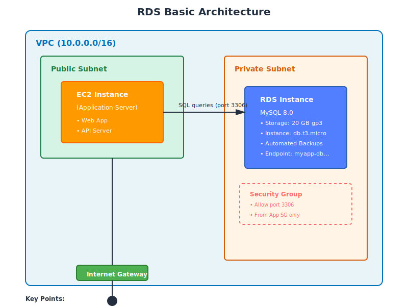

# Part 2: Creating RDS Instance from Scratch

---

## Our Example Architecture (Reference This Throughout)

Before launching anything in AWS, we plan the architecture. This is what we will build:

**Database Engine:** MySQL 8.0  
**Instance Class:** db.t3.micro (free tier eligible)  
**Storage:** 20 GB gp3 (General Purpose SSD)  
**Deployment:** Single-AZ (will upgrade to Multi-AZ in Part 5)  
**Region:** `us-east-1`  
**VPC:** We will use an existing VPC with private subnets  

---

## Table of Contents

1. [Prerequisites — VPC and Network Setup](Part%202%20Creating%20RDS%20Instance%20from%20Scratch%2033bd9daa12b5804bb3d6f9bbdd3312b2.md)
2. [Step 1 — Create DB Subnet Group](Part%202%20Creating%20RDS%20Instance%20from%20Scratch%2033bd9daa12b5804bb3d6f9bbdd3312b2.md)
3. [Step 2 — Create Security Group for RDS](Part%202%20Creating%20RDS%20Instance%20from%20Scratch%2033bd9daa12b5804bb3d6f9bbdd3312b2.md)
4. [Step 3 — Launch RDS MySQL Instance](Part%202%20Creating%20RDS%20Instance%20from%20Scratch%2033bd9daa12b5804bb3d6f9bbdd3312b2.md)
5. [Step 4 — Understanding RDS Instance Status](Part%202%20Creating%20RDS%20Instance%20from%20Scratch%2033bd9daa12b5804bb3d6f9bbdd3312b2.md)
6. [Step 5 — Connect to RDS from EC2](Part%202%20Creating%20RDS%20Instance%20from%20Scratch%2033bd9daa12b5804bb3d6f9bbdd3312b2.md)
7. [Step 6 — Create a Sample Database and Table](Part%202%20Creating%20RDS%20Instance%20from%20Scratch%2033bd9daa12b5804bb3d6f9bbdd3312b2.md)
8. [Step 7 — Test Database Operations](Part%202%20Creating%20RDS%20Instance%20from%20Scratch%2033bd9daa12b5804bb3d6f9bbdd3312b2.md)
9. [Important Configuration Settings Explained](Part%202%20Creating%20RDS%20Instance%20from%20Scratch%2033bd9daa12b5804bb3d6f9bbdd3312b2.md)
10. [Common Errors and Troubleshooting](Part%202%20Creating%20RDS%20Instance%20from%20Scratch%2033bd9daa12b5804bb3d6f9bbdd3312b2.md)

---

## 1. Prerequisites — VPC and Network Setup

Before creating an RDS instance, you need:

### A VPC with Private Subnets

RDS should **always** be placed in private subnets (no direct internet access). This is a security best practice.

### RDS Architecture Overview



If you completed the Networking section, you already have:
- A VPC with CIDR `10.0.0.0/16` or similar
- Private subnets in at least 2 Availability Zones
- A route to the internet via NAT Gateway (for software updates)

### Why Two Availability Zones?

Even if you start with Single-AZ deployment, AWS requires you to define a **DB Subnet Group** with subnets in at least **two AZs**. This is because:
- You may later enable Multi-AZ (which requires a second AZ)
- AWS best practices require AZ diversity for resilience

### Network Design

```
VPC: 10.0.0.0/16
├── Private Subnet 1 (us-east-1a): 10.0.1.0/24
├── Private Subnet 2 (us-east-1b): 10.0.2.0/24
└── RDS will be placed here
```

---

## 2. Step 1 — Create DB Subnet Group

A **DB Subnet Group** is a collection of subnets (from different AZs) that tells RDS where it can launch database instances.

### Why You Need This

RDS does not let you directly pick a subnet when launching an instance. Instead, you first define a group of allowed subnets, and RDS chooses one from the group (or uses both in Multi-AZ mode).

### Create the Subnet Group

```
AWS Console → RDS → Subnet groups → Create DB subnet group
```

```
Settings:
──────────────────────────────────────────────────────
Name:               my-db-subnet-group
Description:        Private subnets for RDS instances
VPC:                Select your VPC (e.g., my-demo-vpc)
──────────────────────────────────────────────────────
```

**Add Subnets:**

```
Availability Zone: us-east-1a
Subnet:            Select your private subnet in us-east-1a (e.g., 10.0.1.0/24)

[Click "Add subnet"]

Availability Zone: us-east-1b
Subnet:            Select your private subnet in us-east-1b (e.g., 10.0.2.0/24)
```

Click **Create**.

### What Happens

AWS validates that:
- Subnets are in different AZs
- Subnets have enough available IP addresses
- Subnets are not overlapping

---

## 3. Step 2 — Create Security Group for RDS

A **Security Group** acts as a firewall. It controls which sources can connect to your RDS instance.

### Best Practice: Database-Only Security Group

Create a dedicated security group for RDS. Never reuse your EC2 web server security group for databases.

```
AWS Console → VPC → Security Groups → Create security group
```

```
Settings:
──────────────────────────────────────────────────────
Security group name:    rds-mysql-sg
Description:            Allow MySQL access from application servers
VPC:                    Select your VPC
──────────────────────────────────────────────────────
```

### Inbound Rules

Add a rule to allow MySQL traffic:

```
Type:       MySQL/Aurora
Protocol:   TCP
Port:       3306
Source:     Custom
Value:      sg-xxxxxxxxx (security group of your EC2 app servers)
```

**Why use a security group as the source?**

Instead of specifying an IP address (which can change), you reference the security group attached to your application servers. This means:
- Any EC2 instance with that security group can connect
- If you add/remove instances, the rule still works
- More secure and easier to manage

### Outbound Rules

Leave the default (allow all outbound). RDS needs to:
- Reach AWS services for backups and monitoring
- Download patches and updates

---

## 4. Step 3 — Launch RDS MySQL Instance

Now we create the actual database.

```
AWS Console → RDS → Databases → Create database
```

### Engine Options

```
Engine type:            MySQL
Edition:                MySQL Community
Engine version:         MySQL 8.0.35 (or latest 8.0.x)
```

**Why MySQL 8.0?**
- Latest stable version with modern features
- Better performance than 5.7
- JSON support, window functions, CTEs (Common Table Expressions)

---

### Templates

AWS offers three templates as shortcuts:

```
( ) Production      — Multi-AZ, provisioned IOPS, larger instance
( ) Dev/Test        — Single-AZ, smaller instance, burstable
(•) Free tier       — db.t3.micro, 20 GB storage, single-AZ
```

**Select Free tier** for this tutorial (you can upgrade later).

---

### Settings

```
DB instance identifier:     myapp-db
Master username:            admin
Master password:            <create a strong password>
Confirm password:           <same password>
```

**Important:**
- The instance identifier becomes part of your endpoint: `myapp-db.xxxxx.us-east-1.rds.amazonaws.com`
- Master username and password are your database admin credentials (not IAM)
- **Save your password** — AWS does not store it in plain text and you cannot retrieve it later

---

### Instance Configuration

```
DB instance class:       Burstable classes (includes t classes)
                         db.t3.micro (2 vCPU, 1 GB RAM) — Free tier eligible
```

If you are not using free tier, consider:
- `db.t3.small` — Light production workloads
- `db.m6g.large` — General production workloads
- `db.r6g.large` — Memory-intensive workloads

---

### Storage

```
Storage type:            General Purpose SSD (gp3)
Allocated storage:       20 GB (minimum, free tier limit)
Storage autoscaling:     ☑ Enable storage autoscaling
Maximum storage:         100 GB
```

**Storage autoscaling explained:**
- RDS automatically increases storage when free space drops below 10%
- Prevents "out of disk space" errors
- No downtime when scaling
- You set a maximum limit to control costs

---

### Availability & Durability

```
Multi-AZ deployment:     ( ) Create a standby instance (recommended for production)
                         (•) Do not create a standby instance
```

**For this tutorial:** Select "Do not create a standby instance" (single-AZ).  
**For production:** Always enable Multi-AZ.

We will enable Multi-AZ in Part 5.

---

### Connectivity

```
Virtual private cloud (VPC):         Select your VPC
DB subnet group:                     my-db-subnet-group (created in Step 1)
Public access:                       No (NEVER enable for production)
VPC security group:                  Choose existing
Existing VPC security groups:        rds-mysql-sg (created in Step 2)
                                     Remove the default security group
Availability Zone:                   No preference (let AWS choose)
```

**Why Public access = No?**
- Databases should never be directly accessible from the internet
- Always access via application servers in the same VPC
- Use bastion host or VPN if you need admin access from outside

---

### Database Authentication

```
Database authentication options:
☑ Password authentication
☐ Password and IAM database authentication
☐ Password and Kerberos authentication
```

**For this tutorial:** Use password authentication.  
**For advanced setups:** IAM database authentication allows you to use IAM roles instead of passwords (covered in Part 6).

---

### Monitoring

```
Enable Enhanced Monitoring:          Yes (recommended)
Granularity:                         60 seconds (free tier)
```

Enhanced Monitoring provides OS-level metrics (CPU, memory, disk I/O) not available in standard CloudWatch.

**Enable Performance Insights:**
```
☑ Enable Performance Insights
Retention period:                    7 days (free)
```

Performance Insights shows which queries are consuming resources.

---

### Additional Configuration (expand this section)

#### Database Options

```
Initial database name:               mydatabase
DB parameter group:                  default.mysql8.0 (use default for now)
Option group:                        default:mysql-8-0
```

**Initial database name:**
- If you specify a name, RDS creates this database automatically
- If blank, RDS creates the instance but no database (you create it manually later)
- **Recommendation:** Specify a name for simplicity

---

#### Backup

```
Enable automated backups:            Yes (enabled by default)
Backup retention period:             7 days (default, can be 1-35 days)
Backup window:                       No preference (let AWS choose)
☑ Copy tags to snapshots
```

**Backup retention explained:**
- Automated backups stored for X days
- Used for point-in-time recovery
- Set to 0 to disable backups (not recommended, even for dev)

---

#### Encryption

```
Enable encryption:                   Yes (recommended)
AWS KMS key:                         (default) aws/rds
```

**Always enable encryption for production.** It encrypts:
- Storage (disk)
- Automated backups
- Snapshots
- Read replicas

No performance impact on modern instances.

---

#### Maintenance

```
Enable auto minor version upgrade:   Yes (recommended)
Maintenance window:                  No preference
```

**Auto minor version upgrade:**
- AWS applies minor patches automatically (e.g., 8.0.35 → 8.0.36)
- Happens during maintenance window
- Typically fixes security issues and bugs
- Major version upgrades (8.0 → 9.0) are manual

---

#### Deletion Protection

```
Enable deletion protection:          No (for tutorial purposes)
                                     Yes (for production — prevents accidental deletion)
```

---

### Cost Estimate

Before clicking Create, AWS shows an estimated monthly cost.

For free tier: **$0** (if you stay within 750 hours/month, 20 GB storage)

For non-free tier:
- db.t3.micro: ~$15/month
- db.m6g.large: ~$140/month
- Add storage and backup costs

---

### Create Database

Click **Create database**.

---

## 5. Step 4 — Understanding RDS Instance Status

After creation, RDS goes through several states:

```
Creating → Backing up → Available
```

**Creating (5-10 minutes):**
- AWS provisions the compute instance
- Allocates storage
- Installs the database engine
- Applies initial configuration

**Backing up (2-5 minutes):**
- RDS takes an initial automated backup
- This becomes your first restore point

**Available:**
- Database is ready
- You can now connect

### View Your Instance

```
AWS Console → RDS → Databases → Click on your instance (myapp-db)
```

You will see:
- **Endpoint:** `myapp-db.c1a2b3c4d5e6.us-east-1.rds.amazonaws.com`
- **Port:** `3306`
- **Status:** Available

**Save the endpoint** — you will use this to connect.

---

## 6. Step 5 — Connect to RDS from EC2

You cannot connect to RDS directly from your laptop (because we disabled public access). You must connect from an EC2 instance in the same VPC.

### Launch a Test EC2 Instance

```
AWS Console → EC2 → Launch Instance
```

```
Name:                    db-client
AMI:                     Amazon Linux 2023
Instance type:           t2.micro
Key pair:                Select or create a key pair
Network:                 Same VPC as RDS
Subnet:                  Any private subnet (with NAT Gateway for internet)
Security group:          The app-server security group you used in Step 2
```

**Important:** This EC2 instance must have the security group you allowed in the RDS security group.

---

### SSH into EC2

```bash
ssh -i your-key.pem ec2-user@<ec2-public-ip>
```

---

### Install MySQL Client

```bash
sudo yum update -y
sudo yum install mysql -y
```

Verify installation:
```bash
mysql --version
```

---

### Connect to RDS

```bash
mysql -h myapp-db.c1a2b3c4d5e6.us-east-1.rds.amazonaws.com \
      -P 3306 \
      -u admin \
      -p
```

Replace:
- `-h` → your RDS endpoint
- `-u` → master username (admin)
- `-p` → you will be prompted for password

**Enter your master password** when prompted.

If successful, you will see:

```
Welcome to the MySQL monitor.  Commands end with ; or \g.
Your MySQL connection id is 10
Server version: 8.0.35 Source distribution

Type 'help;' or '\h' for help. Type '\c' to clear the current input statement.

mysql>
```

---

## 7. Step 6 — Create a Sample Database and Table

### List Databases

```sql
SHOW DATABASES;
```

Output:
```
+--------------------+
| Database           |
+--------------------+
| information_schema |
| mydatabase         |
| mysql              |
| performance_schema |
| sys                |
+--------------------+
```

`mydatabase` is the initial database we specified during RDS creation.

---

### Use the Database

```sql
USE mydatabase;
```

---

### Create a Table

```sql
CREATE TABLE users (
    id INT AUTO_INCREMENT PRIMARY KEY,
    username VARCHAR(50) NOT NULL UNIQUE,
    email VARCHAR(100) NOT NULL,
    created_at TIMESTAMP DEFAULT CURRENT_TIMESTAMP
);
```

---

### Insert Sample Data

```sql
INSERT INTO users (username, email) VALUES
('alice', 'alice@example.com'),
('bob', 'bob@example.com'),
('charlie', 'charlie@example.com');
```

---

## 8. Step 7 — Test Database Operations

### Query Data

```sql
SELECT * FROM users;
```

Output:
```
+----+----------+----------------------+---------------------+
| id | username | email                | created_at          |
+----+----------+----------------------+---------------------+
|  1 | alice    | alice@example.com    | 2024-01-15 10:30:00 |
|  2 | bob      | bob@example.com      | 2024-01-15 10:30:00 |
|  3 | charlie  | charlie@example.com  | 2024-01-15 10:30:00 |
+----+----------+----------------------+---------------------+
```

---

### Update Data

```sql
UPDATE users SET email = 'alice.smith@example.com' WHERE username = 'alice';
```

---

### Delete Data

```sql
DELETE FROM users WHERE username = 'charlie';
```

---

### Exit MySQL

```sql
EXIT;
```

---

## 9. Important Configuration Settings Explained

### Why We Chose These Settings

| Setting | Value | Reason |
|:--------|:------|:-------|
| **Engine** | MySQL 8.0 | Modern, feature-rich, widely used |
| **Instance class** | db.t3.micro | Free tier, good for learning/dev |
| **Storage** | gp3, 20 GB | Balanced performance and cost |
| **Multi-AZ** | Disabled | Lower cost for dev (enable for prod) |
| **Public access** | No | Security best practice |
| **Encryption** | Enabled | Security best practice (no perf cost) |
| **Automated backups** | 7 days | Allows point-in-time recovery |
| **Enhanced Monitoring** | Enabled | Better visibility into performance |
| **Deletion protection** | Disabled | Easier to clean up tutorial resources |

---

### Settings You Can Change Later (No Downtime)

- Backup retention period
- Backup window
- Maintenance window
- Monitoring settings
- Security groups
- Parameter groups (some parameters)
- Tags

---

### Settings You Can Change (With Downtime)

- Instance class (scaling up/down)
- Storage type (gp2 → gp3, gp3 → io2)
- Multi-AZ (enabling requires downtime for single-AZ → Multi-AZ)
- Engine version (major version upgrades)

---

### Settings You CANNOT Change

- DB instance identifier (requires creating a new instance)
- Master username (requires creating a new instance)
- Engine type (e.g., MySQL → PostgreSQL — must migrate manually)
- VPC (once created, the RDS instance is tied to that VPC)
- Initial database name (but you can create new databases)

---

## 10. Common Errors and Troubleshooting

### Error: "Could not connect to server"

**Symptoms:**
```bash
ERROR 2003 (HY000): Can't connect to MySQL server on 'myapp-db...' (110)
```

**Causes and fixes:**

1. **Security group not allowing traffic**
   - Verify RDS security group has inbound rule for port 3306
   - Verify source is set to your EC2 security group (not an IP)

2. **EC2 instance not in the allowed security group**
   - Check EC2 instance's security group matches the one allowed in RDS security group

3. **RDS instance not in Available state**
   - Go to RDS Console → Check status
   - Wait until status = Available

4. **Wrong endpoint or port**
   - Verify endpoint from RDS Console (Connectivity & security tab)
   - MySQL default port is 3306

---

### Error: "Access denied for user"

**Symptoms:**
```bash
ERROR 1045 (28000): Access denied for user 'admin'@'10.0.1.50' (using password: YES)
```

**Causes and fixes:**

1. **Wrong password**
   - Verify password
   - Reset password: RDS Console → Modify → Change master password

2. **Wrong username**
   - Verify master username in RDS Console (Configuration tab)

3. **Trying to connect from wrong host**
   - This error shows your IP (10.0.1.50)
   - Verify you are connecting from an allowed source

---

### Error: "Unknown database"

**Symptoms:**
```bash
ERROR 1049 (42000): Unknown database 'mydatabase'
```

**Causes and fixes:**

1. **Database was not created during RDS launch**
   - If you left "Initial database name" blank, no database was created
   - Solution: Create the database manually:
     ```sql
     CREATE DATABASE mydatabase;
     ```

2. **Typo in database name**
   - List all databases: `SHOW DATABASES;`
   - Use the correct name

---

### Performance Issues

**Symptoms:**
- Slow queries
- High CPU usage
- High IOPS consumption

**Causes and fixes:**

1. **Instance class too small**
   - Check CloudWatch metrics: CPU, memory, IOPS
   - Upgrade to larger instance class

2. **Missing indexes**
   - Run `EXPLAIN` on slow queries
   - Add indexes to frequently queried columns

3. **Storage IOPS limit reached**
   - gp3 baseline is 3,000 IOPS
   - Upgrade to io2 if you need more consistent high IOPS

4. **Too many connections**
   - MySQL default max_connections is based on instance memory
   - Check: `SHOW VARIABLES LIKE 'max_connections';`
   - Optimize application connection pooling

---