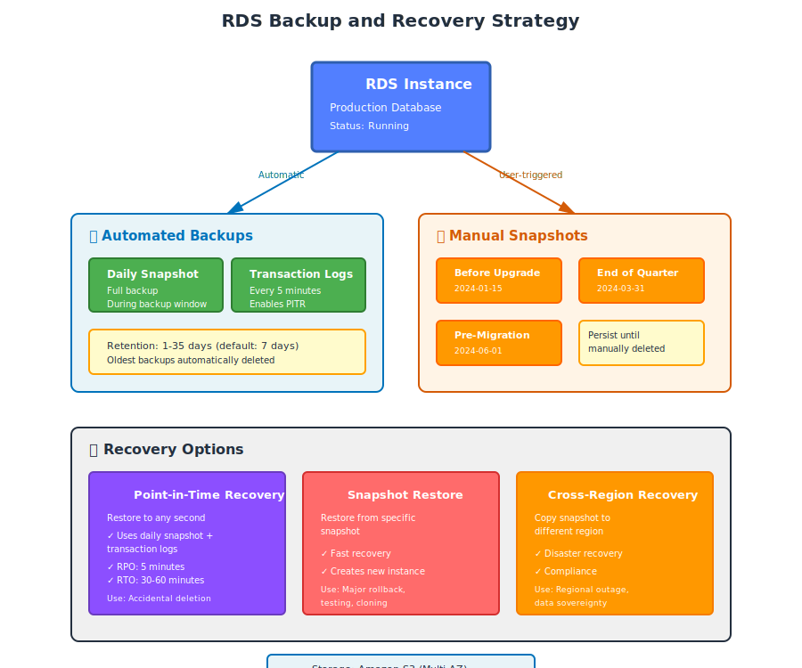

# Part 4: RDS Backup, Snapshots, and Recovery

---

## Table of Contents

1. [RDS Backup Architecture Overview](Part%204%20RDS%20Backup,%20Snapshots,%20and%20Recovery%2033bd9daa12b580c2d8e7a4b005836e72.md)
2. [Automated Backups vs Manual Snapshots](Part%204%20RDS%20Backup,%20Snapshots,%20and%20Recovery%2033bd9daa12b580c2d8e7a4b005836e72.md)
3. [Automated Backups Deep Dive](Part%204%20RDS%20Backup,%20Snapshots,%20and%20Recovery%2033bd9daa12b580c2d8e7a4b005836e72.md)
4. [Point-in-Time Recovery (PITR)](Part%204%20RDS%20Backup,%20Snapshots,%20and%20Recovery%2033bd9daa12b580c2d8e7a4b005836e72.md)
5. [Manual Snapshots](Part%204%20RDS%20Backup,%20Snapshots,%20and%20Recovery%2033bd9daa12b580c2d8e7a4b005836e72.md)
6. [Creating a Manual Snapshot (Hands-On)](Part%204%20RDS%20Backup,%20Snapshots,%20and%20Recovery%2033bd9daa12b580c2d8e7a4b005836e72.md)
7. [Restoring from a Snapshot](Part%204%20RDS%20Backup,%20Snapshots,%20and%20Recovery%2033bd9daa12b580c2d8e7a4b005836e72.md)
8. [Restoring to a Point in Time (Hands-On)](Part%204%20RDS%20Backup,%20Snapshots,%20and%20Recovery%2033bd9daa12b580c2d8e7a4b005836e72.md)
9. [Copying Snapshots Across Regions](Part%204%20RDS%20Backup,%20Snapshots,%20and%20Recovery%2033bd9daa12b580c2d8e7a4b005836e72.md)
10. [Sharing Snapshots Across Accounts](Part%204%20RDS%20Backup,%20Snapshots,%20and%20Recovery%2033bd9daa12b580c2d8e7a4b005836e72.md)
11. [Backup Storage Costs](Part%204%20RDS%20Backup,%20Snapshots,%20and%20Recovery%2033bd9daa12b580c2d8e7a4b005836e72.md)
12. [Disaster Recovery Strategies](Part%204%20RDS%20Backup,%20Snapshots,%20and%20Recovery%2033bd9daa12b580c2d8e7a4b005836e72.md)
13. [Testing Your Backups](Part%204%20RDS%20Backup,%20Snapshots,%20and%20Recovery%2033bd9daa12b580c2d8e7a4b005836e72.md)
14. [Best Practices](Part%204%20RDS%20Backup,%20Snapshots,%20and%20Recovery%2033bd9daa12b580c2d8e7a4b005836e72.md)

---

## 1. RDS Backup Architecture Overview

RDS provides two types of backups:

```
RDS Backups
│
├── Automated Backups
│   ├── Daily full snapshot
│   ├── Transaction logs (every 5 minutes)
│   └── Enables Point-in-Time Recovery (PITR)
│
└── Manual Snapshots
    ├── User-triggered
    ├── Persist until manually deleted
    └── No automatic expiration
```

### Backup and Recovery Visualization



### Where Backups Are Stored

All backups are stored in **Amazon S3** (in the same region as your RDS instance):
- Stored across multiple Availability Zones automatically
- Encrypted if the source database is encrypted
- Not visible in your S3 console (AWS manages this storage)

---

## 2. Automated Backups vs Manual Snapshots

| Feature | Automated Backups | Manual Snapshots |
|:--------|:------------------|:-----------------|
| **Triggered by** | AWS (daily + transaction logs) | You (on-demand) |
| **Retention** | 1-35 days (you set) | Until you delete |
| **Point-in-Time Recovery** | Yes (to any second within retention) | No (only snapshot time) |
| **Deleted when instance deleted** | Yes | No (persists) |
| **Cost** | Free up to DB size, then $0.095/GB | $0.095/GB-month |
| **Use case** | Day-to-day recovery | Long-term backups, migrations, testing |

---

## 3. Automated Backups Deep Dive

### How Automated Backups Work

```
1. Daily snapshot (full backup) during backup window
2. Transaction logs captured every 5 minutes
3. Stored for retention period (1-35 days)
4. Oldest backups automatically deleted after retention expires
```

### Backup Window

The **backup window** is a 30-minute to several-hour period when RDS takes the daily snapshot.

**Impact:**
- **Single-AZ:** Brief I/O suspension (seconds to minutes) during snapshot
- **Multi-AZ:** No I/O suspension (snapshot taken from standby)

**Configure backup window:**
```
AWS Console → RDS → Modify
```

```
Backup window:  02:00 - 02:30 UTC (choose a low-traffic time)
```

Or select **No preference** and AWS picks a time.

---

### Backup Retention Period

```
Retention: 1 to 35 days (default is 7 days)
```

**Setting retention to 0** disables automated backups entirely.

> ⚠️ **Never disable backups in production.** Even development databases should have at least 1 day retention.

**Configure retention:**
```
AWS Console → RDS → Modify
```

```
Backup retention period: 7 days (recommended minimum for production)
```

For compliance/regulatory requirements, you might need 30-35 days.

---

### Transaction Logs

Transaction logs record every change (insert, update, delete) made to the database.

RDS captures these logs **every 5 minutes** and uploads them to S3.

**Why transaction logs matter:**
- Enable Point-in-Time Recovery (PITR)
- Allow restoring to any second within retention period
- Much smaller than full snapshots

**Example recovery scenario:**
```
Last daily snapshot: Yesterday at 02:00 AM
Database crashed:    Today at 10:37 AM
Recovery:            Restore snapshot + replay transaction logs from 02:00 to 10:37
```

---

## 4. Point-in-Time Recovery (PITR)

PITR allows you to restore your database to **any second** within the retention period.

### Use Cases

- **Accidental data deletion:** "I dropped the wrong table at 3:45 PM"
- **Bad deployment:** "The deployment at 2:30 PM corrupted data"
- **Testing:** "I want to see what the database looked like last Tuesday"

### How It Works

```
1. RDS creates a new DB instance
2. Restores the most recent daily snapshot
3. Replays transaction logs up to your specified time
4. New instance is ready to use
```

**Important:** PITR creates a **new instance**. Your original instance is untouched.

---

### PITR Window

You can restore to any point within your retention period:

```
Earliest restore time: Today - retention period
Latest restore time:   5 minutes ago (transaction log lag)
```

Example with 7-day retention:
```
Today is: January 15, 2024
Earliest: January 8, 2024
Latest:   January 15, 2024, 10:55 AM (current time is 11:00 AM)
```

---

### View Available Restore Range

```
AWS Console → RDS → Databases → Select instance
```

Look for:
```
Latest restorable time:  2024-01-15 10:55:00 UTC
Earliest restorable time: 2024-01-08 02:00:00 UTC
```

---

## 5. Manual Snapshots

Manual snapshots are user-triggered backups that **persist until you delete them**.

### When to Use Manual Snapshots

- **Before major changes:** "I'm upgrading the database engine — take a snapshot first"
- **Long-term retention:** "Keep a backup from end-of-quarter for compliance"
- **Environment cloning:** "Create a copy of production for testing"
- **Pre-delete safety:** "Before deleting the instance, take a final snapshot"

### Key Characteristics

- Not affected by retention period settings
- Persist even if you delete the RDS instance
- Cost $0.095 per GB-month (same as automated backup cost)
- No limit on number of snapshots (but cost adds up)

---

## 6. Creating a Manual Snapshot (Hands-On)

### Step 1: Navigate to Snapshots

```
AWS Console → RDS → Snapshots → Take snapshot
```

### Step 2: Configure Snapshot

```
DB instance:        Select your instance (e.g., myapp-db)
Snapshot name:      myapp-db-before-upgrade-2024-01-15
```

**Naming best practices:**
- Include instance name
- Include purpose or date
- Use consistent format

Examples:
```
myapp-db-before-v2-migration
myapp-db-eoy-2023
myapp-db-pre-delete
```

### Step 3: Create Snapshot

Click **Take snapshot**.

**Time to complete:**
- Small database (< 100 GB): 5-10 minutes
- Large database (> 1 TB): 30 minutes to hours

**No downtime** — instance remains online.

---

### Step 4: Monitor Snapshot Creation

```
AWS Console → RDS → Snapshots
```

Status:
```
creating → available
```

When status = **available**, the snapshot is ready to use.

---

## 7. Restoring from a Snapshot

Restoring a snapshot creates a **new RDS instance** from the backup.

### Step 1: Select Snapshot

```
AWS Console → RDS → Snapshots → Select your snapshot → Actions → Restore snapshot
```

### Step 2: Configure New Instance

```
DB instance identifier:     myapp-db-restored
DB instance class:          db.t3.micro (or match original)
VPC:                        Select your VPC
Subnet group:               my-db-subnet-group
Public access:              No
Security group:             rds-mysql-sg
```

**Important settings:**

- **New identifier:** You cannot reuse the name of an existing instance
- **Match or upgrade instance class:** You can restore to a larger instance
- **Same or different VPC:** You can restore to a different VPC
- **Encryption:** Snapshot encryption is preserved

### Step 3: Restore

Click **Restore DB instance**.

**Time to complete:**
- Depends on database size
- Small DB (< 100 GB): 10-20 minutes
- Large DB (> 1 TB): 1-2 hours

---

### Step 4: Update Application

Your application still points to the old instance. You need to:

**Option 1: Update application connection string**
```
Old: myapp-db.xxxxx.us-east-1.rds.amazonaws.com
New: myapp-db-restored.xxxxx.us-east-1.rds.amazonaws.com
```

**Option 2: Rename instances (requires deleting old instance first)**
```
1. Delete or rename old instance
2. Rename new instance to original name
3. Application automatically connects (DNS endpoint stays same)
```

---

## 8. Restoring to a Point in Time (Hands-On)

### Step 1: Navigate to Point-in-Time Restore

```
AWS Console → RDS → Databases → Select instance → Actions → Restore to point in time
```

### Step 2: Choose Restore Time

```
(•) Latest restorable time: 2024-01-15 10:55:00 UTC
( ) Custom date and time
    Date: 2024-01-15
    Time: 09:30:00 UTC (before the bad deployment)
```

**Choose custom date/time** if you know exactly when the issue occurred.

### Step 3: Configure New Instance

Same as snapshot restore:

```
DB instance identifier:     myapp-db-pitr-2024-01-15
DB instance class:          db.t3.micro
VPC:                        (same as original)
Subnet group:               my-db-subnet-group
Security group:             rds-mysql-sg
```

### Step 4: Restore

Click **Restore to point in time**.

---

### Step 5: Verify Restored Data

SSH into your EC2 instance and connect to the restored database:

```bash
mysql -h myapp-db-pitr-2024-01-15.xxxxx.us-east-1.rds.amazonaws.com -u admin -p
```

Check your data:
```sql
USE mydatabase;
SELECT * FROM users WHERE created_at < '2024-01-15 09:30:00';
```

If data looks correct, you can:
- Switch application to this instance
- Delete the corrupted instance

---

## 9. Copying Snapshots Across Regions

For disaster recovery, you should keep backups in multiple regions.

### Why Copy Snapshots to Another Region?

- **Regional disaster:** If `us-east-1` has an outage, restore in `us-west-2`
- **Compliance:** Some regulations require backups in separate geographic locations
- **Latency:** Move database closer to users in another region

### Copy Snapshot (Hands-On)

```
AWS Console → RDS → Snapshots → Select snapshot → Actions → Copy snapshot
```

```
Destination region:         US West (Oregon) - us-west-2
New snapshot name:          myapp-db-snapshot-dr-copy
Copy tags:                  Yes
Encryption:                 Enable encryption (select KMS key in target region)
```

Click **Copy snapshot**.

**Time to complete:** Depends on snapshot size and inter-region transfer speed.

**Cost:** Inter-region data transfer fee (~$0.02 per GB)

---

### Automated Cross-Region Backups (AWS Backup)

For automated cross-region copies, use **AWS Backup** (covered in Part 7).

---

## 10. Sharing Snapshots Across Accounts

You can share snapshots with other AWS accounts (e.g., separate dev/prod accounts).

### Share Snapshot (Hands-On)

```
AWS Console → RDS → Snapshots → Select snapshot → Actions → Share snapshot
```

```
AWS Account ID: 123456789012 (the account you want to share with)
```

Click **Save**.

### Restore in Target Account

The other account can now:
```
AWS Console → RDS → Snapshots → Shared with me → Select snapshot → Restore
```

**Important:**
- Encrypted snapshots can only be shared if you share the KMS key as well
- The target account must be in the same region

---

## 11. Backup Storage Costs

Backup storage is billed separately from instance and storage costs.

### Automated Backup Cost

```
Free backup storage = Size of your database
```

**Example:**
- Your RDS instance: 100 GB
- Free backup storage: 100 GB
- You have 7 days of automated backups: 150 GB total
- Billable storage: 150 GB - 100 GB = 50 GB
- Cost: 50 GB × $0.095 = $4.75/month

### Manual Snapshot Cost

```
All manual snapshots are billed: $0.095 per GB-month
```

**Example:**
- Manual snapshot 1: 100 GB
- Manual snapshot 2: 100 GB
- Cost: 200 GB × $0.095 = $19/month

### Cost Optimization Tips

- Delete old manual snapshots you no longer need
- Don't keep retention period longer than necessary (35 days vs 7 days = 5x storage)
- Use AWS Backup lifecycle policies to automatically delete old backups

---

## 12. Disaster Recovery Strategies

### RPO and RTO Explained

- **RPO (Recovery Point Objective):** How much data you can afford to lose (in time)
- **RTO (Recovery Time Objective):** How long it takes to recover

### RDS Disaster Recovery Options

| Strategy | RPO | RTO | Cost | Implementation |
|:---------|:----|:----|:-----|:---------------|
| **Automated backups** | 5 minutes (transaction log) | 30-60 min (restore time) | Low | Default, enable Multi-AZ |
| **Multi-AZ** | 0 (synchronous replication) | 1-2 min (automatic failover) | Medium | Enable Multi-AZ |
| **Cross-region read replica** | Seconds (async replication) | 5-10 min (promote replica) | Medium | Create read replica in another region |
| **Cross-region snapshot** | Hours to 1 day | 1-2 hours (restore) | Low | Copy snapshots daily |

---

### Recommended DR Strategy for Production

```
1. Enable Multi-AZ (protects against AZ failure)
2. Set backup retention to 7-14 days
3. Copy snapshots to another region weekly (or use AWS Backup)
4. Test recovery process quarterly
```

---

## 13. Testing Your Backups

**"Untested backups are not backups."**

You must regularly test that your backups work.

### Quarterly Recovery Test

1. **Choose a test time:** Outside business hours
2. **Restore a recent snapshot** to a new instance
3. **Connect to the restored instance**
4. **Verify data integrity:**
   ```sql
   SELECT COUNT(*) FROM users;
   SELECT MAX(created_at) FROM orders;
   ```
5. **Test application connectivity** (point staging app to restored DB)
6. **Delete the test instance** (to avoid costs)

### Document the Process

Create a runbook:
```
1. Who to notify
2. Steps to restore
3. How to validate data
4. How to switch application over
5. Rollback plan
```

---

## 14. Best Practices

### Backup Configuration

- ✅ Enable automated backups (minimum 7 days retention for production)
- ✅ Schedule backup window during low-traffic hours
- ✅ Enable Multi-AZ to avoid I/O suspension during backups
- ✅ Use encryption for all backups (free, no performance cost)
- ❌ Never set retention to 0 in production

### Snapshot Management

- ✅ Take manual snapshot before major changes (upgrades, schema migrations)
- ✅ Name snapshots clearly (include date and purpose)
- ✅ Delete old manual snapshots to save costs
- ✅ Copy critical snapshots to another region
- ❌ Don't rely solely on manual snapshots (they don't support PITR)

### Disaster Recovery

- ✅ Enable Multi-AZ for high availability
- ✅ Copy snapshots to another region for disaster recovery
- ✅ Test recovery process at least quarterly
- ✅ Document recovery procedures
- ✅ Monitor CloudWatch metrics for backup failures
- ❌ Don't assume backups work without testing

### Cost Optimization

- ✅ Set retention period based on actual recovery needs (7 days is usually sufficient)
- ✅ Delete unused manual snapshots
- ✅ Use AWS Backup for centralized backup management
- ❌ Don't keep 35-day retention if you only need 7 days

---