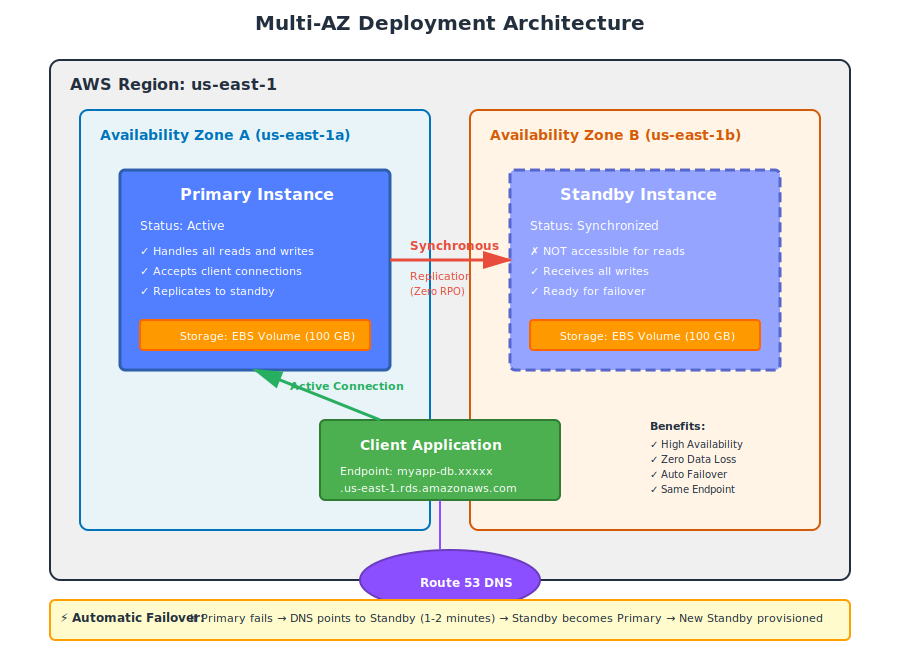

# Part 5: High Availability - Multi-AZ and Read Replicas

---

## Table of Contents

1. [High Availability Overview](Part%205%20High%20Availability%20-%20Multi-AZ%20and%20Read%20Replicas%2033bd9daa12b580a7f2e9c1d008463b85.md)
2. [Multi-AZ Deployment Deep Dive](Part%205%20High%20Availability%20-%20Multi-AZ%20and%20Read%20Replicas%2033bd9daa12b580a7f2e9c1d008463b85.md)
3. [How Multi-AZ Failover Works](Part%205%20High%20Availability%20-%20Multi-AZ%20and%20Read%20Replicas%2033bd9daa12b580a7f2e9c1d008463b85.md)
4. [Enabling Multi-AZ (Hands-On)](Part%205%20High%20Availability%20-%20Multi-AZ%20and%20Read%20Replicas%2033bd9daa12b580a7f2e9c1d008463b85.md)
5. [Multi-AZ DB Cluster (New Architecture)](Part%205%20High%20Availability%20-%20Multi-AZ%20and%20Read%20Replicas%2033bd9daa12b580a7f2e9c1d008463b85.md)
6. [Read Replicas Explained](Part%205%20High%20Availability%20-%20Multi-AZ%20and%20Read%20Replicas%2033bd9daa12b580a7f2e9c1d008463b85.md)
7. [Creating Read Replicas (Hands-On)](Part%205%20High%20Availability%20-%20Multi-AZ%20and%20Read%20Replicas%2033bd9daa12b580a7f2e9c1d008463b85.md)
8. [Monitoring Replication Lag](Part%205%20High%20Availability%20-%20Multi-AZ%20and%20Read%20Replicas%2033bd9daa12b580a7f2e9c1d008463b85.md)
9. [Promoting Read Replicas](Part%205%20High%20Availability%20-%20Multi-AZ%20and%20Read%20Replicas%2033bd9daa12b580a7f2e9c1d008463b85.md)
10. [Cross-Region Read Replicas](Part%205%20High%20Availability%20-%20Multi-AZ%20and%20Read%20Replicas%2033bd9daa12b580a7f2e9c1d008463b85.md)
11. [Multi-AZ vs Read Replicas Comparison](Part%205%20High%20Availability%20-%20Multi-AZ%20and%20Read%20Replicas%2033bd9daa12b580a7f2e9c1d008463b85.md)
12. [Combining Multi-AZ and Read Replicas](Part%205%20High%20Availability%20-%20Multi-AZ%20and%20Read%20Replicas%2033bd9daa12b580a7f2e9c1d008463b85.md)
13. [Best Practices](Part%205%20High%20Availability%20-%20Multi-AZ%20and%20Read%20Replicas%2033bd9daa12b580a7f2e9c1d008463b85.md)

---

## 1. High Availability Overview

**High Availability (HA)** means your database remains accessible even when failures occur.

In AWS RDS, there are two main HA mechanisms:

```
High Availability Mechanisms
│
├── Multi-AZ Deployment
│   └── Automatic failover to standby (high availability)
│
└── Read Replicas
    └── Scale read traffic, can be promoted (scalability + DR)
```

### Key Metrics for HA

- **Availability:** 99.95% (Multi-AZ) = ~22 minutes downtime per month max
- **RTO (Recovery Time Objective):** How fast you recover (Multi-AZ: 1-2 min)
- **RPO (Recovery Point Objective):** How much data loss (Multi-AZ: 0, Read Replica: seconds)

---

## 2. Multi-AZ Deployment Deep Dive

### What is Multi-AZ?

Multi-AZ creates a **synchronous standby replica** in a different Availability Zone.



### Key Characteristics

**Synchronous replication:**
- Every write to primary is immediately replicated to standby
- Write is only confirmed when **both** primary and standby have written it
- **Zero data loss** during failover

**Standby is not accessible:**
- You cannot connect to standby for reads
- It exists **only** for failover
- Single DNS endpoint: `myapp-db.xxxxx.us-east-1.rds.amazonaws.com`

**Automatic failover:**
- Detects primary failure in ~30 seconds
- DNS automatically points to standby
- Standby becomes new primary
- Total downtime: 1-2 minutes

---

### When Does Failover Happen?

AWS automatically triggers failover in these scenarios:

1. **Primary instance failure** (hardware, OS crash)
2. **Availability Zone outage** (entire AZ down)
3. **Loss of network connectivity** to primary
4. **Storage failure** on primary
5. **Manual failover** (via "Reboot with failover" in console)

**Not triggered by:**
- Database query errors (bad SQL)
- Application errors
- Security group misconfigurations
- Running out of connections

---

### What Happens During Failover

```
Step-by-step failover process:

1. RDS detects primary is unhealthy (30 seconds detection)
2. RDS updates DNS record to point to standby IP
3. Standby is promoted to primary (accepts reads/writes)
4. Old primary is isolated (if still running)
5. RDS provisions a new standby in another AZ (background)

Total time: 1-2 minutes
Application impact: Brief connection errors (app must retry)
```

---

### DNS and Endpoint Behavior

**Before failover:**
```
myapp-db.xxxxx.us-east-1.rds.amazonaws.com → Primary IP: 10.0.1.50
```

**After failover:**
```
myapp-db.xxxxx.us-east-1.rds.amazonaws.com → Standby IP: 10.0.2.75
```

**Your application code stays the same** — the endpoint name doesn't change.

**Important:** Your application must handle connection errors and retry. Most database drivers do this automatically.

---

## 3. How Multi-AZ Failover Works

### Architecture Diagram


### Step 1: Normal Operation

```
Client Application
       │
       │ (writes and reads)
       ▼
   Primary DB (AZ-A)
       │
       │ (synchronous replication)
       ▼
   Standby DB (AZ-B)
```

- All traffic goes to Primary
- Standby receives writes synchronously
- Standby is not accessible for reads

---

### Step 2: Failure Detected

```
Client Application
       │
       │ (connection timeout)
       ▼
   Primary DB (AZ-A) ✗ FAILED
       │
       │ (replication stopped)
       ▼
   Standby DB (AZ-B) ✓ HEALTHY
```

RDS health checks detect primary failure in ~30 seconds.

---

### Step 3: DNS Failover

```
Client Application
       │
       │ (DNS resolves to new IP)
       ▼
   Standby DB (AZ-B) → becomes Primary
```

RDS updates DNS record. Client retries and connects to new primary.

---

### Step 4: New Standby Provisioned

```
Client Application
       │
       ▼
   New Primary (AZ-B)
       │
       │ (synchronous replication)
       ▼
   New Standby (AZ-C) ← provisioned in background
```

RDS automatically creates a new standby in a different AZ.

---

## 4. Enabling Multi-AZ (Hands-On)

### For an Existing Single-AZ Instance

```
AWS Console → RDS → Databases → Select instance → Modify
```

Scroll to **Availability & durability:**

```
Multi-AZ deployment:
( ) Do not create a standby instance
(•) Create a standby instance (recommended for production)
```

**Other settings to review:**
```
Backup retention period: 7 days (required for Multi-AZ)
```

Click **Continue**.

**Apply immediately** or **During maintenance window:**
- Immediate: Downtime of ~5-10 minutes right now
- Maintenance window: Scheduled downtime

Click **Modify DB Instance**.

---

### What Happens During Enablement

```
1. RDS takes a snapshot of primary (no downtime)
2. RDS provisions standby instance in another AZ (background)
3. Standby is restored from snapshot
4. Synchronous replication is established
5. Brief outage (5-10 min) during final sync and cutover
6. Multi-AZ is now active
```

**Total time:** 15-30 minutes depending on database size.

---

### Verify Multi-AZ is Enabled

```
AWS Console → RDS → Databases → Select instance
```

Look for:
```
Multi-AZ: Yes
Secondary Zone: us-east-1b (if primary is in us-east-1a)
```

---

### Cost Impact

Multi-AZ **approximately doubles** your instance and storage costs:

**Example:**
- Single-AZ db.m6g.large: $140/month
- Multi-AZ db.m6g.large: $280/month

**Worth it for production?** Absolutely. The cost of downtime far exceeds the cost of Multi-AZ.

---

## 5. Multi-AZ DB Cluster (New Architecture)

AWS introduced a **new Multi-AZ architecture** called **Multi-AZ DB Cluster** (2021).

### Traditional Multi-AZ vs Multi-AZ DB Cluster

| Feature | Traditional Multi-AZ | Multi-AZ DB Cluster |
|:--------|:---------------------|:--------------------|
| **Standby replicas** | 1 (not readable) | 2 (readable) |
| **Failover time** | 1-2 minutes | ~35 seconds |
| **Read scaling** | No | Yes (read from standbys) |
| **Write performance** | Standard | Higher (2 standby commits in parallel) |
| **Engines supported** | All RDS engines | MySQL 8.0.28+, PostgreSQL 13.4+ |
| **Cost** | 2x single-AZ | ~3x single-AZ |

---

### Multi-AZ DB Cluster Architecture

```
┌───────────────────────────────────────────────────────────────┐
│                         AWS Region                             │
│                                                                │
│  ┌──────────────┐  ┌──────────────┐  ┌──────────────┐        │
│  │   AZ-A       │  │   AZ-B       │  │   AZ-C       │        │
│  │              │  │              │  │              │        │
│  │  ┌────────┐  │  │  ┌────────┐  │  │  ┌────────┐  │        │
│  │  │Primary │  │  │  │Readable│  │  │  │Readable│  │        │
│  │  │(Writer)│◄─┼──┼──┤Standby │  │  │  │Standby │  │        │
│  │  │        │  │  │  │        │  │  │  │        │  │        │
│  │  └────────┘  │  │  └────────┘  │  │  └────────┘  │        │
│  │              │  │      │       │  │      │       │        │
│  └──────────────┘  └──────│───────┘  └──────│───────┘        │
│                            │                 │                │
│   Writes to Primary        │  Reads from Standbys             │
│                            └─────────────────┘                │
└───────────────────────────────────────────────────────────────┘
```

### Endpoints

Multi-AZ DB Cluster provides **three endpoints:**

```
1. Writer endpoint:     myapp-db.cluster-xxxxx.us-east-1.rds.amazonaws.com
   → Always points to primary (for writes)

2. Reader endpoint:     myapp-db.cluster-ro-xxxxx.us-east-1.rds.amazonaws.com
   → Load-balances reads across 2 standbys

3. Instance endpoints:  myapp-db-instance-1.xxxxx.rds.amazonaws.com
                        myapp-db-instance-2.xxxxx.rds.amazonaws.com
   → Direct access to each instance (rarely used)
```

---

### When to Use Multi-AZ DB Cluster

**Use when:**
- You need faster failover (35 sec vs 1-2 min)
- You want to offload reads to standbys
- You have a read-heavy workload
- You are on MySQL 8.0.28+ or PostgreSQL 13.4+

**Stick with traditional Multi-AZ when:**
- Cost is a concern (Multi-AZ cluster is 50% more expensive)
- You are on an older database engine version
- Your workload is write-heavy (readable standbys don't help)

---

## 6. Read Replicas Explained

**Read Replicas** are separate database instances that receive updates **asynchronously** from the primary.

### Multi-AZ vs Read Replicas

```
Multi-AZ:           High availability (failover)
Read Replicas:      Read scalability + disaster recovery
```

### Read Replica Architecture


### Key Characteristics

**Asynchronous replication:**
- Primary doesn't wait for replicas to confirm writes
- Replicas lag behind primary by seconds (typically < 1 second)
- Possibility of reading stale data

**Readable:**
- You can run SELECT queries on replicas
- Offload reporting, analytics, backups from primary
- Each replica has its own DNS endpoint

**No automatic failover:**
- If primary fails, replicas don't automatically become primary
- You must manually **promote** a replica to standalone database

**Up to 5 replicas:**
- MySQL, PostgreSQL, MariaDB: 5 read replicas
- Aurora: 15 read replicas

---

### Use Cases for Read Replicas

**1. Read scaling:**
```
Application has:
- 80% reads
- 20% writes

Solution:
- Send writes to primary
- Distribute reads across 3 read replicas
- 4x read capacity
```

**2. Analytics and reporting:**
```
Problem: Heavy reporting queries slow down production database

Solution:
- Run reports on read replica
- Primary handles user traffic
- Isolated workloads
```

**3. Disaster recovery:**
```
Create read replica in another region
If primary region fails:
- Promote replica to standalone database
- Update application to point to new endpoint
```

**4. Testing and development:**
```
Create read replica
Test new queries on replica without affecting production
Promote replica to create a dev/staging database
```

---

## 7. Creating Read Replicas (Hands-On)

### Step 1: Create Read Replica

```
AWS Console → RDS → Databases → Select primary instance → Actions → Create read replica
```

---

### Step 2: Configure Replica

```
DB instance identifier:      myapp-db-replica-1
```

**Destination:**
```
(•) Same region as primary
( ) Different region (cross-region replica)
```

**Instance configuration:**
```
DB instance class:  db.t3.micro (can be smaller/larger than primary)
Storage:            Matches primary (cannot change)
```

**Network:**
```
VPC:                Same VPC as primary
Subnet group:       my-db-subnet-group
Public access:      No
Security group:     rds-mysql-sg (same as primary)
Availability Zone:  us-east-1c (different from primary)
```

---

### Step 3: Additional Settings

**Encryption:**
```
☑ Enable encryption (matches primary)
```

**Monitoring:**
```
☑ Enable Enhanced Monitoring
☑ Enable Performance Insights
```

**Backup:**
```
Backup retention: 0 days (replicas don't need automated backups)
```

> Note: Backups on replicas are optional. If you enable them, you can promote the replica with its backup history intact.

---

### Step 4: Create Replica

Click **Create read replica**.

**Time to complete:** 10-30 minutes depending on database size.

---

### Step 5: Verify Replication

```
AWS Console → RDS → Databases
```

You should see:
```
myapp-db (primary)
myapp-db-replica-1 (replica of myapp-db)
```

Select the replica and check:
```
Role: Replica
Source: myapp-db
Replication state: replicating
```

---

### Step 6: Get Replica Endpoint

```
Endpoint: myapp-db-replica-1.xxxxx.us-east-1.rds.amazonaws.com
Port: 3306
```

---

### Step 7: Connect to Read Replica

From your EC2 instance:

```bash
mysql -h myapp-db-replica-1.xxxxx.us-east-1.rds.amazonaws.com -u admin -p
```

Try a read query:
```sql
SELECT * FROM users LIMIT 10;
```

Try a write query:
```sql
INSERT INTO users (username, email) VALUES ('test', 'test@example.com');
```

You'll get an error:
```
ERROR 1290 (HY000): The MySQL server is running with the --read-only option so it cannot execute this statement
```

Read replicas are **read-only**.

---

## 8. Monitoring Replication Lag

**Replication lag** is the delay between primary and replica.

### CloudWatch Metric

```
Metric: ReplicaLag
Unit:   Seconds
```

**Healthy replication:**
```
ReplicaLag: 0-2 seconds
```

**Problem:**
```
ReplicaLag: > 10 seconds (significant lag)
```

---

### View Replication Lag

```
AWS Console → RDS → Databases → Select replica → Monitoring
```

Look for **ReplicaLag** graph.

---

### Causes of High Replication Lag

1. **Replica instance too small**
   - Primary: db.m6g.large
   - Replica: db.t3.micro ← can't keep up
   - Solution: Upgrade replica instance class

2. **Heavy write load on primary**
   - 10,000 writes/second on primary
   - Replica processes writes sequentially
   - Solution: Scale replica to match primary specs

3. **Network issues**
   - Cross-region replicas naturally have higher lag (50-200ms)
   - Solution: Acceptable for DR, not for real-time reads

4. **Large transactions**
   - Bulk insert of 1 million rows
   - Replica waits for entire transaction to commit before applying
   - Solution: Break large transactions into smaller batches

---

### Create CloudWatch Alarm for Lag

```
AWS Console → CloudWatch → Alarms → Create alarm
```

```
Metric:      RDS > Per-Database Metrics > ReplicaLag
Instance:    myapp-db-replica-1
Condition:   Greater than 10 seconds
Period:      1 minute
Datapoints:  3 out of 5
Notification: SNS topic (email alert)
```

---

## 9. Promoting Read Replicas

**Promotion** converts a read replica into a standalone read-write database.

### When to Promote

- **Disaster recovery:** Primary region fails
- **Database migration:** Move to different region
- **Environment cloning:** Create prod copy for staging

---

### Promote Replica (Hands-On)

```
AWS Console → RDS → Databases → Select replica → Actions → Promote read replica
```

**Settings:**
```
Backup retention period: 7 days (enable automated backups)
Backup window:          No preference
```

Click **Promote read replica**.

---

### What Happens During Promotion

```
1. Replication from primary stops
2. Replica applies all remaining replication logs
3. Replica is converted to standalone read-write instance
4. Automated backups are enabled (if you selected)
5. Instance restarts briefly

Total time: 2-5 minutes
```

**After promotion:**
- Replica is now a fully independent database
- No longer syncs from primary
- Can accept writes
- Has its own endpoint (unchanged)

---

### Update Application

Your application still points to the primary. To use the promoted replica:

```python
# Old (primary)
DB_HOST = "myapp-db.xxxxx.us-east-1.rds.amazonaws.com"

# New (promoted replica)
DB_HOST = "myapp-db-replica-1.xxxxx.us-east-1.rds.amazonaws.com"
```

---

## 10. Cross-Region Read Replicas

Create read replicas in **different AWS regions** for:
- **Disaster recovery** (region-level failure)
- **Low latency** (serve users in multiple geographies)
- **Migration** (move database to another region)

### Architecture

```
┌─────────────────────────┐     ┌─────────────────────────┐
│   US East (N. Virginia) │     │   EU West (Ireland)     │
│                         │     │                         │
│  ┌───────────────────┐  │     │  ┌───────────────────┐  │
│  │   Primary DB      │  │     │  │  Read Replica     │  │
│  │                   │  │     │  │  (Cross-Region)   │  │
│  │  Read + Write     │──┼─────┼─▶│  Read-only        │  │
│  │                   │  │     │  │                   │  │
│  └───────────────────┘  │     │  └───────────────────┘  │
│                         │     │                         │
└─────────────────────────┘     └─────────────────────────┘
        us-east-1         Internet        eu-west-1
                         (Encrypted)
```

---

### Create Cross-Region Replica

```
AWS Console → RDS → Databases → Select primary → Actions → Create read replica
```

```
Destination region: Europe (Ireland) - eu-west-1
DB instance identifier: myapp-db-eu-replica
```

Rest of configuration is same as same-region replica.

---

### Cross-Region Considerations

**Replication lag:**
- Cross-region lag: 50-500 milliseconds (depends on distance)
- Same-region lag: 0-5 milliseconds
- Acceptable for DR, not for real-time reads

**Data transfer costs:**
- Cross-region data transfer: $0.02 per GB
- Example: 1 TB database with 10 GB changes per day = $6/month transfer cost

**Failover:**
- Not automatic (you must promote manually)
- Promotion takes 5-10 minutes
- Update application DNS/endpoint

---

## 11. Multi-AZ vs Read Replicas Comparison

| Feature | Multi-AZ | Read Replicas |
|:--------|:---------|:--------------|
| **Purpose** | High availability | Read scaling + DR |
| **Replication** | Synchronous | Asynchronous |
| **Data loss on failover** | Zero | Seconds of data |
| **Standby readable** | No (traditional), Yes (DB cluster) | Yes |
| **Automatic failover** | Yes | No (manual promotion) |
| **Failover time** | 1-2 min (traditional), 35 sec (cluster) | 5-10 min (manual) |
| **Number of replicas** | 1 standby (traditional), 2 (cluster) | Up to 5 (15 for Aurora) |
| **Endpoint** | Single endpoint | Separate endpoint per replica |
| **Cross-region** | No | Yes |
| **Cost** | ~2x single-AZ | +1x per replica |
| **Use for production HA** | Yes | No (use Multi-AZ) |
| **Use for read scaling** | No (traditional), Yes (cluster) | Yes |

---

## 12. Combining Multi-AZ and Read Replicas

You can (and should) use **both** for production workloads.

### Recommended Production Architecture

```
┌────────────────────────────────────────────────────────────────┐
│                      Primary Region (us-east-1)                 │
│                                                                 │
│  ┌────────────────────────────────────────────────────────┐    │
│  │             Multi-AZ Deployment                        │    │
│  │                                                        │    │
│  │   ┌─────────────┐    Sync   ┌─────────────┐          │    │
│  │   │  Primary    │◄──────────▶│  Standby    │          │    │
│  │   │  (AZ-A)     │            │  (AZ-B)     │          │    │
│  │   └─────────────┘            └─────────────┘          │    │
│  │         │                                              │    │
│  └─────────┼──────────────────────────────────────────────┘    │
│            │                                                    │
│            │ Async replication                                 │
│            │                                                    │
│  ┌─────────▼────────┐          ┌─────────────────┐            │
│  │  Read Replica 1  │          │  Read Replica 2 │            │
│  │  (us-east-1c)    │          │  (us-east-1a)   │            │
│  │  Read-only       │          │  Read-only      │            │
│  └──────────────────┘          └─────────────────┘            │
│                                                                │
└────────────────────────────────────────────────────────────────┘
             │
             │ Async cross-region replication
             ▼
┌────────────────────────────────────────────────────────────────┐
│              DR Region (us-west-2)                              │
│                                                                 │
│               ┌─────────────────────────────┐                  │
│               │  Cross-Region Read Replica  │                  │
│               │  (Disaster Recovery)        │                  │
│               └─────────────────────────────┘                  │
└────────────────────────────────────────────────────────────────┘
```

### Traffic Routing

```
Application load:
- Writes         → Primary (Multi-AZ handles failover)
- Critical reads → Primary (no lag)
- Reports        → Read Replica 1
- Analytics      → Read Replica 2
- DR standby     → Cross-region replica (promoted if region fails)
```

---

## 13. Best Practices

### Multi-AZ

- ✅ **Always enable Multi-AZ for production databases**
- ✅ Set backup retention ≥ 7 days (required for Multi-AZ)
- ✅ Test failover at least once per quarter (Reboot with failover)
- ✅ Ensure application retries on connection failure
- ✅ Use Multi-AZ DB Cluster for faster failover (if engine supported)
- ❌ Don't rely on Multi-AZ standby for read scaling (use read replicas)

### Read Replicas

- ✅ Use read replicas for read-heavy workloads
- ✅ Monitor ReplicaLag metric (alert if > 10 seconds)
- ✅ Size replicas to match primary instance class
- ✅ Create cross-region replica for disaster recovery
- ✅ Use replica endpoints in application for read queries
- ❌ Don't use replicas as primary HA mechanism (use Multi-AZ)
- ❌ Don't read from replicas if you need latest data (read from primary)

### Combined Setup

- ✅ Production: Multi-AZ + Read Replicas + Cross-region replica
- ✅ Send writes to primary
- ✅ Send read-heavy queries (reports, analytics) to replicas
- ✅ Keep cross-region replica for disaster recovery
- ✅ Test promotion process regularly
- ✅ Document failover procedures

---