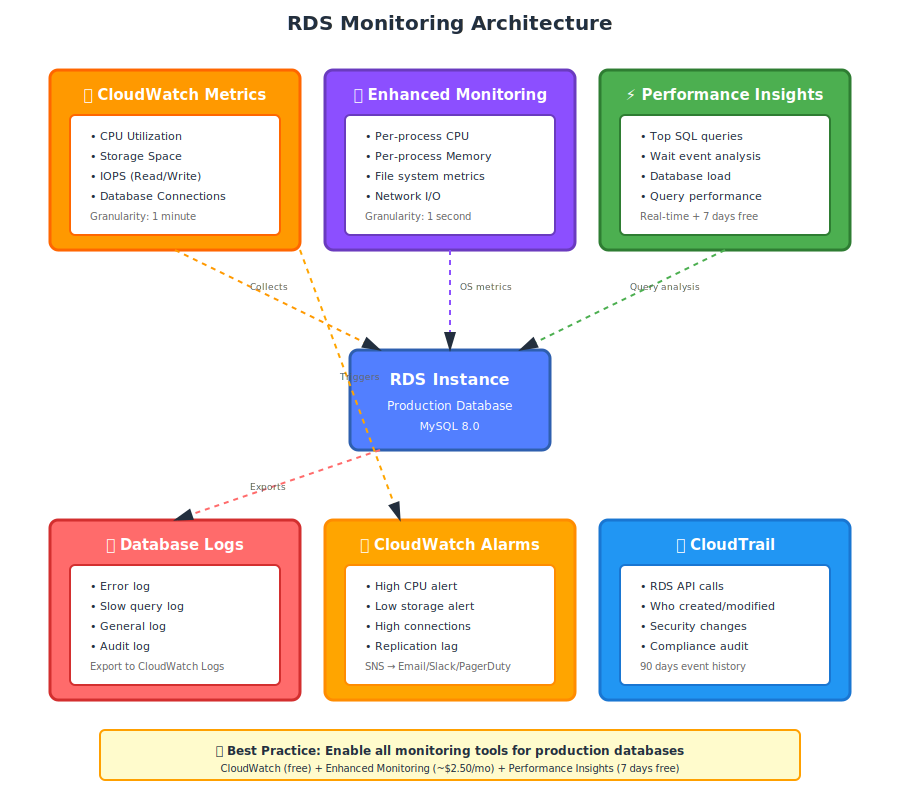

# Part 7: RDS Monitoring and Maintenance

---

## Table of Contents

1. [Monitoring Overview](Part%207%20RDS%20Monitoring%20and%20Maintenance.md)
2. [CloudWatch Metrics](Part%207%20RDS%20Monitoring%20and%20Maintenance.md)
3. [Enhanced Monitoring](Part%207%20RDS%20Monitoring%20and%20Maintenance.md)
4. [Performance Insights](Part%207%20RDS%20Monitoring%20and%20Maintenance.md)
5. [CloudWatch Alarms Setup](Part%207%20RDS%20Monitoring%20and%20Maintenance.md)
6. [Database Logs](Part%207%20RDS%20Monitoring%20and%20Maintenance.md)
7. [RDS Events and Notifications](Part%207%20RDS%20Monitoring%20and%20Maintenance.md)
8. [Maintenance Windows](Part%207%20RDS%20Monitoring%20and%20Maintenance.md)
9. [Engine Version Upgrades](Part%207%20RDS%20Monitoring%20and%20Maintenance.md)
10. [Parameter Groups Management](Part%207%20RDS%20Monitoring%20and%20Maintenance.md)
11. [Cost Optimization](Part%207%20RDS%20Monitoring%20and%20Maintenance.md)
12. [Troubleshooting Common Issues](Part%207%20RDS%20Monitoring%20and%20Maintenance.md)

---

## 1. Monitoring Overview

Effective monitoring helps you:
- Detect performance issues before users complain
- Optimize costs by right-sizing instances
- Meet SLA requirements
- Troubleshoot problems quickly
- Plan capacity

### RDS Monitoring Tools

```
RDS Monitoring Stack
│
├── CloudWatch Metrics (Basic)
│   ├── Instance-level metrics (CPU, memory, storage)
│   ├── 1-minute granularity
│   └── Free
│
├── Enhanced Monitoring
│   ├── OS-level metrics (per-process CPU, I/O)
│   ├── 1-second granularity
│   └── Small cost (~$2.50/month per instance)
│
├── Performance Insights
│   ├── Database performance analysis
│   ├── Top SQL queries
│   ├── Wait event analysis
│   └── 7 days free, $0.009/vCPU-hour for long-term retention
│
└── Database Logs
    ├── Error log, slow query log, general log
    ├── Exported to CloudWatch Logs
    └── Searchable and analyzable
```

### Complete Monitoring Architecture



---

## 2. CloudWatch Metrics

CloudWatch provides **basic monitoring** for all RDS instances (free).

### Key Metrics to Monitor

#### CPU Metrics

| Metric | Description | Good Value | Alert Threshold |
|:-------|:------------|:-----------|:----------------|
| `CPUUtilization` | CPU usage (%) | < 60% | > 80% sustained |
| `CPUCreditBalance` | Burst credits (t3 instances) | > 100 | < 50 |
| `CPUCreditUsage` | Credits consumed per min | Varies | Sustained high usage |

---

#### Storage Metrics

| Metric | Description | Good Value | Alert Threshold |
|:-------|:------------|:-----------|:----------------|
| `FreeStorageSpace` | Available storage (bytes) | > 20% of total | < 10 GB |
| `ReadIOPS` | Read I/O operations/sec | < provisioned IOPS | Approaching limit |
| `WriteIOPS` | Write I/O operations/sec | < provisioned IOPS | Approaching limit |
| `ReadLatency` | Average read latency (ms) | < 5 ms | > 20 ms |
| `WriteLatency` | Average write latency (ms) | < 5 ms | > 20 ms |
| `ReadThroughput` | Read MB/sec | Varies | Approaching limit |
| `WriteThroughput` | Write MB/sec | Varies | Approaching limit |
| `DiskQueueDepth` | I/O requests waiting | < 5 | > 10 |

---

#### Memory Metrics

| Metric | Description | Good Value | Alert Threshold |
|:-------|:------------|:-----------|:----------------|
| `FreeableMemory` | Available RAM (bytes) | > 20% of total | < 10% of total |
| `SwapUsage` | Swap space used (bytes) | 0 | > 0 (out of memory!) |

---

#### Connection Metrics

| Metric | Description | Good Value | Alert Threshold |
|:-------|:------------|:-----------|:----------------|
| `DatabaseConnections` | Active connections | < 80% max | > 80% of max_connections |

---

#### Replication Metrics

| Metric | Description | Good Value | Alert Threshold |
|:-------|:------------|:-----------|:----------------|
| `ReplicaLag` | Seconds behind primary | < 2 seconds | > 10 seconds |

---

### View Metrics in Console

```
AWS Console → RDS → Databases → Select instance → Monitoring tab
```

**Customize view:**
- Select time range (1 hour, 3 hours, 1 day, 1 week)
- Choose metrics to display
- Refresh interval

---

### CloudWatch Dashboards

Create custom dashboards to monitor multiple instances:

```
AWS Console → CloudWatch → Dashboards → Create dashboard
```

Add widgets:
- **Line graph:** CPU, IOPS over time
- **Number:** Current connections, free storage
- **Stacked area:** Read vs write IOPS

**Example dashboard layout:**
```
┌────────────────────┬────────────────────┐
│   CPU Utilization  │  Database Conns    │
│                    │                    │
└────────────────────┴────────────────────┘
┌────────────────────┬────────────────────┐
│   Read/Write IOPS  │  Storage Free      │
│                    │                    │
└────────────────────┴────────────────────┘
┌─────────────────────────────────────────┐
│   Replica Lag (all read replicas)       │
│                                         │
└─────────────────────────────────────────┘
```

---

## 3. Enhanced Monitoring

**Enhanced Monitoring** provides OS-level metrics with higher granularity.

### What Enhanced Monitoring Adds

**Beyond standard CloudWatch:**
- Per-process CPU usage
- Per-process memory usage
- File system metrics
- Network transmit/receive
- Up to **1-second granularity** (vs 1-minute for CloudWatch)

---

### Enable Enhanced Monitoring

```
AWS Console → RDS → Databases → Modify
```

```
Enhanced Monitoring:
☑ Enable Enhanced Monitoring
Granularity: 1 second (or 5, 10, 15, 30, 60 seconds)
Monitoring Role: (auto-create) rds-monitoring-role
```

---

### View Enhanced Monitoring

```
AWS Console → RDS → Databases → Select instance → Monitoring tab → Enhanced monitoring
```

**Metrics available:**
```
CPU Utilization:
  - RDS processes (MySQL, PostgreSQL)
  - OS processes
  - Per-core utilization

Memory:
  - Active memory
  - Buffers
  - Cached
  - Free
  - Total

Disk I/O:
  - Read/write operations
  - Throughput
  - IOPS
  - Queue depth

Network:
  - Transmit/receive throughput
```

---

### Cost

Enhanced Monitoring sends logs to CloudWatch Logs.

**Pricing:**
- $0.50 per GB ingested
- $0.03 per GB stored per month

**Typical cost:**
- 1-second granularity: ~$2.50/month per instance
- 60-second granularity: ~$0.40/month per instance

---

## 4. Performance Insights

**Performance Insights** analyzes database performance and identifies bottlenecks.

### Dashboard Overview

Performance Insights shows:

```
┌─────────────────────────────────────────────────────────┐
│  Database Load (Average Active Sessions)                │
│                                                         │
│   │                                                     │
│ 4 │     ███████                                         │
│   │    █████████                                        │
│ 3 │   ███████████                                       │
│   │  █████████████                                      │
│ 2 │ ███████████████                                     │
│   │█████████████████                                    │
│ 1 │█████████████████████                                │
│   │                                                     │
│ 0 └─────────────────────────────────────────────────    │
│      10:00    11:00    12:00    13:00    14:00         │
│                                                         │
│  Color-coded by wait event:                            │
│  ■ CPU (green)                                          │
│  ■ IO:XactSync (blue) - waiting for transaction log    │
│  ■ Lock:transactionid (red) - waiting for locks        │
└─────────────────────────────────────────────────────────┘

┌─────────────────────────────────────────────────────────┐
│  Top SQL Queries (by load)                              │
│                                                         │
│  1. SELECT * FROM orders WHERE user_id = ?             │
│     Load: 45%  Executions: 15,000  Avg latency: 150ms  │
│                                                         │
│  2. UPDATE users SET last_login = NOW() WHERE id = ?   │
│     Load: 30%  Executions: 8,000   Avg latency: 50ms   │
│                                                         │
│  3. INSERT INTO logs (message, timestamp) VALUES ...   │
│     Load: 15%  Executions: 50,000  Avg latency: 10ms   │
└─────────────────────────────────────────────────────────┘
```

---

### Enable Performance Insights

```
AWS Console → RDS → Databases → Modify
```

```
Performance Insights:
☑ Enable Performance Insights
Retention: 7 days (free) or 731 days (paid)
AWS KMS key: (default) aws/rds or your own key
```

---

### Analyze Performance

**Access Performance Insights:**
```
AWS Console → RDS → Performance Insights → Select instance
```

**Time range:** 1 hour, 5 hours, 1 day, 1 week, custom

---

### Common Wait Events and Solutions

| Wait Event | Meaning | Solution |
|:-----------|:--------|:---------|
| **CPU** | Query consuming CPU | Optimize queries, add indexes, upgrade instance |
| **IO:XactSync** | Waiting for transaction log writes | Upgrade to io2 storage, enable Multi-AZ |
| **IO:DataFileRead** | Reading data from disk | Increase instance memory (more caching), upgrade storage |
| **Lock:transactionid** | Waiting for row/table locks | Optimize queries, shorten transactions, use read replicas |
| **Lock:tuple** | Waiting for row-level locks | Same as above |
| **Client:ClientRead** | Idle connection (waiting for client) | Not a database problem (application issue) |

---

### Top SQL Analysis

Click on a SQL query to see:
- Full SQL text
- Execution count
- Average latency
- Wait events for this query
- Execution plan (with EXPLAIN)

---

## 5. CloudWatch Alarms Setup

Alarms notify you when metrics exceed thresholds.

### Create Alarm for High CPU

```
AWS Console → CloudWatch → Alarms → Create alarm
```

**Step 1: Select metric**
```
Namespace: RDS
Metric name: CPUUtilization
DB instance: myapp-db
```

**Step 2: Define condition**
```
Threshold type: Static
Condition: Greater than 80 (percent)
Period: 5 minutes
Datapoints to alarm: 3 out of 5 (sustained high CPU)
```

**Step 3: Configure notification**
```
SNS topic: rds-alerts (or create new)
Email: your-email@example.com
```

**Step 4: Name alarm**
```
Alarm name: RDS-myapp-db-HighCPU
Description: CPU exceeds 80% for 15 minutes
```

---

### Recommended Alarms for Production

| Alarm | Metric | Threshold | Action |
|:------|:-------|:----------|:-------|
| **High CPU** | CPUUtilization | > 80% for 15 min | Investigate queries, consider upgrade |
| **Low storage** | FreeStorageSpace | < 10 GB | Enable autoscaling or manually increase |
| **High connections** | DatabaseConnections | > 80% of max | Check for connection leaks, use RDS Proxy |
| **High replica lag** | ReplicaLag | > 10 seconds | Upgrade replica instance, reduce write load |
| **High latency** | ReadLatency, WriteLatency | > 20 ms | Upgrade storage to io2 |
| **Disk queue depth** | DiskQueueDepth | > 10 | Storage bottleneck, upgrade IOPS |
| **Memory pressure** | FreeableMemory | < 10% of total | Upgrade instance class |
| **Swap usage** | SwapUsage | > 0 | OUT OF MEMORY — upgrade immediately |

---

## 6. Database Logs

### Log Types

**MySQL:**
- Error log (always enabled)
- Slow query log (enable manually)
- General log (enable for debugging only — very verbose)

**PostgreSQL:**
- PostgreSQL log (includes errors, slow queries)

---

### Enable Logs

```
AWS Console → RDS → Databases → Modify
```

```
Log exports:
☑ Error log
☑ Slow query log
☐ General log (use sparingly)
```

Logs are published to CloudWatch Logs.

---

### Configure Slow Query Log

Edit parameter group:

```
Parameter: slow_query_log
Value: 1 (enabled)

Parameter: long_query_time
Value: 2 (log queries > 2 seconds)

Parameter: log_output
Value: FILE
```

---

### View Logs in CloudWatch

```
AWS Console → CloudWatch → Log groups
```

Log groups:
```
/aws/rds/instance/myapp-db/error
/aws/rds/instance/myapp-db/slowquery
```

**Search logs:**
```
Filter pattern: "ERROR"
Filter pattern: "Query_time: [5 TO *]"  (queries > 5 sec)
```

---

### Download Logs via CLI

```bash
aws rds download-db-log-file-portion \
    --db-instance-identifier myapp-db \
    --log-file-name error/mysql-error.log \
    --output text
```

---

## 7. RDS Events and Notifications

**RDS Events** notify you of important operational changes.

### Event Categories

- **Configuration change:** Parameter group modified
- **Availability:** Failover occurred, instance restarted
- **Backup:** Automated backup started/completed
- **Creation:** Instance created
- **Deletion:** Instance deleted
- **Failure:** Backup failed
- **Maintenance:** Maintenance started
- **Notification:** Low storage, approaching storage limit
- **Recovery:** Point-in-time recovery completed
- **Restoration:** Snapshot restored

---

### View Events

```
AWS Console → RDS → Events
```

Filter by:
- Time range
- Event category
- Source (instance, snapshot, parameter group)

---

### Event Subscriptions (SNS Notifications)

Get email/SMS/webhook notifications for events.

```
AWS Console → RDS → Event subscriptions → Create event subscription
```

```
Name: rds-critical-events
SNS topic: rds-alerts (or create new)
Source type: DB instance
Instances: myapp-db (or all instances)
Event categories:
  ☑ Availability
  ☑ Failure
  ☑ Notification
  ☐ Configuration change
```

**Email notification example:**
```
Subject: AWS Notification - RDS DB Instance Event

Your RDS instance myapp-db has experienced an event:

Event: Multi-AZ failover completed
Time: 2024-01-15 14:32:00 UTC
Message: A Multi-AZ failover has completed. The instance is now available.
```

---

## 8. Maintenance Windows

AWS performs regular maintenance:
- OS patches
- Database engine minor version upgrades (if auto-upgrade enabled)
- Hardware maintenance

---

### Configure Maintenance Window

```
AWS Console → RDS → Databases → Modify
```

```
Maintenance window: 
( ) No preference (AWS chooses)
(•) Select window
    Day:   Monday
    Start: 03:00 UTC
    Duration: 1 hour
```

**Best practice:** Choose a low-traffic period (e.g., weekend nights, early mornings).

---

### Pending Maintenance

```
AWS Console → RDS → Databases → Select instance → Maintenance & backups tab
```

Shows:
- Upcoming maintenance (scheduled date)
- Type of maintenance (required or available)
- Option to apply immediately or defer

**Required maintenance:** Cannot be deferred indefinitely (typically allows 2-4 weeks delay).

**Available maintenance:** Optional updates you can apply anytime.

---

### Apply Maintenance Immediately

```
AWS Console → RDS → Databases → Select instance → Modify
```

```
☑ Apply immediately
```

This triggers maintenance outside the maintenance window.

---

## 9. Engine Version Upgrades

### Minor Version Upgrades

**Minor upgrades:** MySQL 8.0.35 → 8.0.36

```
Auto minor version upgrade: 
☑ Enabled (recommended)
```

AWS automatically applies minor upgrades during maintenance window.

**Downtime:** 5-10 minutes (instance restart required).

---

### Major Version Upgrades

**Major upgrades:** MySQL 5.7 → 8.0

**Not automatic** — you must initiate manually.

```
AWS Console → RDS → Databases → Modify
```

```
DB engine version: 8.0.35 (select target version)
```

**Downtime:** 15-30 minutes (longer for large databases).

**Pre-upgrade steps:**
1. Take manual snapshot (backup before upgrade)
2. Test upgrade on a copy of database (restore snapshot, upgrade)
3. Review application compatibility
4. Schedule upgrade during maintenance window

---

### Upgrade Best Practices

- ✅ Always take snapshot before major upgrade
- ✅ Test upgrade on non-production instance first
- ✅ Review release notes for breaking changes
- ✅ Check application compatibility
- ✅ Schedule during low-traffic period
- ❌ Don't upgrade directly in production without testing

---

## 10. Parameter Groups Management

**Parameter groups** control database engine settings.

### Default vs Custom Parameter Groups

**Default parameter group:**
- Cannot be modified
- AWS-managed settings

**Custom parameter group:**
- Copy of default
- You can modify settings
- Required for any custom configuration

---

### Create Custom Parameter Group

```
AWS Console → RDS → Parameter groups → Create parameter group
```

```
Parameter group family: mysql8.0
Type: DB Parameter Group
Name: myapp-mysql-params
Description: Custom MySQL parameters for myapp
```

---

### Modify Parameters

```
AWS Console → RDS → Parameter groups → Select your group → Edit parameters
```

**Common parameters to tune:**

**MySQL:**
```
max_connections: 200 (default: based on instance memory)
innodb_buffer_pool_size: 70-80% of instance memory
query_cache_type: OFF (deprecated in MySQL 8.0)
slow_query_log: 1 (enable slow query logging)
long_query_time: 2 (log queries > 2 seconds)
```

**PostgreSQL:**
```
max_connections: 200
shared_buffers: 25% of instance memory
effective_cache_size: 75% of instance memory
maintenance_work_mem: 1 GB
```

---

### Apply Parameter Group

```
AWS Console → RDS → Databases → Modify
```

```
DB parameter group: myapp-mysql-params (select your custom group)
```

**Some parameters require reboot:**
- AWS will indicate "pending-reboot" status
- Schedule reboot during maintenance window

---

## 11. Cost Optimization

### Right-Sizing Instances

**Under-utilized instance:**
```
CPU: 10-20% average
Memory: 50% free
```
→ Downgrade to smaller instance class

**Over-utilized instance:**
```
CPU: 80%+ sustained
Memory: < 10% free
Swap usage: > 0
```
→ Upgrade to larger instance class

---

### Reserved Instances

**Save 30-60% vs On-Demand** by committing to 1 or 3 years.

```
AWS Console → RDS → Reserved Instances → Purchase Reserved DB Instance
```

```
DB engine: MySQL
Instance class: db.m6g.large
Multi-AZ: Yes
Term: 1 year or 3 years
Payment: All Upfront, Partial Upfront, No Upfront
```

**Best for:** Steady-state production workloads.

---

### Storage Optimization

- Delete old manual snapshots
- Reduce backup retention period (if compliance allows)
- Use gp3 instead of io2 (unless you need > 16,000 IOPS)

---

### Delete Unused Resources

- Unused read replicas
- Test/dev databases not in use
- Old parameter groups, option groups, security groups

---

## 12. Troubleshooting Common Issues

### Issue 1: High CPU Usage

**Symptoms:** CPUUtilization > 80%, queries slow

**Troubleshooting steps:**
1. Check Performance Insights for top queries
2. Run `EXPLAIN` on slow queries
3. Look for missing indexes
4. Check for full table scans

**Solutions:**
- Add indexes to frequently queried columns
- Optimize queries (avoid SELECT *, use WHERE clauses)
- Offload read queries to read replicas
- Upgrade instance class

---

### Issue 2: Out of Storage

**Symptoms:** FreeStorageSpace = 0, database read-only

**Immediate action:**
```
AWS Console → RDS → Modify
Allocated storage: Increase by 20-50 GB
Apply immediately: Yes
```

**Prevention:**
- Enable storage autoscaling
- Set CloudWatch alarm for low storage
- Archive old data

---

### Issue 3: Connection Errors

**Symptoms:** "Too many connections" error

**Check max_connections:**
```sql
SHOW VARIABLES LIKE 'max_connections';
```

**Solutions:**
- Use connection pooling in application
- Close idle connections
- Upgrade instance class (increases max_connections)
- Use RDS Proxy

---

### Issue 4: High Replication Lag

**Symptoms:** ReplicaLag > 10 seconds

**Causes:**
- Replica instance too small
- High write load on primary
- Large transactions

**Solutions:**
- Upgrade replica instance to match primary
- Break large transactions into smaller batches
- Use Multi-AZ DB Cluster (read from standbys with < 1 sec lag)

---

### Issue 5: Slow Queries

**Symptoms:** Queries taking longer than expected

**Troubleshooting:**
1. Enable slow query log
2. Check Performance Insights
3. Run EXPLAIN on slow queries

**Solutions:**
- Add indexes
- Rewrite inefficient queries
- Increase instance memory (more cache)
- Upgrade storage to io2

---

**End of Part 7 - RDS Monitoring and Maintenance**

---