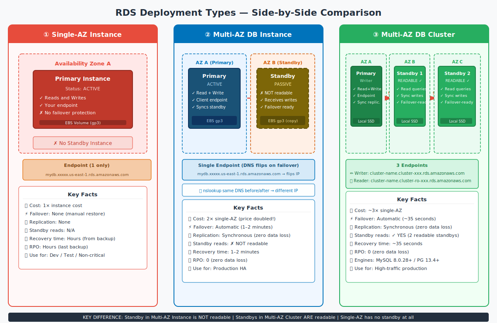
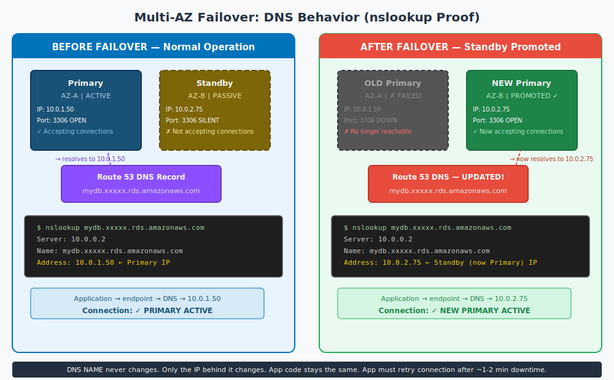
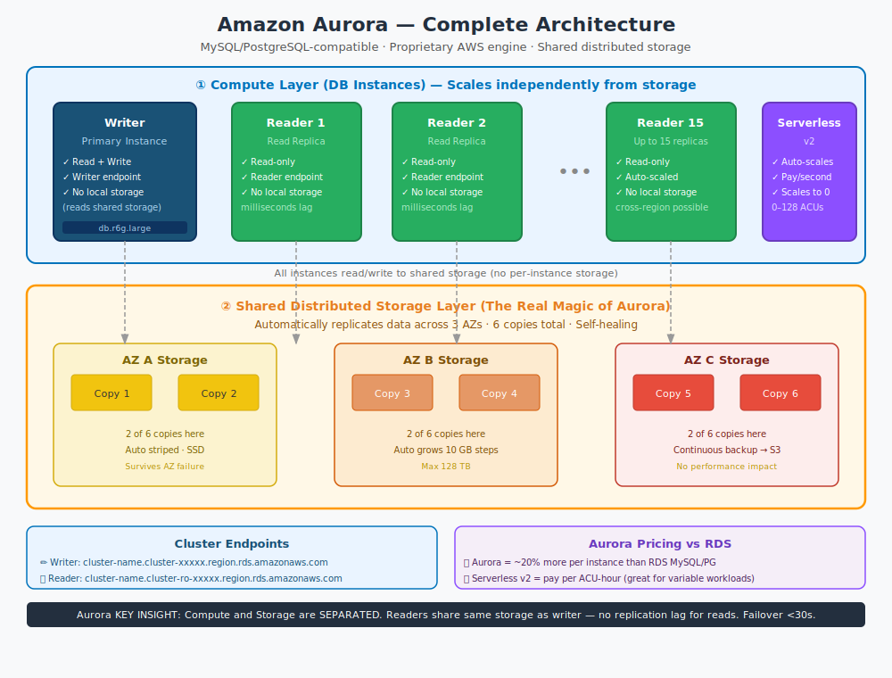
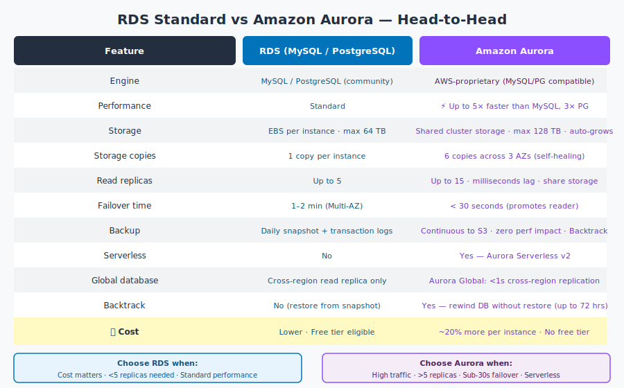

# Part 8: Master Reference — Aurora, Deployment Comparison & Complete Checklist

---

## Table of Contents

1. [Three Deployment Types — Complete Visual Guide](#1-three-deployment-types--complete-visual-guide)
2. [Pricing Reality: What Actually Costs What](#2-pricing-reality-what-actually-costs-what)
3. [Multi-AZ Failover — Deep Dive with DNS Proof](#3-multi-az-failover--deep-dive-with-dns-proof)
4. [Reboot Scenarios — When Standby Kicks In](#4-reboot-scenarios--when-standby-kicks-in)
5. [Read Replicas — Promoting and What Happens](#5-read-replicas--promoting-and-what-happens)
6. [Amazon Aurora — Complete Picture](#6-amazon-aurora--complete-picture)
7. [Aurora vs RDS — Which to Choose](#7-aurora-vs-rds--which-to-choose)
8. [RDS Instance Creation Checklist](#8-rds-instance-creation-checklist)
9. [Master Checklist — Key Points from All Parts](#9-master-checklist--key-points-from-all-parts)

---

## 1. Three Deployment Types — Complete Visual Guide

The image you saw in the AWS Console is exactly this — three architecturally different choices:



> **Reference image from AWS Console:**
> 

---

### Single-AZ Instance Deployment

```
┌──────────────────────────────────────────┐
│             AWS Region                    │
│                                          │
│   ┌───────────────────────────────┐      │
│   │       Availability Zone A     │      │
│   │                               │      │
│   │   ┌──────────────────────┐    │      │
│   │   │   Primary Instance   │    │      │
│   │   │   Read + Write       │    │      │
│   │   │   EBS Volume (gp3)   │    │      │
│   │   └──────────────────────┘    │      │
│   │                               │      │
│   └───────────────────────────────┘      │
│                                          │
│   DNS: mydb.xxxxx.us-east-1.rds.amazonaws.com   │
└──────────────────────────────────────────┘
```

- 1 instance only. No redundancy.
- If AZ goes down → database is down until AWS recovers it.
- Recovery: restore from backup (takes hours).
- **Cost: 1×** base instance price.
- **Use: Dev, test, non-critical.**

---

### Multi-AZ DB Instance Deployment (Traditional)

```
┌──────────────────────────────────────────────────────┐
│                   AWS Region                          │
│                                                      │
│  ┌───────────────────┐  SYNC  ┌──────────────────┐  │
│  │  Availability     │ ─────▶ │  Availability    │  │
│  │  Zone A           │        │  Zone B          │  │
│  │                   │        │                  │  │
│  │  ┌─────────────┐  │        │  ┌────────────┐  │  │
│  │  │  Primary    │  │        │  │  Standby   │  │  │
│  │  │  ACTIVE     │  │        │  │  PASSIVE   │  │  │
│  │  │  R + W      │  │        │  │  NOT READABLE│ │  │
│  │  │  EBS gp3    │  │        │  │  EBS gp3   │  │  │
│  │  └─────────────┘  │        │  └────────────┘  │  │
│  └───────────────────┘        └──────────────────┘  │
│                                                      │
│  Single DNS endpoint — IP flips on failover          │
└──────────────────────────────────────────────────────┘
```

**Critical facts:**
- The standby instance is **invisible to you**. You cannot query it, SSH to it, or read from it.
- It exists **purely** to take over when primary fails.
- Replication is **synchronous** — primary waits for standby to confirm every write before acknowledging your app. This means **zero data loss** on failover.
- **Cost: ~2× single-AZ** (you're paying for both instances + both EBS volumes).

---

### Multi-AZ DB Cluster Deployment (Newer, 2021+)

```
┌─────────────────────────────────────────────────────────────┐
│                         AWS Region                           │
│                                                             │
│  ┌──────────────┐  SYNC  ┌──────────────┐  SYNC ┌────────┐ │
│  │    AZ A      │ ─────▶ │    AZ B      │       │  AZ C  │ │
│  │              │        │              │ ─────▶ │        │ │
│  │  ┌─────────┐ │        │  ┌─────────┐ │        │┌──────┐│ │
│  │  │ Primary │ │        │  │Standby 1│ │        ││Stand-││ │
│  │  │ (Writer)│ │        │  │READABLE │ │        ││by 2  ││ │
│  │  │ R + W   │ │        │  │Read-only│ │        ││READ. ││ │
│  │  └─────────┘ │        │  └─────────┘ │        │└──────┘│ │
│  └──────────────┘        └──────────────┘        └────────┘ │
│                                                             │
│  Writer endpoint  → always primary                         │
│  Reader endpoint  → load-balances across 2 standbys        │
└─────────────────────────────────────────────────────────────┘
```

**Critical differences from traditional Multi-AZ:**
- **Both standbys are readable** — you can send SELECT queries to them.
- Uses **local SSD storage** (not EBS) — much faster than traditional Multi-AZ.
- Failover in **~35 seconds** vs 1–2 minutes.
- Only available for MySQL 8.0.28+ and PostgreSQL 13.4+.
- **Cost: ~3× single-AZ.**

---

### Side-by-Side Summary Table

| | Single-AZ | Multi-AZ Instance | Multi-AZ Cluster |
|:---|:---:|:---:|:---:|
| **Instances** | 1 | 2 | 3 |
| **Standby readable** | N/A | ✗ No | ✓ Yes |
| **Failover** | None | 1–2 min (auto) | ~35 sec (auto) |
| **Replication** | None | Synchronous | Synchronous |
| **Data loss** | Full (last backup) | Zero | Zero |
| **Cost multiplier** | 1× | ~2× | ~3× |
| **Engines** | All | All | MySQL 8.0.28+ / PG 13.4+ |
| **Endpoints** | 1 | 1 (flips) | 3 (writer + reader + instance) |

---

## 2. Pricing Reality: What Actually Costs What

Understanding where your money goes is critical. Multi-AZ does **not** just cost slightly more — it roughly **doubles** your bill.

### Why Multi-AZ Doubles the Cost

When you enable Multi-AZ, AWS provisions:
- A second DB instance (the standby) in another AZ
- A second EBS volume equal in size to your primary

You pay for **both instances** + **both storage volumes** + **data transfer between AZs**.

**Example — db.m6g.large MySQL in us-east-1:**

```
Single-AZ:
  Instance:  $0.193/hour × 730 hours = $141/month
  Storage:   100 GB gp3 = $11.50/month
  TOTAL:     ~$153/month

Multi-AZ Instance:
  Instance:  $0.386/hour × 730 hours = $282/month   ← doubles
  Storage:   200 GB gp3 (both instances) = $23/month ← doubles
  TOTAL:     ~$305/month
```

**Multi-AZ Cluster (~3×):**
```
  3 instances × $141 = $423/month + storage for all 3
  TOTAL:     ~$450/month
```

**Is it worth it?**

> 1 hour of production database downtime typically costs far more than the difference. For any revenue-generating workload, enable Multi-AZ.

### Free Tier Caution

The free tier gives you `db.t3.micro` Single-AZ only. **Never enable Multi-AZ on a free tier account expecting it to remain free** — it will immediately start charging for the second instance.

---

## 3. Multi-AZ Failover — Deep Dive with DNS Proof



### The DNS Magic — How It Works

Your RDS endpoint is a **DNS CNAME** (not an IP address). The actual IP behind it can change without any change to your application code.

**Before failover:**
```bash
$ nslookup mydb.c1a2b3c4d5e6.us-east-1.rds.amazonaws.com
Server:  10.0.0.2
Name:    mydb.c1a2b3c4d5e6.us-east-1.rds.amazonaws.com
Address: 10.0.1.50         ← Primary is in AZ-A
```

**After failover (same DNS name, different IP):**
```bash
$ nslookup mydb.c1a2b3c4d5e6.us-east-1.rds.amazonaws.com
Server:  10.0.0.2
Name:    mydb.c1a2b3c4d5e6.us-east-1.rds.amazonaws.com
Address: 10.0.2.75         ← Standby (now Primary) is in AZ-B
```

The DNS TTL for RDS endpoints is very low (5 seconds). This is how AWS achieves fast failover without you changing any code.

### Step-by-Step Failover Process

```
Timeline of a Multi-AZ Failover:

T+0s   → Primary instance becomes unreachable
           (hardware failure, AZ outage, storage failure)

T+30s  → RDS health monitoring detects failure
           (pings fail for 2+ consecutive checks)

T+30s  → DNS record updated to point to standby IP
           Route 53 TTL is 5 seconds

T+35s  → Standby is promoted to primary
           Begins accepting reads and writes

T+35s  → Your application retries connection
           Gets new IP from DNS, connects to new primary

T+120s → Total cutover complete
           Old primary is isolated

T+??m  → AWS provisions a new standby in another AZ
           Replication re-established automatically
```

### What Triggers Automatic Failover

Failover **IS triggered** by:
- Primary instance host failure (hardware crash)
- Availability Zone outage
- Primary loses network connectivity
- Primary storage (EBS) failure
- **Rebooting the primary with "Reboot with failover" option**

Failover **is NOT triggered** by:
- Bad SQL queries / application errors
- Running out of connections (max_connections exceeded)
- Security group blocking access
- Wrong password / auth failures
- High CPU or memory usage

### Application Requirements During Failover

Your application will see ~1-2 minutes of connection failures. You need:

```python
# Example: proper retry with exponential backoff
import time
import mysql.connector

def connect_with_retry(endpoint, max_retries=5):
    for attempt in range(max_retries):
        try:
            conn = mysql.connector.connect(
                host=endpoint,
                user='admin',
                password='...',
                connect_timeout=10
            )
            return conn
        except mysql.connector.Error as e:
            wait = 2 ** attempt          # 1s, 2s, 4s, 8s, 16s
            time.sleep(wait)
    raise Exception("Could not connect after failover")
```

Most modern ORMs and database drivers handle this automatically. Use **connection pools** (RDS Proxy is ideal for this).

---

## 4. Reboot Scenarios — When Standby Kicks In

This is a common interview/exam question. Not all reboots trigger failover.

### Reboot WITHOUT Failover (Default)

```
AWS Console → RDS → Databases → Select instance
→ Actions → Reboot
→ (do NOT check "Reboot With Failover")
```

**What happens:**
- Primary instance reboots in place (same AZ, same IP)
- Standby stays passive (unchanged)
- Downtime: ~2-5 minutes (just restart time)
- DNS record: unchanged
- **Standby does NOT take over**

**Use this when:**
- Applying parameter group changes that require restart
- Routine maintenance
- Clearing memory/connection state

---

### Reboot WITH Failover

```
AWS Console → RDS → Databases → Select instance
→ Actions → Reboot
→ ☑ Check "Reboot With Failover"
→ Confirm
```

**What happens:**
1. RDS intentionally fails the primary
2. DNS updated to point to standby
3. Standby promoted to primary
4. Old primary becomes the new standby (after it reboots)
5. Total downtime: ~1-2 minutes

**Use this when:**
- Testing your failover procedure
- Moving workload to a different AZ (e.g., standby is in the AZ with your EC2)
- Verifying your application handles failover correctly

**Recommended: Test failover at least once per quarter in production.**

---

### Automatic vs Manual Failover Summary

| Scenario | Standby Takes Over? | How |
|:---------|:----------------:|:----|
| AZ outage | ✅ Yes | Automatic |
| Host hardware failure | ✅ Yes | Automatic |
| EBS storage failure | ✅ Yes | Automatic |
| Reboot WITH failover | ✅ Yes | Manual trigger |
| Reboot WITHOUT failover | ✗ No | Restarts in place |
| High CPU/memory | ✗ No | No failover |
| Max connections hit | ✗ No | No failover |
| Bad SQL query | ✗ No | No failover |

---

## 5. Read Replicas — Promoting and What Happens

### Creating a Read Replica — What to Know

```
AWS Console → RDS → Databases → Select Primary
→ Actions → Create read replica
```

Key points during creation:
- Replica can be **smaller** instance class than primary (for read-light workloads)
- Replica can be in **same AZ, different AZ, or different region**
- Replica uses **asynchronous** replication (may lag seconds behind primary)
- Each replica gets its **own endpoint** (different from primary)
- Automated backups on replica: Optional (0 days is fine)

**Replication lag check:**
```sql
-- On the replica, check lag:
SHOW SLAVE STATUS\G
-- Look for: Seconds_Behind_Master

-- In CloudWatch:
-- Metric: ReplicaLag (seconds)
-- Alert if > 10 seconds
```

---

### Promoting a Read Replica

```
AWS Console → RDS → Databases → Select Replica
→ Actions → Promote read replica
```

**What happens step by step:**
```
1. Replication link is broken (replica stops receiving from primary)
2. Replica applies all remaining pending replication logs
   (catches up to where primary was at time of promotion)
3. Replica is converted to standalone read-write instance
4. Instance restarts briefly (~2 min)
5. Automated backups are enabled on the promoted instance

Result:
- Former replica is now a FULLY INDEPENDENT database
- It no longer syncs from primary
- It has its OWN data (snapshot at time of promotion)
- Primary is UNAFFECTED — still running normally
```

**After promotion — update your application:**
```
Before:   DB_HOST = "mydb.xxxxx.us-east-1.rds.amazonaws.com"      (primary)
After:    DB_HOST = "mydb-replica-1.xxxxx.us-east-1.rds.amazonaws.com" (promoted)
```

---

### When to Promote a Read Replica

| Scenario | Why Promote |
|:---------|:-----------|
| Primary region disaster | Promote cross-region replica as new primary |
| Database migration to new region | Promote replica in target region, switch traffic |
| Create staging environment | Promote replica = instant prod copy for staging |
| Database refresh | Promote, make changes, test — without touching prod |

---

### Read Replica vs Standby (Multi-AZ) — The Key Difference

```
                    STANDBY (Multi-AZ)       READ REPLICA
─────────────────────────────────────────────────────────
Purpose:            High Availability         Read Scaling
Replication:        Synchronous               Asynchronous
Readable:           ✗ No (traditional)        ✓ Yes
Failover:           Automatic (1-2 min)       Manual (promotion)
Data lag:           Zero                      Seconds
Own endpoint:       No (shares primary)       Yes (separate)
Cross-region:       No                        Yes
Cost:               ~2× primary               +1× per replica
```

---

## 6. Amazon Aurora — Complete Picture

### What Aurora Actually Is

Aurora is **not** a version of MySQL or PostgreSQL. It is an entirely new database engine built by AWS, designed to be **wire-compatible** with MySQL and PostgreSQL. This means your MySQL drivers, SQL queries, and tools work without changes — but the internal engine is completely different.

**The two biggest things that make Aurora different:**

1. **Shared distributed storage** — Instead of each instance having its own EBS volume, all instances in a cluster share the same underlying distributed storage system. This storage automatically maintains **6 copies across 3 AZs**.

2. **Compute and storage are separated** — Read replicas don't replicate data. They just read from the same shared storage the writer uses. This is why Aurora replicas have near-zero lag (milliseconds vs seconds for RDS replicas).

### Aurora Architecture



### Aurora Storage — The Key Innovation

```
Traditional RDS MySQL:
   Primary DB ──────────────────── its own EBS (1 copy)
   Standby DB ──── syncs from primary ── its own EBS (1 copy)
   Read Replica ── lags behind ─────── its own EBS (1 copy)

Aurora:
   Writer Instance ──┐
   Reader 1        ──┼──── Shared Cluster Storage
   Reader 2        ──┘     (6 copies, 3 AZs, auto-heal)
                           Grows automatically in 10 GB increments
                           Maximum 128 TB
```

**Aurora can survive:**
- Loss of 2 out of 6 storage copies → still readable and writable
- Loss of 3 out of 6 copies → still readable (write protection kicks in)
- An entire AZ failure → the other 2 AZs have 4 remaining copies

---

### Aurora Failover (Under 30 Seconds)

```
T+0s   → Writer instance fails

T+1s   → Aurora detects failure immediately
           (storage layer already knows — no ping needed)

T+15s  → One of the read replicas is promoted to writer
           (it already shares the same storage — no data sync needed!)

T+30s  → New writer is accepting reads and writes
           DNS updated to new writer endpoint

Why so fast? Because readers already have access to all the data.
There is no data to copy or synchronize.
```

Compare this to traditional RDS Multi-AZ:
- RDS Multi-AZ: ~30s detection + DNS update + standby promotion = 1-2 min
- Aurora: near-instant detection (shared storage) + replica promotion = < 30s

---

### Aurora Endpoints

Aurora provides multiple endpoints (unlike standard RDS which has one):

```
Cluster Writer Endpoint:
  mydb.cluster-c1a2b3c4.us-east-1.rds.amazonaws.com
  → Always points to the current writer instance
  → Use for INSERT, UPDATE, DELETE, and DDL

Cluster Reader Endpoint:
  mydb.cluster-ro-c1a2b3c4.us-east-1.rds.amazonaws.com
  → Load-balances across ALL reader instances
  → Use for SELECT queries
  → If no readers, falls back to writer

Instance Endpoints (direct):
  mydb-instance-1.c1a2b3c4.us-east-1.rds.amazonaws.com
  → Direct connection to one specific instance
  → Use only for debugging or targeted operations
```

---

### Aurora Serverless v2

**The problem it solves:** Traditional RDS/Aurora instances run 24×7 at a fixed size. For workloads with variable traffic (SaaS apps, dev environments, occasional analytics), you pay for capacity you don't use most of the time.

**Aurora Serverless v2:**
```
Min capacity:  0.5 ACUs (Aurora Capacity Units)
Max capacity:  128 ACUs

1 ACU ≈ 2 GB RAM + proportional CPU

Scaling:       Happens in ~seconds (fractions of an ACU at a time)
Billing:       Per ACU-second of actual use

Example:
  3am (low traffic):  0.5 ACU → $0.0006/min
  12pm (peak):        64 ACU  → $0.077/min
  
  vs fixed db.r6g.2xlarge: $0.48/hour = $0.008/min always
```

**Choose Serverless v2 when:**
- Traffic is highly variable or unpredictable
- Dev/test environments that sit idle overnight
- New applications where you don't know expected load yet
- Multi-tenant SaaS where different tenants have different peak times

---

### Aurora Backtrack

A unique Aurora feature not available in standard RDS:

```
What it does:
  Rewinds your database to any point in the last 72 hours
  WITHOUT restoring from a backup

How long it takes:
  Seconds to minutes (vs hours for a full restore)

How it works:
  Aurora stores all database changes as "log records"
  Backtrack replays them in reverse — literally un-does writes

Use case:
  "We accidentally deleted the users table at 2:47pm"
  → Backtrack to 2:46pm
  → Check if table is there
  → Done

vs Standard RDS PITR:
  → Create a new instance restored to 2:46pm
  → Takes 20-60 minutes depending on database size
  → You get a NEW instance, not a rewound existing one
```

---

### Aurora Global Database

For applications needing sub-1-second cross-region replication:

```
Primary Region (us-east-1):
  ┌──────────────────────────────────────────┐
  │  Aurora Cluster (Writer + Readers)       │
  │  Handles all writes + local reads        │
  └──────────────────────────────────────────┘
          │
          │ Replication < 1 second
          ▼
Secondary Region (eu-west-1):
  ┌──────────────────────────────────────────┐
  │  Aurora Cluster (Read-only)              │
  │  Handles local EU reads (low latency)    │
  │  Can be promoted to writer in < 1 min    │
  └──────────────────────────────────────────┘
```

**Use when:**
- You have users in multiple continents
- You need sub-1-second cross-region failover
- You want to serve reads from the nearest region

---

### Aurora Pricing

Aurora pricing has three components:

```
1. Compute: Per DB instance-hour
   Example: db.r6g.large Aurora MySQL = $0.29/hour = ~$212/month
   (vs $0.193/hour for RDS MySQL = ~$141/month → Aurora 50% more for r-family)

2. Storage: $0.10 per GB-month (shared across all instances in cluster)
   Example: 200 GB = $20/month
   (vs RDS: $0.115 per GB-month for gp3)

3. I/O: $0.20 per 1 million I/O requests
   (Aurora charges separately for I/O; RDS gp3 includes baseline I/O free)

Aurora I/O-Optimized Pricing (new option):
   Higher per-hour rate but I/O is included
   Better when I/O costs > ~25% of total Aurora bill
```

**Aurora Serverless v2:**
```
$0.12 per ACU-hour (us-east-1)
Storage: $0.10 per GB-month
I/O:     $0.20 per 1M requests
```

**Free tier:** Aurora is NOT covered by the AWS free tier. There is no free Aurora option.

---

## 7. Aurora vs RDS — Which to Choose



### Decision Framework

**Choose Standard RDS (MySQL/PostgreSQL) when:**
- ☑ Cost is a primary concern
- ☑ You need free tier eligibility
- ☑ Traffic is steady and moderate
- ☑ You need 5 or fewer read replicas
- ☑ 1-2 minute failover is acceptable
- ☑ Your team is new to AWS databases

**Choose Aurora when:**
- ☑ You need more than 5 read replicas
- ☑ You need sub-30-second failover
- ☑ Traffic is unpredictable → use Serverless v2
- ☑ You need cross-region active-active → use Global Database
- ☑ You need Backtrack (rewind without restore)
- ☑ Storage growing beyond 64 TB
- ☑ Performance is critical (5× vs standard MySQL)

**A common pattern:** Start with RDS for simplicity, migrate to Aurora when you hit limits.

---

## 8. RDS Instance Creation Checklist

Use this every time you create a production RDS instance. These are the critical decisions you cannot change after creation.

### Before You Create — Network Setup

- [ ] VPC is created with **private subnets** in at least 2 AZs
- [ ] DB Subnet Group created (covers ≥2 AZs)
- [ ] Security Group created for RDS (inbound: DB port from app server SG only)
- [ ] App server Security Group ID noted (used as SG source for RDS)
- [ ] NAT Gateway available (so RDS can reach AWS for updates)

---

### Engine Selection (Cannot Change Later)

- [ ] Engine selected: MySQL / PostgreSQL / MariaDB / Oracle / SQL Server / Aurora
- [ ] Engine version selected (use latest stable, e.g., MySQL 8.0.x)
- [ ] If Aurora: MySQL-compat or PG-compat?

---

### Instance Configuration (Can Change With Downtime)

- [ ] Instance class chosen correctly (don't over/under-provision)
  - Dev/Test: `db.t3.micro` or `db.t3.small`
  - Production: `db.m6g.large` minimum
  - Memory-heavy: `db.r6g.large`
- [ ] Storage type: **gp3** (not gp2, not magnetic)
- [ ] Storage autoscaling **enabled** with a sane max
- [ ] Cannot reduce storage after creation — start appropriately

---

### Availability & Durability (The Big Decision)

- [ ] **Single-AZ** for dev/test (cost-sensitive)
- [ ] **Multi-AZ Instance** for production HA (costs ~2×)
- [ ] **Multi-AZ Cluster** for fastest failover + readable standbys (costs ~3×)
- [ ] **Aurora Cluster** for high performance + 15 replicas

> **Reminder:** Multi-AZ roughly doubles your monthly bill. Budget accordingly.

---

### Connectivity

- [ ] Public access: **No** (never for production)
- [ ] VPC and Subnet Group: correct
- [ ] Correct Security Group attached
- [ ] Deletion protection: **Yes** for production

---

### Security

- [ ] Encryption at rest: **Yes** (no performance penalty, cannot enable after creation)
- [ ] KMS key: default `aws/rds` is fine unless you need customer-managed keys
- [ ] Authentication: password (standard) or IAM (for apps using IAM roles)
- [ ] Store credentials in **Secrets Manager** (not hardcoded in app)

---

### Backup and Recovery

- [ ] Automated backups: **enabled**
- [ ] Backup retention: **7 days** minimum (35 days max)
- [ ] Backup window: low-traffic time in your timezone
- [ ] Snapshots before major changes (major version upgrades, etc.)

---

### Monitoring

- [ ] Enhanced Monitoring: enabled (60 seconds, free for most cases)
- [ ] Performance Insights: enabled (7-day free retention)
- [ ] CloudWatch alarms set for: CPU > 80%, FreeStorageSpace < 10 GB, ReplicaLag > 10s

---

### Settings You CANNOT Change After Creation

| Setting | Note |
|:--------|:-----|
| Engine type | MySQL → cannot change to PostgreSQL. Must migrate. |
| Master username | Cannot change. Note it down securely. |
| Encryption | Cannot enable after creation on existing instance (must restore encrypted snapshot) |
| VPC | Instance is locked to its VPC |
| DB instance identifier | Cannot rename. Must create new instance. |

---

## 9. Master Checklist — Key Points from All Parts

This is your complete one-stop reference. Everything critical from Parts 1-7.

---

### Part 1: Fundamentals

- [ ] RDS is **managed** — AWS handles OS, patching, backups, HA
- [ ] You manage: schema, queries, access control, scaling decisions
- [ ] 6 supported engines: MySQL, PostgreSQL, MariaDB, Oracle, SQL Server, Aurora
- [ ] Instance families: T (burstable), M (general), R (memory-optimized)
- [ ] Storage: gp3 (default, best), io2 (high IOPS), magnetic (avoid)
- [ ] gp3 baseline: 3,000 IOPS free regardless of storage size
- [ ] Maximum storage: 64 TB (standard), 128 TB (Aurora)
- [ ] Free tier: `db.t3.micro` single-AZ, 20 GB gp3, valid 12 months
- [ ] Multi-AZ roughly doubles the bill
- [ ] Read replicas are separate instances with their own cost

---

### Part 2: Creating RDS — Critical Points

- [ ] Always use **private subnets** — never public access for production
- [ ] DB Subnet Group must span ≥2 AZs (even for Single-AZ deployment)
- [ ] Use a **dedicated Security Group** for RDS (reference app SG as source, not IP)
- [ ] Source = App Server Security Group (not hardcoded IP — IPs change)
- [ ] `Initial database name` — if left blank, no database created (just the instance)
- [ ] Master password: save it — AWS cannot show it again after creation
- [ ] DB identifier becomes part of your endpoint (choose carefully)
- [ ] Storage autoscaling: always enable with a max cap
- [ ] Deletion protection: always on for production
- [ ] Settings NOT changeable: engine, master username, encryption, VPC

---

### Part 3: Storage and Performance

- [ ] gp3 is better than gp2 — baseline 3,000 IOPS independent of storage size
- [ ] gp2 IOPS = 3 × GB (so 100 GB = 300 IOPS baseline only)
- [ ] Storage can only grow, never shrink
- [ ] Storage scaling is online (no downtime)
- [ ] `io2` for > 16,000 IOPS sustained workloads
- [ ] CPU burstable (T instances) — check CPUCreditBalance; don't use for sustained load
- [ ] RDS Proxy: reduces connection overhead, use with Lambda or high connection counts
- [ ] Performance Insights: shows top SQL by load (wait events)
- [ ] Enable slow query log and set `long_query_time = 1` or `2`
- [ ] `db.r6g` Graviton instances: 40% better price/performance vs Intel

---

### Part 4: Backup and Recovery

- [ ] Automated backups: stored in S3, transparent to you
- [ ] Retention: 0 (disabled) to 35 days. **Set ≥7 for any production use**
- [ ] Point-in-Time Recovery (PITR): restore to any second within retention window
- [ ] PITR creates a **new instance** — not an in-place restore
- [ ] Manual snapshots: persist forever (until you delete them)
- [ ] Take manual snapshot before any major change (upgrade, major schema change)
- [ ] Cross-region snapshot copy: for DR in another region
- [ ] Free backup storage = database size. Extra storage charged per GB.
- [ ] Backup window: should not overlap with maintenance window
- [ ] Restoring from snapshot: always creates a new instance (new endpoint)
- [ ] You cannot restore in-place — plan for endpoint changes after a restore

---

### Part 5: High Availability — Critical Points

**Multi-AZ:**
- [ ] Standby instance is in a **different AZ** and is **NOT readable**
- [ ] Replication is **synchronous** — zero data loss on failover
- [ ] Failover is **automatic** — 1-2 minutes total
- [ ] Same single DNS endpoint — IP changes behind the scenes
- [ ] nslookup same endpoint before/after failover → different IP
- [ ] Your app must retry connections (most drivers handle automatically)
- [ ] Multi-AZ DB Cluster: 2 readable standbys, 35s failover, ~3× cost
- [ ] Test failover: "Reboot with failover" quarterly

**Read Replicas:**
- [ ] Replication is **asynchronous** — may lag seconds behind primary
- [ ] Each replica has its **own endpoint** (different from primary)
- [ ] Up to 5 replicas (MySQL/PG/MariaDB), up to 15 (Aurora)
- [ ] Replicas are **read-only** — writes fail with error 1290
- [ ] Can be in same AZ, different AZ, or different region
- [ ] Promote replica: becomes standalone read-write instance (2-5 minutes)
- [ ] After promotion: replica is fully independent — no longer syncs from primary
- [ ] Cross-region replica: ~50-500ms lag (acceptable for DR, not real-time reads)
- [ ] Monitor `ReplicaLag` in CloudWatch — alert if > 10 seconds

**Multi-AZ vs Read Replicas:**
- [ ] Multi-AZ = HA (availability, failover) — NOT for reads
- [ ] Read Replicas = Scale (performance, DR) — NOT for automatic failover
- [ ] Production best practice: use BOTH together

---

### Part 6: Security

- [ ] Always place RDS in **private subnets** (no public IP)
- [ ] Security Group: restrict inbound to your app server's SG only
- [ ] Encryption at rest: enable at creation (cannot add later without restore)
- [ ] SSL/TLS in transit: enforce it (`REQUIRE SSL` grant or param group)
- [ ] IAM authentication: use for apps (no passwords hardcoded in code)
- [ ] Secrets Manager: rotate passwords automatically (every 30 days)
- [ ] Never use master user for application connections — create app-specific users
- [ ] CloudTrail logs all RDS API calls (who created, modified, deleted instances)
- [ ] Parameter group `require_secure_transport=ON` (MySQL) enforces SSL
- [ ] Database Activity Streams: real-time audit for compliance (PCI, HIPAA)

---

### Part 7: Monitoring and Maintenance

- [ ] CloudWatch: basic metrics free — CPU, FreeStorageSpace, DatabaseConnections
- [ ] Enhanced Monitoring: OS-level metrics (per-process CPU, RAM) — small cost
- [ ] Performance Insights: top SQL by load — 7 days free, worth enabling always
- [ ] Key alarms to set:
  - `CPUUtilization` > 80% for 5 min
  - `FreeStorageSpace` < 10 GB
  - `DatabaseConnections` > 80% of max
  - `ReplicaLag` > 10 seconds
  - `FreeableMemory` < 256 MB
- [ ] Maintenance window: set to low-traffic time (e.g., Sunday 3-4am)
- [ ] Auto minor version upgrade: enable (security fixes)
- [ ] Major version upgrade (MySQL 5.7 → 8.0): manual, takes downtime, test first
- [ ] Reserved Instances: 1-year commitment = 40% discount, 3-year = 60% discount
- [ ] Stop instance: saves compute cost (storage still charged), auto-starts after 7 days
- [ ] Right-size: downgrade instance if CPU < 20% sustained

---

### Aurora-Specific Quick Reference

- [ ] Aurora = AWS-proprietary engine, MySQL/PostgreSQL compatible
- [ ] 6 copies of data across 3 AZs — survives 2 copy losses for writes, 3 for reads
- [ ] Compute and storage are separated — replicas share storage with writer
- [ ] Aurora replicas have near-zero lag (milliseconds) — share same storage
- [ ] Failover < 30 seconds (no data to sync — readers already have everything)
- [ ] Max storage: 128 TB (auto-grows, no downtime)
- [ ] Backtrack: rewind DB to any point in 72 hrs without restoring (seconds)
- [ ] Serverless v2: auto-scales per workload, pay per second, can scale to 0
- [ ] Global Database: < 1s cross-region replication, < 1 min failover
- [ ] Aurora is ~20% more expensive per instance than RDS MySQL/PG
- [ ] No free tier for Aurora
- [ ] Aurora I/O-Optimized: higher hourly rate, I/O included (better if I/O-heavy)

---

### Common Exam / Interview Points

```
Q: Can you SSH into an RDS instance?
A: No. RDS is fully managed. AWS owns the OS.

Q: Can you use a standby instance (Multi-AZ) for reads?
A: No (traditional Multi-AZ). Yes (Multi-AZ DB Cluster standbys).

Q: How do you scale read traffic on RDS?
A: Create Read Replicas. Use different endpoint for reads.

Q: What is the RPO for Multi-AZ?
A: Zero. Synchronous replication means no data loss.

Q: What is the RTO for Multi-AZ?
A: ~1-2 minutes (detection + DNS flip + standby promotion).

Q: What happens to your app endpoint after Multi-AZ failover?
A: Nothing — same DNS name, but IP behind it changes.

Q: Can you encrypt an existing unencrypted RDS instance?
A: Not directly. Take snapshot → copy snapshot with encryption → restore.

Q: What is the max storage for RDS?
A: 64 TB (standard), 128 TB (Aurora).

Q: How many read replicas can RDS have?
A: 5 (MySQL/PG/MariaDB), 15 (Aurora).

Q: What is Aurora Backtrack?
A: Rewind the database to a prior state without restoring from backup.

Q: What is the difference between Aurora and RDS MySQL?
A: Same SQL/wire protocol, completely different engine. Aurora: 6-copy shared
   storage, compute-storage separation, faster failover, more replicas.

Q: What triggers Multi-AZ failover?
A: Host failure, AZ failure, storage failure, network failure, manual "reboot
   with failover". NOT: bad SQL, high CPU, wrong password.
```

---

*End of Part 8 — RDS Master Reference*

> **Study tip:** Review this checklist before deploying any production RDS resource. The most common mistakes are: forgetting Multi-AZ doubles cost, enabling public access, not enabling encryption at creation, and assuming standby is readable.
