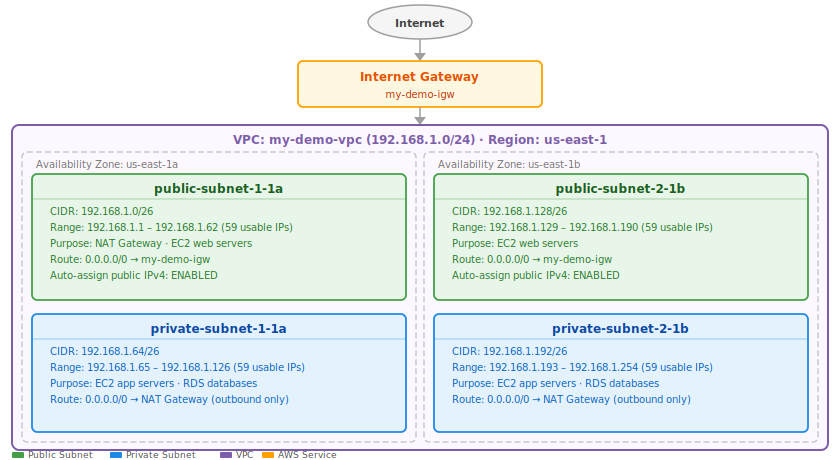
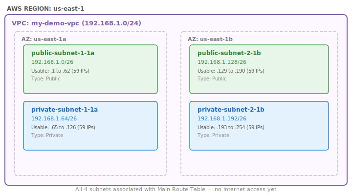
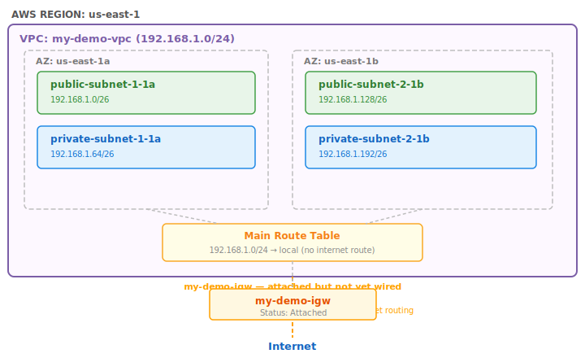
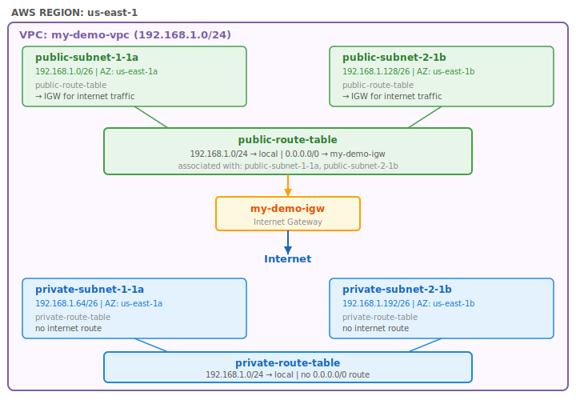
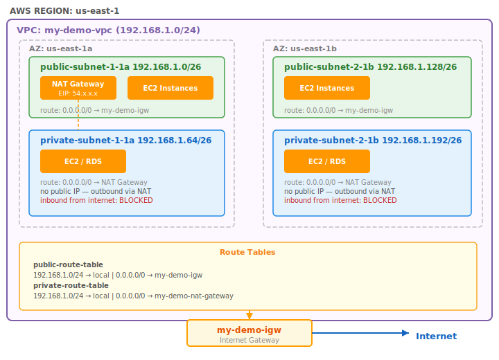
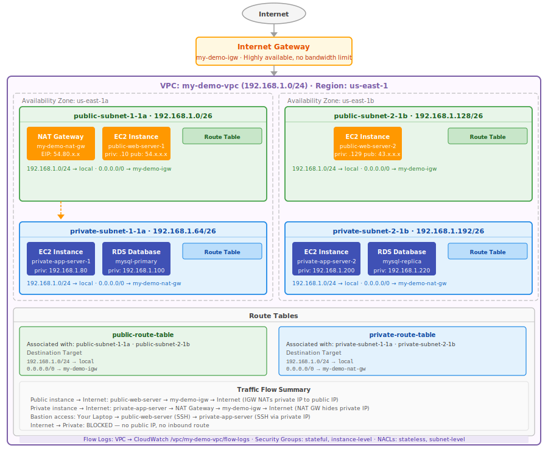

# Part 2: Building a VPC from Scratch [Subnets, IG, NAT Gateways, Route Tables]

# AWS VPC —  (Practical Guide)

---

## Our Example Architecture (Reference This Throughout)

Before touching anything in AWS, we plan the entire architecture on paper. Every experienced engineer does this first.

**VPC CIDR:** `192.168.1.0/24` (from Part 1 — 256 addresses, 4 subnets of /26)
**Region:** `us-east-1`**Availability Zones:** `us-east-1a` and `us-east-1b`

| Subnet Name | CIDR | AZ | Type |
|:------------|:-----|:---|:-----|
| public-subnet-1-1a | 192.168.1.0/26 | us-east-1a | Public |
| private-subnet-1-1a | 192.168.1.64/26 | us-east-1a | Private |
| public-subnet-2-1b | 192.168.1.128/26 | us-east-1b | Public |
| private-subnet-2-1b | 192.168.1.192/26 | us-east-1b | Private |

Each /26 gives 64 addresses. AWS reserves 5 per subnet, leaving **59 usable IPs** per subnet.

---

## Architecture — What We Are Building



---

## Table of Contents

1. [Step 0 — Clean Up Default VPC](Part%202%20Building%20a%20VPC%20from%20Scratch%20%5BSubnets,%20IG,%20N%2033bd9daa12b5804bb3d6f9bbdd3312b2.md)
2. [Step 1 — Create the VPC](Part%202%20Building%20a%20VPC%20from%20Scratch%20%5BSubnets,%20IG,%20N%2033bd9daa12b5804bb3d6f9bbdd3312b2.md)
3. [Step 2 — Create All 4 Subnets](Part%202%20Building%20a%20VPC%20from%20Scratch%20%5BSubnets,%20IG,%20N%2033bd9daa12b5804bb3d6f9bbdd3312b2.md)
4. [Step 3 — Create and Attach Internet Gateway](Part%202%20Building%20a%20VPC%20from%20Scratch%20%5BSubnets,%20IG,%20N%2033bd9daa12b5804bb3d6f9bbdd3312b2.md)
5. [Step 4 — Route Tables — The Full Picture](Part%202%20Building%20a%20VPC%20from%20Scratch%20%5BSubnets,%20IG,%20N%2033bd9daa12b5804bb3d6f9bbdd3312b2.md)
6. [Step 5 — Make Public Subnets Truly Public](Part%202%20Building%20a%20VPC%20from%20Scratch%20%5BSubnets,%20IG,%20N%2033bd9daa12b5804bb3d6f9bbdd3312b2.md)
7. [Step 6 — NAT Gateway for Private Subnets](Part%202%20Building%20a%20VPC%20from%20Scratch%20%5BSubnets,%20IG,%20N%2033bd9daa12b5804bb3d6f9bbdd3312b2.md)
8. [Step 7 — VPC Flow Logs](Part%202%20Building%20a%20VPC%20from%20Scratch%20%5BSubnets,%20IG,%20N%2033bd9daa12b5804bb3d6f9bbdd3312b2.md)
9. [Step 8 — Security Groups vs NACLs](Part%202%20Building%20a%20VPC%20from%20Scratch%20%5BSubnets,%20IG,%20N%2033bd9daa12b5804bb3d6f9bbdd3312b2.md)
10. [Step 9 — Launch Instances to Verify](Part%202%20Building%20a%20VPC%20from%20Scratch%20%5BSubnets,%20IG,%20N%2033bd9daa12b5804bb3d6f9bbdd3312b2.md)
11. [Complete Final Architecture](Part%202%20Building%20a%20VPC%20from%20Scratch%20%5BSubnets,%20IG,%20N%2033bd9daa12b5804bb3d6f9bbdd3312b2.md)
12. [Important Rules & Gotchas Summary](Part%202%20Building%20a%20VPC%20from%20Scratch%20%5BSubnets,%20IG,%20N%2033bd9daa12b5804bb3d6f9bbdd3312b2.md)

---

## Step 0 — Clean Up Default VPC

When you create a new AWS account, every region comes with a **Default VPC** pre-created. It has default subnets, a default Internet Gateway, and default route tables all pre-wired together.

**Why delete it?**

- It is too open — all default subnets are public by default
- It trains bad habits — real production environments never use default VPCs
- It can cause confusion — resources accidentally launched in the default VPC may get unexpected public IPs
- A clean account forces you to build your network intentionally

**How to delete it:**

```
AWS Console → VPC → Your VPCs → select "default" → Actions → Delete VPC
```

Deleting the default VPC also automatically deletes its subnets, default internet gateway, and default route tables. You can always recreate it via `Actions → Create Default VPC` if needed.

> **Important:** The default VPC exists per region. If you work in multiple regions, delete the default VPC in each one.
> 

---

## Step 1 — Create the VPC

### What a VPC actually is

A VPC is the outer boundary — the fence around everything. It defines:

- The overall IP address pool your entire network can use
- The region it lives in (a VPC is always confined to one region)
- Whether resources use shared hardware or dedicated hardware (tenancy)

A VPC by itself does nothing. It is just a defined boundary. Everything useful — subnets, gateways, routing — gets added to it in subsequent steps.

### Create it

```
AWS Console → VPC → Your VPCs → Create VPC
```

```
Settings to fill in:
────────────────────────────────────────────────
Name tag:          my-demo-vpc
IPv4 CIDR block:   192.168.1.0/24
IPv6 CIDR block:   No IPv6 CIDR block
Tenancy:           Default
────────────────────────────────────────────────
```

**Tenancy explained:**

- `Default` — your VPC runs on shared physical hardware with other AWS customers (fully isolated logically, but shared hardware). This is what 99% of workloads use.
- `Dedicated` — your VPC runs on hardware exclusively for you. Costs significantly more. Only needed for strict compliance requirements (some financial/government regulations).

### What AWS creates automatically when you create a VPC

```
Created automatically with every new VPC:
─────────────────────────────────────────
✓  Main Route Table        (one default route table, attached to all subnets until changed)
✓  Main Network ACL        (allows all inbound and outbound by default)
✓  Default Security Group  (allows all outbound, no inbound from outside)

NOT created automatically — you must create these:
─────────────────────────────────────────
✗  Subnets
✗  Internet Gateway
✗  NAT Gateway
✗  Custom Route Tables
```

### Architecture after Step 1

```
AWS REGION: us-east-1
┌─────────────────────────────────────────────────────────┐
│  VPC: my-demo-vpc  (192.168.1.0/24)                     │
│                                                         │
│  [Empty — no subnets yet]                               │
│                                                         │
│  Auto-created:                                          │
│  • Main Route Table (no routes to internet)             │
│  • Main Network ACL                                     │
│  • Default Security Group                               │
│                                                         │
└─────────────────────────────────────────────────────────┘

No connection to internet yet.
```

### Important VPC rules

- **One region per VPC** — a VPC cannot span multiple AWS regions. To have resources in multiple regions you create a VPC in each region and connect them with VPC Peering or Transit Gateway.
- **CIDR cannot be changed after creation** — you can add secondary CIDR blocks, but you cannot modify the primary CIDR. Plan your IP range carefully.
- **No overlapping CIDRs for peered VPCs** — if you later peer this VPC with another, their CIDR ranges must not overlap. `192.168.1.0/24` and `192.168.2.0/24` can be peered. `192.168.1.0/24` and `192.168.1.0/24` cannot.
- **Limit of 5 VPCs per region by default** — this is a soft limit, you can request an increase.

---

## Step 2 — Create All 4 Subnets

### What a subnet is

A subnet (subnetwork) is a subdivision of your VPC's IP range assigned to a **specific Availability Zone**. Think of the VPC as the entire office building and subnets as individual floors — each floor is in a specific physical location (AZ) and has its own rules.

**A subnet is always in exactly one AZ. An AZ can have multiple subnets. A subnet cannot span AZs.**

This is fundamental: if an AZ goes down, the subnets inside it become unreachable. This is why you create subnets in multiple AZs — for high availability.

### Create Subnet 1 — public-subnet-1-1a

```
AWS Console → VPC → Subnets → Create Subnet
```

```
Settings:
────────────────────────────────────────────────────────
VPC ID:                  my-demo-vpc (select from dropdown)
Subnet name:             public-subnet-1-1a
Availability Zone:       us-east-1a
IPv4 subnet CIDR block:  192.168.1.0/26
────────────────────────────────────────────────────────
```

**IP range this subnet covers:**

```
192.168.1.0/26
Total:    64 addresses  (.0 to .63)
Reserved: .0  (network), .1  (router), .2  (DNS), .3  (future), .63  (broadcast)
Usable:   192.168.1.1  to  192.168.1.62  →  59 IPs
```

### Create Subnet 2 — private-subnet-1-1a

```
Settings:
────────────────────────────────────────────────────────
VPC ID:                  my-demo-vpc
Subnet name:             private-subnet-1-1a
Availability Zone:       us-east-1a        ← same AZ as subnet 1
IPv4 subnet CIDR block:  192.168.1.64/26
────────────────────────────────────────────────────────
```

**IP range:**

```
192.168.1.64/26
Total:    64 addresses  (.64 to .127)
Reserved: .64 (network), .65 (router), .66 (DNS), .67 (future), .127 (broadcast)
Usable:   192.168.1.65  to  192.168.1.126  →  59 IPs
```

### Create Subnet 3 — public-subnet-2-1b

```
Settings:
────────────────────────────────────────────────────────
VPC ID:                  my-demo-vpc
Subnet name:             public-subnet-2-1b
Availability Zone:       us-east-1b        ← DIFFERENT AZ
IPv4 subnet CIDR block:  192.168.1.128/26
────────────────────────────────────────────────────────
```

**IP range:**

```
192.168.1.128/26
Total:    64 addresses  (.128 to .191)
Reserved: .128 (network), .129 (router), .130 (DNS), .131 (future), .191 (broadcast)
Usable:   192.168.1.129  to  192.168.1.190  →  59 IPs
```

### Create Subnet 4 — private-subnet-2-1b

```
Settings:
────────────────────────────────────────────────────────
VPC ID:                  my-demo-vpc
Subnet name:             private-subnet-2-1b
Availability Zone:       us-east-1b        ← same AZ as subnet 3
IPv4 subnet CIDR block:  192.168.1.192/26
────────────────────────────────────────────────────────
```

**IP range:**

```
192.168.1.192/26
Total:    64 addresses  (.192 to .255)
Reserved: .192 (network), .193 (router), .194 (DNS), .195 (future), .255 (broadcast)
Usable:   192.168.1.193  to  192.168.1.254  →  59 IPs
```

### Architecture after Step 2



> Status: Subnets created but NO internet access for any of them yet. All 4 subnets behave like private subnets at this point.

### Important subnet rules

- **Subnet CIDR must be within the VPC CIDR** — since the VPC is `192.168.1.0/24`, every subnet must use an address range within `.0` to `.255`. You cannot create a subnet with `192.168.2.0/26` inside this VPC.
- **Subnet CIDRs cannot overlap** — you cannot have two subnets both claiming the same IP range.
- **Subnet is always in exactly one AZ** — you choose the AZ at creation and it cannot be changed.
- **Subnet cannot span AZs** — there is no such thing as a subnet that exists in both `us-east-1a` and `us-east-1b`.
- **The VPC's AZs must match the region** — `us-east-1` has AZs `us-east-1a`, `us-east-1b`, `us-east-1c`, etc. You can only choose AZs belonging to the VPC's region.
- **A subnet name does not make it public or private** — calling something `public-subnet-1-1a` does NOT make it public. Public/private is determined entirely by the route table associated with it. The name is just a label for humans.

---

## Step 3 — Create and Attach Internet Gateway

### What an Internet Gateway is

An Internet Gateway (IGW) is the bridge between your VPC and the public internet. Without one, nothing in your VPC can send or receive traffic from the internet — not even if it has a public IP address.

Think of it like the main entrance door of your building. The building (VPC) exists, the floors (subnets) exist, but without a door (IGW) nobody can enter or leave to the outside world.

The IGW performs two functions:

1. **Provides a route target** — route tables point internet-bound traffic at the IGW
2. **NAT for public IPs** — when an instance with a public IP sends traffic to the internet, the IGW translates (NAT) the private IP to the public IP and vice versa

### Create the Internet Gateway

```
AWS Console → VPC → Internet Gateways → Create Internet Gateway
```

```
Settings:
────────────────────────────────
Name tag:   my-demo-igw
────────────────────────────────
```

After creation the IGW status will show **Detached**. It exists but is not connected to any VPC yet.

### Attach the Internet Gateway to the VPC

```
Select my-demo-igw → Actions → Attach to VPC → select my-demo-vpc → Attach
```

Status changes from `Detached` to `Attached`.

### Architecture after Step 3



### Critical IGW rules

- **One IGW per VPC, one VPC per IGW** — you cannot attach two IGWs to one VPC, and you cannot attach one IGW to two VPCs. This is a hard AWS limit.
- **An IGW is region-scoped** — it exists within the region of the VPC. You cannot share an IGW across regions.
- **Creating and attaching the IGW does not automatically enable internet access** — the IGW being attached just means the door exists. You still need to tell traffic to use it (via route tables in the next step).
- **IGW is highly available by default** — AWS manages the IGW. It is redundant across AZs within the region. You do not need to worry about the IGW failing.
- **No bandwidth limit on IGW** — it scales automatically with your traffic. You are not charged for the IGW itself, only for data transfer through it.

---

## Step 4 — Route Tables — The Full Picture

### What a route table is

A route table is a set of rules (called routes) that tells network traffic where to go. Every subnet must be associated with exactly one route table. When a packet leaves an instance, the VPC looks at the route table of that subnet and decides where to send the packet based on its destination IP.

A route has two parts:

```
Destination       Target
───────────       ──────────────────
10.0.0.0/8        local
0.0.0.0/0         igw-xxxxxxxxx
```

- **Destination** — the IP range this rule applies to (which packets does this rule match?)
- **Target** — where to send the matched packets

The VPC always picks the **most specific matching route**. `192.168.1.64/26` is more specific than `0.0.0.0/0`, so traffic to `192.168.1.64/26` uses the local route even if a `0.0.0.0/0` route also exists.

### The `local` route — always present, never removable

Every route table in every VPC automatically has one route that cannot be deleted:

```
Destination          Target
────────────         ──────
192.168.1.0/24       local
```

This means: "any traffic destined for an IP within `192.168.1.0/24` stays inside the VPC." Instances in different subnets can reach each other because of this route — traffic to `192.168.1.64` (private subnet) from an instance in `192.168.1.0` (public subnet) hits this `local` route and stays within the VPC.

### The Main Route Table

When you created the VPC, AWS automatically created a **Main Route Table**. At this moment it only has the local route:

```
Main Route Table — current state
─────────────────────────────────────────────────────
Destination          Target         Status
────────────         ──────         ──────
192.168.1.0/24       local          Active
─────────────────────────────────────────────────────
```

**All 4 subnets are currently associated with this Main Route Table** by default. No subnet has internet access. This is correct — we will now create custom route tables and associate the right subnets with them.

**Best practice: Never add internet routes to the Main Route Table.** Keep the Main Route Table clean with only the local route. This way, any new subnet you create in the future will default to no internet access — which is the safer default. You intentionally add internet access by associating a subnet with a custom public route table.

### Create the Public Route Table

```
AWS Console → VPC → Route Tables → Create Route Table
```

```
Settings:
────────────────────────────────────────────
Name:   public-route-table
VPC:    my-demo-vpc
────────────────────────────────────────────
```

**Add the internet route to the public route table:**

```
Select public-route-table → Routes tab → Edit Routes → Add Route

Destination:   0.0.0.0/0
Target:        Internet Gateway → my-demo-igw

Save changes
```

The public route table now looks like this:

```
Public Route Table — routes
─────────────────────────────────────────────────────────────────
Destination          Target              Meaning
────────────         ──────              ────────────────────────
192.168.1.0/24       local               Stay in VPC (all internal traffic)
0.0.0.0/0            igw-xxxxxxxxx       Everything else → Internet
─────────────────────────────────────────────────────────────────
```

`0.0.0.0/0` is shorthand for "every IP address on the internet." This is the catch-all route that handles any destination not covered by a more specific rule. By pointing it at the IGW, internet-bound traffic exits through the gateway.

**Associate public subnets with the public route table:**

```
Select public-route-table → Subnet associations tab → Edit subnet associations

Check:  public-subnet-1-1a  (192.168.1.0/26)
Check:  public-subnet-2-1b  (192.168.1.128/26)

Save associations
```

### Create the Private Route Table

```
Create Route Table:
────────────────────────────────────────────
Name:   private-route-table
VPC:    my-demo-vpc
────────────────────────────────────────────
```

Do NOT add a route to the Internet Gateway. The private route table looks like this:

```
Private Route Table — routes (current state, before NAT)
─────────────────────────────────────────────────────────────────
Destination          Target              Meaning
────────────         ──────              ────────────────────────
192.168.1.0/24       local               Stay in VPC only
─────────────────────────────────────────────────────────────────

No 0.0.0.0/0 route = no internet access outbound or inbound.
```

**Associate private subnets with the private route table:**

```
Select private-route-table → Subnet associations tab → Edit subnet associations

Check:  private-subnet-1-1a  (192.168.1.64/26)
Check:  private-subnet-2-1b  (192.168.1.192/26)

Save associations
```

### Architecture after Step 4



### Route table rules

- **Every subnet must have exactly one route table** — you cannot associate a subnet with two route tables simultaneously.
- **One route table can serve multiple subnets** — both public subnets share one public route table. That is fine and normal.
- **The most specific route wins** — if two rules match a destination, the one with the longer prefix (more specific) wins. `192.168.1.64/26` beats `0.0.0.0/0`.
- **The local route cannot be deleted** — it is permanent and always takes priority for internal VPC traffic.
- **Public vs private is entirely about the route table** — the only difference between a public subnet and a private subnet is whether the subnet's route table has `0.0.0.0/0 → IGW`. Nothing else.

---

## Step 5 — Make Public Subnets Truly Public

### The auto-assign public IP setting

At this point the public subnets have internet routing via the route table, but there is still one more thing needed: instances launched in public subnets must have a public IP address so the internet can reach them.

By default, instances launched in a subnet get only a private IP. You need to enable **auto-assign public IPv4 address** on the public subnets.

```
Select public-subnet-1-1a → Actions → Edit subnet settings
→ Enable auto-assign public IPv4 address → Save

Repeat for public-subnet-2-1b
```

With this enabled, every EC2 instance launched in these subnets automatically gets a public IP address (in addition to its private IP). The IGW then handles the mapping between public and private IP.

**Do NOT enable this on private subnets.** Private subnet instances should never have public IPs — that would defeat the purpose of making them private.

### How the public IP actually works

When an EC2 instance in a public subnet sends traffic to the internet:

```
Instance (private: 192.168.1.10, public: 54.x.x.x)
  → Sends packet to 8.8.8.8 (Google DNS)
  → Packet leaves instance with source: 192.168.1.10
  → Hits the IGW
  → IGW translates source IP: 192.168.1.10 → 54.x.x.x  (this is NAT)
  → Packet goes to internet with source: 54.x.x.x
  → Response comes back to 54.x.x.x
  → IGW translates: 54.x.x.x → 192.168.1.10
  → Packet delivered to instance
```

The instance itself never knows about its public IP — if you run `ip addr` on a Linux instance in AWS, you only see the private IP. The public IP translation happens entirely at the IGW level.

---

## Step 6 — NAT Gateway for Private Subnets

### The problem

Private subnet instances have no route to the internet — by design. But they still need to reach the internet for outbound purposes:

- Downloading OS updates (`yum update`, `apt-get upgrade`)
- Calling external APIs
- Pulling Docker images
- Sending logs to external services

They just should not be reachable FROM the internet. This is the distinction:

- **Inbound from internet → BLOCKED** (no public IP, no IGW route)
- **Outbound to internet → ALLOWED** (via NAT Gateway)

### What NAT Gateway does — simply explained

NAT stands for Network Address Translation. A NAT Gateway is like a **post office proxy** for your private subnet instances.

```
WITHOUT NAT GATEWAY:
Private instance wants to reach 8.8.8.8
→ Checks route table: no route to 0.0.0.0/0
→ Request fails. No internet access at all.

WITH NAT GATEWAY:
Private instance wants to reach 8.8.8.8
→ Route table: 0.0.0.0/0 → NAT Gateway
→ Packet goes to NAT Gateway (which is in a public subnet)
→ NAT Gateway has an Elastic IP (public IP)
→ NAT Gateway sends the request to internet using its own public IP
→ Response comes back to NAT Gateway's public IP
→ NAT Gateway forwards response back to the private instance
→ Private instance receives response

The internet only ever sees the NAT Gateway's IP.
Nobody on the internet can initiate a connection TO the private instance.
```

The NAT Gateway acts as the middleman:

- Outbound: private IP → public IP (NAT Gateway's Elastic IP)
- Inbound: only allows responses to requests that the private instance originated

### Create an Elastic IP for the NAT Gateway

The NAT Gateway needs a static public IP to represent all outbound traffic from your private subnets.

```
AWS Console → EC2 → Elastic IPs → Allocate Elastic IP Address
→ Network Border Group: us-east-1
→ Allocate
```

Note the allocated IP (e.g., `54.80.x.x`). This is the IP the internet will see for all outbound traffic from your private subnets.

### Create the NAT Gateway

**Critical: The NAT Gateway must be placed in a PUBLIC subnet, not a private one.** The NAT Gateway itself needs internet access to forward traffic. If you put it in a private subnet, it has no internet connectivity and cannot function.

```
AWS Console → VPC → NAT Gateways → Create NAT Gateway
```

```
Settings:
────────────────────────────────────────────────────────────────
Name:              my-demo-nat-gateway
Subnet:            public-subnet-1-1a    ← MUST be a public subnet
Connectivity type: Public
Elastic IP:        [select the one you just allocated]
────────────────────────────────────────────────────────────────
```

Wait a few minutes for the NAT Gateway status to become **Available**.

### Update the Private Route Table to use NAT Gateway

```
Select private-route-table → Routes → Edit Routes → Add Route

Destination:   0.0.0.0/0
Target:        NAT Gateway → my-demo-nat-gateway

Save changes
```

The private route table now looks like:

```
Private Route Table — routes (after NAT Gateway)
─────────────────────────────────────────────────────────────────────────────────
Destination          Target                  Meaning
────────────         ──────                  ────────────────────────────────────
192.168.1.0/24       local                   Stay in VPC (internal traffic)
0.0.0.0/0            nat-xxxxxxxxxxxxxxxxx   Internet-bound → go via NAT Gateway
─────────────────────────────────────────────────────────────────────────────────
```

### NAT Gateway vs Internet Gateway — key differences

| Feature | Internet Gateway | NAT Gateway |
|:--------|:-----------------|:------------|
| Direction of traffic | Inbound + Outbound | Outbound ONLY |
| Instance needs public IP? | Yes | No (NAT GW has one) |
| Internet can reach it? | Yes (if SG allows) | No (never) |
| Where it lives | Attached to VPC | Inside a public subnet |
| Cost | Free (data charges only) | Hourly charge + data |
| HA / Redundancy | AWS managed, always HA | Single AZ — create one per AZ |

### NAT Gateway high availability — one per AZ

The NAT Gateway we created is in `us-east-1a`. If `us-east-1a` fails, the NAT Gateway goes down too, and `private-subnet-2-1b` (in `us-east-1b`) would lose internet access.

For true high availability, create a second NAT Gateway in `us-east-1b` and create a separate private route table for `us-east-1b` that points to the `us-east-1b` NAT Gateway:

```
NAT Gateway 1:  in public-subnet-1-1a  (us-east-1a)
NAT Gateway 2:  in public-subnet-2-1b  (us-east-1b)

private-route-table-1a  →  used by private-subnet-1-1a  →  routes 0.0.0.0/0 to NAT-GW-1
private-route-table-1b  →  used by private-subnet-2-1b  →  routes 0.0.0.0/0 to NAT-GW-2
```

For our learning example we use one NAT Gateway to keep it simple.

### Architecture after Step 6



---

## Step 7 — VPC Flow Logs

### What Flow Logs are

VPC Flow Logs capture metadata about every IP packet that flows through your network interfaces in the VPC. They do not capture the actual content of the packets (no payload data), just the headers:

```
Example flow log entry:
─────────────────────────────────────────────────────────────────────────────
2 123456789010 eni-abc123 192.168.1.10 8.8.8.8 12345 53 17 1 60 ACCEPT OK
─────────────────────────────────────────────────────────────────────────────
Account   ENI         Source IP     Dest IP    SrcPort DstPort  Protocol  Action
```

Flow Logs are essential for:

- **Security investigations** — which IPs are trying to reach your instances?
- **Troubleshooting** — why can't Instance A reach Instance B? Was the traffic rejected?
- **Compliance** — many regulations require network traffic logging
- **Cost analysis** — which resources are generating the most traffic?

### Set up Flow Logs to CloudWatch

**Step 1: Create a CloudWatch Log Group**

```
AWS Console → CloudWatch → Log Groups → Create Log Group
Name: /vpc/my-demo-vpc/flow-logs
Retention: 90 days (choose based on your compliance needs)
```

**Step 2: Create an IAM Role for VPC to write to CloudWatch**

The VPC service needs permission to write logs to CloudWatch on your behalf. Create a role:

```
IAM → Roles → Create Role
Trusted entity: VPC Flow Logs service (vpc-flow-logs.amazonaws.com)

Attach policy:
{
  "Version": "2012-10-17",
  "Statement": [{
    "Effect": "Allow",
    "Action": [
      "logs:CreateLogGroup",
      "logs:CreateLogStream",
      "logs:PutLogEvents",
      "logs:DescribeLogGroups",
      "logs:DescribeLogStreams"
    ],
    "Resource": "*"
  }]
}

Role name: vpc-flow-logs-role
```

**Step 3: Enable Flow Logs on the VPC**

```
VPC Console → Your VPCs → select my-demo-vpc
→ Flow Logs tab → Create Flow Log

Filter:          All (captures accepted and rejected traffic)
Max aggregation: 1 minute
Destination:     Send to CloudWatch Logs
Log group:       /vpc/my-demo-vpc/flow-logs
IAM role:        vpc-flow-logs-role
```

After a few minutes, traffic logs will appear in CloudWatch under the log group you created.

---

## Step 8 — Security Groups vs NACLs

Both are firewall mechanisms in AWS but they work at different levels and have different behaviors. Understanding both is critical.

### Security Groups — Instance Level Firewall

A Security Group is attached to an **ENI (Elastic Network Interface)** — effectively to an EC2 instance. It controls what traffic is allowed in and out of that specific instance.

**Key behaviors:**

- **Stateful** — if you allow inbound traffic on port 80, the response traffic is automatically allowed out, even without an explicit outbound rule. The connection is tracked.
- **Allow only** — you can only write ALLOW rules. There is no explicit DENY. Anything not allowed is implicitly denied.
- **Applied at instance level** — different instances in the same subnet can have different security groups.

```
Example Security Group for a public web server:
────────────────────────────────────────────────────────────
INBOUND RULES
Type        Protocol  Port    Source          Reason
────────    ────────  ────    ──────          ──────────────
HTTP        TCP       80      0.0.0.0/0       Web traffic
HTTPS       TCP       443     0.0.0.0/0       Secure web
SSH         TCP       22      your-IP/32      Admin access only

OUTBOUND RULES
Type        Protocol  Port    Destination
────────    ────────  ────    ───────────
All traffic All       All     0.0.0.0/0   (default — allow all outbound)
────────────────────────────────────────────────────────────
```

```
Example Security Group for a private database:
────────────────────────────────────────────────────────────
INBOUND RULES
Type        Protocol  Port    Source              Reason
────────    ────────  ────    ──────              ──────────────────────────────
MySQL/Aurora TCP      3306   [web-server-sg-id]  Only from web server SG

Note: You reference another Security Group as the source — not an IP range.
This means "allow traffic from any instance that belongs to web-server-sg."
This is called Security Group chaining and is a powerful pattern.
────────────────────────────────────────────────────────────
```

### NACLs — Subnet Level Firewall

A Network Access Control List (NACL) is attached to a **subnet** and controls traffic entering and leaving the subnet as a whole.

**Key behaviors:**

- **Stateless** — if you allow inbound port 80, you must also explicitly allow the outbound response (ephemeral ports 1024-65535). Both directions are evaluated independently.
- **Allow AND deny** — you can write both ALLOW and DENY rules. This is the main reason to use NACLs.
- **Rules are numbered and evaluated in order** — lower number = higher priority. First matching rule wins.
- **Applied at subnet level** — all instances in a subnet share the same NACL.

```
Example NACL for public subnets:
────────────────────────────────────────────────────────────
INBOUND RULES
Rule #  Type      Protocol  Port        Source          Action
──────  ────      ────────  ────        ──────          ──────
100     HTTP      TCP       80          0.0.0.0/0       ALLOW
110     HTTPS     TCP       443         0.0.0.0/0       ALLOW
120     SSH       TCP       22          your-IP/32      ALLOW
130     Custom    TCP       1024-65535  0.0.0.0/0       ALLOW  ← ephemeral (response traffic)
*       All       All       All         0.0.0.0/0       DENY   ← default deny everything else

OUTBOUND RULES
Rule #  Type      Protocol  Port        Destination     Action
──────  ────      ────────  ────        ───────────     ──────
100     HTTP      TCP       80          0.0.0.0/0       ALLOW
110     HTTPS     TCP       443         0.0.0.0/0       ALLOW
120     Custom    TCP       1024-65535  0.0.0.0/0       ALLOW  ← ephemeral response ports
*       All       All       All         0.0.0.0/0       DENY
────────────────────────────────────────────────────────────
```

### Security Group vs NACL — quick comparison

| Feature | Security Group | NACL |
|:--------|:--------------|:-----|
| Applied to | Instance (ENI) | Subnet |
| State | Stateful | Stateless |
| Rule types | Allow only | Allow + Deny |
| Rule evaluation | All rules evaluated | Lowest number first, stops at match |
| Default behavior | Deny all inbound | Allow all (default NACL) |
| Use for | Instance-level control | Subnet-level block/allow, IP blocks |

**When to use which:**

- Use **Security Groups** for most day-to-day access control — which services can talk to which.
- Use **NACLs** when you need to explicitly **block** a specific IP or range (you can't do deny in security groups) — for example, blocking a known malicious IP across an entire subnet.

---

## Step 9 — Launch Instances to Verify

### Launch a public EC2 instance

```
EC2 → Launch Instance

Name:               public-web-server
AMI:                Amazon Linux 2023
Instance type:      t2.micro
Key pair:           create or select existing
Network:            my-demo-vpc
Subnet:             public-subnet-1-1a
Auto-assign IP:     Enable
Security Group:     Allow SSH (22) from your IP, HTTP (80) from anywhere
```

This instance will get:

- A private IP from the `192.168.1.0/26` range (e.g., `192.168.1.15`)
- A public IP (auto-assigned, e.g., `54.x.x.x`)
- Internet access via the public route table → IGW

### Launch a private EC2 instance

```
EC2 → Launch Instance

Name:               private-app-server
AMI:                Amazon Linux 2023
Instance type:      t2.micro
Key pair:           same key pair
Network:            my-demo-vpc
Subnet:             private-subnet-1-1a
Auto-assign IP:     Disable
Security Group:     Allow SSH (22) from public subnet CIDR (192.168.1.0/26) only
```

This instance will get:

- A private IP from the `192.168.1.64/26` range (e.g., `192.168.1.80`)
- No public IP
- Outbound internet access via NAT Gateway
- No direct inbound access from internet

### Access pattern — Bastion Host

You cannot SSH directly into the private instance from your laptop — it has no public IP. The standard pattern is to use the public instance as a **Bastion Host** (also called a Jump Server):

```
Your Laptop
    │  SSH to 54.x.x.x (public instance's public IP)
    ▼
Public Instance (192.168.1.15)
    │  SSH to 192.168.1.80 (private instance's private IP)
    │  (works because both are in the same VPC — local route)
    ▼
Private Instance (192.168.1.80)
```

```bash
# From your laptop — connect to bastion (public instance)
ssh -i my-key.pem ec2-user@54.x.x.x

# From inside the bastion — connect to private instance
ssh -i my-key.pem ec2-user@192.168.1.80
```

### Test outbound internet from private instance

Once inside the private instance, test that the NAT Gateway is working:

```bash
# This should succeed — goes via NAT Gateway
curl <https://www.google.com>

# Or test DNS resolution
nslookup google.com

# Check your outbound public IP — it should show the NAT Gateway's Elastic IP
curl ifconfig.me
```

If these work, your NAT Gateway and private route table are configured correctly.

### Test internal VPC communication

From the public instance, ping the private instance's private IP:

```bash
ping 192.168.1.80
```

This should succeed — the local route handles all traffic within `192.168.1.0/24`.

---

## Complete Final Architecture



---

## Important Rules & Gotchas Summary

### VPC Rules

- One VPC = one region. Cannot span regions.
- CIDR cannot be modified after creation. You can only add secondary CIDRs.
- Limit: 5 VPCs per region (soft limit, can be increased).
- Peered VPCs must have non-overlapping CIDRs.

### Subnet Rules

- One subnet = one AZ. Cannot span AZs.
- Subnet CIDR must be within the VPC CIDR.
- Subnet CIDRs within a VPC cannot overlap each other.
- AWS reserves 5 IPs per subnet (network, router, DNS, future, broadcast).
- A subnet is public or private based solely on its route table — not its name.
- Auto-assign public IP must be enabled on public subnets for instances to get public IPs.

### Internet Gateway Rules

- One IGW per VPC. One VPC per IGW. Hard limit.
- Creating an IGW does not give internet access — you must add it as a route target.
- IGW is region-scoped and AWS-managed (always highly available).
- No cost for the IGW itself. You pay for data transfer.

### Route Table Rules

- Every subnet has exactly one route table at a time.
- One route table can serve many subnets.
- The `local` route cannot be deleted and always wins for internal VPC traffic.
- Most specific route (longest prefix) wins when multiple rules match.
- Never add internet routes to the Main Route Table — keep it internal-only.

### NAT Gateway Rules

- Must be placed in a PUBLIC subnet (it needs internet access to forward traffic).
- Requires an Elastic IP.
- Provides outbound-only internet access for private subnets.
- Single AZ — for HA, create one NAT Gateway per AZ.
- Not free — charged per hour + per GB of data processed.
- NAT Gateway is managed by AWS (no patching, no scaling needed).

### Security

- Security Groups = stateful, instance level, allow-only rules.
- NACLs = stateless, subnet level, allow + deny rules, numbered order.
- Use Security Groups for normal access control. Use NACLs to block specific IPs/ranges.
- Private instances use a Bastion Host (public instance) for SSH access.
- Never put databases or application servers in public subnets.

---

## Quick Reference — What Makes a Subnet Public or Private

| | PUBLIC SUBNET | PRIVATE SUBNET |
|:---|:---|:---|
| Route table has | `192.168.x.0/24 → local`<br>`0.0.0.0/0 → IGW` | `192.168.x.0/24 → local`<br>`0.0.0.0/0 → NAT Gateway`<br>(or no `0.0.0.0/0` route at all) |
| Auto-assign public IP | ENABLED | DISABLED |
| Instances get | Private IP (always)<br>Public IP (auto-assigned) | Private IP (always)<br>No public IP |
| Reachable from internet | YES | NO |
| Can reach internet | YES | YES (via NAT) |
| Used for | Load balancers<br>Bastion hosts<br>NAT Gateways<br>Public-facing web servers | Application servers<br>Databases<br>Backend services<br>Internal microservices |

---

*End of Part 2 — AWS VPC Creation and Architecture*