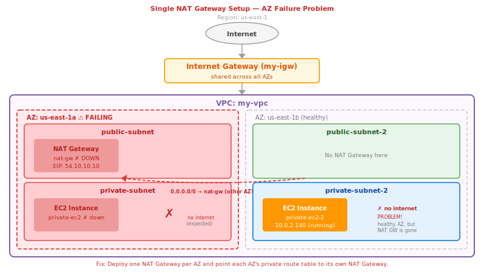
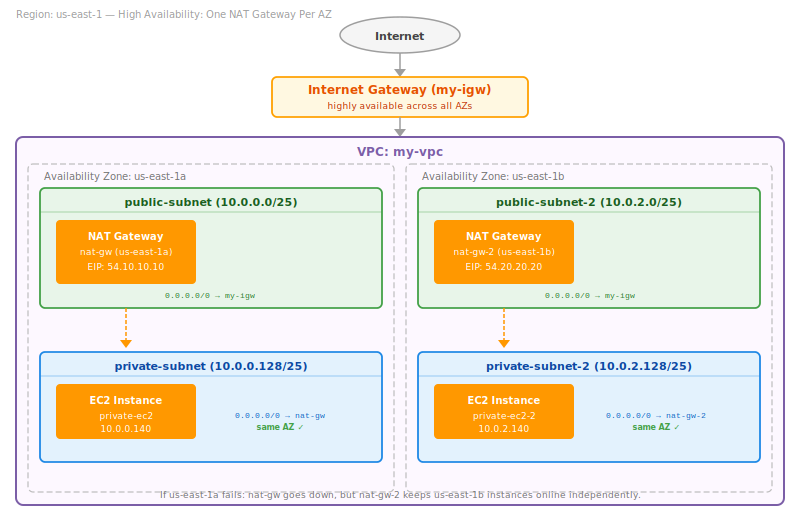
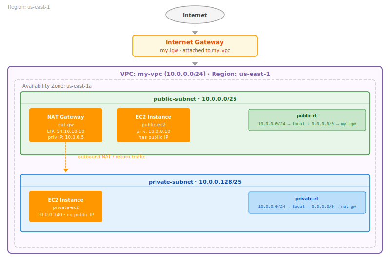

# Part 3: NAT Gateway — Deep Dive

---

## Our Example Architecture (Reference This Throughout)

Before anything else, here is the setup we will use for every example, diagram, and packet trace in this part.

**VPC:** `my-vpc` — `10.0.0.0/24`
**Region:** `us-east-1`

| Subnet Name | CIDR | AZ | Type |
|:------------|:-----|:---|:-----|
| public-subnet | 10.0.0.0/25 | us-east-1a | Public |
| private-subnet | 10.0.0.128/25 | us-east-1a | Private |

**Key resources:**

```
NAT Gateway:      nat-gw   →  lives in public-subnet   →  EIP: 54.10.10.10
Internet Gateway: my-igw   →  attached to my-vpc

EC2 Instance (public):   public-ec2   →  public-subnet   →  private IP: 10.0.0.10
EC2 Instance (private):  private-ec2  →  private-subnet  →  private IP: 10.0.0.140
```

---

## Table of Contents

1. [Why NAT Exists — The Core Problem](#1-why-nat-exists--the-core-problem)
2. [What NAT Actually Does — PAT Explained](#2-what-nat-actually-does--pat-explained)
3. [The Full Packet Journey — Step by Step](#3-the-full-packet-journey--step-by-step)
4. [Public NAT Gateway vs Private NAT Gateway](#4-public-nat-gateway-vs-private-nat-gateway)
5. [Elastic IP and NAT Gateway](#5-elastic-ip-and-nat-gateway)
6. [Placement Rule — Why NAT Gateway Must Be in a Public Subnet](#6-placement-rule--why-nat-gateway-must-be-in-a-public-subnet)
7. [High Availability — One NAT Gateway Per AZ](#7-high-availability--one-nat-gateway-per-az)
8. [NAT Gateway vs NAT Instance](#8-nat-gateway-vs-nat-instance)
9. [Technical Limits and Performance](#9-technical-limits-and-performance)
10. [Connection Tracking and Idle Timeouts](#10-connection-tracking-and-idle-timeouts)
11. [NAT Gateway vs Internet Gateway — The Complete Comparison](#11-nat-gateway-vs-internet-gateway--the-complete-comparison)
12. [When NOT to Use NAT Gateway — VPC Endpoints](#12-when-not-to-use-nat-gateway--vpc-endpoints)
13. [Cost Breakdown](#13-cost-breakdown)
14. [NACLs and NAT Gateway — the Ephemeral Port Problem](#14-nacls-and-nat-gateway--the-ephemeral-port-problem)
15. [Common Mistakes and Gotchas](#15-common-mistakes-and-gotchas)
16. [Quick Reference Cheatsheet](#16-quick-reference-cheatsheet)

---

## 1. Why NAT Exists — The Core Problem

### IPv4 exhaustion

The internet runs on IPv4 addresses. There are exactly 2^32 = **4,294,967,296 possible IPv4 addresses** — about 4.3 billion. The internet has far more than 4.3 billion connected devices. We ran out of assignable public IPv4 addresses around 2011.

The solution that kept the internet running was **NAT — Network Address Translation**. NAT allows many devices that each have a private IP address to share a single public IP address when communicating with the internet. Instead of every device needing its own public IP, an entire office building, data center, or VPC can share one (or a handful of) public IPs.

```
WITHOUT NAT:
  Device A needs public IP: 54.10.10.1
  Device B needs public IP: 54.10.10.2
  Device C needs public IP: 54.10.10.3
  ...thousands of devices, thousands of public IPs consumed

WITH NAT:
  Device A  (private: 10.0.0.140) ─┐
  Device B  (private: 10.0.0.141) ─┼─→ NAT → public IP: 54.10.10.10 → Internet
  Device C  (private: 10.0.0.142) ─┘
  
  All three share one public IP. Only one public IP consumed.
```

### The AWS context

In a VPC, every instance in a private subnet has a private IP. Private IPs (like `10.0.x.x`) are not routable on the internet — if a private-subnet instance tried to send a packet directly to `8.8.8.8` with source address `10.0.0.140` (a private IP), every router on the internet would discard it because `10.0.0.140` is not a valid internet address, and responses would have nowhere to go.

But private instances still need outbound internet access for legitimate purposes:

- Downloading OS patches (`yum update -y`, `apt-get upgrade`)
- Pulling container images from Docker Hub or ECR
- Calling third-party APIs (payment gateways, auth providers)
- Fetching configuration from public endpoints
- Sending logs or metrics to external services

The requirement is asymmetric:
- **Outbound to internet: YES** — instances must be able to initiate connections
- **Inbound from internet: NO** — the internet must never be able to initiate connections to private instances

**NAT Gateway solves exactly this.** It is the one-way valve — lets your private instances call out to the internet but drops any unsolicited connection coming in.

---

## 2. What NAT Actually Does — PAT Explained

Most people say "NAT" but what NAT Gateway actually performs is **PAT — Port Address Translation**, also called **NAT overloading** or **NAPT (Network Address Port Translation)**.

### Basic NAT vs PAT

**Basic NAT** is a simple one-to-one mapping: one private IP maps to one public IP. If you have 100 private instances, you need 100 public IPs. This doesn't solve the exhaustion problem at all.

**PAT** is a many-to-one mapping: many private IPs share one public IP by using **different source ports** to keep conversations separate. One public IP can serve tens of thousands of concurrent connections simultaneously.

### How PAT works

Every TCP/UDP connection is uniquely identified by a 5-tuple:

```
(source IP, source port, destination IP, destination port, protocol)
```

When `private-ec2` (10.0.0.140) makes an HTTPS request to Google (142.250.80.46 port 443):

```
BEFORE PAT (packet leaving private-ec2):
  Source IP:   10.0.0.140
  Source Port: 52341          ← randomly chosen ephemeral port by the OS
  Dest IP:     142.250.80.46
  Dest Port:   443

NAT Gateway receives this and creates a translation record:
  PRIVATE SIDE                  PUBLIC SIDE
  10.0.0.140 : 52341   ←→   54.10.10.10 : 58901

AFTER PAT (packet leaving NAT Gateway toward internet):
  Source IP:   54.10.10.10    ← NAT Gateway's EIP replaces private IP
  Source Port: 58901          ← NAT Gateway chooses a new source port
  Dest IP:     142.250.80.46
  Dest Port:   443
```

When Google's response comes back:

```
Google responds to 54.10.10.10 port 58901
  Dest IP:   54.10.10.10
  Dest Port: 58901

NAT Gateway looks up its translation table:
  54.10.10.10 : 58901  →  10.0.0.140 : 52341

NAT Gateway rewrites the packet:
  Dest IP:   10.0.0.140
  Dest Port: 52341

Delivers it to private-ec2 — the response arrives correctly.
```

The private instance never knows the translation happened. From its perspective it sent a request to Google and got a response back. The NAT Gateway's translation table is the magic in the middle.

### The translation table — keeping conversations separate

Now suppose both `private-ec2` (10.0.0.140) and a second private instance (10.0.0.141) make requests to Google simultaneously. The NAT Gateway handles this by using different source ports:

**TRANSLATION TABLE (simplified):**

| Private IP | Priv Port | EIP | Pub Port | Destination |
|:-----------|:----------|:----|:---------|:------------|
| 10.0.0.140 | 52341 | 54.10.10.10 | 58901 | 142.250.80.46 : 443 |
| 10.0.0.141 | 44217 | 54.10.10.10 | 59044 | 142.250.80.46 : 443 |
| 10.0.0.140 | 52399 | 54.10.10.10 | 58955 | 1.1.1.1 : 53 |

Each row is a unique conversation. When a response comes back to `54.10.10.10 : 59044`, the NAT Gateway knows it belongs to `10.0.0.141 : 44217`. The destination host never knows there are multiple private IPs — it just sees all traffic coming from `54.10.10.10`.

---

## 3. The Full Packet Journey — Step by Step

Let's trace a single HTTPS request from `private-ec2` to `8.8.8.8` (Google DNS) through the complete stack.

```
ARCHITECTURE OVERVIEW:

10.0.0.140               10.0.0.5               54.10.10.10
(private-ec2)            (nat-gw)                 (EIP)         Internet
     │                        │                      │               │
     │                        │                      │               │
private-subnet           public-subnet               │              IGW
(10.0.0.128/25)          (10.0.0.0/25)               │          (my-igw)
```

**Step 1 — Application initiates a request**

```
private-ec2 wants to reach 8.8.8.8 (Google DNS, port 53 UDP)

OS creates the packet:
  Source:      10.0.0.140 : 54321
  Destination: 8.8.8.8   : 53
  Protocol:    UDP
```

**Step 2 — Instance consults its routing table**

```
private-subnet Route Table:
  Destination        Target
  ─────────────────  ───────────────
  10.0.0.0/24        local            ← 8.8.8.8 doesn't match this
  0.0.0.0/0          nat-gw           ← 8.8.8.8 matches this

Result: Send to nat-gw
```

**Step 3 — Packet arrives at NAT Gateway**

```
NAT Gateway receives:
  Source:      10.0.0.140 : 54321
  Destination: 8.8.8.8   : 53

NAT Gateway creates a translation record:
  10.0.0.140 : 54321  ←→  54.10.10.10 : 61200

NAT Gateway rewrites packet:
  Source:      54.10.10.10 : 61200   ← EIP replaces private IP
  Destination: 8.8.8.8    : 53       ← unchanged
```

**Step 4 — NAT Gateway's own routing**

```
NAT Gateway (which lives in public-subnet) consults:
public-subnet Route Table:
  Destination        Target
  ─────────────────  ───────────────
  10.0.0.0/24        local
  0.0.0.0/0          my-igw           ← 8.8.8.8 goes to IGW

Result: Send to my-igw
```

**Step 5 — Internet Gateway handles the packet**

```
IGW receives:
  Source:      54.10.10.10 : 61200
  Destination: 8.8.8.8     : 53

The source is already a public IP (the EIP). IGW sends this onto the internet.

Note: The IGW is stateless for this direction — it just forwards the packet.
```

**Step 6 — Response returns**

```
8.8.8.8 responds to 54.10.10.10 : 61200:
  Source:      8.8.8.8     : 53
  Destination: 54.10.10.10 : 61200

IGW receives → forwards to my-vpc (because 54.10.10.10 is the EIP of nat-gw)
```

**Step 7 — NAT Gateway reverses the translation**

```
NAT Gateway receives the response:
  Source:      8.8.8.8     : 53
  Destination: 54.10.10.10 : 61200

Looks up translation table:
  54.10.10.10 : 61200  →  10.0.0.140 : 54321

Rewrites packet:
  Source:      8.8.8.8   : 53      ← unchanged
  Destination: 10.0.0.140 : 54321   ← restores original private IP

Sends to private-ec2 in private-subnet
```

**Step 8 — private-ec2 receives the response**

```
DNS response arrives at private-ec2.
The application gets its answer.
private-ec2 never knew about the translation.
```

**Full picture:**

```
private-ec2          nat-gw               my-igw           8.8.8.8
(10.0.0.140)         (10.0.0.x)          (edge of VPC)    (internet)
      │                    │                    │                │
      │─── UDP packet ────►│                    │                │
      │  src: 10.0.0.140   │                    │                │
      │  dst: 8.8.8.8:53   │                    │                │
      │                    │                    │                │
      │              [PAT translate]             │                │
      │              10.0.0.140:54321            │                │
      │              → 54.10.10.10:61200         │                │
      │                    │                    │                │
      │                    │─── translated ─────►│                │
      │                    │  src: 54.10.10.10   │                │
      │                    │  dst: 8.8.8.8:53    │                │
      │                    │                    │─── to internet─►│
      │                    │                    │                │
      │                    │                    │◄── response ───│
      │                    │◄── response ───────│                │
      │                    │  dst: 54.10.10.10   │                │
      │                    │                    │                │
      │              [reverse lookup]            │                │
      │              54.10.10.10:61200           │                │
      │              → 10.0.0.140:54321          │                │
      │                    │                    │                │
      │◄── response ───────│                    │                │
      │  dst: 10.0.0.140   │                    │                │
      │                    │                    │                │
```

---

## 4. Public NAT Gateway vs Private NAT Gateway

AWS offers two types of NAT Gateway. They serve fundamentally different use cases.

### Public NAT Gateway

This is what Part 2 covered. It gives private subnet instances **outbound internet access**.

```
Purpose:    Private instances → Internet
Direction:  Outbound only (internet cannot initiate connections in)
Lives in:   Public subnet (one with a route to the Internet Gateway)
Requires:   Elastic IP address
Traffic path: Instance → NAT GW → IGW → Internet
```

**Example route tables for public NAT Gateway:**

```
public-subnet Route Table:
  10.0.0.0/24  →  local
  0.0.0.0/0    →  my-igw          ← NAT Gateway needs this to reach internet

private-subnet Route Table:
  10.0.0.0/24  →  local
  0.0.0.0/0    →  nat-gw          ← instances send internet traffic here
```

When traffic from the private instance leaves the NAT Gateway through the IGW, the source IP seen by the destination is the **EIP** (`54.10.10.10`). This only happens when the traffic path includes the IGW in the same VPC.

> **Important nuance:** If a public NAT Gateway routes traffic through a Transit Gateway or Virtual Private Gateway (instead of through an IGW), the source IP seen by the destination is the **private IP of the NAT Gateway**, not the EIP. The EIP is only visible to the outside world when the IGW performs its final translation.

### Private NAT Gateway

This is less talked about but critical for multi-VPC architectures.

```
Purpose:    Connect private instances to OTHER VPCs or on-premises networks
            (not the internet)
Direction:  Outbound only (no unsolicited inbound)
Lives in:   Private subnet (does NOT need a public subnet or IGW)
Requires:   NO Elastic IP — uses only private IPs
Traffic path: Instance → Private NAT GW → Transit Gateway → Other VPC
```

**When do you need a private NAT Gateway?**

The classic problem it solves: **overlapping CIDR ranges between VPCs**.

VPC-A uses `10.0.0.0/16`. VPC-B also uses `10.0.0.0/16`. You cannot connect these with VPC Peering because the CIDRs overlap. But with private NAT, you can still route between them:

```
VPC-A (10.0.0.0/16)                              VPC-B (10.0.0.0/16)
─────────────────────                            ─────────────────────
routable-subnet: 100.64.0.0/28                   ALB in routable-subnet
                     │                                     │
               Private NAT GW                       Transit Gateway
               (IP: 100.64.0.5)                           │
                     │                                     │
                  TGW ──────────────────────────────────────
```

- VPC-A's instance sends traffic to VPC-B
- Private NAT translates source IP from `10.0.x.x` to `100.64.0.5` (routable range)
- VPC-B sees traffic from `100.64.0.5` — no overlap conflict
- Response returns to `100.64.0.5`, NAT Gateway reverses the translation

**Key difference at a glance:**

| Feature | Public NAT Gateway | Private NAT Gateway |
|:--------|:-------------------|:--------------------|
| Purpose | Internet access | VPC-to-VPC / on-prem |
| Elastic IP required | YES | NO |
| Subnet placement | Public subnet | Private subnet |
| Connects to | Internet Gateway | Transit GW / VPN GW |
| Source IP visible | EIP (when via IGW) | NAT GW private IP |
| Internet access | YES | NO (IGW drops traffic) |
| Use case | Software updates, APIs | Overlapping CIDRs,<br>private connectivity |

> **Critical rule:** If you attach an Internet Gateway to a VPC that contains a private NAT gateway and route traffic from that private NAT gateway toward the IGW — **the IGW drops the traffic.** A private NAT gateway cannot be used for internet access under any configuration.

---

## 5. Elastic IP and NAT Gateway

### What an Elastic IP is

An Elastic IP (EIP) is a **static, persistent public IPv4 address** that you allocate to your AWS account. Unlike the auto-assigned public IPs that EC2 instances get (which change every restart), an EIP stays yours until you explicitly release it.

A public NAT Gateway must have an EIP. The EIP is the address that the internet sees for all outbound traffic from your private subnets.

### Why NAT Gateway requires an EIP (not a regular public IP)

Regular public IPs (auto-assigned to EC2 instances) are dynamic — they change when the instance restarts and they cannot be moved between resources. A NAT Gateway needs a **stable, predictable public IP** because:

1. **Outbound IP whitelisting** — many external services (payment APIs, partner services, corporate firewalls) whitelist specific IP addresses. If your outbound IP changes, your connections break. By using an EIP on the NAT Gateway, your entire private subnet has one predictable outbound IP.

2. **Managed resource continuity** — AWS manages the NAT Gateway. If AWS needs to perform maintenance or replace hardware, the NAT Gateway may be recreated internally. The EIP stays stable across these events because it is decoupled from the hardware.

3. **DNS and auditing** — with a static EIP, you can create DNS records pointing to your outbound IP and correlate audit logs to a predictable source address.

### What happens to the EIP when you delete a NAT Gateway

```
Delete NAT Gateway
     │
     ▼
EIP is DISASSOCIATED from the NAT Gateway
(EIP is no longer attached to anything)
     │
     ▼
EIP REMAINS in your account — you keep paying for it
(EIP idle charges apply until you release it)
     │
     ▼
You must MANUALLY release the EIP if you no longer need it
(EC2 → Elastic IPs → Actions → Release)
```

> **Gotcha:** Deleting a NAT Gateway does NOT release the EIP. The EIP stays allocated to your account and you are charged for it ($0.005/hour when idle). Always explicitly release EIPs you no longer need.

### Multiple EIPs per NAT Gateway

Each public NAT Gateway can have up to **8 IPv4 addresses** (1 primary + 7 secondary EIPs). Why would you want multiple EIPs on one NAT Gateway?

This relates to the 55,000 concurrent connections limit (explained in Section 9). The limit is **per IP address per unique destination**. If your private instances are making massive numbers of connections to the same external service, you can hit this limit.

By adding more EIPs, the NAT Gateway can use different source IPs to distribute connections:

```
One EIP:   55,000 concurrent connections to one destination
Two EIPs:  110,000 concurrent connections to one destination
Four EIPs: 220,000 concurrent connections to one destination
```

The default quota is 2 EIPs per NAT Gateway — you can increase this via AWS Service Quotas.

---

## 6. Placement Rule — Why NAT Gateway Must Be in a Public Subnet

This is one of the most frequently asked questions and the most common mistake beginners make.

**The rule:** A public NAT Gateway must be placed in a **public subnet** — a subnet whose route table has `0.0.0.0/0 → IGW`.

Here is why, step by step:

```
INCORRECT SETUP (NAT Gateway in private subnet):

private-ec2                 nat-gw (WRONG — in private-subnet)
(10.0.0.140)                (10.0.0.130)
      │                             │
      ▼                             ▼
private-subnet Route Table:
  10.0.0.0/24  →  local
  0.0.0.0/0    →  nat-gw   ← private-ec2 sends internet traffic here

nat-gw wants to forward this to the internet.
nat-gw consults its own subnet's route table (private-subnet):
  0.0.0.0/0  →  ???  (no route to IGW — this is a private subnet!)

Result: nat-gw cannot reach the internet. Traffic is dropped.
```

```
CORRECT SETUP (NAT Gateway in public subnet):

private-ec2                 nat-gw (CORRECT — in public-subnet)
(10.0.0.140)                (10.0.0.5)
      │                             │
      ▼                             ▼
private-subnet Route Table:         public-subnet Route Table:
  10.0.0.0/24  →  local             10.0.0.0/24  →  local
  0.0.0.0/0    →  nat-gw            0.0.0.0/0    →  my-igw  ← THIS is why!

Result: private-ec2 → nat-gw → my-igw → Internet. Works perfectly.
```

The NAT Gateway itself needs a path to the internet to forward the traffic it receives. It can only get that path through the route table of the subnet it lives in. A public subnet's route table has `0.0.0.0/0 → IGW`, giving the NAT Gateway the exit it needs.

Think of the NAT Gateway as a security guard at a building entrance. The guard (NAT Gateway) must be stationed **at the door** (public subnet — the one that faces outside). Putting the guard in an interior room (private subnet) means the guard can't actually see or reach the outside world.

---

## 7. High Availability — One NAT Gateway Per AZ

### The single-AZ problem

A NAT Gateway is confined to the AZ it is created in. It has internal redundancy within that AZ (AWS manages this), but if the **entire AZ goes down**, the NAT Gateway goes down with it.

Look at what happens with a single NAT Gateway setup when `us-east-1a` fails:



This defeats the purpose of multi-AZ architecture. The AZ failure should only affect resources in that AZ, not cascade to other AZs.

### The correct HA setup — one NAT Gateway per AZ



Each AZ's private subnets use only the NAT Gateway in their own AZ. Failure is contained.

### The cross-AZ data transfer cost angle

Even beyond HA, using a NAT Gateway in a different AZ from your instance costs extra money. AWS charges for cross-AZ data transfer. If `private-ec2-2` (us-east-1b) routes through `nat-gw` (us-east-1a), every byte of traffic crosses an AZ boundary and incurs a transfer fee — on top of the NAT Gateway's own data processing charge.

By routing each AZ's instances to the NAT Gateway in the same AZ, you avoid cross-AZ transfer costs entirely.

```
COST COMPARISON (when scaling to multiple AZs):

Single NAT Gateway in us-east-1a:
  private-ec2   → nat-gw: same AZ, no cross-AZ charge
  private-ec2-2 → nat-gw: cross-AZ, extra charge per GB

One NAT Gateway per AZ:
  private-ec2   → nat-gw:   same AZ, no cross-AZ charge
  private-ec2-2 → nat-gw-2: same AZ, no cross-AZ charge
```

The cost of running a second NAT Gateway (hourly fee) is often offset by eliminating cross-AZ data transfer fees for production workloads with significant traffic.

### Our example architecture — single-AZ setup

Our running example uses a single AZ (`us-east-1a`) with one NAT Gateway — the simplest correct setup.



When you expand to multiple AZs, apply the one-per-AZ pattern shown in the conceptual diagrams above: each AZ gets its own NAT Gateway in its own public subnet, and each AZ's private route table points only to the NAT Gateway in the same AZ.

---

## 8. NAT Gateway vs NAT Instance

Before NAT Gateway existed, AWS customers had to run a **NAT Instance** — an EC2 instance manually configured to perform NAT. NAT Gateway replaced this pattern for most use cases, but understanding NAT Instance helps clarify exactly what NAT Gateway abstracts away.

### What a NAT Instance is

A NAT Instance is just an EC2 instance (typically running Amazon Linux) with two things configured:

1. **Source/destination check disabled** — by default, EC2 instances drop any packet where the instance is not the actual source or destination. For a NAT instance to forward packets on behalf of other instances, this check must be disabled.

2. **IP forwarding and iptables rules** — the OS is configured to forward packets and apply NAT rules using `iptables`.

You are responsible for all of this: the EC2 instance, the OS configuration, security patching, scaling if traffic grows, and replacing the instance if it fails.

### Comparison

| Feature | NAT Gateway | NAT Instance |
|:--------|:------------|:-------------|
| Management | Fully AWS-managed | You manage the EC2 instance |
| Availability | HA within the AZ (AWS handles) | Single instance — you must build your own HA with ASG |
| Bandwidth | 5 Gbps → auto-scales to 100 Gbps | Depends entirely on instance type (t3.small vs c5.4xlarge) |
| Scaling | Automatic | Manual (change instance type) |
| Security Groups | Cannot attach | Can attach |
| Cost | Hourly + per-GB charges | EC2 instance + data transfer |
| Patching | AWS handles | You handle OS patches |
| Setup complexity | Low (console, a few clicks) | Higher (disable src/dst check,<br>configure iptables) |
| IP fragmentation TCP | Not supported | Supported |
| Port forwarding | Not supported | Supported (via iptables rules) |
| Use as bastion host | Not possible | Possible (SSH through it) |
| Custom routing logic | Not possible | Possible |
| Logging / metrics | CloudWatch metrics built-in | You set up custom logging |

### When would you still use a NAT Instance?

NAT Gateway handles nearly every production scenario better than NAT Instance. The narrow cases where you might still reach for NAT Instance:

- You need **TCP IP fragmentation** support (NAT Gateway drops fragmented TCP)
- You need **port forwarding** (redirecting traffic on specific ports to different internal destinations)
- You are running a very small workload and want to use the NAT instance as a **bastion host too** (two birds, one stone)
- Hard budget constraint and the NAT Gateway hourly cost is genuinely prohibitive for a lab/sandbox environment

For anything production-grade, use NAT Gateway.

---

## 9. Technical Limits and Performance

These are the official AWS limits for a NAT Gateway. Understanding them matters when designing architectures at scale.

### Bandwidth

```
Baseline bandwidth:    5 Gbps
Maximum bandwidth:     100 Gbps (auto-scales, no action required)

Baseline packets/sec:  1,000,000 (1 million pps)
Maximum packets/sec:   10,000,000 (10 million pps — packets dropped beyond this)
```

You do not need to provision or configure this scaling — it happens automatically. If your workload needs more than 5 Gbps, the NAT Gateway scales up transparently.

### Concurrent connections

```
55,000 simultaneous connections per unique destination per IP address
```

A "unique destination" means a unique combination of: `destination IP + destination port + protocol`.

In practice, this means:

```
nat-gw (IP: 54.10.10.10) can hold:
  55,000 concurrent TCP connections to 142.250.80.46:443  (Google HTTPS)
  55,000 concurrent TCP connections to 1.1.1.1:443       (Cloudflare HTTPS)
  55,000 concurrent UDP connections to 8.8.8.8:53        (Google DNS)
  ... and so on for every unique destination
```

Each unique destination gets its own pool of 55,000. The limit is not a global cap across all connections.

**When do you hit this limit?**

Mostly when many instances are connecting to the **same destination IP and port** — for example, hundreds of instances all hitting the same API endpoint simultaneously.

**How to increase it:**

Add secondary EIPs to the NAT Gateway. Each additional IP address adds another 55,000 connections per unique destination.

```
1 EIP:  55,000 connections per unique destination
2 EIPs: 110,000 connections per unique destination
4 EIPs: 220,000 connections per unique destination
8 EIPs: 440,000 connections per unique destination (maximum)
```

### Port ranges

```
Ephemeral port range used by NAT Gateway: 1024 – 65535
```

This matters for NACL configuration. When a private instance sends a request through NAT Gateway, the NAT Gateway picks a source port from this range. Return traffic from the destination will come back to NAT Gateway on one of these ports. Your NACLs must allow this range.

### MTU (Maximum Transmission Unit)

```
NAT Gateway max MTU:  8500 bytes (supports jumbo frames internally)
Internet-bound MTU:   Must be 1500 bytes or less on EC2 instances

Why 1500 for internet: The public internet does not support jumbo frames.
                       Even though AWS's internal network supports 8500 bytes,
                       once traffic exits to the internet it must be 1500 bytes.
```

NAT Gateway supports **Path MTU Discovery (PMTUD)** — if a remote server sends back an ICMP "Fragmentation Needed" message, NAT Gateway propagates this signal, allowing the connection to negotiate a smaller packet size automatically.

---

## 10. Connection Tracking and Idle Timeouts

NAT Gateway is **stateful** in one specific sense: it tracks active translations so it can match responses back to the correct private instance. This is different from a full stateful firewall — NAT Gateway does not inspect or block traffic the way a Security Group does. It just maintains the translation table.

### Idle timeout — 350 seconds

NAT Gateway has an idle connection timeout of **350 seconds**. If a connection has no data flowing for 350 seconds, NAT Gateway removes it from its translation table.

```
Connection established:     10.0.0.140:52341 ←→ 54.10.10.10:61200 ←→ 8.8.8.8:443
Data flowing:               translation table entry stays active
No data for 350 seconds:    NAT Gateway removes the entry from translation table

What happens next:
  If 8.8.8.8 sends data after 350 seconds:
    NAT Gateway has no record of this connection
    NAT Gateway sends RST (reset) to the client (10.0.0.140)

  RST = abrupt connection close, NOT graceful FIN handshake
```

### RST vs FIN — why this matters for applications

When a connection ends normally, the parties exchange **FIN** packets — "I'm done sending, you can close." This is graceful. Most applications handle FIN cleanly.

When NAT Gateway forcibly removes an idle connection, it sends **RST** — "this connection no longer exists." RST is abrupt. Applications that do not handle RST gracefully may crash, throw unhandled exceptions, or not reconnect. This is a common source of mysterious intermittent failures.

```
Application behavior that causes idle timeout issues:
  - Connection pools that keep connections open "forever" between requests
  - Long-polling HTTP connections
  - WebSocket connections with no heartbeat
  - Database connection pools with idle connections

Fix: Enable TCP keepalive on the application or OS with interval < 350 seconds

Linux:
  sudo sysctl -w net.ipv4.tcp_keepalive_time=300
  sudo sysctl -w net.ipv4.tcp_keepalive_intvl=60
  sudo sysctl -w net.ipv4.tcp_keepalive_probes=3
  
  This sends keepalive probes every 300 seconds of idle time,
  keeping the NAT Gateway translation entry alive.
```

### CloudWatch metrics for connection health

| Metric | What it tells you |
|:-------|:------------------|
| ErrorPortAllocation | > 0 means NAT Gateway ran out of ports — add more EIPs |
| IdleTimeoutCount | Connections timing out from inactivity — fix with keepalive |
| PacketsDropCount | Packets being dropped — possible port exhaustion or AZ issue |
| ActiveConnectionCount | Current active connections — monitor for growth trends |
| ConnectionAttemptCount | New connection attempts per minute |

Monitor `ErrorPortAllocation` and `PacketsDropCount` in CloudWatch. If either is non-zero, investigate before it becomes a user-facing problem.

---

## 11. NAT Gateway vs Internet Gateway — The Complete Comparison

These two often get confused because both deal with internet connectivity. They serve completely different purposes and work at different levels.

| Feature | Internet Gateway (IGW) | NAT Gateway |
|:--------|:-----------------------|:------------|
| What it is | VPC attachment point for internet connectivity | A proxy/forwarder for private instances |
| Where it lives | Attached to the VPC (not in any subnet) | Inside a subnet (public) |
| Traffic direction | Bidirectional (inbound + outbound) | Outbound only (responses allowed back,<br>no unsolicited inbound) |
| Instance needs public IP? | YES — instance must have a public IP for inbound | NO — NAT GW has the EIP on behalf of instances |
| Internet can initiate? | YES (if Security Group allows) | NO (never) |
| Handles NAT? | YES — translates instance private IP ↔ public IP | YES — translates private IP to its own EIP |
| Where NAT happens | At the IGW (instance's public IP ↔ instance's private IP) | At the NAT Gateway (instance's private IP ↔ NAT GW's EIP) |
| Used by | Public subnets | Private subnets |
| One-per-VPC limit? | YES — one IGW per VPC | NO — many NAT GWs per VPC |
| Redundancy | AWS manages, always HA across ALL AZs | HA within AZ only (create one per AZ) |
| Cost | Free (pay for data transfer) | Hourly + per-GB data charge |

### The flow for public vs private subnet — side by side

```
PUBLIC SUBNET INSTANCE (has public IP, uses IGW):
  EC2 (10.0.0.10 / public: 52.x.x.x)
  → Sends packet  src: 10.0.0.10   dst: 8.8.8.8
  → Route table:  0.0.0.0/0  →  my-igw
  → IGW translates: 10.0.0.10 → 52.x.x.x
  → Internet sees: src: 52.x.x.x   dst: 8.8.8.8
  ← Response:    dst: 52.x.x.x
  ← IGW translates: 52.x.x.x → 10.0.0.10
  ← EC2 receives: dst: 10.0.0.10

PRIVATE SUBNET INSTANCE (no public IP, uses NAT Gateway):
  EC2 (10.0.0.140, no public IP)
  → Sends packet  src: 10.0.0.140   dst: 8.8.8.8
  → Route table:  0.0.0.0/0  →  nat-gw
  → NAT GW translates: 10.0.0.140:52341 → 54.10.10.10:61200
  → NAT GW route: 0.0.0.0/0  →  my-igw
  → IGW sees NAT GW's EIP — forwards to internet
  → Internet sees: src: 54.10.10.10   dst: 8.8.8.8
  ← Response:    dst: 54.10.10.10
  ← NAT GW translates: 54.10.10.10:61200 → 10.0.0.140:52341
  ← EC2 receives: dst: 10.0.0.140
```

The key insight: **NAT Gateway and IGW work together for private subnet internet access.** NAT Gateway handles the private-to-EIP translation, and IGW handles the EIP-to-internet routing. Neither one alone is sufficient.

---

## 12. When NOT to Use NAT Gateway — VPC Endpoints

NAT Gateway is charged per hour plus per GB of data processed. Every byte of traffic going through NAT Gateway costs money. For traffic destined to AWS services (S3, DynamoDB, CloudWatch, SSM, etc.), routing through NAT Gateway is wasteful because you are:

1. Paying NAT Gateway data processing charges
2. Sending traffic out of your VPC and back in again unnecessarily
3. Potentially sending traffic over the internet (less secure)

**VPC Endpoints** let private instances communicate with AWS services **without leaving the AWS network** — no NAT Gateway, no internet, no IGW.

### Two types of VPC Endpoints

**Gateway Endpoints (free)**

Available for: **Amazon S3** and **Amazon DynamoDB** only.

A Gateway Endpoint adds a route to your route table pointing directly to the S3 or DynamoDB service within AWS's network. Traffic never leaves AWS.

```
WITHOUT Gateway Endpoint (expensive):
  private-ec2 → NAT GW → IGW → Internet → S3
  Cost: NAT GW hourly + NAT GW data charge + data transfer

WITH Gateway Endpoint (free):
  private-ec2 → S3 Gateway Endpoint → S3 (stays inside AWS network)
  Cost: $0 for the endpoint itself, only standard S3 request costs

Setup:
  VPC → Endpoints → Create Endpoint
  Service: com.amazonaws.us-east-1.s3
  Type:    Gateway
  VPC:     my-vpc
  Route Tables: select private-rt

This automatically adds a route:
  Destination:  pl-xxxxxxxx  (S3's managed prefix list)
  Target:       vpce-xxxxxxxxx

private-ec2 traffic to S3 now uses this route instead of 0.0.0.0/0 → NAT GW.
```

**Interface Endpoints (paid, but often cheaper than NAT Gateway for high volume)**

Available for: most other AWS services (EC2 API, CloudWatch, SSM, SQS, SNS, Secrets Manager, KMS, etc.)

An Interface Endpoint creates an ENI in your subnet with a private IP. Traffic to AWS services is routed to this private IP. No NAT Gateway involved.

```
Cost comparison for SSM:
  WITHOUT Interface Endpoint:
    Every SSM call goes: private-ec2 → NAT GW → Internet → SSM endpoint
    Charge: NAT GW hourly ($0.045/hr) + data processing ($0.045/GB)

  WITH Interface Endpoint:
    Every SSM call goes: private-ec2 → Interface Endpoint ENI → SSM
    Charge: Interface Endpoint hourly ($0.01/hr per AZ) — but zero data processing
```

### Rule of thumb

| Traffic destination | Recommendation |
|:--------------------|:---------------|
| S3 or DynamoDB | Use Gateway Endpoint (free) |
| Other AWS services | Consider Interface Endpoint<br>(evaluate: volume of traffic to that service vs Interface Endpoint hourly cost) |
| Third-party internet (APIs, package repos, etc.) | NAT Gateway is required (no alternative) |

For instances that only need to call AWS services (never third-party internet), you may be able to **eliminate NAT Gateway entirely** by using VPC Endpoints — especially for EC2 instances in private subnets that use SSM Session Manager instead of SSH.

---

## 13. Cost Breakdown

NAT Gateway has two cost components:

| Component | Charge |
|:----------|:-------|
| NAT Gateway hourly | Per hour the NAT Gateway is provisioned<br>(charged from creation to deletion, regardless of traffic) |
| Data processing | Per GB of data flowing THROUGH the NAT Gateway<br>(charged for both inbound and outbound data) |

> Exact prices vary by region and change over time. Always check the [Amazon VPC Pricing page](https://aws.amazon.com/vpc/pricing/) for current rates. The patterns below apply regardless of the specific numbers.

### Cost optimization strategies

**1. Place resources in the same AZ as the NAT Gateway**

Cross-AZ data transfer has its own charge on top of NAT Gateway processing. If `private-ec2-2` in `us-east-1b` routes through `nat-gw` in `us-east-1a`, you pay:

```
NAT GW data processing charge (for the data going through nat-gw)
+ Cross-AZ transfer charge (for data crossing AZ boundary to reach nat-gw)
+ Cross-AZ transfer charge (for the response coming back)
```

With one NAT Gateway per AZ, you eliminate the cross-AZ charges.

**2. Use VPC Endpoints for AWS services**

As covered in Section 12 — S3, DynamoDB, and other AWS services do not need to go through NAT Gateway.

**3. Delete NAT Gateways in non-production environments when not in use**

NAT Gateway charges hourly from creation to deletion. In dev/test environments that are only active during business hours, deleting the NAT Gateway at the end of each day and recreating it in the morning eliminates overnight charges.

```
Automatable with AWS Lambda + EventBridge:
  8:00 AM → Lambda creates NAT Gateway, updates route table
  7:00 PM → Lambda deletes NAT Gateway
```

**4. Do not confuse idle with free**

Even with zero traffic flowing through it, a NAT Gateway sitting there with `Available` status is charging you hourly. If you are not using it, delete it.

---

## 14. NACLs and NAT Gateway — the Ephemeral Port Problem

This is the most common reason NAT Gateway stops working after it seems to be set up correctly. It is a subnet NACL misconfiguration.

### What ephemeral ports are

When `private-ec2` (10.0.0.140) makes an outbound TCP connection to `8.8.8.8:443`:

- The destination port is 443 (HTTPS) — fixed by the service
- The **source port** is chosen randomly by the OS from a range called **ephemeral ports**

On Linux: `32768 – 60999`
On Windows: `1024 – 65535`

NAT Gateway uses ports `1024 – 65535` for its translated source ports.

When the response comes back from `8.8.8.8`, it is addressed to the NAT Gateway on one of these ephemeral ports. If your NACLs don't allow these ports, the response is dropped and the connection fails.

### Which NACLs need to allow ephemeral ports

Both the **private subnet** NACL and the **public subnet** NACL (where the NAT Gateway lives) need to be configured correctly.

```
Traffic flow for private-ec2 → NAT GW → Internet:

STEP 1: private-ec2 → nat-gw
  Traffic crosses: private-subnet NACL (outbound)
  Then:            public-subnet NACL (inbound at nat-gw)

STEP 2: nat-gw → Internet (via IGW)
  Traffic crosses: public-subnet NACL (outbound)

STEP 3: Internet → nat-gw (response)
  Traffic crosses: public-subnet NACL (inbound)
  Response port is an ephemeral port (1024-65535) ← must allow this

STEP 4: nat-gw → private-ec2 (translated response)
  Traffic crosses: public-subnet NACL (outbound)
  Then:            private-subnet NACL (inbound)
  Response port is an ephemeral port (1024-65535) ← must allow this
```

### Correct NACL configuration example

**private-subnet NACL — INBOUND:**

| Rule# | Type | Protocol | Port Range | Source | Action |
|:------|:-----|:---------|:-----------|:-------|:-------|
| 100 | Custom TCP | TCP | 1024-65535 | 0.0.0.0/0 | ALLOW ← return traffic |
| * | All | All | All | 0.0.0.0/0 | DENY |

**private-subnet NACL — OUTBOUND:**

| Rule# | Type | Protocol | Port Range | Destination | Action |
|:------|:-----|:---------|:-----------|:------------|:-------|
| 100 | HTTPS | TCP | 443 | 0.0.0.0/0 | ALLOW |
| 110 | HTTP | TCP | 80 | 0.0.0.0/0 | ALLOW |
| 120 | Custom UDP | UDP | 53 | 0.0.0.0/0 | ALLOW ← DNS |
| * | All | All | All | 0.0.0.0/0 | DENY |

**public-subnet NACL — INBOUND:**

| Rule# | Type | Protocol | Port Range | Source | Action |
|:------|:-----|:---------|:-----------|:-------|:-------|
| 100 | Custom TCP | TCP | 1024-65535 | 0.0.0.0/0 | ALLOW ← return traffic |
| * | All | All | All | 0.0.0.0/0 | DENY |

**public-subnet NACL — OUTBOUND:**

| Rule# | Type | Protocol | Port Range | Destination | Action |
|:------|:-----|:---------|:-----------|:------------|:-------|
| 100 | HTTPS | TCP | 443 | 0.0.0.0/0 | ALLOW |
| 110 | HTTP | TCP | 80 | 0.0.0.0/0 | ALLOW |
| 120 | Custom UDP | UDP | 53 | 0.0.0.0/0 | ALLOW |
| * | All | All | All | 0.0.0.0/0 | DENY |

Security Groups do NOT have this problem because Security Groups are **stateful** — they automatically allow response traffic. NACLs are **stateless** — they independently evaluate every packet in both directions, so you must explicitly allow ephemeral port responses.

> **Why Security Groups are not the problem here:** You cannot attach a Security Group to a NAT Gateway. Security Groups only apply to EC2 instances and a few other resources. The NACL on the subnet is the only firewall mechanism at the NAT Gateway level.

---

## 15. Common Mistakes and Gotchas

### 1. NAT Gateway placed in a private subnet

**Symptom:** Private instances have no internet access even with NAT Gateway configured.
**Cause:** NAT Gateway was created in a private subnet that has no route to the IGW.
**Fix:** Recreate the NAT Gateway in a public subnet (one with `0.0.0.0/0 → IGW`).

### 2. Route table not updated after creating NAT Gateway

**Symptom:** Private instances still can't reach internet after NAT Gateway is `Available`.
**Cause:** The private subnet's route table still has no `0.0.0.0/0` route, or it points to the old route.
**Fix:** Add `0.0.0.0/0 → nat-gw-xxxx` to the private route table.

### 3. EIP not released after NAT Gateway deletion

**Symptom:** Unexpected EIP charges after deleting the NAT Gateway.
**Cause:** AWS disassociates the EIP but does not release it. It stays in your account billing as idle EIP.
**Fix:** Go to EC2 → Elastic IPs → Release address.

### 4. Stale routes pointing to deleted NAT Gateway

**Symptom:** Routes in route table show `blackhole` status.
**Cause:** NAT Gateway was deleted but the route entry `0.0.0.0/0 → nat-gw-xxxx` still exists.
**Fix:** Delete or update the blackhole route entry.

### 5. Cannot ping private instance from another VPC via NAT Gateway

**Symptom:** Trying to SSH or ping from a peered VPC through a NAT Gateway fails.
**Cause:** You cannot route traffic through a NAT Gateway via VPC Peering. Traffic must originate from **inside** the NAT Gateway's own VPC. The path "VPC-B → Peering → NAT GW in VPC-A → Internet" is not supported.
**Fix:** Give the connecting resource its own internet access, or restructure the architecture.

### 6. 350-second RST kills long-lived connections

**Symptom:** Database connections, WebSocket connections, or long-running requests intermittently fail after minutes of inactivity.
**Cause:** NAT Gateway idle timeout (350 seconds) removed the connection from its translation table. When the remote server sends data, NAT Gateway RSTs the connection.
**Fix:** Enable TCP keepalive on the application or OS with interval less than 350 seconds.

### 7. Private NAT Gateway routing to Internet Gateway

**Symptom:** Instances can't reach the internet even though there's both a private NAT Gateway and an IGW in the same VPC.
**Cause:** Private NAT Gateways are not designed for internet access. The IGW drops traffic from a private NAT Gateway.
**Fix:** Use a **public** NAT Gateway for internet access.

### 8. NACLs blocking ephemeral port return traffic

**Symptom:** Connections from private instances time out or fail, but Security Group rules look correct.
**Cause:** NACLs on the private or public subnet are not allowing inbound TCP ports 1024–65535.
**Fix:** Add NACL inbound rule allowing TCP 1024–65535 from `0.0.0.0/0` on both the private and public subnets.

### 9. Single NAT Gateway causes AZ-level failure cascade

**Symptom:** When one AZ fails, private instances in ALL AZs lose internet access.
**Cause:** All private subnets route through a single NAT Gateway that is in the failing AZ.
**Fix:** Create one NAT Gateway per AZ, with each AZ's private route table pointing to the NAT Gateway in the same AZ.

### 10. Paying for cross-AZ data transfer unnecessarily

**Symptom:** Higher-than-expected data transfer charges.
**Cause:** Private instances in `us-east-1b` are routing through a NAT Gateway in `us-east-1a` (cross-AZ).
**Fix:** One NAT Gateway per AZ, route tables pointing to same-AZ NAT Gateway.

---

## 16. Quick Reference Cheatsheet

### NAT Gateway types at a glance

| Type | Subnet | EIP? | Connects to | Source IP seen |
|:-----|:-------|:-----|:------------|:---------------|
| Public NAT GW | Public | YES | Internet (via IGW)<br>Other VPCs (via TGW) | EIP<br>NAT GW private IP |
| Private NAT GW | Private | NO | Other VPCs (via TGW)<br>On-premises (via VGW) | NAT GW private IP<br>NAT GW private IP |

### Technical limits

```
Bandwidth:         5 Gbps baseline → auto-scales to 100 Gbps
Packets/sec:       1M pps baseline → auto-scales to 10M pps
Concurrent conns:  55,000 per unique destination per IP address
Max EIPs:          8 (1 primary + 7 secondary)
Idle timeout:      350 seconds (sends RST, not FIN)
MTU:               8500 bytes internal, 1500 bytes for internet-bound
Ephemeral ports:   1024–65535
```

### Decision flowchart

```
Does your private instance need internet access?
    │
    YES → Use Public NAT Gateway
    │      (in public subnet, with EIP, with route to IGW)
    │
    NO  → Is it connecting to another VPC with overlapping CIDRs?
              │
              YES → Use Private NAT Gateway
              │      (in private subnet, no EIP, route via TGW)
              │
              NO  → Is it connecting to AWS services (S3, DynamoDB)?
                        │
                        YES → Use VPC Gateway Endpoint (free)
                        │
                        NO  → Is it connecting to other AWS services (SSM, CW)?
                                  │
                                  YES → Consider Interface Endpoint
                                  │
                                  NO  → Use VPC Peering or Transit Gateway
```

### Route table patterns

```
PUBLIC SUBNET (for NAT Gateway to use):
  Destination      Target
  10.0.0.0/24      local
  0.0.0.0/0        my-igw

PRIVATE SUBNET (instances using NAT Gateway):
  Destination      Target
  10.0.0.0/24      local
  0.0.0.0/0        nat-gw          ← always same AZ for HA + cost

PRIVATE SUBNET (with S3 Gateway Endpoint added):
  Destination      Target
  10.0.0.0/24      local
  pl-xxxxxxxx      vpce-xxxxxxxxx  ← S3 traffic bypasses NAT GW
  0.0.0.0/0        nat-gw
```

### HA checklist

```
□ One NAT Gateway per AZ that has private workloads
□ Each AZ's private route table points to NAT GW in the SAME AZ
□ Each NAT Gateway has its own Elastic IP
□ Each NAT Gateway is in a PUBLIC subnet
□ Public subnet route table has 0.0.0.0/0 → IGW
□ NACLs allow inbound TCP 1024-65535 on both private and public subnets
□ TCP keepalive enabled on instances with long-lived connections (< 350s interval)
□ CloudWatch alarms on ErrorPortAllocation and PacketsDropCount
□ EIP released manually after NAT Gateway deletion
```

### Cost awareness rules

```
Charged for:   Every hour NAT Gateway exists (Available, Pending, or Deleting)
Charged for:   Every GB processed through NAT Gateway
Not charged:   For the EIP while it is attached to a running NAT Gateway
CHARGED FOR:   EIP when it is idle (disassociated) — release it immediately on NAT GW deletion
Savings:       Same-AZ routing eliminates cross-AZ transfer charges
Savings:       Gateway Endpoints for S3/DynamoDB eliminate NAT data processing charges
```

---

*End of Part 3 — NAT Gateway Deep Dive*

*Next: Part 4 — VPC Peering and Transit Gateway*
