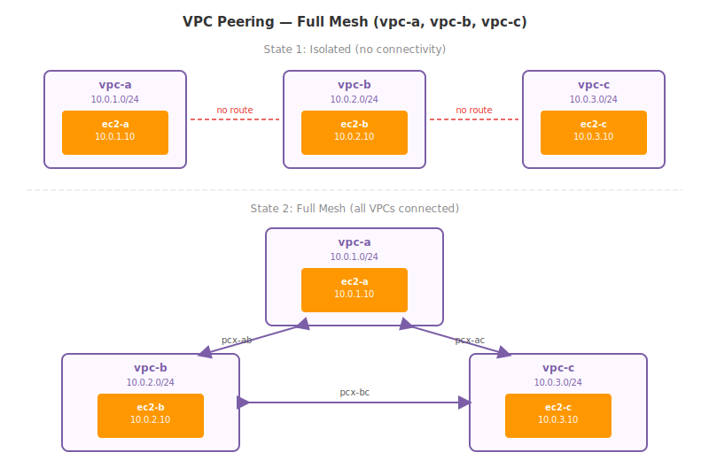
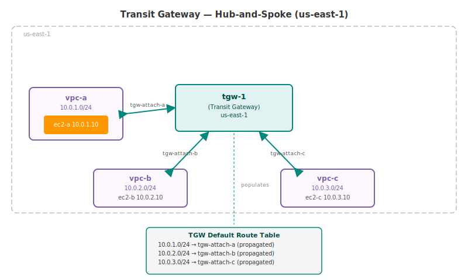
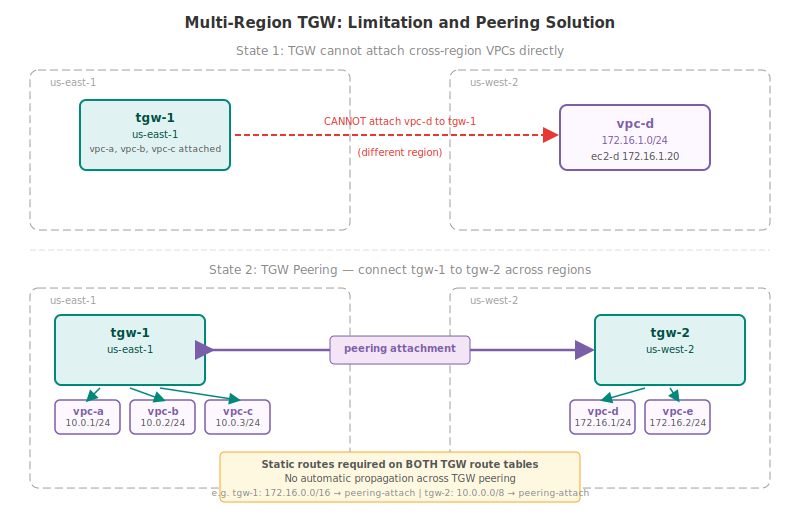

# Part 4: VPC Peering and Transit Gateway

---

## Our Example Architecture (Reference This Throughout)

Three VPCs — all in `us-east-1`, no overlapping CIDRs. This same setup is used for every example in both VPC Peering and Transit Gateway sections.

| VPC | CIDR | Subnet | EC2 Instance | Private IP |
|:----|:-----|:-------|:-------------|:-----------|
| vpc-a | 10.0.1.0/24 | subnet-a | ec2-a | 10.0.1.10 |
| vpc-b | 10.0.2.0/24 | subnet-b | ec2-b | 10.0.2.10 |
| vpc-c | 10.0.3.0/24 | subnet-c | ec2-c | 10.0.3.10 |

Goal: make `ec2-a`, `ec2-b`, and `ec2-c` able to communicate with each other using their private IP addresses.



---

## Table of Contents

**Part A — VPC Peering**

1. [Why VPCs Are Islands by Default](#1-why-vpcs-are-islands-by-default)
2. [What VPC Peering Is](#2-what-vpc-peering-is)
3. [How VPC Peering Works — Under the Hood](#3-how-vpc-peering-works--under-the-hood)
4. [Setting Up Your First Peering — A ↔ B Step by Step](#4-setting-up-your-first-peering--a--b-step-by-step)
5. [Route Tables — The Most Missed Step](#5-route-tables--the-most-missed-step)
6. [Full Mesh — Connecting All Three VPCs](#6-full-mesh--connecting-all-three-vpcs)
7. [The Non-Transitive Rule — VPC Peering's Core Limitation](#7-the-non-transitive-rule--vpc-peerings-core-limitation)
8. [Edge-to-Edge Routing Restrictions](#8-edge-to-edge-routing-restrictions)
9. [VPC Peering Across Regions and Accounts](#9-vpc-peering-across-regions-and-accounts)
10. [VPC Peering Limits and Rules](#10-vpc-peering-limits-and-rules)

**Part B — Transit Gateway**

11. [The Mesh Problem at Scale](#11-the-mesh-problem-at-scale)
12. [What Transit Gateway Is](#12-what-transit-gateway-is)
13. [TGW Core Concepts — Attachments, Route Tables, Associations](#13-tgw-core-concepts--attachments-route-tables-associations)
14. [Setting Up TGW with Three VPCs](#14-setting-up-tgw-with-three-vpcs)
15. [TGW Route Tables — How Traffic Finds Its Way](#15-tgw-route-tables--how-traffic-finds-its-way)
16. [TGW Limits and Rules](#16-tgw-limits-and-rules)

**Part C — Comparison and What's Next**

17. [VPC Peering vs Transit Gateway — Full Comparison](#17-vpc-peering-vs-transit-gateway--full-comparison)
18. [When to Use Which](#18-when-to-use-which)
19. [The Multi-Region Problem — Where TGW Hits Its Limit](#19-the-multi-region-problem--where-tgw-hits-its-limit)
20. [Quick Reference Cheatsheet](#20-quick-reference-cheatsheet)

---

# PART A — VPC PEERING

---

## 1. Why VPCs Are Islands by Default

Each VPC is a completely isolated, self-contained network. Traffic between VPCs does not happen automatically — not even if they are in the same AWS region, the same account, and have non-overlapping CIDRs.

By default:

```
ec2-a (10.0.1.10) tries to reach ec2-b (10.0.2.10):

1. ec2-a sends packet: src 10.0.1.10, dst 10.0.2.10
2. vpc-a's route table:
     10.0.1.0/24 → local   ← 10.0.2.10 does NOT match this
     (no other routes)
3. No matching route → packet is dropped

ec2-b is completely unreachable from ec2-a.
```

This isolation is a security feature by design. You have to explicitly and deliberately create connectivity between VPCs. VPC Peering is one way to do that.

---

## 2. What VPC Peering Is

A **VPC Peering connection** is a direct, private networking link between exactly two VPCs. Once a peering is active and route tables are updated on both sides, instances in either VPC can communicate using private IP addresses as if they were on the same network.

Key properties:
- Not a gateway. Not a VPN. No separate hardware.
- Traffic travels over the **AWS private backbone** — never over the public internet.
- Works for **same account, different accounts, same region, different regions**.
- Bidirectional once active — either side can initiate connections.
- No single point of failure. No bandwidth bottleneck.


```
ec2-a → 10.0.2.10 : routed via pcx-ab → reaches ec2-b ✓
ec2-b → 10.0.1.10 : routed via pcx-ab → reaches ec2-a ✓
```

> **Peering is not the same as merging VPCs.** The two VPCs remain separate. The peering only adds a private path. Each VPC keeps its own route table, security groups, NACLs, and internet gateways. Resources from one VPC cannot automatically use resources from the other VPC (more on this in Section 8).

---

## 3. How VPC Peering Works — Under the Hood

### The request/accept model

VPC Peering follows a two-party model:

```
Step 1 — Requester sends peering request
  Owner of vpc-a creates a peering request targeting vpc-b.
  The peering connection enters state: pending-acceptance

Step 2 — Accepter accepts the request
  Owner of vpc-b accepts the request.
  The peering connection enters state: active

Step 3 — Both sides update route tables
  MANUALLY add routes on both sides (this step is NOT automatic).
  Until this is done, no traffic flows even though the peering is active.
```

### Peering connection lifecycle

| State | Meaning | How long visible |
|:------|:--------|:-----------------|
| initiating-request | Request being sent | Briefly |
| pending-acceptance | Awaiting acceptance by accepter | 7 days — expires if not acted on |
| active | Peering live, traffic can flow | Until deleted |
| rejected | Accepter rejected the request | Requester: 2 days / Accepter: 2h |
| expired | 7-day window passed without acceptance | Both sides: 2 days |
| deleted | Either party deleted the connection | Deleting party: 2h / Other: 2 days |

> **Important:** If routes pointing to a peering connection are added while it is still in `pending-acceptance`, those routes show as **blackhole** status until the peering becomes `active`. Routes do not automatically start working — they wait for the active state.

### What the peering connection actually is

The peering connection (`pcx-xxxxxxxx`) is just an identifier — a logical link between the two VPCs. It does not consume an IP address. It does not have bandwidth limits. It sits between the two VPCs and, once active, allows route table entries to reference it as a target.

---

## 4. Setting Up Your First Peering — A ↔ B Step by Step

### Step 1 — Create the peering request

```
AWS Console → VPC → Peering Connections → Create Peering Connection
```

```
Settings:
──────────────────────────────────────────────────────────────────────
Name:                  pcx-ab
VPC ID (Requester):    vpc-a  (10.0.1.0/24)
Account:               My account
Region:                This region (us-east-1)
VPC ID (Accepter):     vpc-b  (10.0.2.0/24)
──────────────────────────────────────────────────────────────────────
```

After creation, the connection status is `pending-acceptance`.

### Step 2 — Accept the peering connection

```
VPC → Peering Connections → select pcx-ab → Actions → Accept Request
```

Status changes to `active`. The logical link now exists.

### Step 3 — Update route tables (BOTH sides)

The peering is active but no traffic flows yet. You must tell each VPC's route table how to reach the other VPC.

```
vpc-a's subnet-a route table → Edit Routes → Add Route:
  Destination:  10.0.2.0/24
  Target:       pcx-ab

vpc-b's subnet-b route table → Edit Routes → Add Route:
  Destination:  10.0.1.0/24
  Target:       pcx-ab
```

Now the route tables look like this:

```
vpc-a route table (subnet-a):
  Destination       Target          Meaning
  ─────────────     ──────────────  ──────────────────────────────
  10.0.1.0/24       local           Stay within vpc-a
  10.0.2.0/24       pcx-ab          vpc-b traffic goes through peering

vpc-b route table (subnet-b):
  Destination       Target          Meaning
  ─────────────     ──────────────  ──────────────────────────────
  10.0.2.0/24       local           Stay within vpc-b
  10.0.1.0/24       pcx-ab          vpc-a traffic goes through peering
```

Now ec2-a and ec2-b can communicate:

```
ec2-a (10.0.1.10) → 10.0.2.10:
  1. Checks subnet-a route table
  2. 10.0.2.0/24 → pcx-ab  ← matches
  3. Packet goes through peering
  4. Arrives at ec2-b (10.0.2.10)  ✓

ec2-b (10.0.2.10) → 10.0.1.10:
  1. Checks subnet-b route table
  2. 10.0.1.0/24 → pcx-ab  ← matches
  3. Packet goes through peering
  4. Arrives at ec2-a (10.0.1.10)  ✓
```

### Step 4 — Security Groups

Even with peering and route tables set up, a Security Group on ec2-b still controls what traffic it accepts. To allow ec2-a to SSH into ec2-b:

```
ec2-b's Security Group — Inbound rule:
  Type:    SSH
  Port:    22
  Source:  10.0.1.0/24   ← vpc-a's CIDR
  (or reference vpc-a's security group ID directly — same region only)
```

Peering does not bypass Security Groups. Traffic must be explicitly allowed by both routing AND firewall rules.

---

## 5. Route Tables — The Most Missed Step

This is the single most common reason VPC Peering "doesn't work" after setup. The peering status is `active` but instances can't communicate — the route table was not updated.

**The rule:** After accepting a peering, AWS adds the link but touches nothing else. Both sides are entirely responsible for their own route table updates.

```
WHAT HAPPENS IF YOU FORGET THE ROUTE TABLE UPDATE:

ec2-a → 10.0.2.10
  Checks vpc-a route table:
    10.0.1.0/24  →  local   ← doesn't match
    (no other routes)
  Result: no route found → packet dropped

The peering is active. The link exists. But there's no direction to use it.
```

Additional route table rules for peering:

- **You can route to a subset of the peer's CIDR.** If the peer is `10.0.2.0/24`, you can add a route for just `10.0.2.64/26` or even a single IP `10.0.2.10/32`. This lets you selectively expose only certain instances.
- **The local route always takes priority** for your own VPC's CIDR (you cannot accidentally route your own VPC's traffic through a peering).
- **Routes can be added before peering is accepted** — they appear as `blackhole` and activate once the peering becomes `active`.

---

## 6. Full Mesh — Connecting All Three VPCs

To enable all three VPCs to communicate with each other, you need **one peering connection per pair**:

```
Number of connections for full mesh:
  N VPCs: N * (N-1) / 2 connections needed

  2 VPCs:  2 * 1 / 2  =   1 connection
  3 VPCs:  3 * 2 / 2  =   3 connections
  5 VPCs:  5 * 4 / 2  =  10 connections
  10 VPCs: 10 * 9 / 2 =  45 connections
  50 VPCs: 50 * 49/2  = 1225 connections ← this becomes unmanageable
```

For our 3 VPCs, we need 3 peering connections:

```
pcx-ab  →  vpc-a (requester)  ↔  vpc-b (accepter)
pcx-bc  →  vpc-b (requester)  ↔  vpc-c (accepter)
pcx-ac  →  vpc-a (requester)  ↔  vpc-c (accepter)
```

### Architecture after full mesh


### Route tables after full mesh

```
vpc-a route table (subnet-a):
  10.0.1.0/24  →  local
  10.0.2.0/24  →  pcx-ab    ← to reach vpc-b
  10.0.3.0/24  →  pcx-ac    ← to reach vpc-c

vpc-b route table (subnet-b):
  10.0.2.0/24  →  local
  10.0.1.0/24  →  pcx-ab    ← to reach vpc-a
  10.0.3.0/24  →  pcx-bc    ← to reach vpc-c

vpc-c route table (subnet-c):
  10.0.3.0/24  →  local
  10.0.1.0/24  →  pcx-ac    ← to reach vpc-a
  10.0.2.0/24  →  pcx-bc    ← to reach vpc-b
```

### Connectivity matrix after full mesh

| From\To | ec2-a | ec2-b | ec2-c |
|:--------|:------|:------|:------|
| ec2-a | self | ✓ pcx-ab | ✓ pcx-ac |
| ec2-b | ✓ pcx-ab | self | ✓ pcx-bc |
| ec2-c | ✓ pcx-ac | ✓ pcx-bc | self |

Every pair can communicate. But this required:
- **3 peering connections** created and accepted
- **6 route table entries** added (2 per VPC)
- **6 Security Group rules** updated (at minimum)

That is manageable for 3 VPCs. Now imagine doing this for 20 VPCs (190 connections, 38 entries per VPC). This is the problem Section 11 addresses with Transit Gateway.

---

## 7. The Non-Transitive Rule — VPC Peering's Core Limitation

This is the most important concept to understand about VPC Peering.

**VPC Peering is non-transitive.** If A is peered with B, and B is peered with C, **A cannot reach C through B**. The peering connection between A and B does not extend to C. Each peering is strictly a one-to-one, point-to-point link.

### Why this trips people up

```
COMMON MISTAKE — thinking peering is transitive:

"I already peered A↔B and B↔C. Can A now reach C?"

ANSWER: No.

        vpc-a ──pcx-ab──► vpc-b ──pcx-bc──► vpc-c

ec2-a sends a packet to 10.0.3.10 (ec2-c):
  1. Checks vpc-a route table
  2. No route to 10.0.3.0/24 exists (we didn't create pcx-ac)
  3. Packet dropped

Even if you add a route in vpc-a: 10.0.3.0/24 → pcx-ab,
vpc-b will receive the packet but CANNOT forward it to vpc-c
through pcx-bc. VPC Peering does not allow one VPC to act
as a transit point for another VPC.
```

### The rule — visualized

```
WHAT YOU HAVE:                        WHAT YOU DON'T GET:

vpc-a ◄──pcx-ab──► vpc-b             vpc-a     vpc-c
                                        ▲           ▲
vpc-b ◄──pcx-bc──► vpc-c               └────X──────┘
                                       (no path even though
                                        both are peered with vpc-b)

To get vpc-a ↔ vpc-c connectivity,
you MUST create pcx-ac directly.
```

### Why AWS designed it this way

VPC Peering is intentionally non-transitive for security. If transitive routing were allowed, any VPC peered with a hub VPC would implicitly gain access to all other VPCs also peered with that hub. This would be a massive security risk — adding one peering connection would silently expose your VPC to dozens of other networks. Non-transitive design ensures every connectivity decision is explicit and intentional.

---

## 8. Edge-to-Edge Routing Restrictions

Even within an active peering, resources in one VPC **cannot use** the other VPC's edge resources. "Edge resources" are things that connect the VPC to the outside world.

```
Scenario: vpc-a has an Internet Gateway and a NAT Gateway.
          vpc-a and vpc-b are peered.

Can ec2-b (in vpc-b) use vpc-a's IGW to reach the internet?
  → NO. This is called "edge-to-edge routing" and is blocked.

Can ec2-b (in vpc-b) use vpc-a's NAT Gateway to reach the internet?
  → NO. Same restriction.

Can ec2-b use vpc-a's VPN connection to reach the corporate network?
  → NO. Traffic cannot transit through a peered VPC's VPN.

Can ec2-b use vpc-a's S3 Gateway Endpoint to reach S3?
  → NO. Gateway Endpoints are VPC-specific and cannot be used by peers.
```

```
EDGE-TO-EDGE ROUTING — what is blocked:

         vpc-a                        vpc-b
  ┌──────────────────┐          ┌──────────────────┐
  │  IGW (internet)  │◄─────────│  ec2-b           │ ✗
  │  NAT Gateway     │   peering│                  │ ✗
  │  VPN Gateway     │          │  (cannot use any │ ✗
  │  S3 Gateway EP   │          │   of vpc-a's     │ ✗
  │  DX Gateway      │          │   edge resources)│ ✗
  └──────────────────┘          └──────────────────┘
```

Each VPC must have its own internet connectivity, its own NAT Gateway, its own VPN if needed. Peering only provides a direct path for VPC-to-VPC private communication — nothing more.

---

## 9. VPC Peering Across Regions and Accounts

### Cross-account peering

You can peer VPCs that belong to different AWS accounts. The process is the same: the requester sends the request specifying the target account ID and VPC ID, and the accepter (logged into the other account) accepts it.

```
Cross-account peering request:
  VPC ID (Requester):   vpc-a  (your account)
  Account ID (Accepter): 987654321098
  VPC ID (Accepter):    vpc-xyz (the other account's VPC)
```

The accepter must accept within 7 days or the request expires.

### Cross-region (inter-region) peering

VPC Peering also works between VPCs in different AWS regions — for example, `vpc-a` in `us-east-1` peered with `vpc-d` in `us-west-2`.

```
Cross-region peering:

us-east-1                              us-west-2
┌──────────────────┐                ┌──────────────────┐
│  vpc-a           │◄──── pcx-ad ──►│  vpc-d           │
│  10.0.1.0/24     │                │  172.16.1.0/24   │
│  ec2-a: .1.10    │                │  ec2-d: .1.20    │
└──────────────────┘                └──────────────────┘

ec2-a (10.0.1.10) → ec2-d (172.16.1.20): works via pcx-ad
Traffic: stays on AWS private backbone, never touches public internet.
All inter-region peering traffic is encrypted.
```

**What is different for inter-region peering:**

| Feature | Intra-region peering | Inter-region peering |
|:--------|:---------------------|:---------------------|
| MTU | 9001 bytes | 8500 bytes |
| Traffic encryption | No (already private) | Yes (encrypted at AWS) |
| DNS hostname resolution | Automatic (RFC1918) | Must explicitly enable |
| SG cross-reference | Yes | No (must use CIDR) |
| Cost | Free same-AZ; cross-AZ data transfer charges | Standard inter-region data transfer charges |
| Traffic path | AWS regional backbone | AWS global backbone |

> **Inter-region peering also has the non-transitive rule.** A cross-region peering is still point-to-point. It does not help with the mesh problem — if you have 5 VPCs across 3 regions, you still need direct peerings for every pair that needs to communicate.

---

## 10. VPC Peering Limits and Rules

| Limit | Default | Adjustable | Note |
|:------|:--------|:-----------|:-----|
| Active peerings per VPC | 50 | Yes (max 125) | Per VPC, not per account |
| Pending peering requests per VPC | 25 | Yes | Expire in 7 days if not accepted |
| Max peerings between same 2 VPCs | 1 | No | Cannot have duplicate peerings |

**Hard rules (cannot be bypassed):**

- **CIDRs must not overlap** — any IPv4 or IPv6 CIDR overlap between the two VPCs blocks peering. Even if you only plan to use non-overlapping subnets, the VPC CIDR blocks themselves must not clash.
- **Transitive routing is not supported** — ever, under any configuration. This is architectural, not a setting.
- **DNS hostname resolution** to private IPs across the peering must be explicitly enabled (for inter-region, always; for intra-region with public hostname-based DNS, also required).
- **Security Group cross-reference** only works within the same region. Cross-region peering requires IP/CIDR-based SG rules.
- **No multicast support** — VPC Peering does not support multicast traffic.
- **One peering per pair** — you cannot create two peering connections between the same two VPCs simultaneously.

---

# PART B — TRANSIT GATEWAY

---

## 11. The Mesh Problem at Scale

VPC Peering works well for a small number of VPCs. The problem is that the number of connections grows quadratically as you add more VPCs.

**Formula: N\*(N-1)/2**

| VPCs | Connections needed | Route entries per VPC |
|-----:|-------------------:|----------------------:|
| 2 | 1 | 1 |
| 3 | 3 | 2 |
| 5 | 10 | 4 |
| 10 | 45 | 9 |
| 20 | 190 | 19 |
| 50 | 1225 | 49 |
| 100 | 4950 | 99 |

For each new VPC you add to a full mesh:
- Create N-1 new peering connections
- Accept N-1 peering requests
- Update route tables in every existing VPC (add a new route)
- Update Security Groups
- Manage N-1 new connection IDs

At 20 VPCs, one new addition requires 19 new peering connections and 19 new route entries in each of the existing 19 VPCs. This is operationally painful and error-prone.

**Transit Gateway solves this by changing the topology from mesh to hub-and-spoke.**

---

## 12. What Transit Gateway Is

A **Transit Gateway (TGW)** is a regional networking hub. Instead of connecting VPCs directly to each other, all VPCs connect to the Transit Gateway, and the Transit Gateway routes traffic between them.

```
VPC PEERING — Mesh topology:              TRANSIT GATEWAY — Hub-and-spoke:

vpc-a ──── vpc-b                          vpc-a
  │ \   / │                                 │
  │  vpc-d │                                │
  │   |   │                              tgw-1 (hub)
  │  vpc-e │                                │
  │ /   \ │                             /   |   \
vpc-c ──── vpc-f                       vpc-b  vpc-c  vpc-d
                                                 │
                                               vpc-e
```

With a hub-and-spoke model:
- Adding a new VPC means **one new attachment** to the TGW (not N-1 new peerings)
- Route management is **centralized in the TGW route table**
- You manage **one hub** instead of dozens of point-to-point connections

With TGW: linear growth. With peering: quadratic growth.

| VPCs | Peering connections | TGW attachments |
|-----:|--------------------:|----------------:|
| 2 | 1 | 2 |
| 3 | 3 | 3 |
| 5 | 10 | 5 |
| 10 | 45 | 10 |
| 20 | 190 | 20 |
| 50 | 1225 | 50 |
| 100 | 4950 | 100 |

---

## 13. TGW Core Concepts — Attachments, Route Tables, Associations

### Attachments

An **attachment** is how a resource connects to the TGW. Each attachment represents one resource (or connection) plugged into the hub.

```
Attachment types:
─────────────────────────────────────────────────────────────────────
VPC attachment        →  connects a VPC in the same region to the TGW
VPN attachment        →  connects on-premises via Site-to-Site VPN
Direct Connect GW     →  connects on-premises via AWS Direct Connect
TGW Connect           →  connects SD-WAN/network appliances (GRE tunnel)
Peering attachment    →  connects this TGW to another TGW (same or diff region)
─────────────────────────────────────────────────────────────────────
```

For our example, we use **VPC attachments** only.

**For a VPC attachment:**
- You specify one subnet per AZ in the VPC
- TGW places a network interface (uses one IP from that subnet) in each specified subnet
- Once an AZ is enabled, ALL subnets in that AZ can route to the TGW

> **Important:** When you attach a VPC to a TGW and specify a subnet, AWS **consumes one IP address** from that subnet for the TGW's network interface. For our `/24` subnets, this is fine. If you are using very small subnets (like `/28`), account for this extra IP.

### TGW Route Tables

A TGW has its own route tables — completely separate from the VPC route tables. While VPC route tables control where packets go when they leave a VPC, TGW route tables control where packets go when they arrive at the TGW.

```
The two-stage routing for TGW traffic:

STAGE 1 — Inside the source VPC:
  ec2-a sends packet to 10.0.2.10
  vpc-a route table: 10.0.2.0/24 → tgw-1
  Packet exits vpc-a and enters the TGW.

STAGE 2 — Inside the TGW:
  TGW receives packet destined for 10.0.2.10
  TGW route table: 10.0.2.0/24 → tgw-attach-b (attachment for vpc-b)
  TGW forwards packet to vpc-b.

STAGE 3 — Inside vpc-b:
  Packet arrives in vpc-b, routed to ec2-b (10.0.2.10)
```

### Associations and Propagations

Each attachment has a relationship with TGW route tables:

**Association** — which route table does this attachment use to look up where to send traffic?
- Each attachment is associated with **exactly one** TGW route table.
- When a packet arrives from an attachment, the TGW uses the associated route table to decide where to forward it.

**Propagation** — does this attachment automatically add its routes to a route table?
- VPC attachments can propagate their VPC CIDR to a TGW route table automatically.
- This means: when you attach vpc-a (10.0.1.0/24), the TGW learns to send traffic for 10.0.1.0/24 to tgw-attach-a automatically.
- No manual TGW route table editing needed for VPC-to-VPC basic connectivity.

```
DEFAULT BEHAVIOR (simplest setup):

All attachments → associated with default TGW route table
All attachments → propagate to default TGW route table

Result:
  TGW default route table learns:
    10.0.1.0/24 → tgw-attach-a  (from vpc-a propagation)
    10.0.2.0/24 → tgw-attach-b  (from vpc-b propagation)
    10.0.3.0/24 → tgw-attach-c  (from vpc-c propagation)

All three VPCs can reach each other through the TGW automatically.
```

---

## 14. Setting Up TGW with Three VPCs

### Step 1 — Create the Transit Gateway

```
AWS Console → VPC → Transit Gateways → Create Transit Gateway
```

```
Settings:
──────────────────────────────────────────────────────────────
Name:                          tgw-1
Amazon side ASN:               64512        (BGP ASN, keep default)
DNS support:                   Enable
VPN ECMP support:              Enable
Default route table association: Enable     ← new attachments auto-associated
Default route table propagation: Enable     ← new attachments auto-propagate
──────────────────────────────────────────────────────────────
```

With default association and propagation enabled, attaching a VPC automatically adds its CIDR to the TGW's default route table. This is the simplest configuration.

Wait a few minutes for the TGW to become `available`.

### Step 2 — Attach vpc-a to the TGW

```
VPC → Transit Gateways → Transit Gateway Attachments → Create Attachment
```

```
Settings:
──────────────────────────────────────────────────────────────────────────
Transit Gateway ID:  tgw-1
Attachment type:     VPC
Attachment name:     tgw-attach-a
VPC ID:              vpc-a
Subnet IDs:          subnet-a  (10.0.1.0/24 in us-east-1a)
──────────────────────────────────────────────────────────────────────────
```

Wait for the attachment to become `available`. AWS will:
- Place a TGW network interface in subnet-a (consuming one IP)
- Since propagation is enabled: automatically add `10.0.1.0/24 → tgw-attach-a` to the default TGW route table

### Step 3 — Attach vpc-b and vpc-c

Repeat Step 2 for vpc-b and vpc-c:

```
Attachment name:     tgw-attach-b
VPC ID:              vpc-b
Subnet IDs:          subnet-b  (10.0.2.0/24)

Attachment name:     tgw-attach-c
VPC ID:              vpc-c
Subnet IDs:          subnet-c  (10.0.3.0/24)
```

After all three attachments are `available`, the TGW default route table automatically contains:

```
TGW Default Route Table (after all 3 attachments):
────────────────────────────────────────────────────────────
Destination     Target            Type           State
──────────────  ────────────────  ─────────────  ──────
10.0.1.0/24     tgw-attach-a      propagated     active
10.0.2.0/24     tgw-attach-b      propagated     active
10.0.3.0/24     tgw-attach-c      propagated     active
────────────────────────────────────────────────────────────
```

No manual TGW route table editing needed.

### Step 4 — Update each VPC's route table

The TGW now knows how to route between VPCs. But each VPC's own route table still needs to know to send inter-VPC traffic to the TGW.

```
vpc-a route table (subnet-a) → Edit Routes → Add:
  Destination: 10.0.2.0/24   Target: tgw-1
  Destination: 10.0.3.0/24   Target: tgw-1

vpc-b route table (subnet-b) → Edit Routes → Add:
  Destination: 10.0.1.0/24   Target: tgw-1
  Destination: 10.0.3.0/24   Target: tgw-1

vpc-c route table (subnet-c) → Edit Routes → Add:
  Destination: 10.0.1.0/24   Target: tgw-1
  Destination: 10.0.2.0/24   Target: tgw-1
```

> **Tip:** You can simplify this by using a supernet aggregate route. If all your VPCs use `10.0.0.0/8` space, you can add a single route: `10.0.0.0/8 → tgw-1`. All VPC-to-VPC traffic goes to the TGW and the TGW's route table handles the specific forwarding. This reduces the number of VPC route entries as you add more VPCs.

### Step 5 — Verify connectivity

```
From ec2-a → ping 10.0.2.10 (ec2-b)   ✓
From ec2-a → ping 10.0.3.10 (ec2-c)   ✓
From ec2-b → ping 10.0.3.10 (ec2-c)   ✓
```

All three VPCs can now communicate through the TGW.

### Architecture after TGW setup



### Route tables after TGW setup

```
vpc-a route table:            vpc-b route table:            vpc-c route table:
  10.0.1.0/24 → local           10.0.2.0/24 → local           10.0.3.0/24 → local
  10.0.2.0/24 → tgw-1           10.0.1.0/24 → tgw-1           10.0.1.0/24 → tgw-1
  10.0.3.0/24 → tgw-1           10.0.3.0/24 → tgw-1           10.0.2.0/24 → tgw-1

TGW default route table:
  10.0.1.0/24 → tgw-attach-a  (propagated from vpc-a)
  10.0.2.0/24 → tgw-attach-b  (propagated from vpc-b)
  10.0.3.0/24 → tgw-attach-c  (propagated from vpc-c)
```

---

## 15. TGW Route Tables — How Traffic Finds Its Way

### Full packet trace: ec2-a → ec2-c via TGW

```
ec2-a (10.0.1.10) wants to reach ec2-c (10.0.3.10)

Step 1: ec2-a sends packet
  src: 10.0.1.10   dst: 10.0.3.10

Step 2: vpc-a route table lookup
  10.0.3.0/24 → tgw-1
  Packet exits vpc-a → enters TGW via tgw-attach-a

Step 3: TGW receives packet from tgw-attach-a
  TGW looks at the route table associated with tgw-attach-a
  (which is the default TGW route table)
  Destination 10.0.3.10 → matches 10.0.3.0/24 → target: tgw-attach-c

Step 4: TGW forwards packet to tgw-attach-c (vpc-c's attachment)
  Packet enters vpc-c

Step 5: vpc-c route table lookup
  10.0.3.0/24 → local
  Packet delivered to ec2-c (10.0.3.10) ✓

Step 6: ec2-c responds: src 10.0.3.10  dst 10.0.1.10
  vpc-c route table: 10.0.1.0/24 → tgw-1
  Packet enters TGW via tgw-attach-c
  TGW route table: 10.0.1.0/24 → tgw-attach-a
  Packet enters vpc-a
  Delivered to ec2-a (10.0.1.10) ✓
```

Notice: ec2-a reached ec2-c **without any direct peering between vpc-a and vpc-c**. The TGW acts as the transit point. This is the key capability that VPC Peering cannot provide — TGW routing IS transitive within the TGW.

### Static routes in TGW route tables

Propagated routes are automatic, but sometimes you need manual control. Static routes in the TGW route table let you:

- Override a propagated route with a more specific static route
- Send traffic to an attachment that doesn't propagate its own routes (like a peering attachment — more on this in Part 5)
- Create **blackhole routes** to explicitly drop traffic to specific CIDRs

```
TGW route table — add a blackhole route:
  Destination: 10.0.4.0/24   Target: blackhole
  Meaning: any traffic destined for 10.0.4.0/24 is dropped at the TGW level

TGW route table — add a static route:
  Destination: 10.0.5.0/24   Target: tgw-attach-x   (static)
  Static routes take priority over propagated routes for the same prefix.
```

### Isolation using multiple TGW route tables

The default setup (one route table, everyone can talk to everyone) is called **centralized routing**. For more advanced setups, you can create multiple TGW route tables to isolate VPCs:

```
EXAMPLE: Development and Production isolation

TGW route table: prod-rt
  Associated with:  tgw-attach-vpc-prod-1, tgw-attach-vpc-prod-2
  Routes:           10.0.1.0/24 → tgw-attach-vpc-prod-1
                    10.0.2.0/24 → tgw-attach-vpc-prod-2
  (no routes to dev VPCs)

TGW route table: dev-rt
  Associated with:  tgw-attach-vpc-dev-1, tgw-attach-vpc-dev-2
  Routes:           10.0.10.0/24 → tgw-attach-vpc-dev-1
                    10.0.11.0/24 → tgw-attach-vpc-dev-2
  (no routes to prod VPCs)

Result: prod VPCs cannot reach dev VPCs and vice versa,
        even though all are attached to the same TGW.
```

This kind of isolation is extremely difficult with VPC Peering (you would simply not create peering connections between prod and dev), but TGW makes it explicit and centrally manageable.

---

## 16. TGW Limits and Rules

| Limit | Default | Adjustable |
|:------|:--------|:-----------|
| Transit Gateways per account/region | 5 | Yes |
| Attachments per TGW | 5,000 | Yes |
| TGW route tables per TGW | 20 | Yes |
| Total routes across all route tables | 10,000 | Contact AWS |
| Peering attachments per TGW | 50 | Yes |
| TGW VPC attachments per VPC | 5 | No (hard limit) |
| Pending peering attachments per TGW | 10 | Yes |

**Bandwidth:**

```
VPC attachment per AZ:    up to 100 Gbps ingress + 100 Gbps egress
VPN attachment:           up to 1.25 Gbps per tunnel (ECMP for more)
TGW Connect peer:         up to 5 Gbps (use ECMP across 4 peers for 20 Gbps)
Peering attachment per AZ: up to 100 Gbps
```

**MTU:**

```
VPC-to-VPC via TGW:       8500 bytes (not 9001 — note: lower than intra-region VPC peering)
VPN via TGW:              1500 bytes
TGW Peering:              8500 bytes
```

> **MTU gotcha when migrating from VPC Peering to TGW:** Intra-region VPC Peering supports 9001-byte MTU (jumbo frames). Transit Gateway supports only 8500 bytes. If your applications are sending packets larger than 8500 bytes, migrating from peering to TGW without updating EC2 instance MTU settings will cause packet drops.

**Important behavioral rules:**

- **A TGW is regional** — it only attaches to VPCs in the same region. Cross-region requires TGW Peering (Part 5).
- **One attachment per VPC per TGW** — you cannot attach the same VPC to the same TGW twice.
- **Peering attachments have no route propagation** — you must use static routes. This is why TGW Peering (cross-region TGW connectivity) requires manual route management.
- **TGW is not transitive across peering attachments by default** — if TGW-1 is peered with TGW-2, a VPC attached to TGW-1 can reach a VPC attached to TGW-2, but cannot reach resources attached to TGW-3 (which is peered with TGW-2) without explicit static routes.

---

# PART C — COMPARISON AND WHAT'S NEXT

---

## 17. VPC Peering vs Transit Gateway — Full Comparison

| Dimension | VPC Peering | Transit Gateway |
|:----------|:------------|:----------------|
| Architecture | Point-to-point mesh | Hub-and-spoke |
| Connection type | Direct link between two VPCs | VPCs connect to a central TGW hub |
| Transitive routing | NOT supported (never, by design) | YES — TGW routes between all attachments |
| Scaling (N VPCs) | N*(N-1)/2 connections | N attachments (linear) |
| Same region | Yes | Yes |
| Cross-region | Yes (direct inter-region peering) | Requires TGW Peering (Part 5) |
| Cross-account | Yes | Yes (via AWS Resource Access Manager) |
| CIDR overlap | Not allowed between peered VPCs | Not allowed per attachment, but<br>overlapping VPCs can be isolated<br>via separate TGW route tables |
| Bandwidth limit | No stated limit | Up to 100 Gbps/AZ per VPC attachment |
| MTU (intra-region) | 9001 bytes | 8500 bytes |
| MTU (inter-region) | 8500 bytes | 8500 bytes |
| Latency | Lowest (direct path, no extra hop) | Slightly higher (one extra hop through TGW) |
| Route management | Manual on both VPC route tables | TGW route tables; VPC propagation automatic |
| Security group ref. | Yes (same region only) | N/A (not applicable) |
| Edge-to-edge routing | Not supported<br>(cannot use peer's IGW, NAT, etc.) | Not supported via TGW attachment<br>(VPCs still need own IGW/NAT) |
| Centralized routing | No | Yes (shared services VPC, central firewall) |
| Network isolation | Achieved by not creating peerings | Achieved via separate TGW route tables |
| Multicast | Not supported | Supported |
| Cost | Free to create<br>Data transfer charges apply | Per attachment-hour + per GB processed<br>Data transfer charges apply |
| Setup complexity | Simple for 2–3 VPCs; painful at scale (many peerings to manage) | Simple at any scale; initial TGW setup required but then linear from there |
| Operational overhead | High at scale (dozens of connections to manage) | Low at scale (one TGW, central config) |
| On-premises integration | Cannot route through a VPC's VPN to reach on-premises | Native VPN and Direct Connect attachments; all VPCs via one TGW reach on-premises |
| Single point of failure | No (peer connection is redundant) | No (TGW is regional, highly available) |

### The cost trade-off — a clear example

**3 VPCs with VPC Peering:**

```
Cost:
  Peering connections: 3 (pcx-ab, pcx-bc, pcx-ac) — free to create
  Data transfer:       standard VPC-to-VPC data transfer rates

Total fixed cost: $0/month for the connections themselves
```

**3 VPCs with Transit Gateway:**

```
Cost:
  TGW itself: free to run
  Attachments: 3 VPC attachments × hourly rate × 730 hours/month
  Data processing: per GB through TGW

Total fixed cost: 3 × attachment cost per month (even with zero traffic)
```

**At 3 VPCs, VPC Peering is cheaper** (no attachment hourly cost). The TGW attachment cost is only justified when the operational complexity savings outweigh the hourly cost. This break-even point is typically around 5–10 VPCs depending on your region's pricing and traffic volume.

---

## 18. When to Use Which

| Use VPC Peering when | Use Transit Gateway when |
|:---------------------|:------------------------|
| You have 2–4 VPCs to connect | You have 5+ VPCs and the number may grow |
| You want the lowest possible cost | You want centralized routing and operations |
| You need the lowest possible latency | You need a hub for VPN / Direct Connect too |
| You need inter-region connectivity without building TGW peering | You need VPC isolation/segmentation control |
| You want simple architecture | You need multicast |
| You don't need on-premises integration through the same hub | You want shared services accessible from all VPCs |
| | You are building a network for a large org |
| | You need centralized network inspection/firewall |

**The "shared services VPC" pattern** is where TGW really shines:

```
WITH VPC PEERING (shared services):
  Every application VPC needs a direct peering with the shared services VPC.
  Adding a new app VPC = create a peering + update routes.

WITH TGW (shared services):
  Shared services VPC is attached to TGW like any other VPC.
  All app VPCs reach it through the TGW automatically.
  Adding a new app VPC = attach to TGW, done.
```

---

## 19. The Multi-Region Problem — Where TGW Hits Its Limit

This is the exact problem that Part 5 solves. It is important to understand clearly.

### VPC Peering's multi-region ability

VPC Peering supports inter-region connections natively. You can directly create a peering between `vpc-a` in `us-east-1` and `vpc-d` in `us-west-2`. Simple and direct.

```
VPC PEERING — cross-region works directly:

us-east-1             us-west-2
┌─────────┐           ┌─────────┐
│  vpc-a  │◄─pcx-ad──►│  vpc-d  │   ← works fine, direct peering
└─────────┘           └─────────┘
```

The limitation is that this is still point-to-point — if you have 10 VPCs across 3 regions, you need peerings for every pair that needs to communicate. The mesh problem remains.

### Transit Gateway's multi-region limitation

A Transit Gateway is a **regional resource**. You cannot attach a VPC from a different region to it.



If you try to attach `vpc-d` (us-west-2) to `tgw-1` (us-east-1), AWS will reject it. A TGW only accepts attachments from its own region.

### The solution: Transit Gateway Peering

To connect VPCs across regions using Transit Gateway, you need a TGW in each region, and then a **TGW Peering attachment** between the two TGWs.

```
ec2-a → ec2-d:
  vpc-a → tgw-1 → peering attachment → tgw-2 → vpc-d → ec2-d

BUT: requires static routes on BOTH tgw route tables
     (no route propagation across TGW peering — manual only)
```

**The key difference with TGW Peering vs regular TGW attachments:**

| Feature | Regular VPC attachment | TGW Peering attachment |
|:--------|:----------------------|:----------------------|
| Route propagation | Automatic (propagates VPC CIDR to TGW route table) | Not supported — ALL routes must be added MANUALLY |
| Route type | Propagated (dynamic) | Static only |
| Setup effort | Low (attach VPC, done) | Higher (add static routes for each CIDR) |

This is exactly why Part 5 dedicates full coverage to TGW Peering, static routes in TGW route tables, and the lab exercise connecting three VPCs across three regions.

### The complete picture

| Scenario | Recommended approach |
|:---------|:--------------------|
| 2 VPCs, different regions | VPC Peering (inter-region) — simpler, no TGW cost |
| Many VPCs, same region | Transit Gateway — hub-and-spoke, scales well |
| Many VPCs, different regions (e.g., 5 in us-east-1, 5 in us-west-2) | TGW in each region + TGW Peering between TGWs (Part 5 covers this in depth) |
| On-premises + multi-region | TGW with Direct Connect / VPN + TGW Peering |
| Mixed: some direct, some hub | VPC Peering for small clusters, TGW for hub |

---

## 20. Quick Reference Cheatsheet

### Setup checklist — VPC Peering

```
□ VPC CIDRs do not overlap (mandatory, hard requirement)
□ Create peering connection (specify requester VPC and accepter VPC)
□ Accept the peering request (must be done; auto-expires in 7 days)
□ Update route table in requester VPC: peer CIDR → pcx-xxxx
□ Update route table in accepter VPC:  peer CIDR → pcx-xxxx
□ Update Security Groups to allow traffic from peer CIDR (or peer SG ID same-region)
□ Repeat above steps for every VPC pair that needs connectivity
```

### Setup checklist — Transit Gateway

```
□ Create Transit Gateway (enable default route table association + propagation)
□ For each VPC:
  □ Create VPC attachment (specify VPC and at least one subnet per AZ)
  □ Wait for attachment to become "available"
  □ Verify VPC CIDR propagated to TGW default route table
  □ Update VPC's route table: other VPCs' CIDRs → tgw-id
  □ Update Security Groups to allow traffic from other VPCs' CIDRs
□ For cross-region: see Part 5 (TGW Peering + static routes)
```

### Scaling comparison

| VPCs | VPC Peering connections | TGW attachments |
|-----:|------------------------:|----------------:|
| 3 | 3 | 3 |
| 5 | 10 | 5 |
| 10 | 45 | 10 |
| 20 | 190 | 20 |

### Route table patterns

```
VPC PEERING route table (per VPC, for 3-VPC full mesh):
  10.0.1.0/24 → local
  10.0.2.0/24 → pcx-ab    ← specific peering connection to each peer
  10.0.3.0/24 → pcx-ac    ← separate peering per peer

TRANSIT GATEWAY route table (per VPC):
  10.0.1.0/24 → local
  10.0.2.0/24 → tgw-1     ← SAME target for all other VPCs
  10.0.3.0/24 → tgw-1     ← TGW handles the rest internally

  (or even simpler aggregate):
  10.0.1.0/24 → local
  10.0.0.0/8  → tgw-1     ← one route handles ALL VPCs

TGW internal route table (auto-populated via propagation):
  10.0.1.0/24 → tgw-attach-a
  10.0.2.0/24 → tgw-attach-b
  10.0.3.0/24 → tgw-attach-c
```

### Key rules to remember

```
VPC Peering rules:
  ✗ CIDRs must not overlap
  ✗ Non-transitive — A↔B + B↔C ≠ A↔C
  ✗ Cannot use peer's IGW, NAT GW, VPN, S3 endpoint
  ✗ Security Group cross-reference: same region only
  ✓ Cross-region: yes (direct inter-region peering)
  ✓ No bandwidth limit

Transit Gateway rules:
  ✓ Transitive routing supported (within the TGW)
  ✓ Scales linearly
  ✓ VPC propagation: automatic for VPC attachments
  ✗ Regional — cannot attach cross-region VPCs
  ✗ Cross-region: TGW Peering required (static routes only)
  ✗ Costs per attachment-hour + per GB
  ✗ MTU 8500 bytes (vs 9001 for intra-region VPC peering)
```

---

*End of Part 4 — VPC Peering and Transit Gateway*

*Next: Part 5 — Transit Gateway Peering, Cross-Region Architecture, and the Lab*
