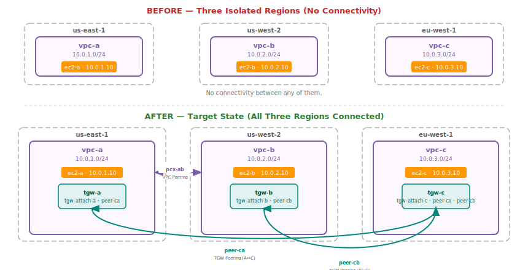
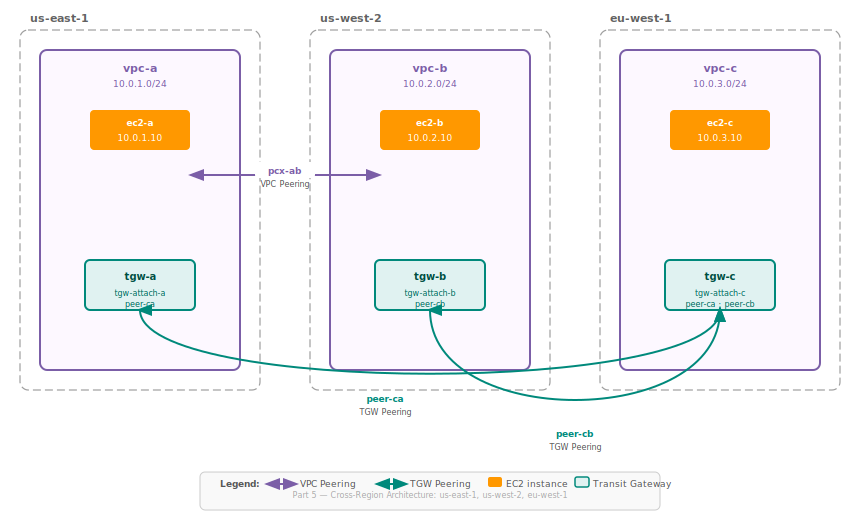

# Part 5: Transit Gateway Peering, Attachments, and Static Routes — Cross-Region Lab

---

## Our Lab Architecture (Reference This Throughout)

Three VPCs across three different AWS regions. The same naming convention as Part 4 — simple, consistent.

| VPC | Region | CIDR | Subnet | EC2 Instance | Private IP |
|:----|:-------|:-----|:-------|:-------------|:-----------|
| vpc-a | us-east-1 | 10.0.1.0/24 | subnet-a | ec2-a | 10.0.1.10 |
| vpc-b | us-west-2 | 10.0.2.0/24 | subnet-b | ec2-b | 10.0.2.10 |
| vpc-c | eu-west-1 | 10.0.3.0/24 | subnet-c | ec2-c | 10.0.3.10 |

The three links we will build:

| Link | Tool | Between | Direction |
|:-----|:-----|:--------|:----------|
| pcx-ab | VPC Peering | vpc-a ↔ vpc-b | Inter-region, direct (us-east-1↔us-west-2) |
| peer-ca | TGW Peering | tgw-a ↔ tgw-c | Inter-region (us-east-1↔eu-west-1) |
| peer-cb | TGW Peering | tgw-b ↔ tgw-c | Inter-region (us-west-2↔eu-west-1) |

Transit Gateways (one per region, each attached to its region's VPC):

| TGW name | Region | Attached VPC | Attachment ID |
|:---------|:-------|:-------------|:--------------|
| tgw-a | us-east-1 | vpc-a | tgw-attach-a |
| tgw-b | us-west-2 | vpc-b | tgw-attach-b |
| tgw-c | eu-west-1 | vpc-c | tgw-attach-c |

Final connectivity matrix:

```
           ec2-a         ec2-b         ec2-c
ec2-a        —           pcx-ab       peer-ca (via tgw-a ↔ tgw-c)
ec2-b      pcx-ab          —          peer-cb (via tgw-b ↔ tgw-c)
ec2-c    peer-ca         peer-cb          —
```

---

## Table of Contents

**Part A — TGW Peering Concepts**

1. [What TGW Peering Is](#1-what-tgw-peering-is)
2. [TGW Peering vs VPC Peering — Not the Same Thing](#2-tgw-peering-vs-vpc-peering--not-the-same-thing)
3. [TGW Attachment Types — The Full Picture](#3-tgw-attachment-types--the-full-picture)
4. [Why Peering Attachments Need Static Routes](#4-why-peering-attachments-need-static-routes)
5. [The No-Propagation Rule — Deep Dive](#5-the-no-propagation-rule--deep-dive)

**Part B — The Lab: Building the Architecture**

6. [Lab Design — Choosing the Right Tool for Each Link](#6-lab-design--choosing-the-right-tool-for-each-link)
7. [Lab Step 1: VPC and EC2 Setup (All 3 Regions)](#7-lab-step-1-vpc-and-ec2-setup-all-3-regions)
8. [Lab Step 2: VPC Peering — vpc-a ↔ vpc-b](#8-lab-step-2-vpc-peering--vpc-a--vpc-b)
9. [Lab Step 3: Create Transit Gateways (One Per Region)](#9-lab-step-3-create-transit-gateways-one-per-region)
10. [Lab Step 4: Attach VPCs to Their Regional TGWs](#10-lab-step-4-attach-vpcs-to-their-regional-tgws)
11. [Lab Step 5: Create TGW Peering Attachments](#11-lab-step-5-create-tgw-peering-attachments)
12. [Lab Step 6: Add Static Routes to TGW Route Tables](#12-lab-step-6-add-static-routes-to-tgw-route-tables)
13. [Lab Step 7: Update VPC Route Tables](#13-lab-step-7-update-vpc-route-tables)
14. [Lab Step 8: Security Group Rules](#14-lab-step-8-security-group-rules)

**Part C — Verification and Reference**

15. [Packet Walk — ec2-a → ec2-c](#15-packet-walk--ec2-a--ec2-c)
16. [Packet Walk — ec2-b → ec2-c](#16-packet-walk--ec2-b--ec2-c)
17. [Packet Walk — ec2-a → ec2-b](#17-packet-walk--ec2-a--ec2-b)
18. [Testing Connectivity — Ping Tests](#18-testing-connectivity--ping-tests)
19. [Full Architecture Consolidated](#19-full-architecture-consolidated)
20. [TGW Peering Limits and Operational Notes](#20-tgw-peering-limits-and-operational-notes)
21. [Quick Reference Cheatsheet](#21-quick-reference-cheatsheet)

---

# PART A — TGW PEERING CONCEPTS

---

## 1. What TGW Peering Is

From Part 4, you know that a Transit Gateway is a regional hub. Every VPC it serves must be in the same region. If you have VPCs in multiple regions and want them all connected, you cannot attach them all to one TGW. You need one TGW per region, and then you need a way to connect those TGWs to each other.

That connection between two Transit Gateways is called a **TGW Peering attachment**.

A TGW Peering attachment is a special type of TGW attachment. Instead of connecting a VPC to a TGW, it connects one TGW to another TGW. Once established, traffic can flow from any VPC attached to TGW-1, across the peering attachment, and into any VPC attached to TGW-2 — subject to route tables and security groups.

```
WITHOUT TGW Peering — VPCs in different regions are unreachable via TGW:

us-east-1                         eu-west-1
┌──────────────────────┐          ┌──────────────────────┐
│  tgw-a               │          │  tgw-c               │
│  └─ vpc-a (attached) │          │  └─ vpc-c (attached) │
└──────────────────────┘          └──────────────────────┘

ec2-a → 10.0.3.10 : no route across regions, dropped


WITH TGW Peering — TGWs are linked, traffic flows:

us-east-1                         eu-west-1
┌──────────────────────┐          ┌──────────────────────┐
│  tgw-a               │◄─peer-ca►│  tgw-c               │
│  └─ vpc-a (attached) │          │  └─ vpc-c (attached) │
└──────────────────────┘          └──────────────────────┘

ec2-a → 10.0.3.10 : vpc-a → tgw-a → peer-ca → tgw-c → vpc-c → ec2-c
```

### Key properties of a TGW Peering attachment

| Property | Behavior |
|:---------|:---------|
| Attachment type | Peering (distinct from VPC, VPN, DX GW) |
| Scope | Inter-region only (same-region TGWs do not need peering) |
| Route propagation | NOT supported — static routes only (critical difference) |
| Request/accept model | Requester initiates, accepter accepts (same as VPC peering) |
| Network path | AWS private backbone — not the public internet |
| Encryption | Yes — traffic is encrypted in transit over the backbone |
| Bandwidth | Up to 100 Gbps per AZ |
| MTU | 8500 bytes |
| Initiator | Either TGW can be the requester |
| Cross-account | Supported (the accepter account manually accepts the request) |

---

## 2. TGW Peering vs VPC Peering — Not the Same Thing

The naming is confusing. "VPC Peering" and "TGW Peering" both use the word "peering" but they operate at completely different levels. This confusion causes mistakes in interviews and in real implementations.

| Dimension | VPC Peering | TGW Peering |
|:----------|:------------|:------------|
| What connects | Two VPCs (directly) | Two Transit Gateways |
| Scope of connectivity | Exactly the two peered VPCs | All VPCs on TGW-1 can reach all VPCs on TGW-2 (with routes) |
| Where routes live | VPC route tables | TGW route tables (static only) |
| Route propagation | Always manual | Always manual (no auto-propagation) |
| Regional restriction | None (can be intra or inter-region) | Only used cross-region — intra-region TGWs don't need peering |
| Scale benefit | Point-to-point, no scaling benefit beyond 2 VPCs | One peering = all VPCs on both TGWs can potentially communicate |
| Transitive routing | Never supported | Not transitive across peering attachments by default (explained below) |
| Cost | No creation cost | Part of TGW attachment pricing |

### Why TGW Peering is NOT transitive

Suppose tgw-a is peered with tgw-b, and tgw-b is peered with tgw-c. VPCs on tgw-a **cannot** automatically reach VPCs on tgw-c through tgw-b. There is no automatic transit through a peered TGW.

```
tgw-a ←── peer-ab ──► tgw-b ←── peer-bc ──► tgw-c

VPCs on tgw-a CAN reach VPCs on tgw-b.
VPCs on tgw-b CAN reach VPCs on tgw-c.
VPCs on tgw-a CANNOT reach VPCs on tgw-c through tgw-b — NOT transitive.
```

To allow tgw-a VPCs to reach tgw-c VPCs, you would need a direct peering between tgw-a and tgw-c (plus the corresponding static routes).

This rule exists by design. AWS prevents using another TGW as a transit hop without explicit configuration, for the same reason VPC Peering is non-transitive — to give you full control over traffic paths and prevent unexpected routing through intermediate networks.

---

## 3. TGW Attachment Types — The Full Picture

Part 4 introduced TGW attachments but focused on VPC attachments. Here is the complete picture of all attachment types, which matters when reasoning about what routes appear in a TGW route table and which ones propagate automatically.

| Attachment Type | What It Connects | Route Propagation |
|:----------------|:-----------------|:------------------|
| VPC | A VPC in the same region | YES — VPC's CIDR auto-propagates to associated TGW route tables |
| VPN | A Site-to-Site VPN connection (to on-premises network) | YES — routes learned via BGP propagate automatically (if BGP; static VPN = manual) |
| Direct Connect GW | A Direct Connect Gateway | YES — routes from DX Gateway propagate via BGP |
| Connect | SD-WAN or third-party network appliances | YES — routes learned via GRE/BGP propagate |
| Peering | Another Transit Gateway in a different region | NO — routes NEVER propagate automatically. Must always be static |

The pattern is clear: anything that can announce its own routes via BGP or has a well-known single CIDR (VPC) supports propagation. A peering attachment connects to another full routing domain — AWS cannot know what CIDRs the remote TGW handles, so propagation is not possible.

### How propagation works for a VPC attachment (review)

When you create a VPC attachment and associate it with a TGW route table, the VPC's primary CIDR block gets added as a propagated route automatically. You can also enable propagation manually per route table if you want a VPC's CIDR to appear in multiple TGW route tables (for segmentation designs).

```
Creating vpc-a attachment (10.0.1.0/24) → tgw-a:

Before attachment:
  tgw-a route table: (empty)

After attachment + association + propagation enabled:
  tgw-a route table:
    10.0.1.0/24 → tgw-attach-a    ← appeared automatically
```

No such automation exists for peering attachments. Every route through a peering attachment must be added by you, manually.

---

## 4. Why Peering Attachments Need Static Routes

This is the most operationally important thing to understand about TGW Peering. The no-propagation rule is not a limitation you can work around — it is fundamental to how peering attachments work.

Here is the exact problem:

When you create a VPC attachment, TGW can query AWS and determine: "this attachment belongs to vpc-a, which has CIDR 10.0.1.0/24." It knows exactly what to propagate.

When you create a peering attachment, TGW connects to another TGW. That remote TGW might have:
- 1 VPC attached: 10.0.3.0/24
- 5 VPCs attached: 10.0.3.0/24, 172.16.0.0/16, 192.168.0.0/16, 10.1.0.0/16, 10.2.0.0/16
- VPCs that you should NOT be allowed to reach (network segmentation)
- Other peering attachments of its own, going further out

AWS cannot make any assumption about what CIDRs are reachable via the remote TGW. More importantly, AWS should not decide this for you — it would violate network segmentation policies. So the responsibility is entirely yours.

```
After creating peer-ca (tgw-a ↔ tgw-c):

tgw-a route table: (peer-ca is listed as an attachment, but no routes point to it)
  10.0.1.0/24 → tgw-attach-a    ← from vpc-a propagation (automatic)
  [no route for 10.0.3.0/24 — you must add this manually]

tgw-c route table: (peer-ca is listed as an attachment, but no routes point to it)
  10.0.3.0/24 → tgw-attach-c    ← from vpc-c propagation (automatic)
  [no route for 10.0.1.0/24 — you must add this manually]
```

After you add the static routes:

```
tgw-a route table:
  10.0.1.0/24 → tgw-attach-a    ← propagated (automatic)
  10.0.3.0/24 → peer-ca          ← static (you added this)

tgw-c route table:
  10.0.3.0/24 → tgw-attach-c    ← propagated (automatic)
  10.0.1.0/24 → peer-ca          ← static (you added this)
```

Static routes in a TGW route table always point to a specific attachment ID as the next hop. For peering attachments, the next hop is the peering attachment ID (peer-ca, peer-cb, etc.).

---

## 5. The No-Propagation Rule — Deep Dive

When Part 4 introduced TGW propagation, it described the concept briefly. Now that TGW Peering is in the picture, it is worth going deeper on how the propagation system works overall — because understanding it fully is what lets you build correct route tables.

### How a TGW route table is built

A TGW route table is built from two sources:

```
Source 1 — Propagated routes:
  Origin: attachments with propagation enabled (VPC, VPN, DX GW, Connect)
  Managed by: AWS, automatically
  Appears as: "propagated" route type in the TGW route table
  Example: 10.0.1.0/24 → tgw-attach-a  (type: propagated)

Source 2 — Static routes:
  Origin: you, manually added
  Managed by: you
  Appears as: "static" route type in the TGW route table
  Example: 10.0.3.0/24 → peer-ca  (type: static)
```

Both types coexist in the same TGW route table. The TGW uses longest prefix match to select the right route, just like VPC route tables.

### Propagation is per-route-table

Each TGW can have multiple route tables. Each VPC attachment can be associated with one route table (the route table it uses for lookup) and can propagate its routes into one or more route tables.

For this lab, we are keeping it simple: one route table per TGW, all attachments associated with and propagating into that single route table.

### The static route requirement — both ends

A static route for a peering attachment must be added on BOTH sides. This is symmetric, and missing one side means traffic works in only one direction.

```
After creating peer-ca (tgw-a ↔ tgw-c):

Step you must take on tgw-a side:
  Add static: 10.0.3.0/24 → peer-ca
  Meaning: "traffic destined for vpc-c should go out via the peering attachment to tgw-c"

Step you must take on tgw-c side:
  Add static: 10.0.1.0/24 → peer-ca
  Meaning: "traffic destined for vpc-a should go out via the peering attachment to tgw-a"

If you only add the route on tgw-a:
  ec2-a → ec2-c: packet reaches tgw-c, but tgw-c has no route for 10.0.1.0/24,
                 so the return traffic drops — ec2-a gets no response
```

Asymmetric routing is the most common mistake when setting up TGW Peering. Always add routes on both ends.

---

# PART B — THE LAB: BUILDING THE ARCHITECTURE

---

## 6. Lab Design — Choosing the Right Tool for Each Link

Before building anything, it is worth understanding why this specific hybrid architecture uses both VPC Peering and TGW Peering. The choice is intentional.

### Why vpc-a ↔ vpc-b uses VPC Peering

Region-A (us-east-1) and Region-B (us-west-2) each have one VPC and nothing else to connect. For two VPCs with no scaling requirement, VPC Peering is simpler and cheaper — no TGW attachment-hour cost, direct link, lowest latency. No reason to involve a TGW.

### Why vpc-c uses TGW Peering for both links

Region-C (eu-west-1) needs to reach BOTH vpc-a and vpc-b. If we used VPC Peering, we would need two separate peering connections from vpc-c: one to vpc-a and one to vpc-b. That works, but then Region-A and Region-B each need a TGW to connect to any future VPCs in their region, so we set up TGWs now and use them for the C-to-A and C-to-B paths.

More importantly, the goal of this lab is to learn TGW Peering. The architecture is intentionally hybrid to exercise both patterns.

### What this architecture looks like before and after



---

## 7. Lab Step 1: VPC and EC2 Setup (All 3 Regions)

Each region needs a VPC, a subnet, and an EC2 instance. This is foundation work — the same process you did in Part 2.

**Region-A (us-east-1):**

| Resource | Name/Value |
|:---------|:-----------|
| VPC | vpc-a, CIDR: 10.0.1.0/24 |
| Subnet | subnet-a, CIDR: 10.0.1.0/24, AZ: us-east-1a |
| Route Table | public-rt-a (associated with subnet-a) |
| Internet Gateway | igw-a (attached to vpc-a) |
| EC2 Instance | ec2-a, subnet-a, private IP: 10.0.1.10 |
| Security Group | sg-a (allow ICMP from 10.0.0.0/8 — we'll configure this in Step 8) |

**Region-B (us-west-2):**

| Resource | Name/Value |
|:---------|:-----------|
| VPC | vpc-b, CIDR: 10.0.2.0/24 |
| Subnet | subnet-b, CIDR: 10.0.2.0/24, AZ: us-west-2a |
| Route Table | public-rt-b (associated with subnet-b) |
| Internet Gateway | igw-b (attached to vpc-b) |
| EC2 Instance | ec2-b, subnet-b, private IP: 10.0.2.10 |
| Security Group | sg-b (allow ICMP from 10.0.0.0/8) |

**Region-C (eu-west-1):**

| Resource | Name/Value |
|:---------|:-----------|
| VPC | vpc-c, CIDR: 10.0.3.0/24 |
| Subnet | subnet-c, CIDR: 10.0.3.0/24, AZ: eu-west-1a |
| Route Table | public-rt-c (associated with subnet-c) |
| Internet Gateway | igw-c (attached to vpc-c) |
| EC2 Instance | ec2-c, subnet-c, private IP: 10.0.3.10 |
| Security Group | sg-c (allow ICMP from 10.0.0.0/8) |

> **Important:** VPC CIDRs must not overlap across any VPC that will communicate with another. 10.0.1.0/24, 10.0.2.0/24, and 10.0.3.0/24 are all non-overlapping — this is a hard requirement for both VPC Peering and TGW attachments.

At the end of this step, the initial route tables look like this (just local and internet gateway entries):

```
public-rt-a:           public-rt-b:           public-rt-c:
  10.0.1.0/24 → local    10.0.2.0/24 → local    10.0.3.0/24 → local
  0.0.0.0/0   → igw-a    0.0.0.0/0   → igw-b    0.0.0.0/0   → igw-c
```

---

## 8. Lab Step 2: VPC Peering — vpc-a ↔ vpc-b

This establishes direct private connectivity between Region-A and Region-B. Review Part 4 Section 4 for the full walkthrough — this is a recap with the exact values for this lab.

### Create the peering connection

VPC Peering is a cross-region peering. The requester is vpc-a (us-east-1) and the accepter is vpc-b (us-west-2).

Console path: VPC → Peering Connections → Create Peering Connection

| Field | Value |
|:------|:------|
| Peering connection name | pcx-ab |
| VPC ID (Requester) | vpc-a (in us-east-1) |
| Account | My account |
| Region | Another Region → us-west-2 |
| VPC ID (Accepter) | vpc-b |

After creating, switch to us-west-2 and accept the request.

```
Peering state progression:
  initiating-request → pending-acceptance → provisioning → active
```

### Update VPC route tables for VPC Peering

At this point, the peering connection (pcx-ab) exists but no traffic flows — both VPCs need routes pointing to it.

```
public-rt-a (in vpc-a, us-east-1):
  ADD: destination 10.0.2.0/24 → target pcx-ab
  Meaning: to reach vpc-b, use the peering connection

public-rt-b (in vpc-b, us-west-2):
  ADD: destination 10.0.1.0/24 → target pcx-ab
  Meaning: to reach vpc-a, use the peering connection
```

Route tables after this step:

```
public-rt-a:                          public-rt-b:
  10.0.1.0/24 → local                   10.0.2.0/24 → local
  10.0.2.0/24 → pcx-ab   ← NEW          10.0.1.0/24 → pcx-ab   ← NEW
  0.0.0.0/0   → igw-a                   0.0.0.0/0   → igw-b
```

ec2-a can now reach ec2-b on private IPs (once security groups allow ICMP — Step 8). ec2-c still has no connectivity to either.

---

## 9. Lab Step 3: Create Transit Gateways (One Per Region)

A Transit Gateway must be created in each region where you have VPCs to connect via TGW. In this lab that means all three regions.

Switch to each region and create a Transit Gateway with these settings:

| Field | Value (same for all three TGWs) |
|:------|:--------------------------------|
| Default route table association | Enabled |
| Default route table propagation | Enabled |
| Amazon side ASN | 64512 (default, fine for this lab) |
| DNS support | Enabled |
| VPN ECMP support | Enabled (harmless to leave on) |
| Multicast support | Disabled (not needed here) |

TGW created in each region:

| Region | Name | State |
|:-------|:-----|:------|
| us-east-1 | tgw-a | available |
| us-west-2 | tgw-b | available |
| eu-west-1 | tgw-c | available |

> TGWs take 1–2 minutes to reach `available` state. Wait before proceeding to attachments.

With "default route table association" and "default route table propagation" enabled, any attachment you create will automatically be associated with the TGW's default route table and will propagate its routes into it. This means VPC attachment routes appear automatically — you only need to manually add the peering routes.

---

## 10. Lab Step 4: Attach VPCs to Their Regional TGWs

Each VPC gets a VPC attachment to its own region's TGW. vpc-a attaches to tgw-a, vpc-b attaches to tgw-b, vpc-c attaches to tgw-c.

For each region, go to **VPC → Transit Gateways → Transit Gateway Attachments → Create Transit Gateway Attachment**.

**In us-east-1 — attach vpc-a to tgw-a:**

| Field | Value |
|:------|:------|
| Attachment type | VPC |
| Transit Gateway ID | tgw-a |
| Attachment name tag | tgw-attach-a |
| VPC ID | vpc-a |
| Subnet IDs | subnet-a (select at least one subnet per AZ you want TGW to use) |

**In us-west-2 — attach vpc-b to tgw-b:**

| Field | Value |
|:------|:------|
| Attachment type | VPC |
| Transit Gateway ID | tgw-b |
| Attachment name tag | tgw-attach-b |
| VPC ID | vpc-b |
| Subnet IDs | subnet-b |

**In eu-west-1 — attach vpc-c to tgw-c:**

| Field | Value |
|:------|:------|
| Attachment type | VPC |
| Transit Gateway ID | tgw-c |
| Attachment name tag | tgw-attach-c |
| VPC ID | vpc-c |
| Subnet IDs | subnet-c |

Wait for all three attachments to reach `available` state.

### What happens automatically after VPC attachments

Because we enabled "default route table association" and "default route table propagation" on each TGW, the following routes appear in each TGW's default route table automatically:

```
tgw-a default route table (us-east-1):
  10.0.1.0/24 → tgw-attach-a    ← propagated from vpc-a

tgw-b default route table (us-west-2):
  10.0.2.0/24 → tgw-attach-b    ← propagated from vpc-b

tgw-c default route table (eu-west-1):
  10.0.3.0/24 → tgw-attach-c    ← propagated from vpc-c
```

Each TGW now knows how to reach its own VPC. They cannot yet reach across regions — that comes in the next step.

---

## 11. Lab Step 5: Create TGW Peering Attachments

This is the core of the lab. We need two peering attachments:
- `peer-ca`: connecting tgw-c (eu-west-1) with tgw-a (us-east-1)
- `peer-cb`: connecting tgw-c (eu-west-1) with tgw-b (us-west-2)

In this lab, tgw-c is the requester for both peerings. Either TGW can initiate — the choice has no functional impact.

### Create peer-ca (tgw-c → tgw-a)

Go to eu-west-1. **VPC → Transit Gateway Attachments → Create Transit Gateway Attachment.**

| Field | Value |
|:------|:------|
| Attachment type | Peering Connection |
| Transit Gateway ID | tgw-c (this is the local/requester TGW) |
| Attachment name tag | peer-ca |
| Account | My account (if same account) or Another account |
| Region | us-east-1 |
| Transit Gateway ID (peer) | tgw-a (the TGW you want to peer with, in us-east-1) |

The attachment is created with state `initiating-request`, then transitions to `pending-acceptance`.

### Accept peer-ca on tgw-a side

Switch to **us-east-1**. Go to **VPC → Transit Gateway Attachments**. You will see an incoming peering request from tgw-c (eu-west-1) with state `pending-acceptance`. Select it and click **Actions → Accept Transit Gateway Peering Attachment**.

```
State progression:
  pending-acceptance → provisioning → available
```

Wait for `available` before adding routes. Provisioning typically takes 1–2 minutes.

### Create peer-cb (tgw-c → tgw-b)

Go back to **eu-west-1**. Create another peering attachment:

| Field | Value |
|:------|:------|
| Attachment type | Peering Connection |
| Transit Gateway ID | tgw-c |
| Attachment name tag | peer-cb |
| Account | My account |
| Region | us-west-2 |
| Transit Gateway ID (peer) | tgw-b |

### Accept peer-cb on tgw-b side

Switch to **us-west-2**. Find the pending peering attachment in Transit Gateway Attachments and accept it.

```
State progression:
  pending-acceptance → provisioning → available
```

### After both peering attachments are available

```
All TGW attachments summary:

us-east-1 (tgw-a):
  tgw-attach-a   (VPC, vpc-a)          state: available
  peer-ca        (Peering, to tgw-c)    state: available

us-west-2 (tgw-b):
  tgw-attach-b   (VPC, vpc-b)          state: available
  peer-cb        (Peering, to tgw-c)    state: available

eu-west-1 (tgw-c):
  tgw-attach-c   (VPC, vpc-c)          state: available
  peer-ca        (Peering, to tgw-a)    state: available
  peer-cb        (Peering, to tgw-b)    state: available
```

At this point the peering attachments exist, but traffic still cannot flow cross-region. No routes in any TGW route table point to the peering attachments yet. That is the next step.

---

## 12. Lab Step 6: Add Static Routes to TGW Route Tables

This is where you wire up the cross-region routing. Remember: peering attachments never propagate routes. You must add every route manually on both ends of every peering.

Three TGW route tables to update — one per TGW.

### tgw-a route table (us-east-1)

Go to **us-east-1 → VPC → Transit Gateway Route Tables → select tgw-a's default route table → Routes tab → Create static route**.

```
Add this route:
  Destination:   10.0.3.0/24
  Attachment:    peer-ca

Meaning: traffic destined for vpc-c (eu-west-1) should exit via the peering attachment to tgw-c
```

```
tgw-a route table after:
  10.0.1.0/24 → tgw-attach-a    (propagated — automatic)
  10.0.3.0/24 → peer-ca          (static — you added this)
```

### tgw-b route table (us-west-2)

Go to **us-west-2 → VPC → Transit Gateway Route Tables → select tgw-b's default route table → Routes tab → Create static route**.

```
Add this route:
  Destination:   10.0.3.0/24
  Attachment:    peer-cb

Meaning: traffic destined for vpc-c (eu-west-1) should exit via the peering attachment to tgw-c
```

```
tgw-b route table after:
  10.0.2.0/24 → tgw-attach-b    (propagated — automatic)
  10.0.3.0/24 → peer-cb          (static — you added this)
```

### tgw-c route table (eu-west-1)

Go to **eu-west-1 → VPC → Transit Gateway Route Tables → select tgw-c's default route table → Routes tab → Create static route**.

tgw-c needs two static routes — one for each peering attachment.

```
Add route 1:
  Destination:   10.0.1.0/24
  Attachment:    peer-ca

Add route 2:
  Destination:   10.0.2.0/24
  Attachment:    peer-cb
```

```
tgw-c route table after:
  10.0.3.0/24 → tgw-attach-c    (propagated — automatic)
  10.0.1.0/24 → peer-ca          (static — you added this)
  10.0.2.0/24 → peer-cb          (static — you added this)
```

### All three TGW route tables — complete state

```
tgw-a (us-east-1):                     tgw-b (us-west-2):
  10.0.1.0/24 → tgw-attach-a (P)         10.0.2.0/24 → tgw-attach-b (P)
  10.0.3.0/24 → peer-ca       (S)         10.0.3.0/24 → peer-cb       (S)

tgw-c (eu-west-1):
  10.0.3.0/24 → tgw-attach-c (P)
  10.0.1.0/24 → peer-ca       (S)
  10.0.2.0/24 → peer-cb       (S)

P = propagated (automatic)    S = static (manual)
```

TGW routing is now complete. The TGWs know where to send packets. But the VPCs do not yet know to send cross-region traffic to their TGW.

---

## 13. Lab Step 7: Update VPC Route Tables

This is the final wiring step. The EC2 instances sit inside VPCs, and VPCs route traffic using their VPC route tables. Each VPC needs to know:
- How to reach the other VPCs
- Which gateway to use for which destination

### public-rt-a (vpc-a in us-east-1)

vpc-a needs to reach:
- vpc-b (10.0.2.0/24) → via pcx-ab (VPC Peering, already added in Step 2)
- vpc-c (10.0.3.0/24) → via tgw-a (TGW, new)

```
Add route:
  Destination:   10.0.3.0/24
  Target:        tgw-a
```

```
public-rt-a final state:
  10.0.1.0/24 → local      (always present)
  10.0.2.0/24 → pcx-ab     (from Step 2)
  10.0.3.0/24 → tgw-a      ← NEW
  0.0.0.0/0   → igw-a      (internet access)
```

### public-rt-b (vpc-b in us-west-2)

vpc-b needs to reach:
- vpc-a (10.0.1.0/24) → via pcx-ab (VPC Peering, already added in Step 2)
- vpc-c (10.0.3.0/24) → via tgw-b (TGW, new)

```
Add route:
  Destination:   10.0.3.0/24
  Target:        tgw-b
```

```
public-rt-b final state:
  10.0.2.0/24 → local      (always present)
  10.0.1.0/24 → pcx-ab     (from Step 2)
  10.0.3.0/24 → tgw-b      ← NEW
  0.0.0.0/0   → igw-b      (internet access)
```

### public-rt-c (vpc-c in eu-west-1)

vpc-c needs to reach both vpc-a and vpc-b via tgw-c. There is no VPC Peering from vpc-c to either of the others.

```
Add route 1:
  Destination:   10.0.1.0/24
  Target:        tgw-c

Add route 2:
  Destination:   10.0.2.0/24
  Target:        tgw-c
```

```
public-rt-c final state:
  10.0.3.0/24 → local      (always present)
  10.0.1.0/24 → tgw-c      ← NEW
  10.0.2.0/24 → tgw-c      ← NEW
  0.0.0.0/0   → igw-c      (internet access)
```

Note that both routes from vpc-c point to the same target (tgw-c). The TGW then handles the differentiation internally — 10.0.1.0/24 exits via peer-ca and 10.0.2.0/24 exits via peer-cb, based on tgw-c's route table.

### All VPC route tables — complete final state

```
public-rt-a (vpc-a, us-east-1):
  10.0.1.0/24 → local
  10.0.2.0/24 → pcx-ab       ← VPC Peering to vpc-b
  10.0.3.0/24 → tgw-a        ← TGW (will path through peer-ca to tgw-c)
  0.0.0.0/0   → igw-a

public-rt-b (vpc-b, us-west-2):
  10.0.2.0/24 → local
  10.0.1.0/24 → pcx-ab       ← VPC Peering to vpc-a
  10.0.3.0/24 → tgw-b        ← TGW (will path through peer-cb to tgw-c)
  0.0.0.0/0   → igw-b

public-rt-c (vpc-c, eu-west-1):
  10.0.3.0/24 → local
  10.0.1.0/24 → tgw-c        ← TGW (will path through peer-ca to tgw-a)
  10.0.2.0/24 → tgw-c        ← TGW (will path through peer-cb to tgw-b)
  0.0.0.0/0   → igw-c
```

---

## 14. Lab Step 8: Security Group Rules

Route tables control where packets go. Security groups control whether packets are allowed. Both must permit the traffic for connectivity to work.

Each EC2 instance has a security group. For the ping tests we will run in Step 18, each security group must allow inbound ICMP from the private IP ranges of the other VPCs.

```
sg-a (attached to ec2-a):
  Inbound rule: Type: All ICMP - IPv4,  Source: 10.0.0.0/8
  (allows ICMP from any 10.x.x.x address — covers vpc-b and vpc-c)

sg-b (attached to ec2-b):
  Inbound rule: Type: All ICMP - IPv4,  Source: 10.0.0.0/8

sg-c (attached to ec2-c):
  Inbound rule: Type: All ICMP - IPv4,  Source: 10.0.0.0/8
```

Using 10.0.0.0/8 is a convenient lab shortcut — it covers all three VPC CIDRs with one rule. In production, you would use specific CIDRs per VPC for least-privilege access.

> Security groups are stateful. If inbound ICMP is allowed, the return ICMP echo reply is automatically permitted regardless of outbound rules. You do not need an explicit outbound rule for ping to work.

---

# PART C — VERIFICATION AND REFERENCE

---

## 15. Packet Walk — ec2-a → ec2-c

ec2-a (10.0.1.10 in vpc-a, us-east-1) pings ec2-c (10.0.3.10 in vpc-c, eu-west-1).

```
Step 1: ec2-a sends ICMP echo request to 10.0.3.10
        Source: 10.0.1.10   Destination: 10.0.3.10

Step 2: vpc-a route table lookup (public-rt-a)
        destination 10.0.3.10 → matches 10.0.3.0/24 → target: tgw-a
        packet handed to tgw-a

Step 3: tgw-a receives packet, looks up its route table
        destination 10.0.3.10 → matches 10.0.3.0/24 → target: peer-ca (static route)
        packet forwarded across AWS backbone to tgw-c (eu-west-1)

Step 4: packet crosses regions via the TGW peering attachment
        encrypted on AWS private backbone, MTU: 8500 bytes
        source and destination IPs are unchanged (NAT does not happen)

Step 5: tgw-c receives packet, looks up its route table
        destination 10.0.3.10 → matches 10.0.3.0/24 → target: tgw-attach-c (propagated)
        packet forwarded to vpc-c via the VPC attachment

Step 6: vpc-c receives packet, local routing delivers it to ec2-c (10.0.3.10)
        ec2-c security group (sg-c): inbound ICMP from 10.0.0.0/8 → allowed

Step 7: ec2-c sends ICMP echo reply to 10.0.1.10
        Source: 10.0.3.10   Destination: 10.0.1.10

Step 8: vpc-c route table lookup (public-rt-c)
        destination 10.0.1.10 → matches 10.0.1.0/24 → target: tgw-c
        packet handed to tgw-c

Step 9: tgw-c route table lookup
        destination 10.0.1.10 → matches 10.0.1.0/24 → target: peer-ca (static route)
        packet forwarded across AWS backbone to tgw-a (us-east-1)

Step 10: tgw-a receives packet, looks up its route table
         destination 10.0.1.10 → matches 10.0.1.0/24 → target: tgw-attach-a (propagated)
         packet forwarded to vpc-a

Step 11: vpc-a delivers packet to ec2-a (10.0.1.10)
         ec2-a receives the ICMP echo reply — ping succeeds
```

Diagram:

```
ec2-a                vpc-a         tgw-a         ~~backbone~~         tgw-c         vpc-c         ec2-c
10.0.1.10      public-rt-a    tgw-a RT            peer-ca            tgw-c RT    public-rt-c    10.0.3.10
   │                │              │                  │                   │              │             │
   │──ICMP req──►  │              │                  │                   │              │             │
   │   10.0.3.10   │              │                  │                   │              │             │
   │               │─10.0.3/24   │                  │                   │              │             │
   │               │ → tgw-a ──►│                  │                   │              │             │
   │               │              │─10.0.3/24        │                   │              │             │
   │               │              │ → peer-ca ──────►│                   │              │             │
   │               │              │                  │──────────────────►│              │             │
   │               │              │                  │                   │─10.0.3/24    │             │
   │               │              │                  │                   │ → attach-c ─►│             │
   │               │              │                  │                   │              │────────────►│
   │               │              │                  │                   │              │   deliver   │
```

---

## 16. Packet Walk — ec2-b → ec2-c

ec2-b (10.0.2.10 in vpc-b, us-west-2) pings ec2-c (10.0.3.10 in vpc-c, eu-west-1). Same pattern as A→C but using tgw-b and peer-cb.

```
Forward path:
  ec2-b (10.0.2.10) → 10.0.3.10
  ↓ public-rt-b: 10.0.3.0/24 → tgw-b
  ↓ tgw-b route table: 10.0.3.0/24 → peer-cb  (static)
  ↓ peer-cb crosses backbone (us-west-2 → eu-west-1)
  ↓ tgw-c route table: 10.0.3.0/24 → tgw-attach-c  (propagated)
  ↓ vpc-c → ec2-c (10.0.3.10)

Return path:
  ec2-c (10.0.3.10) → 10.0.2.10
  ↓ public-rt-c: 10.0.2.0/24 → tgw-c
  ↓ tgw-c route table: 10.0.2.0/24 → peer-cb  (static)
  ↓ peer-cb crosses backbone (eu-west-1 → us-west-2)
  ↓ tgw-b route table: 10.0.2.0/24 → tgw-attach-b  (propagated)
  ↓ vpc-b → ec2-b (10.0.2.10)
```

---

## 17. Packet Walk — ec2-a → ec2-b

ec2-a (10.0.1.10 in vpc-a) pings ec2-b (10.0.2.10 in vpc-b). This path uses VPC Peering, not TGW.

```
Forward path:
  ec2-a (10.0.1.10) → 10.0.2.10
  ↓ public-rt-a: 10.0.2.0/24 → pcx-ab  (VPC Peering)
  ↓ packet crosses directly from vpc-a to vpc-b over pcx-ab
  ↓ vpc-b local routing → ec2-b (10.0.2.10)

Return path:
  ec2-b (10.0.2.10) → 10.0.1.10
  ↓ public-rt-b: 10.0.1.0/24 → pcx-ab  (VPC Peering)
  ↓ packet crosses directly from vpc-b to vpc-a over pcx-ab
  ↓ vpc-a local routing → ec2-a (10.0.1.10)
```

This path does NOT go through any TGW. It is a direct peer-to-peer connection. ec2-a → ec2-b never touches tgw-a or tgw-b. The TGW route tables for tgw-a and tgw-b do not have entries for each other's CIDRs — that is intentional. The VPC Peering route in the VPC route table takes precedence.

Compare the number of hops:

```
ec2-a → ec2-b (VPC Peering):
  ec2-a → pcx-ab → ec2-b
  2 hops: source EC2, destination EC2 (VPC Peering is a direct link)

ec2-a → ec2-c (TGW Peering):
  ec2-a → tgw-a → peer-ca → tgw-c → ec2-c
  4 hops: source EC2, source TGW, peering attachment, destination TGW, destination EC2
```

This is why VPC Peering has lower latency for point-to-point connections. Each TGW hop adds a small amount of processing time.

---

## 18. Testing Connectivity — Ping Tests

SSH into each EC2 instance (via its public IP or Session Manager) and run ping commands using private IPs.

### From ec2-a (us-east-1)

```bash
# Ping ec2-b — should succeed (VPC Peering path)
ping 10.0.2.10

# Ping ec2-c — should succeed (TGW Peering path: tgw-a → peer-ca → tgw-c)
ping 10.0.3.10
```

### From ec2-b (us-west-2)

```bash
# Ping ec2-a — should succeed (VPC Peering path)
ping 10.0.1.10

# Ping ec2-c — should succeed (TGW Peering path: tgw-b → peer-cb → tgw-c)
ping 10.0.3.10
```

### From ec2-c (eu-west-1)

```bash
# Ping ec2-a — should succeed (TGW Peering path: tgw-c → peer-ca → tgw-a)
ping 10.0.1.10

# Ping ec2-b — should succeed (TGW Peering path: tgw-c → peer-cb → tgw-b)
ping 10.0.2.10
```

### Troubleshooting checklist if ping fails

```
Check in order:

1. VPC route table — does the source VPC have a route for the destination CIDR?
   - public-rt-a: 10.0.2.0/24 → pcx-ab  and  10.0.3.0/24 → tgw-a
   - public-rt-b: 10.0.1.0/24 → pcx-ab  and  10.0.3.0/24 → tgw-b
   - public-rt-c: 10.0.1.0/24 → tgw-c   and  10.0.2.0/24 → tgw-c

2. TGW route table — does the source TGW have a route for the destination CIDR?
   - tgw-a: 10.0.1.0/24 (propagated)  and  10.0.3.0/24 (static → peer-ca)
   - tgw-b: 10.0.2.0/24 (propagated)  and  10.0.3.0/24 (static → peer-cb)
   - tgw-c: 10.0.3.0/24 (propagated)  and  10.0.1.0/24 (static → peer-ca)
                                            10.0.2.0/24 (static → peer-cb)

3. TGW attachment state — are all attachments in "available" state?
   - tgw-attach-a, tgw-attach-b, tgw-attach-c: available?
   - peer-ca (on both tgw-a side and tgw-c side): available?
   - peer-cb (on both tgw-b side and tgw-c side): available?
   - pcx-ab: active?

4. Return path routes — every route must exist in BOTH directions.
   If A→C works but the ping times out, the C→A return route is missing.
   Check the TGW route table on the destination TGW side.

5. Security groups — does the destination EC2's security group allow inbound ICMP?
   Check sg-a, sg-b, sg-c for inbound ICMP from 10.0.0.0/8.
   Remember: NACLs are stateless — if you have custom NACLs, check inbound AND outbound.
```

---

## 19. Full Architecture Consolidated

Here is the complete picture of every resource and every connection at the end of the lab.



Route tables summary — the full picture on one screen:

```
VPC ROUTE TABLES:
  public-rt-a (vpc-a, us-east-1):      public-rt-b (vpc-b, us-west-2):
    10.0.1.0/24 → local                  10.0.2.0/24 → local
    10.0.2.0/24 → pcx-ab                 10.0.1.0/24 → pcx-ab
    10.0.3.0/24 → tgw-a                  10.0.3.0/24 → tgw-b
    0.0.0.0/0   → igw-a                  0.0.0.0/0   → igw-b

  public-rt-c (vpc-c, eu-west-1):
    10.0.3.0/24 → local
    10.0.1.0/24 → tgw-c
    10.0.2.0/24 → tgw-c
    0.0.0.0/0   → igw-c

TGW ROUTE TABLES:
  tgw-a (us-east-1):                   tgw-b (us-west-2):
    10.0.1.0/24 → tgw-attach-a (P)       10.0.2.0/24 → tgw-attach-b (P)
    10.0.3.0/24 → peer-ca       (S)       10.0.3.0/24 → peer-cb       (S)

  tgw-c (eu-west-1):
    10.0.3.0/24 → tgw-attach-c (P)
    10.0.1.0/24 → peer-ca       (S)
    10.0.2.0/24 → peer-cb       (S)

P = propagated    S = static (manually added)
```

---

## 20. TGW Peering Limits and Operational Notes

### Hard limits

| Limit | Default | Adjustable |
|:------|:--------|:-----------|
| Peering attachments per TGW | 50 | Yes |
| Pending peering attachment requests per TGW | 10 | Yes |
| Static routes per TGW route table | 10,000 | No |
| Transit Gateways per region per account | 5 | Yes |

### Operational behaviors specific to TGW Peering

**Peering is inter-region only.**
Two TGWs in the same region (same account or different accounts) do not use peering attachments to communicate. VPCs in the same region should simply be attached to the same TGW. Peering is exclusively for cross-region scenarios.

**Peering attachments are bidirectional once accepted.**
After peer-ca is accepted and routes are added on both sides, traffic can flow in either direction through the same attachment. You do not create separate attachments for each direction.

**Peering routes are not transitive.**
If tgw-a is peered with tgw-c, and tgw-c is peered with tgw-b, VPCs on tgw-a cannot reach VPCs on tgw-b through tgw-c. There is no transitive routing across peering attachments. To connect tgw-a VPCs with tgw-b VPCs, you need a direct peering between tgw-a and tgw-b.

In this lab, ec2-a can reach ec2-b via VPC Peering (pcx-ab), not through tgw-c. If pcx-ab did not exist, there would be no path from ec2-a to ec2-b — adding routes via tgw-c would not work without a direct tgw-a ↔ tgw-b peering.

**No propagation across peering — ever.**
This is not configurable. Propagation works only for VPC, VPN, Direct Connect, and Connect attachment types. For peering attachments, static routes are the only option. There is no checkbox or setting to enable propagation across a peering attachment.

**Deleting a peering attachment removes all traffic immediately.**
There is no grace period. If you delete peer-ca, all traffic between vpc-a and vpc-c stops instantly. Plan maintenance windows accordingly.

**Static routes do not get deleted when the peering attachment is deleted.**
After deleting a peering attachment, the static routes you added to the TGW route tables still exist — but they now point to a deleted attachment and will blackhole traffic. You must manually clean up the static routes after deleting a peering attachment.

**MTU across TGW Peering.**
The MTU for traffic flowing through a TGW peering attachment is 8500 bytes. This is the same as intra-region TGW traffic. If you are migrating workloads that previously used inter-region VPC Peering (also 8500 bytes), there is no MTU change.

**Encryption.**
Traffic between two TGWs over a peering attachment is encrypted automatically using AES-256. You do not configure this — it is always on.

### Cost model for this lab

| Resource | Cost |
|:---------|:-----|
| VPC Peering (pcx-ab) | Free to create.<br>Standard inter-region data transfer rates per GB |
| tgw-a, tgw-b, tgw-c | No charge for the TGW itself |
| tgw-attach-a (VPC attachment) | Per attachment-hour × 730 hours/month |
| tgw-attach-b (VPC attachment) | Per attachment-hour × 730 hours/month |
| tgw-attach-c (VPC attachment) | Per attachment-hour × 730 hours/month |
| peer-ca (TGW Peering attachment) | Per attachment-hour × 730 hours/month.<br>Per GB processed through the attachment |
| peer-cb (TGW Peering attachment) | Per attachment-hour × 730 hours/month.<br>Per GB processed through the attachment |
| Total attachments billed | 5 (3 VPC attachments + 2 peering attachments) |
| Total peering connections | 3 (pcx-ab + peer-ca + peer-cb) |

> **Delete resources when done with the lab.** TGW attachments accrue hourly charges regardless of traffic. Delete the VPC attachments, the peering attachments, and then the TGWs (in that order — a TGW cannot be deleted while it has active attachments). Also release any Elastic IPs if created, and delete the VPCs to avoid lingering costs.

---

## 21. Quick Reference Cheatsheet

### Setup checklist — TGW Peering

```
□ Create TGW in each region
□ Create VPC attachment for each VPC (in the VPC's region)
□ Wait for VPC attachments to reach "available"
□ Verify VPC CIDRs are propagated to TGW default route tables
□ Create TGW Peering attachment (requester side)
□ Accept TGW Peering attachment (accepter side)
□ Wait for peering attachments to reach "available"
□ Add static route on REQUESTER TGW route table:
    destination = remote VPC's CIDR, target = peering attachment
□ Add static route on ACCEPTER TGW route table:
    destination = requester's VPC CIDR, target = peering attachment
□ Update VPC route table on requester side:
    destination = remote VPC's CIDR, target = local TGW
□ Update VPC route table on accepter side:
    destination = requester's VPC CIDR, target = local TGW
□ Update Security Groups to allow ICMP / required protocols from remote VPC CIDR
□ Test with ping using private IPs
```

### Static route quick reference — this lab

| Where to add | Destination | Target |
|:-------------|:------------|:-------|
| tgw-a route table | 10.0.3.0/24 | peer-ca |
| tgw-b route table | 10.0.3.0/24 | peer-cb |
| tgw-c route table | 10.0.1.0/24 | peer-ca |
| tgw-c route table | 10.0.2.0/24 | peer-cb |
| public-rt-a | 10.0.3.0/24 | tgw-a |
| public-rt-b | 10.0.3.0/24 | tgw-b |
| public-rt-c | 10.0.1.0/24 | tgw-c |
| public-rt-c | 10.0.2.0/24 | tgw-c |

### Key rules — TGW Peering

```
✗ Peering attachments NEVER propagate routes — always static
✗ Non-transitive — tgw-a ↔ tgw-c ↔ tgw-b does NOT mean tgw-a can reach tgw-b
✗ Routes must be added on BOTH ENDS of every peering attachment
✗ TGW Peering is inter-region only — same-region TGWs don't need peering
✓ Traffic is encrypted over AWS private backbone
✓ MTU: 8500 bytes across peering
✓ Bandwidth: up to 100 Gbps per AZ
✓ Both same-account and cross-account peering supported
✓ Bidirectional — one peering attachment handles both directions
✓ Deleting attachment requires manual cleanup of static routes
```

### Attachment types — propagation reference

| Attachment type | Auto-propagates routes? | Notes |
|:----------------|:------------------------|:------|
| VPC | Yes | VPC primary CIDR auto-propagates |
| VPN (BGP) | Yes | BGP-advertised routes propagate |
| VPN (static) | No | Must add static routes |
| Direct Connect GW | Yes | Propagates via BGP from DX |
| Connect | Yes | Propagates via BGP from appliance |
| Peering | NEVER | Always static, no exceptions |

### Comparing the three paths in this lab

| Path | Tool | Hops | MTU |
|:-----|:-----|:-----|:----|
| ec2-a ↔ ec2-b | VPC Peering | vpc-a ←── pcx-ab ──► vpc-b | 8500 |
| ec2-a ↔ ec2-c | TGW Peering | vpc-a → tgw-a → peer-ca → tgw-c → vpc-c | 8500 |
| ec2-b ↔ ec2-c | TGW Peering | vpc-b → tgw-b → peer-cb → tgw-c → vpc-c | 8500 |

---

*End of Part 5 — Transit Gateway Peering, Attachments, Static Routes, and the Cross-Region Lab*
