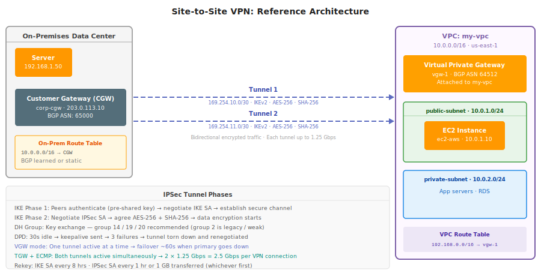
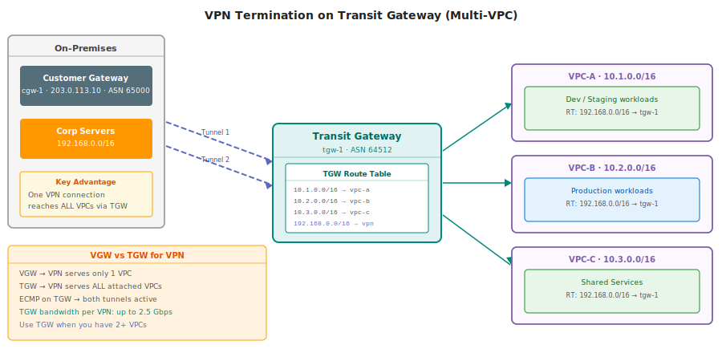
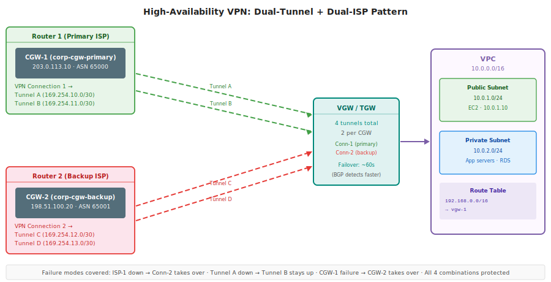

# Part 6: Site-to-Site VPN & Virtual Private Gateway

**Previous:** [Part 5 – Transit Gateway Peering](Part%205%20Transit%20Gateway%20Peering%20Attachments%20and%20Static%20Routes%2033bd9daa12b580a7f2e9c1d008463b85.md)

---

## Reference Architecture

> **Scenario:** Corporate data center connects to AWS VPC over an encrypted IPSec tunnel.
> - On-prem CIDR: `192.168.0.0/16`, CGW public IP: `203.0.113.10`, BGP ASN: `65000`
> - AWS VPC: `my-vpc` (`10.0.0.0/16`), VGW BGP ASN: `64512`



---

## 1. Why Site-to-Site VPN?

| Need | Solution |
|---|---|
| Private, encrypted link to AWS | VPN over public internet (IPSec) |
| No Direct Connect budget/lead time | VPN is fast to set up, ~$0.05/hr |
| Hybrid cloud (extend on-prem to AWS) | Access private subnets from corp network |
| Migration runway | Keep on-prem running while migrating |

VPN vs Direct Connect: VPN = shared internet, encrypted, quick setup. Direct Connect = dedicated fiber, lower latency, higher cost.

---

## 2. Three Core Components

| Component | What It Is | Created Where |
|---|---|---|
| **Customer Gateway (CGW)** | AWS-side config of your on-prem router (IP + ASN) | AWS Console — logical object only |
| **Virtual Private Gateway (VGW)** | AWS-side VPN endpoint; attached to one VPC | AWS Console — attached to VPC |
| **VPN Connection** | Links CGW ↔ VGW; provisions 2 IPSec tunnels | AWS Console — creates tunnel config |

### Customer Gateway (CGW)

- Represents your physical/software router
- You provide: **public static IP** of your router + **BGP ASN** (or `65000` default for static routing)
- No AWS hardware is deployed — this is just a config record

```
CGW fields:
  Name:       corp-cgw
  IP Address: 203.0.113.10   (your router's public IP)
  BGP ASN:    65000           (your on-prem BGP ASN)
```

### Virtual Private Gateway (VGW)

- AWS-managed VPN concentrator
- Attaches to exactly **one VPC**
- Has its own BGP ASN (default `64512`, customizable at creation)
- Highly available across AZs by default — you don't manage the infrastructure

```
VGW fields:
  Name:      vgw-1
  BGP ASN:   64512            (AWS side ASN)
  Attach to: my-vpc
```

### VPN Connection

- Links one CGW to one VGW
- Always creates **exactly 2 tunnels** (AWS requirement — one per AZ for HA)
- Each tunnel has its own: public IP (on AWS side), pre-shared key (PSK), inside CIDR

| Parameter | Tunnel 1 | Tunnel 2 |
|---|---|---|
| Inside CIDR | `169.254.10.0/30` | `169.254.11.0/30` |
| CGW inside IP | `169.254.10.1` | `169.254.11.1` |
| VGW inside IP | `169.254.10.2` | `169.254.11.2` |
| Purpose | Primary path | Standby / failover |
| Max throughput | 1.25 Gbps | 1.25 Gbps |

> **Why 169.254.x.x?** These are link-local IPs — not routable on the internet. They're only used inside the tunnel for BGP peering. Your actual traffic uses your real CIDRs.

---

## 3. IPSec Tunnel Mechanics

Two phases to establish a tunnel:

| Phase | Name | What Happens |
|---|---|---|
| **Phase 1** | IKE SA (ISAKMP) | Authenticate peers (PSK or cert) → negotiate IKE SA → secure channel for Phase 2 |
| **Phase 2** | IPSec SA | Negotiate encryption algorithm + integrity → IPSec SA created → data traffic flows |

**Supported algorithms (AWS defaults):**

| Parameter | AWS Default | Recommended |
|---|---|---|
| IKE version | IKEv1 | IKEv2 |
| Encryption | AES-128 | AES-256 |
| Integrity | SHA-1 | SHA-256 |
| DH Group | Group 2 (1024-bit) | Group 14 / 19 / 20 |
| Phase 1 lifetime | 28800 s (8 hr) | Keep default |
| Phase 2 lifetime | 3600 s (1 hr) | Keep default |

**Dead Peer Detection (DPD):**

- AWS sends DPD keepalive after **30 seconds of idle**
- If peer doesn't respond after **3 probes** → tunnel torn down → renegotiated
- Configure your CGW device to also send DPD (bidirectional)

---

## 4. Routing: BGP vs Static

| | BGP (Dynamic) | Static |
|---|---|---|
| How routes propagate | Automatic — CGW advertises CIDRs to VGW | Manual — you enter routes in AWS console |
| Failover | Automatic — BGP withdraws route when tunnel drops | Manual — no automatic failover |
| Complexity | Requires BGP on your router | Simple, any router |
| Recommended for | Production, HA setups | Quick testing, simple setups |

### BGP Route Propagation

With BGP enabled, VGW automatically learns on-prem routes and can propagate them to your VPC route table — no manual entries needed.

Enable propagation on VPC route table:
```
VPC → Route Tables → select table → Route Propagation → Enable → select vgw-1
```

After enabling, VPC route table will automatically show:
```
192.168.0.0/16  →  vgw-1  (propagated)
```

### On-Prem Router Config (conceptual)

```
! Configure BGP neighbor (BGP peering inside tunnel)
router bgp 65000
  neighbor 169.254.10.2 remote-as 64512   ! VGW inside IP for Tunnel 1
  neighbor 169.254.10.2 activate
  network 192.168.0.0 mask 255.255.0.0    ! advertise on-prem CIDR
```

---

## 5. Setup: Step by Step

```
Step 1: Create Customer Gateway
  VPC → Customer Gateways → Create
  Name: corp-cgw
  Routing: Dynamic (BGP)
  IP Address: 203.0.113.10
  BGP ASN: 65000

Step 2: Create Virtual Private Gateway
  VPC → Virtual Private Gateways → Create
  Name: vgw-1
  ASN: 64512 (or Amazon default)
  → Attach to VPC: my-vpc

Step 3: Create VPN Connection
  VPC → Site-to-Site VPN Connections → Create
  Name: vpn-1
  Virtual Private Gateway: vgw-1
  Customer Gateway: Existing → corp-cgw
  Routing: Dynamic (requires BGP)
  Tunnel options: (leave defaults or customize PSK)

Step 4: Download Configuration
  Select vpn-1 → Download Config
  Choose your vendor (Cisco, Juniper, Palo Alto, etc.)
  Apply config to your physical router

Step 5: Enable Route Propagation (if BGP)
  VPC → Route Tables → select your route table
  Route Propagation tab → Enable → vgw-1

Step 6: Verify
  VPN Connection → Tunnel Details → Status: UP
  VPC route table shows: 192.168.0.0/16 → vgw-1
  Ping from on-prem → EC2 private IP
```

---

## 6. VGW vs TGW for VPN Termination



| | VGW (Virtual Private Gateway) | TGW (Transit Gateway) |
|---|---|---|
| VPCs reachable | **1 VPC only** | **All attached VPCs** |
| VPN connections | One VPN per VGW | Multiple VPNs per TGW |
| ECMP support | No — one tunnel active at a time | Yes — both tunnels active simultaneously |
| Max bandwidth per VPN | 1.25 Gbps (active tunnel only) | **2.5 Gbps** (ECMP across both tunnels) |
| Routing | Simple — propagation to one VPC | Centralized TGW route tables |
| Cost | No TGW charge | TGW attachment fee + data processing |
| Use case | Simple, single-VPC setups | Multi-VPC, hub-and-spoke |

### ECMP on TGW

With TGW, both tunnels are **active simultaneously**:
- Each tunnel: 1.25 Gbps
- Total with ECMP: **2.5 Gbps per VPN connection**
- Multiple VPN connections can further increase bandwidth

Enable ECMP when creating TGW VPN attachment:
```
Equal Cost Multipath (ECMP): Enable
```

---

## 7. Redundancy & High Availability



### Built-in HA (minimum)

Every VPN connection already has **2 tunnels** terminating in different AZs. If one AZ loses the VGW endpoint, the other tunnel stays up (failover ~60s with static, faster with BGP).

### Full HA: Dual-ISP + Dual-CGW

| Scenario | Protection |
|---|---|
| Tunnel A goes down | Tunnel B (same VPN conn) takes over |
| VPN Connection 1 fails | VPN Connection 2 takes over |
| ISP 1 goes down | Traffic switches to ISP 2 |
| CGW-1 hardware failure | CGW-2 handles all traffic |

```
Fully redundant setup:
  CGW-1 (ISP 1) → vpn-conn-1 → Tunnel A + Tunnel B
  CGW-2 (ISP 2) → vpn-conn-2 → Tunnel C + Tunnel D
  Total: 4 IPSec tunnels, 2 ISPs, 2 CGW devices
```

**BGP makes failover automatic** — no manual intervention needed when a tunnel or ISP fails.

---

## 8. Limits & Cost

### Service Limits

| Resource | Default Limit | Notes |
|---|---|---|
| VGWs per region | 5 | Soft limit, can increase |
| VPN connections per VGW | 10 | — |
| VPN connections per TGW | 1000 | — |
| Tunnels per VPN connection | 2 | Fixed, cannot change |
| Max throughput per tunnel | 1.25 Gbps | Fixed |
| Max throughput with TGW ECMP | 2.5 Gbps per VPN conn | Both tunnels active |

### Cost (approximate, us-east-1)

| Item | Cost |
|---|---|
| VPN connection | ~$0.05/hr (~$36/month) |
| Data transfer out | $0.09/GB (standard AWS egress) |
| VGW | Free (no separate charge) |
| TGW VPN attachment | $0.05/hr per attachment |
| TGW data processing | $0.02/GB |

> VPN is significantly cheaper than Direct Connect for most use cases. Direct Connect starts at ~$200-400/month for a 1 Gbps dedicated connection plus port fees.

---

## 9. Quick Reference

### Component Cheatsheet

| Component | AWS Resource | Key Attribute |
|---|---|---|
| CGW | `aws-ec2 create-customer-gateway` | Your router's public IP + ASN |
| VGW | `aws-ec2 create-vpn-gateway` | Attaches to 1 VPC, has its own ASN |
| VPN Connection | `aws-ec2 create-vpn-connection` | Always 2 tunnels, download config |
| Tunnel inside IP | 169.254.x.x/30 | Link-local, for BGP peering only |
| Route propagation | Route table setting | Auto-inserts on-prem CIDRs via BGP |

### Troubleshooting

| Symptom | Check |
|---|---|
| Tunnel shows DOWN | CGW device config matches AWS downloaded config? PSK correct? |
| Traffic not routing | VPC route table has 192.168.0.0/16 → vgw-1? Security groups allow? |
| BGP not peering | BGP neighbor configured with VGW inside IP? ASN correct? |
| Slow throughput | Using VGW (1.25 Gbps max)? Switch to TGW + ECMP for 2.5 Gbps |
| Tunnel flapping | DPD too aggressive? Check both sides have matching DPD settings |

### Decision Tree

```
Need private connectivity to AWS?
  → How many VPCs?
      1 VPC → use VGW (simpler, cheaper)
      2+ VPCs → use TGW (one VPN reaches all)
  → Need > 1.25 Gbps?
      No → VGW is fine
      Yes → TGW + ECMP (up to 2.5 Gbps) or multiple VPN connections
  → Need < 1% downtime?
      Add second CGW (dual-ISP) for full redundancy
  → Need guaranteed bandwidth / low latency?
      Consider Direct Connect instead of VPN
```

---

**Next:** Part 7 – Direct Connect & Hybrid Connectivity
