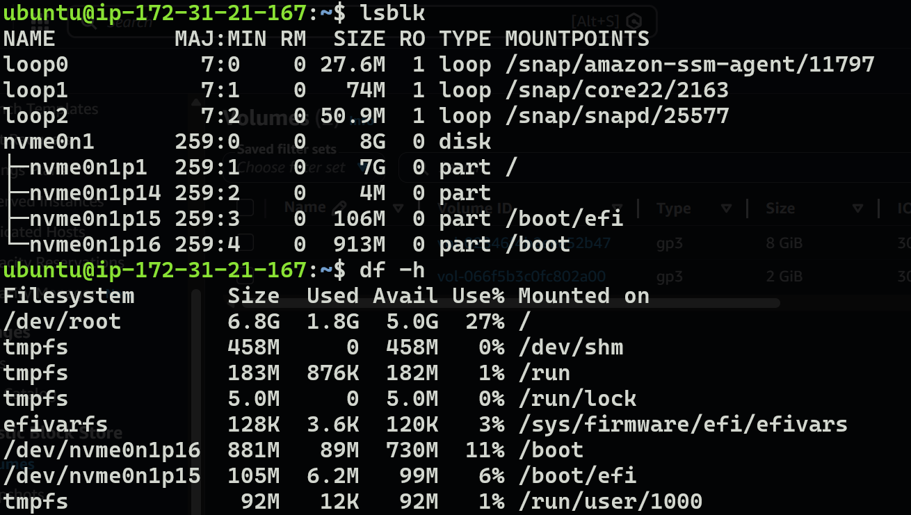

# Part 2: EBS Deep Dive — Volumes, Snapshots, Encryption & Lifecycle

---

## Table of Contents

1. [EBS Architecture Recap](#1-ebs-architecture-recap)
2. [Volume Types — When to Use Which](#2-volume-types--when-to-use-which)
3. [Creating and Attaching an EBS Volume](#3-creating-and-attaching-an-ebs-volume)
4. [Formatting, Mounting, and Persistent Mounts](#4-formatting-mounting-and-persistent-mounts)
5. [Resizing an EBS Volume (Live)](#5-resizing-an-ebs-volume-live)
6. [EBS Snapshots](#6-ebs-snapshots)
7. [EBS Encryption](#7-ebs-encryption)
8. [Multi-Attach (io1/io2)](#8-multi-attach-io1io2)
9. [Data Lifecycle Manager (DLM)](#9-data-lifecycle-manager-dlm)
10. [EBS-Optimized Instances](#10-ebs-optimized-instances)
11. [Migration — Moving Volumes Across AZs and Regions](#11-migration--moving-volumes-across-azs-and-regions)
12. [Monitoring EBS](#12-monitoring-ebs)
13. [Key Points to Remember](#13-key-points-to-remember)
14. [Self-Check Questions](#14-self-check-questions)

---

## 1. EBS Architecture Recap

EBS volumes are network-attached storage that appears as a local block device to EC2 instances. The volume lives on AWS-managed storage infrastructure separate from the host running your instance. Communication happens over a dedicated high-speed network within the Availability Zone.

```
┌───────────────────────────────────────────────────────────────┐
│  Availability Zone: eu-west-1a                                │
│                                                               │
│   EC2 Instance (i-abc123)                                     │
│   ┌─────────────────────────────────────────────┐             │
│   │  OS sees:                                   │             │
│   │    /dev/xvda  (root volume, gp3, 8GB)       │◄──── EBS    │
│   │    /dev/xvdf  (data volume, gp3, 100GB)     │◄──── EBS    │
│   │    /dev/xvdg  (logs volume, st1, 500GB)     │◄──── EBS    │
│   └─────────────────────────────────────────────┘             │
│                          │                                    │
│                   High-speed network                           │
│                          │                                    │
│   ┌──────────────────────┴──────────────────────────┐         │
│   │  AWS EBS Storage Infrastructure                 │         │
│   │  (replicated within this AZ for durability)     │         │
│   └─────────────────────────────────────────────────┘         │
└───────────────────────────────────────────────────────────────┘
```

**Critical constraints:**
- A volume exists in **one AZ only** — cannot be attached to an instance in a different AZ
- Standard volumes attach to **one instance** at a time (multi-attach is io1/io2 only)
- Volumes persist independently of the instance — stopping or terminating EC2 does not delete attached data volumes (unless `DeleteOnTermination` is set)
- EBS data is replicated **within** the AZ automatically — but NOT across AZs (use snapshots for that)

---

## 2. Volume Types — When to Use Which

### SSD-backed (random I/O workloads)

| Type | IOPS Range | Throughput | Max Size | Cost Model | Use When |
|:-----|:-----------|:-----------|:---------|:-----------|:---------|
| **gp3** | 3,000 baseline, up to 16,000 | Up to 1,000 MB/s | 16 TB | Pay for size + optionally provision more IOPS/throughput | Default choice. Boot volumes, dev environments, medium databases, general workloads. |
| **gp2** | Burstable, 3 IOPS/GB, up to 16,000 | Up to 250 MB/s | 16 TB | Pay for size (IOPS tied to size) | Legacy. No reason to use over gp3 — gp3 is cheaper and more flexible. |
| **io2** | Provisioned, up to 64,000 | Up to 1,000 MB/s | 16 TB | Pay for size + provisioned IOPS | Production databases (Oracle, SAP HANA, SQL Server). When you need guaranteed consistent IOPS. |
| **io2 Block Express** | Up to 256,000 | Up to 4,000 MB/s | 64 TB | Pay for size + provisioned IOPS | Extreme database workloads. Largest volumes. Sub-millisecond latency at scale. |

### HDD-backed (sequential I/O workloads)

| Type | IOPS | Throughput | Max Size | Use When |
|:-----|:-----|:-----------|:---------|:---------|
| **st1** | 500 | 500 MB/s | 16 TB | Big data, data warehouses, log processing, Hadoop/Spark. Large sequential reads/writes. |
| **sc1** | 250 | 250 MB/s | 16 TB | Infrequently accessed data where lowest cost matters. Cold storage, archival. |

### gp3 vs gp2 — Why gp3 is always better

```
gp2 problem:  IOPS scales with volume size (3 IOPS per GB)
              Want 9,000 IOPS? You need a 3TB volume — even if you only store 50GB.
              You pay for 3TB just to get the performance you need.

gp3 solution: IOPS and throughput are independently configurable.
              Want 9,000 IOPS on a 50GB volume? Just set it.
              You pay for 50GB storage + the extra IOPS. Much cheaper.
```

> **Rule: Always use gp3 for new volumes.** There is no scenario where gp2 is a better choice.

### Decision tree

```
Is your workload random I/O (databases, apps)?
├── Yes → Do you need > 16,000 IOPS guaranteed?
│         ├── Yes → io2 (or io2 Block Express for > 64,000 IOPS)
│         └── No  → gp3
└── No (sequential I/O — big data, streaming reads/writes)
          ├── Accessed frequently? → st1
          └── Cold/archival?       → sc1
```

---

## 3. Creating and Attaching an EBS Volume

### Step 1: Create the Volume

1. Go to **EC2 Console > Elastic Block Store > Volumes > Create Volume**
2. Configure:

```
Volume Settings:
────────────────────────────────────────────
Volume Type:         gp3
Size:                10 GiB (or whatever you need)
IOPS:                3000 (default baseline, increase if needed)
Throughput:          125 MB/s (default, increase if needed)
Availability Zone:   eu-west-1a     ← MUST match your EC2 instance's AZ
Encryption:          Enabled (recommended)
KMS Key:             aws/ebs (default) or custom key
Tags:                Name = "my-data-volume"
────────────────────────────────────────────
```

3. Click **Create Volume**

> **The #1 mistake**: Creating the volume in a different AZ than your instance. A volume in `eu-west-1a` cannot attach to an instance in `eu-west-1b`. There is no workaround — you must snapshot and recreate in the correct AZ.

### Step 2: Attach to an EC2 Instance

1. Select the volume > **Actions > Attach Volume**
2. Choose the target EC2 instance
3. Device name: `/dev/sdf` (or the next available letter)
4. Click **Attach**

```
What happens:
────────────────────────────────────────────
  AWS Console device name:    /dev/sdf
  What Linux actually sees:   /dev/xvdf  (or /dev/nvme1n1 on Nitro instances)
────────────────────────────────────────────
```

The device name mapping differs between instance generations:
- **Older instances** (Xen-based): `/dev/sdf` → appears as `/dev/xvdf`
- **Newer instances** (Nitro-based): `/dev/sdf` → appears as `/dev/nvme1n1`

Always use `lsblk` to confirm the actual device name inside the OS.




---

## 4. Formatting, Mounting, and Persistent Mounts

Once attached, the volume is a raw block device with no filesystem. You need to format it, mount it, and configure it to survive reboots.

### Step 1: Verify the volume is detected

```bash
lsblk
```

Output shows the new device (e.g., `xvdf` or `nvme1n1`) with no mountpoint.

### Step 2: Check if it already has a filesystem

```bash
sudo file -s /dev/xvdf
```

- If output says **`data`** → no filesystem exists, proceed to format
- If output shows filesystem info (e.g., `XFS filesystem`) → already formatted, skip to mounting


### Step 3: Create a filesystem

```bash
sudo mkfs -t xfs /dev/xvdf
```

> **XFS** is the default and recommended filesystem for Amazon Linux. Use `ext4` if you need to shrink the filesystem later (XFS cannot be shrunk, only grown).

### Step 4: Mount the volume (temporary)

```bash
sudo mkdir /home/ec2-user/data
sudo mount /dev/xvdf /home/ec2-user/data
```

Verify with:

```bash
df -h
```

This mount disappears on reboot. The next step makes it permanent.


### Step 5: Make the mount persistent (survives reboot)

Temporary mounts are lost when the instance restarts. To persist across reboots, you add an entry to `/etc/fstab`.

**Get the volume's UUID:**

```bash
sudo blkid
```

Output example:
```
/dev/xvdf: UUID="c4c320ad-2fe2-40d9-8d58-4b779444b0b3" BLOCK_SIZE="512" TYPE="xfs"
```

**Edit /etc/fstab:**

```bash
sudo vi /etc/fstab
```

**Add this line** (replace UUID with your actual UUID):

```
UUID=c4c320ad-2fe2-40d9-8d58-4b779444b0b3  /home/ec2-user/data  xfs  defaults,nofail  0  2
```

**Why each field matters:**

```
UUID=...              Use UUID, not device name (/dev/xvdf)
                      Device names can change between reboots — UUID never changes.

/home/ec2-user/data   The mount point directory.

xfs                   Filesystem type (must match what you formatted with).

defaults,nofail       defaults = standard mount options
                      nofail  = if the volume is missing at boot, DON'T fail the boot
                      (without nofail, a detached volume would prevent the instance from starting)

0                     Dump flag (0 = don't backup with dump utility)

2                     fsck order (2 = check after root filesystem; 0 = don't check)
```

**Test without rebooting:**

```bash
sudo mount -a
```

If no error, the fstab entry is correct. Verify:

```bash
df -h
```


> **Critical warning**: If you put a wrong entry in `/etc/fstab` without `nofail`, your instance may fail to boot entirely. Always use `nofail` and test with `mount -a` before rebooting.

---

## 5. Resizing an EBS Volume (Live)

EBS volumes can be resized without downtime — you do NOT need to stop the instance or unmount the filesystem. The process has two parts: expand the volume in AWS, then extend the filesystem inside the OS.

### Part 1: Modify the volume in AWS Console

1. Go to **EC2 > Volumes**
2. Select the volume > **Actions > Modify Volume**
3. Increase the size (e.g., 10 GiB → 20 GiB)
4. Click **Modify** > Confirm

The volume state transitions through: `modifying` → `optimizing` → `completed`

> You can only **increase** size, never decrease. If you need a smaller volume, create a new smaller one and copy data over.

### Part 2: Extend the filesystem (Linux side)

The OS won't use the new space until you tell it to. Check that the device shows the new size:

```bash
lsblk
```

**For XFS filesystem** (most common on Amazon Linux):

```bash
sudo xfs_growfs /home/ec2-user/data
```

**For ext4 filesystem:**

```bash
sudo resize2fs /dev/xvdf
```

No unmount needed for either operation. Verify:

```bash
df -h
```


### If the volume has a partition table

On some instances (especially root volumes), the disk has partitions. In that case you need to grow the partition first:

```bash
# Grow partition 1 to fill the disk
sudo growpart /dev/xvda 1

# Then extend the filesystem
sudo xfs_growfs /
```

---

## 6. EBS Snapshots

A snapshot is a point-in-time backup of an EBS volume stored in S3 (you don't interact with S3 directly — it's managed by AWS). Snapshots are the primary mechanism for backup, disaster recovery, and volume migration.

### How snapshots work

```
First snapshot:   Copies ALL blocks from the volume to S3
                  (can take time for large volumes)

Second snapshot:  Only copies blocks that CHANGED since the first snapshot
                  (incremental — fast and space-efficient)

Third snapshot:   Only copies blocks that changed since the second snapshot
                  (each snapshot is independently restorable)
```

Even though snapshots are incremental, **each snapshot is self-contained** — you can restore from any single snapshot without needing previous ones. AWS manages the block-level dependencies internally.

### Creating a snapshot

1. Go to **EC2 > Volumes** or **EC2 > Snapshots**
2. Select volume > **Actions > Create Snapshot**
3. Add a description and tags
4. Click **Create Snapshot**


### Key operations with snapshots

**Create a volume from a snapshot:**
- Go to **Snapshots > Select snapshot > Actions > Create Volume**
- Choose any AZ in the same region — this is how you move volumes across AZs

**Copy snapshot to another region:**
- Select snapshot > **Actions > Copy Snapshot**
- Choose destination region
- This is how you do cross-region disaster recovery

**Share a snapshot:**
- Select snapshot > **Actions > Modify Permissions**
- Add AWS account IDs or make public
- Shared snapshots allow other accounts to create volumes from your backup

**Create an AMI from a snapshot:**
- If the snapshot is of a root volume, you can create a launchable AMI from it
- This is the standard way to create golden images of configured instances


### Snapshot best practices

| Practice | Reason |
|:---------|:-------|
| Snapshot before any risky operation (resize, OS upgrade, major deploy) | Instant rollback point if things go wrong |
| Use tags to identify snapshots | "app-server-data-2024-03-15" is findable; "snap-0a1b2c3d" is not |
| Automate with DLM (see section 9) | Manual snapshots get forgotten |
| Delete old snapshots you no longer need | You pay for snapshot storage — incremental savings only apply to the delta |
| Snapshot running volumes is safe | EBS snapshots are crash-consistent — like pulling the power plug. For databases, flush to disk first or use application-consistent snapshots |

---

## 7. EBS Encryption

EBS encryption provides at-rest and in-transit encryption for volumes and their snapshots using AES-256 and AWS KMS keys.

### What gets encrypted

When you enable encryption on an EBS volume:
- Data at rest on the volume → encrypted
- Data in transit between instance and volume → encrypted
- All snapshots created from the volume → encrypted
- All volumes created from those snapshots → encrypted

The encryption is transparent to the instance — the OS and applications see unencrypted data. The encryption/decryption happens at the EBS storage infrastructure level with negligible performance impact.

### How to enable encryption

**For new volumes:**
- During creation, check "Encrypt this volume"
- Select a KMS key (default `aws/ebs` key or a custom CMK)

**For existing unencrypted volumes:**
You cannot encrypt an existing volume in-place. The process is:

```
Unencrypted volume
       ↓
Create snapshot (unencrypted)
       ↓
Copy snapshot with encryption enabled (encrypted copy)
       ↓
Create new volume from encrypted snapshot (encrypted volume)
       ↓
Detach old volume, attach new encrypted volume
```

**Default encryption for the account:**
- Go to **EC2 > Settings > EBS Encryption > Always encrypt new EBS volumes**
- When enabled, every new volume in the account/region is encrypted by default

### KMS keys for EBS

| Key Type | Description |
|:---------|:------------|
| `aws/ebs` (AWS managed) | Default. AWS creates and manages it. Simple, no cost for key management. |
| Customer Managed Key (CMK) | You create and control the key. Allows key rotation policies, cross-account sharing, and granular IAM policies on who can use the key. |

> **Cross-account sharing**: If you share an encrypted snapshot with another account, they must have access to the KMS key used for encryption. With the default `aws/ebs` key, cross-account sharing is not possible — you must use a Customer Managed Key.

---

## 8. Multi-Attach (io1/io2)

Multi-Attach allows a single io1 or io2 volume to be attached to up to 16 EC2 instances simultaneously, all within the same AZ.

### Constraints

| Constraint | Detail |
|:-----------|:-------|
| Volume types | io1 and io2 only |
| Max instances | 16 concurrent attachments |
| AZ restriction | All instances must be in the same AZ as the volume |
| Filesystem requirement | Must use a cluster-aware filesystem (GFS2, OCFS2) |
| OS support | Linux only (no Windows support for multi-attach) |

### Why you need a cluster-aware filesystem

Standard filesystems (ext4, XFS) assume they have exclusive access to the disk. They cache metadata, maintain journals, and track block allocation with no awareness of other writers. If two instances running ext4 both write to the same volume, they will corrupt each other's metadata — leading to unrecoverable data loss.

Cluster-aware filesystems (GFS2, OCFS2) use distributed locking to coordinate access. Before any node writes, it acquires a cluster-wide lock, ensuring no two nodes write to the same blocks simultaneously.

### When to use Multi-Attach

- Clustered applications with their own distributed locking (Oracle RAC, some clustered databases)
- Shared write-ahead logs for failover scenarios
- Applications that need simultaneous read/write from multiple nodes with application-level coordination

> **For most shared storage needs, EFS is the better solution.** Multi-Attach is a niche feature for applications that specifically require block-level shared access.

---

## 9. Data Lifecycle Manager (DLM)

DLM automates the creation, retention, and deletion of EBS snapshots on a schedule. Instead of manually creating snapshots or writing Lambda scripts, you define a policy and DLM handles everything.

### Creating a DLM Policy

1. Go to **EC2 > Lifecycle Manager > Create Lifecycle Policy**
2. Configure:

```
DLM Policy Configuration:
────────────────────────────────────────────────────────────────
Policy type:           EBS snapshot policy
Target resources:      Volumes (or Instances for all attached volumes)
Target tags:           Key = "Backup", Value = "daily"
Schedule:
  Frequency:           Every 12 hours (or daily, weekly)
  Starting at:         03:00 UTC
  Retention:           Keep last 14 snapshots (count-based)
                       OR retain for 30 days (age-based)
Cross-region copy:     Enable → copy to eu-central-1 (for DR)
────────────────────────────────────────────────────────────────
```

### How DLM works

```
You tag volumes:   Backup=daily
DLM policy watches for that tag
Every 12 hours:
  ├── Creates snapshot of every volume tagged Backup=daily
  ├── Tags the snapshot with creation time and policy ID
  ├── Optionally copies snapshot to another region
  └── Deletes snapshots older than retention period
```

### DLM vs manual snapshots vs AWS Backup

| Method | Scope | Complexity | Cost |
|:-------|:------|:-----------|:-----|
| Manual snapshots | One volume at a time | Simple but forgettable | Free (you pay for snapshot storage) |
| DLM | EBS volumes by tag | Low — policy-based, set and forget | Per-minute charge for DLM operations |
| AWS Backup | Cross-service (EBS, RDS, EFS, DynamoDB, etc.) | Medium — centralized backup plans | Additional service charges |

Use DLM when you only need EBS snapshot automation. Use AWS Backup when you need a unified backup solution across multiple AWS services.

---

## 10. EBS-Optimized Instances

EBS-Optimized means the instance has **dedicated network bandwidth** for EBS traffic, separate from general network traffic. Without optimization, EBS I/O and network traffic compete for the same bandwidth.

```
Non-optimized instance:
  ┌────────────────────────────────────┐
  │  EC2 Instance                      │
  │    Network traffic ──┐             │
  │    EBS I/O ──────────┼── shared NIC ──── network
  │                      │             │
  └────────────────────────────────────┘
  EBS performance suffers when network is busy.

EBS-optimized instance:
  ┌────────────────────────────────────┐
  │  EC2 Instance                      │
  │    Network traffic ──── NIC 1 ──────── general network
  │    EBS I/O ─────────── NIC 2 ──────── dedicated EBS path
  │                                    │
  └────────────────────────────────────┘
  EBS gets guaranteed bandwidth regardless of network load.
```

**For modern instance types (m5, c5, r5, t3 and newer), EBS optimization is enabled by default and included in the instance price.** You only need to worry about this on older instance families.

Each instance type has a maximum EBS bandwidth (e.g., `m5.xlarge` = 4,750 Mbps EBS bandwidth). If your volume's provisioned IOPS/throughput exceeds what the instance can deliver, the instance becomes the bottleneck.

---

## 11. Migration — Moving Volumes Across AZs and Regions

EBS volumes are locked to one AZ. The only way to move data to another AZ or region is through snapshots.

### Moving a volume to a different AZ (same region)

```
Volume in eu-west-1a
       ↓
Create snapshot
       ↓
Create volume from snapshot → select eu-west-1b
       ↓
Attach new volume to instance in eu-west-1b
```

### Moving a volume to a different region

```
Volume in eu-west-1a
       ↓
Create snapshot
       ↓
Copy snapshot to eu-central-1 (destination region)
       ↓
In eu-central-1: Create volume from copied snapshot
       ↓
Attach to instance in eu-central-1
```

### CLI commands for cross-region migration

```bash
# Create snapshot
aws ec2 create-snapshot --region eu-west-1 --volume-id vol-abc123 --description "Migration"

# Copy to another region
aws ec2 copy-snapshot --region eu-central-1 --source-region eu-west-1 --source-snapshot-id snap-xyz789

# Create volume in destination
aws ec2 create-volume --region eu-central-1 --availability-zone eu-central-1a --snapshot-id snap-copied123
```

---

## 12. Monitoring EBS

### Key CloudWatch metrics for EBS

| Metric | What It Tells You |
|:-------|:------------------|
| `VolumeReadOps` / `VolumeWriteOps` | Number of I/O operations — helps identify IOPS bottlenecks |
| `VolumeReadBytes` / `VolumeWriteBytes` | Data throughput — shows if you're hitting throughput limits |
| `VolumeQueueLength` | Number of pending I/O requests — high values indicate the volume can't keep up |
| `VolumeThroughputPercentage` (io1/io2) | Percentage of provisioned IOPS being consumed |
| `BurstBalance` (gp2 only) | Remaining burst credits — if this hits 0, performance drops to baseline |

### When to worry

| Symptom | Likely Cause | Fix |
|:--------|:-------------|:----|
| High queue length (>1 sustained) | Volume IOPS maxed out | Upgrade to higher-IOPS volume type or provision more IOPS |
| BurstBalance dropping to 0 (gp2) | Sustained load exceeding baseline | Switch to gp3 with provisioned IOPS |
| Read/Write bytes flat at a ceiling | Hitting throughput limit | Increase throughput (gp3) or use io2 |
| Application latency spikes | Instance EBS bandwidth saturated | Use a larger instance type with higher EBS bandwidth |

---

## 13. Key Points to Remember

1. **EBS and EC2 must be in the same AZ.** This is the most common mistake.

2. **Use UUID in /etc/fstab, never device names.** Device names (`/dev/xvdf`) can change between reboots. UUIDs never change.

3. **Always use `nofail` in fstab.** Without it, a detached volume prevents the instance from booting — you lose SSH access entirely.

4. **gp3 over gp2, always.** gp3 decouples IOPS from volume size, giving you better performance at lower cost.

5. **Snapshots are incremental but self-contained.** You can restore from any single snapshot without needing the ones before it.

6. **You cannot shrink an EBS volume.** You can only increase size. To shrink, create a new smaller volume and copy data.

7. **Encryption cannot be added to an existing volume.** You must snapshot → copy with encryption → create new volume.

8. **XFS cannot be shrunk.** Use ext4 if you ever need to reduce filesystem size. XFS can only grow.

9. **Snapshot a running volume is crash-consistent.** For application consistency (databases), flush writes or stop the application before snapshotting.

10. **`file -s /dev/xvdf` shows `data` means no filesystem.** This is how you verify a fresh volume before formatting — prevents accidentally formatting a volume that already has data.

---

## 14. Self-Check Questions

1. You have a volume in `us-east-1a` and need to attach it to an instance in `us-east-1b`. What do you do?
   > Snapshot the volume → Create a new volume from the snapshot in `us-east-1b` → Attach.

2. Your gp2 volume's BurstBalance is at 0 and your database is slow. What's the best fix?
   > Switch to gp3. gp3 has a fixed 3,000 IOPS baseline with no burst credit concept. Alternatively, provision higher IOPS on gp3.

3. You accidentally deleted a file on an EBS volume yesterday. Can you recover it?
   > Only if you have a snapshot from before the deletion. Create a new volume from the snapshot, mount it, and copy the file back. EBS has no built-in "undelete."

4. You need to encrypt an existing unencrypted production volume. What's the process?
   > Create snapshot of unencrypted volume → Copy snapshot with encryption enabled → Create new encrypted volume from encrypted snapshot → Stop instance → Detach old volume → Attach new encrypted volume → Start instance.

5. Your fstab has an entry for a volume you detached. What happens on next reboot?
   > If `nofail` is in the options: instance boots normally, volume just isn't mounted. If `nofail` is missing: instance fails to boot, entering emergency mode. You'd need to fix it via a rescue instance or EC2 Serial Console.

6. What's the difference between `xfs_growfs` and `resize2fs`?
   > `xfs_growfs` extends XFS filesystems (pass the mount point). `resize2fs` extends ext4 filesystems (pass the device). Use whichever matches your filesystem type.

7. Can you take a snapshot while the volume is in use?
   > Yes. Snapshots are crash-consistent — they capture all data written to the volume at the moment the snapshot begins. For databases, consider freezing I/O or using `fsfreeze` for full application consistency.

---

## References

- [EBS Volume Types](https://docs.aws.amazon.com/ebs/latest/userguide/ebs-volume-types.html)
- [EBS Snapshots](https://docs.aws.amazon.com/ebs/latest/userguide/EBSSnapshots.html)
- [EBS Encryption](https://docs.aws.amazon.com/ebs/latest/userguide/ebs-encryption.html)
- [EBS Multi-Attach](https://docs.aws.amazon.com/ebs/latest/userguide/ebs-volumes-multi.html)
- [Data Lifecycle Manager](https://docs.aws.amazon.com/ebs/latest/userguide/snapshot-lifecycle.html)
- [Amazon EBS Performance](https://docs.aws.amazon.com/ebs/latest/userguide/ebs-performance.html)
