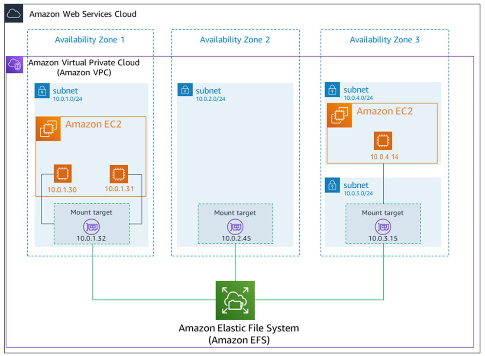

# Part 3: EFS Deep Dive — Elastic File System

---

## Table of Contents

1. [What EFS Actually Is](#1-what-efs-actually-is)
2. [How EFS Differs from EBS](#2-how-efs-differs-from-ebs)
3. [EFS Architecture](#3-efs-architecture)
4. [Storage Classes and Lifecycle](#4-storage-classes-and-lifecycle)
5. [Performance Modes and Throughput](#5-performance-modes-and-throughput)
6. [Security Model](#6-security-model)
7. [Hands-On: Shared Web Server with EFS](#7-hands-on-shared-web-server-with-efs)
8. [Access Points](#8-access-points)
9. [EFS with Containers and Serverless](#9-efs-with-containers-and-serverless)
10. [Backup Solutions](#10-backup-solutions)
11. [Advantages and Limitations](#11-advantages-and-limitations)
12. [Pricing Model](#12-pricing-model)
13. [Use Cases](#13-use-cases)
14. [Key Points to Remember](#14-key-points-to-remember)
15. [Self-Check Questions](#15-self-check-questions)

---

## 1. What EFS Actually Is

Amazon EFS is a fully managed, elastic, shared network file system that uses the **NFSv4.1 protocol**. You create a file system, mount it on one or more EC2 instances (or Lambda, ECS, Fargate), and every mounted client sees the same directory tree with the same files in real time.

The word **elastic** is the defining characteristic. Unlike EBS where you provision 100GB and pay for 100GB whether you use 1GB or 99GB, EFS has no size to set. You start at 0 bytes. Write a file — the filesystem grows. Delete it — the filesystem shrinks. You pay per GB stored per month, nothing more.

```
Traditional storage (EBS):
─────────────────────────────────────────
  "I need storage" → Provision 500GB → Pay for 500GB
  Using 50GB? Still paying for 500GB.
  Need 600GB? Stop, resize, extend filesystem.

EFS:
─────────────────────────────────────────
  "I need storage" → Create filesystem → 0 bytes
  Write 50GB → Pay for 50GB
  Write 200GB more → Pay for 250GB
  Delete 100GB → Pay for 150GB
  No provisioning. No resizing. Ever.
```

---

## 2. How EFS Differs from EBS

This comparison is the most frequently asked question about AWS storage. The differences are fundamental, not superficial.

| | EBS | EFS |
|:--|:-----|:-----|
| **Type** | Block storage (raw disk) | File storage (NFS) |
| **Access** | One instance at a time* | Thousands of instances simultaneously |
| **Scope** | Locked to one AZ | Available across all AZs in the region (Standard class) |
| **Capacity** | Fixed — you provision a size | Elastic — grows and shrinks automatically |
| **Filesystem** | You format it yourself (ext4, XFS) | Managed by AWS (NFS) |
| **Protocol** | Block device protocol (kernel-level) | NFSv4.1 (network protocol) |
| **Latency** | Sub-millisecond | Low milliseconds (network round-trip) |
| **Pricing** | Pay for provisioned size | Pay for stored data only |
| **Boot volume** | Yes | No — cannot boot from EFS |
| **OS support** | Any (Linux, Windows) | Linux only |
| **Snapshots** | Native EBS snapshots | No native snapshots — use AWS Backup |
| **Use case** | Databases, boot volumes | Shared files across instances, CMS, containers |

\* *io1/io2 supports multi-attach up to 16 instances*

The mental model: **EBS is a private hard drive. EFS is a shared network folder.**

---

## 3. EFS Architecture

When you create an EFS file system, AWS deploys **mount targets** in the AZs you specify. Each mount target is a network endpoint (ENI with an IP address) that instances in that AZ use to access the filesystem.

```
┌──────────────────────────────────────────────────────────────────────────┐
│  Region: eu-west-1                                                       │
│                                                                          │
│  ┌─────── AZ: eu-west-1a ───────┐    ┌─────── AZ: eu-west-1b ───────┐  │
│  │                               │    │                               │  │
│  │  EC2-A ──┐                    │    │  EC2-C ──┐                    │  │
│  │  EC2-B ──┼── Mount Target 1   │    │  EC2-D ──┼── Mount Target 2   │  │
│  │          │   (ENI: 10.0.1.x)  │    │          │   (ENI: 10.0.2.x)  │  │
│  │          │                    │    │          │                    │  │
│  └──────────┼────────────────────┘    └──────────┼────────────────────┘  │
│             │                                    │                        │
│             └──────────────┐  ┌──────────────────┘                        │
│                            │  │                                           │
│                     ┌──────┴──┴──────┐                                    │
│                     │   EFS Storage  │                                    │
│                     │   (replicated  │                                    │
│                     │    across AZs) │                                    │
│                     └────────────────┘                                    │
└──────────────────────────────────────────────────────────────────────────┘
```

**Key architectural points:**
- Data is automatically replicated across **all AZs** in the region (Standard class)
- Each AZ gets its own mount target — instances connect to the mount target in their AZ for lowest latency
- If an AZ goes down, instances in other AZs continue operating normally
- Mount targets are placed in subnets you choose — they get IP addresses from those subnets
- Security groups control which instances can reach the mount targets

---

## 4. Storage Classes and Lifecycle

EFS offers four storage classes, trading cost against access frequency and availability.

### Storage Classes

| Class | AZ Resilience | Access Pattern | Relative Cost |
|:------|:--------------|:---------------|:--------------|
| **EFS Standard** | Multi-AZ | Frequently accessed | Highest storage cost, no access fee |
| **EFS Standard-IA** | Multi-AZ | Infrequent (< once/month) | ~92% cheaper storage, per-access fee |
| **EFS One Zone** | Single AZ | Frequently accessed | ~47% cheaper than Standard |
| **EFS One Zone-IA** | Single AZ | Infrequent | Cheapest option overall |

### Lifecycle Management

You do not manually move files between classes. Instead, you configure a **lifecycle policy** — EFS automatically transitions files based on when they were last accessed.

```
Lifecycle Policy Configuration:
────────────────────────────────────────────────────────────────
  Transition to IA after:    30 days of no access (options: 7/14/30/60/90 days)
  Transition back to Standard:  On first access (optional)
────────────────────────────────────────────────────────────────

Example timeline for a file "report.pdf":
  Day 1:    Uploaded → stored in Standard (frequently accessed tier)
  Day 2-30: Not accessed → still in Standard
  Day 31:   Lifecycle policy moves it to Standard-IA automatically
  Day 45:   Someone reads the file → moved back to Standard (if configured)
```

**Cost implication**: A file that hasn't been touched in 3 months sitting in Standard is costing you ~12x more than it would in Standard-IA. Lifecycle policies are the #1 cost optimization for EFS.

---

## 5. Performance Modes and Throughput

### Performance Modes

| Mode | Latency | Max IOPS | When to Use |
|:-----|:--------|:---------|:------------|
| **General Purpose** | Lowest (single-digit ms) | 35,000 | Default. Web serving, CMS, home directories, most workloads. |
| **Max I/O** | Slightly higher | 500,000+ | Highly parallelized workloads — hundreds of instances, big data analytics, media processing. |

> **General Purpose is the correct choice for 95% of workloads.** Only switch to Max I/O if you observe the `PercentIOLimit` CloudWatch metric consistently near 100%.

### Throughput Modes

| Mode | How Throughput is Determined | When to Use |
|:-----|:----------------------------|:------------|
| **Bursting** | Scales with stored data size. More data stored = higher baseline throughput. Burst up to 100 MB/s per TB stored. | Default. Works well when you store enough data to get adequate throughput. |
| **Provisioned** | You explicitly set throughput (1-3,000+ MB/s) independent of storage size. | When you need more throughput than your current storage size would provide via bursting. |
| **Elastic** | Automatically scales throughput up to 10 GB/s for reads and 3 GB/s for writes. Pay per-throughput consumed. | Unpredictable or spiky workloads. Recommended for most new deployments. |

### Bursting explained

With Bursting mode, your throughput allowance is tied to how much data you store:

```
Stored Data     Baseline Throughput      Burst Throughput
─────────────   ────────────────────     ────────────────
  10 GB          0.5 MB/s                100 MB/s (for up to 72 min/day)
  100 GB         5 MB/s                  100 MB/s
  1 TB           50 MB/s                 100 MB/s
  10 TB          500 MB/s                1,000 MB/s
```

The problem: if you store only 10GB but need sustained 50 MB/s throughput, Bursting mode gives you only 0.5 MB/s baseline. You would run out of burst credits quickly. Switch to **Elastic** or **Provisioned** in this case.

> **Recommendation**: Use **Elastic throughput mode** for new file systems. You get automatic scaling without thinking about burst credits or provisioning, and you pay only for what you use.

---

## 6. Security Model

EFS uses multiple layers of security, each controlling access at a different level.

### Layer 1: Network — Security Groups

Mount targets have security groups attached. Only instances whose security groups are allowed in the mount target's inbound rules can connect.

```
Mount Target Security Group inbound rule:
────────────────────────────────────────────
  Type:       NFS
  Protocol:   TCP
  Port:       2049
  Source:     sg-xxxx (EC2 instances' security group)
────────────────────────────────────────────
```

If an instance's security group is not in this rule, it cannot mount the filesystem — the NFS connection will time out.

### Layer 2: IAM — Who can perform EFS API actions

IAM policies control who can create, delete, describe, and manage EFS file systems and mount targets. This is the management plane — it doesn't control file-level access.

### Layer 3: File System Policy (Resource-based)

Optional JSON policy on the filesystem itself. Controls:
- Whether root access is allowed
- Whether read-only or read-write access is granted
- Whether anonymous access is denied
- Whether encryption in transit is enforced

### Layer 4: POSIX Permissions

Once mounted, standard Linux file permissions (user, group, other) control read/write/execute access at the file and directory level. EFS respects the `uid` and `gid` of the connecting process.

### Layer 5: Encryption

- **At rest**: AES-256 encryption using KMS keys. Enabled at filesystem creation (cannot be changed after).
- **In transit**: TLS 1.2 between instance and mount target. Enabled by using the EFS mount helper with the `-o tls` option.

---

## 7. Hands-On: Shared Web Server with EFS

This lab demonstrates the core value of EFS — two EC2 instances serving the same web content from a shared filesystem. Change a file on one server, and the other server immediately reflects the change.

### Architecture

```
                    INTERNET
                       │
              ┌────────┴────────┐
              │                 │
     ┌────────┴──────┐   ┌─────┴───────┐
     │  EC2-A        │   │  EC2-B      │
     │  (httpd)      │   │  (httpd)    │
     │  AZ: 1a       │   │  AZ: 1b    │
     └────────┬──────┘   └─────┬───────┘
              │                 │
              │  NFS mount      │  NFS mount
              │  /var/www/html  │  /var/www/html
              │                 │
     ┌────────┴─────────────────┴───────┐
     │         EFS File System          │
     │   (contains index.html)          │
     │   (replicated across AZs)        │
     └─────────────────────────────────┘
```

Both servers mount the same EFS filesystem at `/var/www/html`. Apache (httpd) serves files from that directory. When you edit `index.html` on EC2-A, EC2-B serves the updated content instantly.

---

### Step 1: Create a Security Group for EFS

Before creating the filesystem, you need a security group that allows NFS traffic (port 2049) from your EC2 instances.

1. Go to **VPC Console > Security Groups > Create Security Group**
2. Configure:

```
Security Group:
────────────────────────────────────────────
Name:           efs-mount-sg
Description:    Allow NFS from EC2 instances to EFS
VPC:            (your VPC)

Inbound Rules:
  Type:       NFS
  Protocol:   TCP
  Port:       2049
  Source:     (Security Group of your EC2 instances)
              OR the VPC CIDR (e.g., 10.0.0.0/16) for simplicity in labs

Outbound Rules:  Leave default (all traffic)
────────────────────────────────────────────
```

> **Why a dedicated SG?** If you use the instance's SG on the mount target and allow "self" inbound NFS, it works but is messy. A dedicated EFS security group is cleaner and explicitly documents the access intent.

---

### Step 2: Create the EFS File System

1. Go to **EFS Console > Create file system**
2. Click **Customize** (not the quick create — you want to see all options)

```
General Settings:
────────────────────────────────────────────
Name:                   shared-web-content
Storage class:          Standard (Multi-AZ)
Automatic backups:      Enable (uses AWS Backup)
Lifecycle management:
  Transition to IA:     After 30 days
  Transition back:      On first access
Encryption at rest:     Enabled (aws/elasticfilesystem key)
────────────────────────────────────────────
```

3. **Performance settings:**

```
Throughput mode:        Elastic (recommended)
Performance mode:       General Purpose
────────────────────────────────────────────
```

4. **Network settings** (mount targets):

For each AZ where you have EC2 instances, select:
- The subnet in that AZ
- Security group: `efs-mount-sg`

```
Mount Targets:
────────────────────────────────────────────
  AZ eu-west-1a  →  Subnet: public-1a  →  SG: efs-mount-sg
  AZ eu-west-1b  →  Subnet: public-1b  →  SG: efs-mount-sg
────────────────────────────────────────────
```

5. **File system policy** (optional): Leave default or enable "Enforce in-transit encryption"
6. Click **Create**

Wait for the file system state to become **Available** and mount targets to show **Available** (1-2 minutes).

---

### Step 3: Launch Two EC2 Instances

Launch two instances in different AZs (or the same AZ — both work). Ensure their security group allows:
- Inbound HTTP (port 80) from 0.0.0.0/0
- Outbound NFS (port 2049) — default "all outbound" covers this

---

### Step 4: Install NFS Client and Apache on Both Instances

SSH into **each** instance and run:

```bash
# Install Apache web server and NFS utilities
sudo yum install -y httpd amazon-efs-utils

# Start Apache
sudo systemctl start httpd
sudo systemctl enable httpd
```

> **`amazon-efs-utils`** is the AWS EFS mount helper. It simplifies mounting with EFS-specific options (TLS, IAM auth, access points). You can also mount with standard `nfs-utils` but the helper is recommended.

---

### Step 5: Mount EFS on Both Instances

Get your filesystem ID from the EFS console (looks like `fs-0abc1234def56789`).

On **both** instances:

```bash
# Create mount point (Apache serves from /var/www/html)
# It already exists from httpd installation, but make sure
sudo mkdir -p /var/www/html

# Mount EFS using the mount helper (with TLS encryption in transit)
sudo mount -t efs -o tls fs-0abc1234def56789:/ /var/www/html

# Verify
df -h
```

You should see the EFS filesystem mounted at `/var/www/html` with a size showing as ~8.0E (exabytes) — this is because EFS reports effectively unlimited capacity.

### Make the mount persistent (survives reboot)

Edit `/etc/fstab` on both instances:

```bash
sudo vi /etc/fstab
```

Add this line:

```
fs-0abc1234def56789:/ /var/www/html efs _netdev,tls 0 0
```

**Fields explained:**
- `fs-0abc1234def56789:/` — EFS filesystem ID and root path
- `/var/www/html` — mount point
- `efs` — filesystem type (uses the amazon-efs-utils mount helper)
- `_netdev,tls` — `_netdev` ensures mount waits for network; `tls` enables encryption in transit
- `0 0` — no dump, no fsck

---

### Step 6: Create Shared Content and Test

On **EC2-A only**:

```bash
sudo bash -c 'echo "<h1>Hello from Shared EFS!</h1><p>This file exists on BOTH servers.</p>" > /var/www/html/index.html'
```

Now test from your browser:
- `http://<EC2-A-public-IP>/` → shows "Hello from Shared EFS!"
- `http://<EC2-B-public-IP>/` → shows the **same content** — no copying required

Edit the file on EC2-B:

```bash
sudo bash -c 'echo "<h1>Modified from Server B!</h1>" > /var/www/html/index.html'
```

Refresh EC2-A's IP in browser — it immediately shows the updated content.

**This is the core value of EFS**: one source of truth, multiple consumers, zero synchronization effort.

---

### Step 7: Verify Shared State

On either instance:

```bash
# See the filesystem mounted
df -h | grep efs

# List shared files
ls -la /var/www/html/

# Check real-time updates
# Terminal 1 (EC2-A): watch the file
watch cat /var/www/html/index.html

# Terminal 2 (EC2-B): modify the file
echo "Updated at $(date)" | sudo tee /var/www/html/index.html
```

Changes are visible within milliseconds on the other instance.

---

## 8. Access Points

Access Points are application-specific entry points into an EFS filesystem. They allow multiple applications to share one filesystem while being isolated into their own directory trees with enforced permissions.

### Problem Access Points solve

Without Access Points, every application mounting the filesystem sees the entire directory tree and must manage its own permissions. With Access Points, you define:
- A root directory for the application (it cannot see anything outside)
- A POSIX user/group identity that all access is mapped to
- Directory creation permissions

```
EFS Filesystem (one filesystem, multiple apps):
────────────────────────────────────────────────────────
  /                          ← full filesystem root
  ├── /app1-data/            ← Access Point 1 root
  │   ├── config.yaml
  │   └── uploads/
  ├── /app2-data/            ← Access Point 2 root
  │   ├── models/
  │   └── training-data/
  └── /shared/               ← Access Point 3 root (shared utilities)

App 1 mounts via AP-1 → sees /app1-data as its "/"  → cannot access /app2-data
App 2 mounts via AP-2 → sees /app2-data as its "/"  → cannot access /app1-data
────────────────────────────────────────────────────────
```

### Creating an Access Point

1. Go to **EFS Console > Select filesystem > Access Points tab > Create Access Point**
2. Configure:

```
Access Point Settings:
────────────────────────────────────────────
Root directory path:       /app1-data
POSIX user:
  User ID (UID):           1001
  Group ID (GID):          1001
Root directory creation permissions:
  Owner UID:               1001
  Owner GID:               1001
  Permissions:             755
────────────────────────────────────────────
```

### Mounting via Access Point

```bash
sudo mount -t efs -o tls,accesspoint=fsap-0abc123 fs-0abc1234def56789:/ /mnt/app1
```

The application sees `/mnt/app1` as its root — it cannot navigate above that directory.

### Access Points with Lambda/ECS

Access Points are **required** when using EFS with Lambda functions and Fargate containers. You configure the Access Point ARN in the Lambda/ECS task definition, and the function/container mounts the filesystem at the specified path with the enforced identity.

---

## 9. EFS with Containers and Serverless

EFS is the primary mechanism for **persistent shared storage** in serverless and container architectures on AWS.

### EFS + Lambda

Lambda functions are ephemeral — the `/tmp` directory is limited to 10GB and not shared across invocations. EFS gives Lambda persistent, shared storage.

```
Configuration (in Lambda):
────────────────────────────────────────────
File system:        fs-0abc1234def56789
Access point:       fsap-0abc123
Local mount path:   /mnt/data
────────────────────────────────────────────
```

The Lambda function reads/writes to `/mnt/data` as if it were a local directory. Multiple concurrent Lambda invocations all see the same files.

### EFS + ECS / Fargate

ECS tasks and Fargate containers can mount EFS volumes in their task definition. Multiple containers across multiple tasks share the same filesystem — useful for:
- Shared model files in ML inference containers
- Persistent logs across container restarts
- Shared configuration files

### Why not S3 for containers?

S3 requires an API call for every read/write (`aws s3 cp`, `boto3.client('s3').get_object()`). EFS provides a standard POSIX filesystem — your application uses normal `open()`, `read()`, `write()` operations with no code changes. This matters when:
- The application expects a filesystem (most do)
- You need low-latency reads of many small files
- Multiple processes need concurrent write access to the same files

---

## 10. Backup Solutions

EFS does **not** have native snapshots like EBS. There is no "Create Snapshot" button. Backup requires a separate service.

### Option 1: AWS Backup (Recommended)

AWS Backup is a fully managed service that creates incremental backups of EFS on a schedule.

```
AWS Backup plan for EFS:
────────────────────────────────────────────
Backup frequency:     Daily at 03:00 UTC
Retention:            35 days
Copy to another region: eu-central-1 (for DR)
────────────────────────────────────────────
```

Backups are stored as **recovery points**. You can restore the entire filesystem or individual files to a new EFS filesystem.

**Advantages:**
- Fully managed, no scripts
- Incremental (only changed files are backed up)
- PCI DSS, ISO, HIPAA compliant
- Cross-region copy for disaster recovery
- Central management across EFS, EBS, RDS, DynamoDB

### Option 2: EFS-to-EFS (legacy)

Before AWS Backup existed, backups required AWS Data Pipeline scripts. This is complex and no longer recommended.

### Option 3: EFS-to-S3

Copy EFS data to S3 using AWS DataSync. Useful when you want cheaper long-term storage in S3 Glacier, but adds operational complexity.

> **Just use AWS Backup.** It's the right answer for 99% of EFS backup needs.

---

## 11. Advantages and Limitations

### Advantages

| Advantage | Detail |
|:----------|:-------|
| **Elastic** | No capacity provisioning. Grows and shrinks automatically with usage. |
| **Shared** | Up to thousands of instances mount simultaneously. |
| **Multi-AZ** | Standard class replicates across all AZs. Survives AZ failure. |
| **Persistent** | Data persists independently of any instance. Terminate all EC2s — data remains. |
| **Managed** | No servers to patch, no RAID to configure, no capacity to monitor. |
| **Serverless compatible** | Lambda, ECS, Fargate can mount EFS via Access Points. |
| **Hybrid** | On-premises servers can mount EFS via VPN or Direct Connect. |

### Limitations

| Limitation | Detail |
|:-----------|:-------|
| **Linux only** | NFS protocol — Windows instances cannot mount EFS. Use FSx for Windows. |
| **Cannot be a boot volume** | EC2 instances must boot from EBS. EFS is for data only. |
| **Higher latency than EBS** | Network filesystem adds milliseconds per operation vs EBS's sub-millisecond. Not suitable for databases requiring lowest latency. |
| **No native snapshots** | Must use AWS Backup for point-in-time recovery. |
| **Cost** | More expensive per GB than S3 or EBS for equivalent data. Lifecycle policies mitigate this. |
| **POSIX only** | No SMB/Windows support. No application-level locking beyond POSIX advisory locks. |

---

## 12. Pricing Model

EFS uses a **pay-per-use** model — no provisioned capacity, no minimum fees.

### What you pay for

| Component | Pricing Basis |
|:----------|:-------------|
| Storage (Standard) | Per GB/month stored |
| Storage (Standard-IA) | Per GB/month stored (much cheaper) + per-GB access fee on read/write |
| Storage (One Zone) | Per GB/month stored (~47% cheaper than Standard) |
| Storage (One Zone-IA) | Per GB/month stored (cheapest) + per-GB access fee |
| Provisioned Throughput | Per MB/s provisioned per month (only if using Provisioned mode) |
| Elastic Throughput | Per-GB data transferred (reads and writes) |

### Cost optimization strategies

1. **Enable Lifecycle Management** — move untouched files to IA class after 7-30 days
2. **Use One Zone class** for non-critical or reproducible data
3. **Use Elastic throughput** instead of Provisioned — pay only for actual throughput used
4. **Monitor with CloudWatch** — track `StorageBytes` metric by storage class to verify lifecycle policies are working
5. **Delete unused filesystems** — even empty filesystems have no cost, but accumulated data in forgotten mounts does

### EFS vs EBS cost comparison example

```
Scenario: 100GB of data, mostly idle, accessed a few times per month

EBS (gp3, 100GB):   ~$8.00/month  (pay for provisioned 100GB regardless of access)
EFS (Standard):      ~$30.00/month (expensive for idle data!)
EFS (Standard-IA):   ~$1.60/month  (with lifecycle policy, files move to IA)
S3 (Standard-IA):    ~$1.25/month  (cheapest, but not a filesystem)

EFS only makes financial sense when you NEED the shared filesystem capability.
For single-instance storage, EBS is always cheaper.
```

---

## 13. Use Cases

| Use Case | Why EFS |
|:---------|:--------|
| **Web serving / Content Management** | Multiple web servers share the same content directory. Update once, serve from all. |
| **Home directories** | Users on multiple instances access their home folder from any instance. |
| **Container persistent storage** | ECS/Fargate containers need shared persistent storage across tasks. |
| **Machine learning** | Training data shared across multiple GPU instances. Model output accessible to all. |
| **Big data analytics** | Hadoop/Spark clusters share a common data layer. |
| **Media processing** | Video rendering farms share source files and write output to shared storage. |
| **CI/CD build artifacts** | Build servers share intermediate artifacts, caches, and dependencies. |
| **Database backups** | Multiple database instances write backups to a central shared location. |

### When NOT to use EFS

| Scenario | Use Instead |
|:---------|:------------|
| Single instance needs a fast disk for a database | EBS (lower latency) |
| Windows file shares | FSx for Windows File Server |
| Storing logs/backups you rarely access | S3 (cheaper, unlimited) |
| Static website hosting | S3 + CloudFront |
| Data that one Lambda function processes alone | S3 (simpler, no mount needed) |

---

## 14. Key Points to Remember

1. **EFS is Linux only.** NFS protocol means no Windows support. This is the #1 gotcha.

2. **Mount targets need a security group allowing port 2049 (NFS).** If mounting times out, check the mount target's SG first.

3. **Elastic throughput mode is the best default.** Bursting is confusing and can starve low-storage filesystems. Elastic scales automatically.

4. **Use lifecycle policies from day one.** Without them, every file stays in the expensive Standard class forever.

5. **EFS has no snapshot feature.** Use AWS Backup for point-in-time recovery. Set this up immediately — don't discover it during an incident.

6. **Access Points are required for Lambda and Fargate.** You cannot mount EFS in serverless without one.

7. **Use `amazon-efs-utils` for mounting.** It handles DNS resolution, TLS, IAM authorization, and automatic remounting. Much better than raw `mount -t nfs4`.

8. **`_netdev` in fstab is critical.** Without it, the system tries to mount EFS before the network is up on boot — causing mount failure.

9. **EFS is expensive compared to EBS for single-instance use.** Only use EFS when you need the shared access capability. For one instance, EBS is always cheaper.

10. **Data is replicated across AZs automatically (Standard class).** You do not need to configure this. It is inherent to the service.

---

## 15. Self-Check Questions

1. You mounted EFS on 5 instances and one instance writes a large file. When do the other 4 instances see it?
   > Immediately. EFS provides strong read-after-write consistency for new files. The moment the write completes on one instance, all other instances can read the full file.

2. Your EFS-backed application is slow. The filesystem stores only 5GB. What's likely wrong?
   > If using Bursting throughput mode, 5GB of stored data gives you only ~0.25 MB/s baseline throughput. Burst credits deplete quickly under sustained load. Switch to Elastic throughput mode.

3. Can you mount EFS on an on-premises Linux server?
   > Yes. EFS supports mounting from on-premises via AWS VPN or AWS Direct Connect. The on-premises server must have NFS client installed and network connectivity to the mount target's IP in the VPC.

4. You need to share files between a Linux EC2 instance and a Windows EC2 instance. Can you use EFS?
   > No. EFS only supports NFSv4.1 (Linux). For cross-platform sharing, use **FSx for NetApp ONTAP** (supports both NFS and SMB) or **FSx for Windows File Server** (SMB only, Linux can mount via CIFS/SMB client).

5. Your EFS costs are high but most files haven't been accessed in months. What do you do?
   > Enable Lifecycle Management: transition files to Standard-IA (or One Zone-IA) after 7 or 14 days of no access. This can reduce storage costs by 90%+ for cold data.

6. What happens if you terminate all EC2 instances that have EFS mounted?
   > Nothing happens to the data. EFS exists independently of any instance. The filesystem and all its data persist until you explicitly delete the filesystem. Next time you launch instances and mount, all data is there.

7. How do you encrypt an existing unencrypted EFS filesystem?
   > You cannot. Encryption must be enabled at creation time and cannot be changed after. To encrypt, create a new encrypted filesystem and copy data using AWS DataSync or `rsync`.

---

## References

- [What is Amazon EFS?](https://docs.aws.amazon.com/efs/latest/ug/whatisefs.html)
- [EFS Performance](https://docs.aws.amazon.com/efs/latest/ug/performance.html)
- [EFS Storage Classes](https://docs.aws.amazon.com/efs/latest/ug/storage-classes.html)
- [EFS Access Points](https://docs.aws.amazon.com/efs/latest/ug/efs-access-points.html)
- [Mounting with EFS Mount Helper](https://docs.aws.amazon.com/efs/latest/ug/mounting-fs-mount-helper.html)
- [EFS with Lambda](https://docs.aws.amazon.com/lambda/latest/dg/configuration-filesystem.html)
- [AWS Backup for EFS](https://docs.aws.amazon.com/efs/latest/ug/awsbackup.html)
- [EFS Pricing](https://aws.amazon.com/efs/pricing/)
