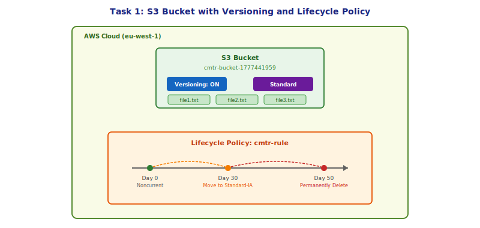
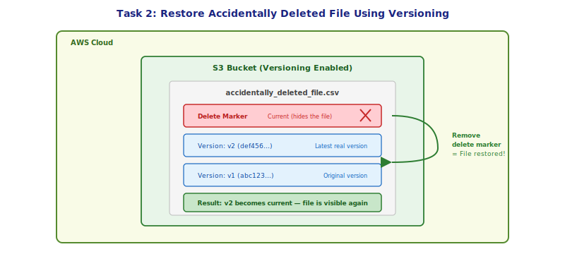
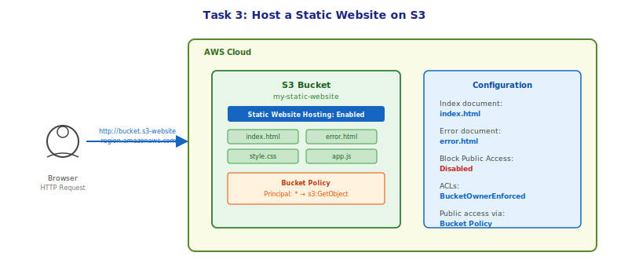
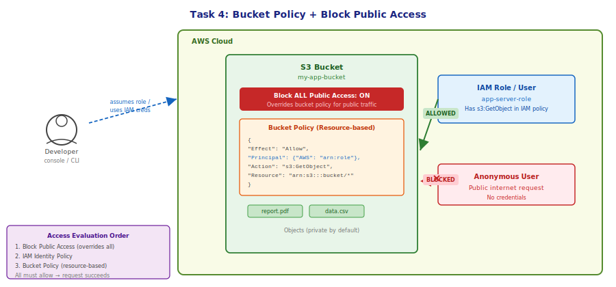
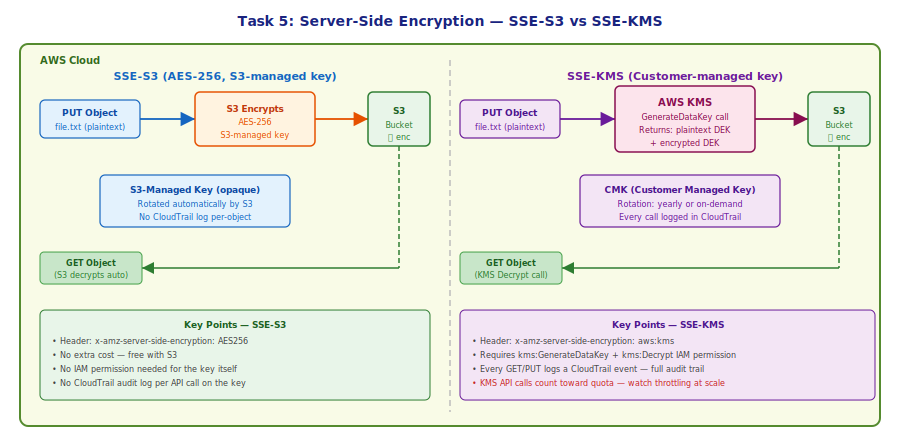
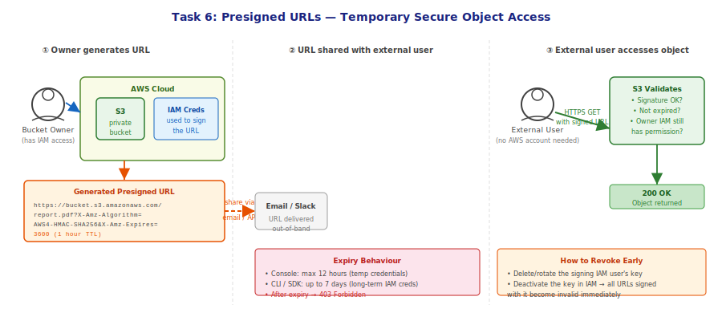
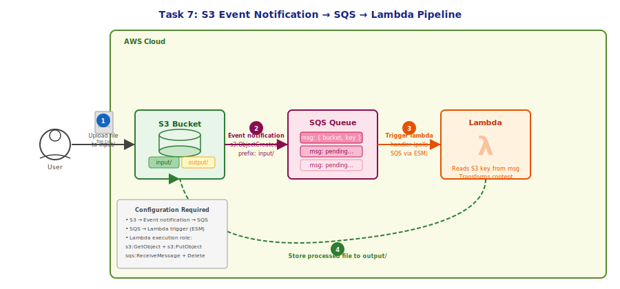
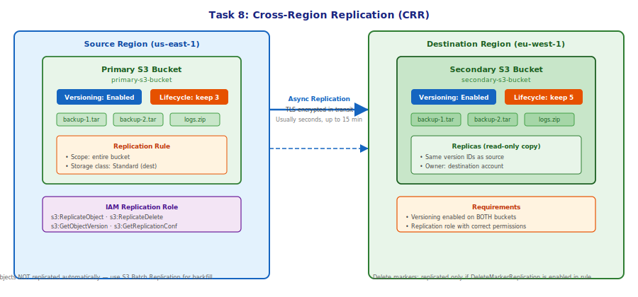
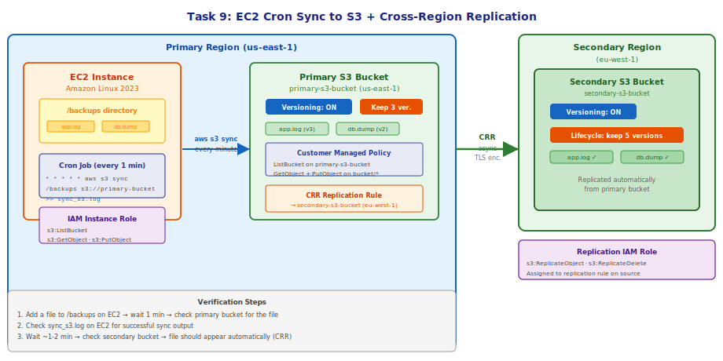
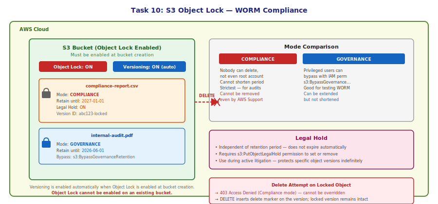

# Part 4.4: S3 Hands-On Tasks

---

## Table of Contents

1. [Task 1 — Create an S3 Bucket with Versioning and Lifecycle Policy](#task-1--create-an-s3-bucket-with-versioning-and-lifecycle-policy)
2. [Task 2 — Restore an Accidentally Deleted File Using Versioning](#task-2--restore-an-accidentally-deleted-file-using-versioning)
3. [Task 3 — Host a Static Website on S3](#task-3--host-a-static-website-on-s3)
4. [Task 4 — Secure a Bucket with Bucket Policy and Block Public Access](#task-4--secure-a-bucket-with-bucket-policy-and-block-public-access)
5. [Task 5 — Enable Server-Side Encryption (SSE-S3 and SSE-KMS)](#task-5--enable-server-side-encryption-sse-s3-and-sse-kms)
6. [Task 6 — Generate and Use Presigned URLs for Temporary Access](#task-6--generate-and-use-presigned-urls-for-temporary-access)
7. [Task 7 — S3 Event Notifications → SQS → Lambda Pipeline](#task-7--s3-event-notifications--sqs--lambda-pipeline)
8. [Task 8 — Set Up Cross-Region Replication (CRR)](#task-8--set-up-cross-region-replication-crr)
9. [Task 9 — Synchronize Files from EC2 to S3 with Cron + CRR](#task-9--synchronize-files-from-ec2-to-s3-with-cron--crr)
10. [Task 10 — S3 Object Lock and WORM Compliance](#task-10--s3-object-lock-and-worm-compliance)

---

## Task 1 — Create an S3 Bucket with Versioning and Lifecycle Policy

### Objective

Create an S3 bucket, enable versioning so every upload creates a new object version, upload a few files, and then configure a lifecycle policy that automatically moves noncurrent versions to cheaper storage and eventually deletes them. This covers the full day-to-day management flow for versioned buckets.



### Steps

**1. Create the bucket**

- Open the [S3 console](https://s3.console.aws.amazon.com/s3/) and click **Create bucket**.
- Bucket name: `my-versioned-bucket-<your-suffix>` (must be globally unique).
- AWS Region: `eu-west-1` (or your preferred region).
- Under **Object Ownership**, leave as **ACLs disabled (recommended)**.
- Leave **Block all public access** checked (default).
- Click **Create bucket**.

**2. Enable versioning**

- Open the bucket → **Properties** tab → **Bucket Versioning** section → **Edit**.
- Select **Enable** → **Save changes**.
- The bucket is now in the **Enabled** versioning state.

**3. Upload objects**

- Go to the **Objects** tab → **Upload**.
- Click **Add files**, select two or three small `.txt` files from your computer.
- Click **Upload**. Note the green success banner — each file now has a version ID.
- Upload the same file again (different content) to generate a second version. You can confirm by clicking **Show versions** toggle in the object list.

**4. Change the storage class of an object**

- Click the object name → **Properties** tab → **Storage class** → **Edit**.
- Change from **Standard** to **Standard-IA** → **Save changes**.
- This is a manual one-off change. Lifecycle policies automate this at scale.

**5. Create a lifecycle policy**

- Go to the bucket → **Management** tab → **Lifecycle rules** → **Create lifecycle rule**.
- Rule name: `noncurrent-version-management`.
- Rule scope: **Apply to all objects in the bucket**.
- Under **Lifecycle rule actions**, check:
  - **Transition noncurrent versions of objects between storage classes**
  - **Permanently delete noncurrent versions of objects**
- Transition: **Noncurrent days after becoming noncurrent** = `30`, **Storage class** = `Standard-IA`.
- Expiration: **Noncurrent days after becoming noncurrent** = `50`.
- Click **Create rule**.

**6. Verify**

- **Properties → Bucket Versioning** shows **Enabled**.
- **Management → Lifecycle rules** shows your rule with both transition and expiration actions.
- **Objects tab → Show versions** shows multiple version IDs for any re-uploaded file.

### Key Points

- A lifecycle policy acts only on **noncurrent** versions when versioning is enabled — the **current** version is unaffected until it itself becomes noncurrent.
- The days in the lifecycle rule are counted from the moment a version becomes noncurrent (i.e., a newer version replaces it), not from the original upload date.
- Once versioning is enabled it cannot be fully disabled — only **suspended**. Suspended state stops generating new version IDs (new objects get `null` ID) but existing versioned objects remain.
- Lifecycle rules are evaluated once per day; there can be up to 24 hours of lag before a rule takes effect.

---

## Task 2 — Restore an Accidentally Deleted File Using Versioning

### Objective

Simulate accidentally deleting a file from a versioned bucket, then restore the latest real version by removing the delete marker. This is the primary recovery method for accidental deletions in S3.



### Steps

**1. Use the bucket from Task 1** (versioning must be enabled).

**2. Simulate an accidental delete**

- Go to **Objects** tab, select one of the `.txt` files.
- Click **Delete** → type `permanently delete` → **Delete objects**.
- The file disappears from the object list. It looks gone, but versioning saved it.

**3. Reveal the delete marker**

- In the **Objects** tab, click the **Show versions** toggle.
- You will see a row for your file with **Type = Delete marker** — this is the "current" state that makes the object appear deleted.
- Below it you will see the actual content versions (v1, v2…) with their version IDs.

**4. Remove the delete marker**

- Select the **Delete marker** row (not the content versions).
- Click **Delete** → confirm → **Delete objects**.
- Toggle **Show versions** off. The file reappears in the object list — the most recent content version is now current again.

**5. Restore a specific older version**

- If you want to roll back to an earlier version rather than the latest:
  - **Show versions** on → select the specific version you want → **Actions → Download** to get a copy.
  - Or: select the version → **Actions → Copy** → paste to the same bucket/key to make it the new current version.

**6. Verify**

- Toggle off **Show versions**. The file is visible and accessible.
- Click the file → **Versions** tab — the delete marker is gone and the content version is current.

### Key Points

- A standard DELETE on a versioned object never physically removes data — it only adds a delete marker on top.
- To permanently delete a specific version you must explicitly delete **that version ID**. This is a two-step action, which prevents accidents.
- Delete markers themselves have no storage cost — you are only billed for the actual content versions.
- In MFA Delete mode (extra hardening), deleting a version or removing a delete marker requires an MFA token. Enable via CLI only — not available in the console.

---

## Task 3 — Host a Static Website on S3

### Objective

Configure an S3 bucket to serve a static HTML website over HTTP, attach a bucket policy that allows public reads, and verify that the site is reachable from a browser using the S3 website endpoint.



### Steps

**1. Create a new bucket for the website**

- **S3 console → Create bucket**.
- Name: `my-static-site-<suffix>`, region of your choice.
- **Block Public Access settings**: Uncheck **Block all public access** → Acknowledge the warning.
- Leave all other settings default → **Create bucket**.

**2. Upload website files**

- Create three files locally:
  - `index.html` — your homepage (any valid HTML)
  - `error.html` — shown on 404/missing pages
- **Objects tab → Upload** → add both files → **Upload**.

**3. Enable static website hosting**

- **Properties tab → Static website hosting → Edit**.
- Select **Enable**.
- Hosting type: **Host a static website**.
- Index document: `index.html`
- Error document: `error.html`
- **Save changes**.
- Copy the **Bucket website endpoint** URL shown at the bottom of the Static website hosting section.

**4. Attach a bucket policy for public read**

- **Permissions tab → Bucket policy → Edit**.
- Paste the following policy (replace `my-static-site-<suffix>` with your bucket name):

```json
{
  "Version": "2012-10-17",
  "Statement": [
    {
      "Sid": "PublicReadGetObject",
      "Effect": "Allow",
      "Principal": "*",
      "Action": "s3:GetObject",
      "Resource": "arn:aws:s3:::my-static-site-<suffix>/*"
    }
  ]
}
```

- **Save changes**.

**5. Verify**

- Open the bucket website endpoint URL in a browser — your HTML page should render.
- Try navigating to a path that doesn't exist (e.g., append `/missing`) — the `error.html` page should appear.

### Key Points

- The S3 website endpoint (`bucket.s3-website-region.amazonaws.com`) is HTTP only. For HTTPS, place a CloudFront distribution in front of the bucket.
- The static website endpoint and the REST API endpoint are different URLs — only the website endpoint interprets `index.html` as the root document.
- Block Public Access must be off at the bucket level before a `Principal: *` bucket policy can take effect. If Block Public Access is on, even a correctly written public policy is overridden and denied.
- ACLs are not needed — use bucket policies for public access. AWS recommends keeping ACLs disabled (Object Ownership = Bucket owner enforced).

---

## Task 4 — Secure a Bucket with Bucket Policy and Block Public Access

### Objective

Apply a bucket policy that grants a specific IAM role (e.g., an EC2 application server) access to objects, while keeping the bucket private from the public internet. Understand how Block Public Access, IAM policies, and bucket policies interact in the access evaluation chain.



### Steps

**1. Create the bucket (private)**

- **S3 console → Create bucket**.
- Name: `my-app-bucket-<suffix>`.
- Keep **Block all public access** enabled (default) — do not uncheck anything.
- **Create bucket**.

**2. Create an IAM role for access (if not already existing)**

- **IAM console → Roles → Create role**.
- Trusted entity: **AWS service → EC2** (or **Another AWS account** for cross-account).
- Attach the AWS managed policy **AmazonS3ReadOnlyAccess** as a starting point — you will narrow it with the bucket policy.
- Role name: `app-server-role` → **Create role**.
- Copy the role ARN from the role summary page.

**3. Write a bucket policy allowing only that role**

- Back in S3, open your bucket → **Permissions tab → Bucket policy → Edit**.
- Paste the following (replace the ARN and bucket name):

```json
{
  "Version": "2012-10-17",
  "Statement": [
    {
      "Sid": "AllowAppServerRole",
      "Effect": "Allow",
      "Principal": {
        "AWS": "arn:aws:iam::123456789012:role/app-server-role"
      },
      "Action": [
        "s3:GetObject",
        "s3:PutObject",
        "s3:DeleteObject"
      ],
      "Resource": "arn:aws:s3:::my-app-bucket-<suffix>/*"
    },
    {
      "Sid": "AllowListBucket",
      "Effect": "Allow",
      "Principal": {
        "AWS": "arn:aws:iam::123456789012:role/app-server-role"
      },
      "Action": "s3:ListBucket",
      "Resource": "arn:aws:s3:::my-app-bucket-<suffix>"
    }
  ]
}
```

- **Save changes**.

**4. Test access**

- From an EC2 instance with `app-server-role` attached:

```bash
aws s3 ls s3://my-app-bucket-<suffix>/
aws s3 cp localfile.txt s3://my-app-bucket-<suffix>/
aws s3 cp s3://my-app-bucket-<suffix>/localfile.txt ./downloaded.txt
```

- From your local machine (no role, just your IAM user with no explicit s3 allow):

```bash
aws s3 ls s3://my-app-bucket-<suffix>/
# Expected: Access Denied
```

**5. Add a Deny for non-TLS access (best practice)**

- Add a second statement to the bucket policy:

```json
{
  "Sid": "DenyNonSSL",
  "Effect": "Deny",
  "Principal": "*",
  "Action": "s3:*",
  "Resource": [
    "arn:aws:s3:::my-app-bucket-<suffix>",
    "arn:aws:s3:::my-app-bucket-<suffix>/*"
  ],
  "Condition": {
    "Bool": {
      "aws:SecureTransport": "false"
    }
  }
}
```

**6. Verify**

- **Permissions tab → Bucket policy** — shows your policy.
- **Permissions tab → Block public access** — all four checkboxes are still enabled.
- Accessing via `http://` (non-TLS) should now return 403.

### Key Points

- Access evaluation order: **Block Public Access → SCP (if used) → IAM Identity Policy → Bucket Policy**. All applicable layers must allow; any explicit Deny wins.
- A bucket policy `Allow` alone is NOT enough for an IAM user — the IAM identity policy must also allow the action (both must allow for cross-account; for same-account the IAM policy OR bucket policy can grant access).
- For cross-account access, the destination account's IAM policies must also explicitly allow S3 actions — the source bucket policy alone is insufficient.
- The `DenyNonSSL` statement forces encryption in transit and is a standard security baseline for any production bucket.

---

## Task 5 — Enable Server-Side Encryption (SSE-S3 and SSE-KMS)

### Objective

Configure default encryption on an S3 bucket first using S3-managed keys (SSE-S3 / AES-256), then upgrade to AWS KMS customer-managed keys (SSE-KMS). Understand the audit and permission differences between the two modes.



### Steps

**Part A — Enable SSE-S3 (Default Encryption)**

**1. Set default encryption on the bucket**

- Open any existing bucket → **Properties tab → Default encryption → Edit**.
- Encryption type: **Server-side encryption with Amazon S3 managed keys (SSE-S3)**.
- **Save changes**.

**2. Upload a file and inspect the encryption**

- **Objects tab → Upload** any file → **Upload** (no special settings needed — encryption is applied automatically).
- Click the uploaded object → **Properties** tab → **Server-side encryption** field shows `AES-256 (SSE-S3)`.

**3. Force encryption at upload via bucket policy (deny unencrypted uploads)**

- Go to **Permissions tab → Bucket policy → Edit**, add:

```json
{
  "Sid": "DenyUnencryptedUploads",
  "Effect": "Deny",
  "Principal": "*",
  "Action": "s3:PutObject",
  "Resource": "arn:aws:s3:::my-bucket-<suffix>/*",
  "Condition": {
    "StringNotEquals": {
      "s3:x-amz-server-side-encryption": "AES256"
    }
  }
}
```

---

**Part B — Upgrade to SSE-KMS**

**1. Create a KMS key**

- Open **AWS KMS console → Customer managed keys → Create key**.
- Key type: **Symmetric**, Key usage: **Encrypt and decrypt**.
- Alias: `alias/my-s3-key`.
- Key administrators and key users: add your IAM user or role.
- **Finish**. Copy the Key ARN.

**2. Update bucket default encryption**

- Back in S3, open the bucket → **Properties tab → Default encryption → Edit**.
- Encryption type: **AWS Key Management Service key (SSE-KMS)**.
- KMS key: **Choose from your KMS keys** → select `my-s3-key`.
- **Save changes**.

**3. Upload a file and inspect**

- Upload a new file. The existing files are still SSE-S3 encrypted — encryption is applied per upload, not retroactively.
- Click the new file → **Properties → Server-side encryption** shows `AWS-KMS` with your key ARN.

**4. Verify IAM permissions are needed**

- Try downloading the KMS-encrypted object with an IAM role that does NOT have `kms:Decrypt` permission → you should receive an Access Denied error. Add `kms:GenerateDataKey` and `kms:Decrypt` to the role to fix it.

### Key Points

- **SSE-S3**: Free, zero configuration, no additional IAM permissions required. No per-call audit trail on the key.
- **SSE-KMS**: Costs $0.03 per 10,000 API calls. Every GET/PUT generates a CloudTrail event for the KMS call — full audit trail. Requires `kms:GenerateDataKey` (on PUT) and `kms:Decrypt` (on GET) in the caller's IAM policy.
- Encryption is applied at write time. Existing objects are not retroactively re-encrypted when you change the default encryption setting. To encrypt existing objects, use **S3 Batch Operations** with a Copy operation.
- SSE-KMS at high request rates can hit KMS API throttle limits (default 5,500–30,000 RPS). Use S3 Bucket Keys to reduce KMS call volume by up to 99% — one data key is reused per S3 prefix.
- **SSE-C** (customer-provided keys): you supply the key on every request and AWS never stores it. Not configurable via console — CLI/SDK only.

---

## Task 6 — Generate and Use Presigned URLs for Temporary Access

### Objective

Generate a presigned URL for a private S3 object that allows anyone with the link to download it for a limited time, without needing AWS credentials. This is the correct pattern for giving temporary access to specific objects without making the bucket public.



### Steps

**1. Upload a private object**

- Use the bucket from Task 4 (private bucket, Block Public Access enabled).
- Upload a file, e.g., `private-report.pdf`.
- Verify it is NOT publicly accessible: try opening the direct S3 URL (`https://bucket.s3.amazonaws.com/private-report.pdf`) — you should get `AccessDenied`.

**2. Generate a presigned URL from the console**

- Click the object → **Object actions → Share with a presigned URL**.
- Duration: set to `60 minutes` (1 hour).
- Click **Create presigned URL** → copy the URL.

**3. Test the presigned URL**

- Open the URL in a browser or paste it into:

```bash
curl -o downloaded.pdf "<paste-the-presigned-url-here>"
```

- The file downloads successfully without any AWS credentials.

**4. Generate a presigned URL via AWS CLI (longer expiry)**

```bash
aws s3 presign s3://my-app-bucket-<suffix>/private-report.pdf \
  --expires-in 3600
```

- For 7-day expiry (maximum, requires long-term IAM credentials — not STS temporary creds):

```bash
aws s3 presign s3://my-app-bucket-<suffix>/private-report.pdf \
  --expires-in 604800
```

**5. Test expiry**

- Generate a URL with `--expires-in 30` (30 seconds).
- Wait 30 seconds, then try the URL again → you should get:

```xml
<Code>AccessDenied</Code>
<Message>Request has expired.</Message>
```

**6. Generate a presigned URL for upload (PUT)**

- To allow an external party to upload a specific object:

```bash
aws s3 presign s3://my-app-bucket-<suffix>/upload-target.txt \
  --http-method PUT \
  --expires-in 3600
```

- The recipient uses:

```bash
curl -X PUT -T localfile.txt "<presigned-put-url>"
```

### Key Points

- A presigned URL carries the permissions of the IAM identity that signed it. If that IAM user/role loses `s3:GetObject` permission after the URL is generated, the URL stops working immediately.
- Console-generated URLs use **STS temporary credentials** — maximum expiry is 12 hours regardless of what you enter.
- CLI/SDK-generated URLs using long-term IAM user keys allow up to 7 days expiry.
- There is no server-side revocation mechanism — you cannot invalidate a URL directly. To revoke, deactivate or delete the signing IAM access key.
- Presigned URLs work even when Block Public Access is enabled — they use signed credentials, not anonymous public access.

---

## Task 7 — S3 Event Notifications → SQS → Lambda Pipeline

### Objective

Build an event-driven pipeline where uploading a file to an S3 `input/` prefix automatically sends a notification to an SQS queue, which triggers a Lambda function that processes the file and writes the result to an `output/` prefix in the same bucket.



### Steps

**1. Create the SQS queue**

- **SQS console → Create queue**.
- Type: **Standard** (not FIFO — S3 event notifications require Standard queues).
- Name: `s3-event-queue`.
- Under **Access policy**, switch to **Advanced** and paste this (replace region, account ID, bucket name):

```json
{
  "Version": "2012-10-17",
  "Statement": [
    {
      "Effect": "Allow",
      "Principal": { "Service": "s3.amazonaws.com" },
      "Action": "sqs:SendMessage",
      "Resource": "arn:aws:sqs:eu-west-1:123456789012:s3-event-queue",
      "Condition": {
        "ArnLike": {
          "aws:SourceArn": "arn:aws:s3:::my-pipeline-bucket-<suffix>"
        }
      }
    }
  ]
}
```

- **Create queue**. Copy the Queue ARN.

**2. Create the S3 bucket**

- **S3 console → Create bucket**: `my-pipeline-bucket-<suffix>`.
- Keep Block Public Access enabled.
- **Create bucket**.

**3. Configure the S3 event notification**

- Open the bucket → **Properties tab → Event notifications → Create event notification**.
- Event name: `input-folder-upload-event`.
- Prefix: `input/`
- Event types: Check **All object create events** (s3:ObjectCreated:*).
- Destination: **SQS queue** → select `s3-event-queue`.
- **Save changes**.

**4. Create the Lambda function**

- **Lambda console → Create function → Author from scratch**.
- Function name: `s3-file-processor`.
- Runtime: **Python 3.12**.
- Execution role: **Create a new role** (or use an existing role) — you will add permissions next.
- **Create function**.
- Paste the following code into the inline editor and **Deploy**:

```python
import json, boto3, urllib.parse

s3 = boto3.client('s3')

def lambda_handler(event, context):
    for record in event['Records']:
        body = json.loads(record['body'])
        for s3_record in body.get('Records', []):
            bucket = s3_record['s3']['bucket']['name']
            key = urllib.parse.unquote_plus(s3_record['s3']['object']['key'])
            
            # Read the file from input/
            response = s3.get_object(Bucket=bucket, Key=key)
            content = response['Body'].read().decode('utf-8')
            
            # Process: convert to uppercase
            processed = content.upper()
            
            # Write to output/
            output_key = key.replace('input/', 'output/', 1)
            s3.put_object(Bucket=bucket, Key=output_key, Body=processed.encode('utf-8'))
            print(f"Processed {key} → {output_key}")
    
    return {'statusCode': 200}
```

**5. Add permissions to the Lambda execution role**

- **Configuration tab → Permissions → Execution role → click the role name** (opens IAM).
- **Add permissions → Attach policies**:
  - `AmazonS3FullAccess` (or a scoped custom policy with `s3:GetObject` + `s3:PutObject`).
- Return to Lambda. Under **Configuration → Permissions**, also confirm that Lambda has the SQS permissions needed to poll (`sqs:ReceiveMessage`, `sqs:DeleteMessage`, `sqs:GetQueueAttributes`) — these come from the managed policy `AWSLambdaSQSQueueExecutionRole`.

**6. Add SQS as a Lambda trigger**

- **Lambda console → Configuration tab → Triggers → Add trigger**.
- Trigger source: **SQS**.
- SQS queue: select `s3-event-queue`.
- Batch size: `1`.
- **Add**.
- Wait for the trigger status to show **Enabled**.

**7. Test the pipeline**

- **S3 console → Upload** a `.txt` file into the `input/` prefix (create the folder in the upload dialog if needed by typing `input/` before the filename).
- After ~10–30 seconds, check the `output/` prefix in the bucket — the processed (uppercased) file should appear automatically.

**8. Verify**

- Check **Lambda → Monitor → Logs** in CloudWatch for execution logs.
- Check **SQS → s3-event-queue → Send and receive messages → Poll for messages** — the queue should be empty (messages were consumed by Lambda).
- The `output/` folder in S3 contains the transformed file.

### Key Points

- Using SQS as an intermediary (rather than triggering Lambda directly from S3) adds **durability**: if Lambda fails, the message stays in the queue and is retried. Direct S3 → Lambda can lose events if Lambda throttles.
- The SQS queue **resource policy** must explicitly allow `s3.amazonaws.com` to call `sqs:SendMessage`. Without this, S3 event delivery fails silently — always test by checking **S3 → Properties → Event notifications → Test destination** before proceeding.
- S3 event notifications are **at-least-once** delivery — duplicate events are possible. Make your Lambda idempotent (writing the same output for the same input twice should be harmless).
- The `output/` folder is created automatically when Lambda puts the first object there. No need to pre-create it.
- Lambda ESM (Event Source Mapping) polls SQS in batches. With a batch size of 1, each Lambda invocation handles one file. Increase batch size for higher throughput.

---

## Task 8 — Set Up Cross-Region Replication (CRR)

### Objective

Configure Cross-Region Replication (CRR) so that every object uploaded to a source bucket in one AWS region is automatically and asynchronously copied to a destination bucket in a different region. This is the standard pattern for disaster recovery and geo-redundancy.



### Steps

**1. Create the source bucket**

- **S3 console → Create bucket**.
- Name: `primary-bucket-<suffix>`, Region: `us-east-1`.
- **Enable Bucket Versioning** (versioning is required for replication).
- **Create bucket**.

**2. Create the destination bucket**

- **Create bucket**.
- Name: `secondary-bucket-<suffix>`, Region: `eu-west-1` (must be different from source).
- **Enable Bucket Versioning** (also required on the destination).
- **Create bucket**.

**3. Configure replication on the source bucket**

- Open `primary-bucket-<suffix>` → **Management tab → Replication rules → Create replication rule**.
- Rule name: `replicate-all-to-eu`.
- Status: **Enabled**.
- Source bucket scope: **Apply to all objects in the bucket** (or set a prefix filter).
- Destination:
  - **Choose a bucket in this account** → browse → select `secondary-bucket-<suffix>`.
  - Storage class: leave as **Same as source** or choose a cheaper class.
- IAM role: **Create new role** (AWS creates a role with the necessary permissions automatically).
- Click **Save**.

**4. (Optional) Enable delete marker replication**

- Back in the replication rule → **Edit**.
- Under **Additional replication options**, enable **Delete marker replication** if you want delete markers to also be replicated.

**5. Test replication**

- Upload a new object to `primary-bucket-<suffix>`.
- Wait 1–2 minutes, then check `secondary-bucket-<suffix>` — the object should appear.
- Click the replicated object → **Properties** tab → **Replication status** shows `REPLICA`.

**6. Configure lifecycle policies on both buckets**

- Source bucket: **Management → Lifecycle rules** — rule to delete noncurrent versions after 30 days (keep last 3 versions).
- Destination bucket: a separate rule to keep the last 5 versions (more retention at the DR site is typical).

**7. Verify**

- Objects in the destination have **Replication status: REPLICA**.
- New uploads to the source appear in the destination within minutes.
- Objects uploaded before the replication rule was created are NOT replicated — use **S3 Batch Replication** for the backfill.

### Key Points

- Replication is **asynchronous** — there is no guaranteed SLA by default. Enable **S3 Replication Time Control (RTC)** if you need a 99.99% SLA that objects replicate within 15 minutes (additional cost).
- Replication only applies to **new objects** written after the rule is created. Pre-existing objects require S3 Batch Replication to backfill.
- Both source and destination buckets must have versioning enabled. Replication cannot be set up without it.
- Objects encrypted with SSE-KMS are replicated, but you must specify the KMS key in the replication rule (destination key) and grant the replication role `kms:GenerateDataKey` and `kms:Decrypt` permissions on both keys.
- Delete markers are NOT replicated by default — you must explicitly enable delete marker replication in the rule. This prevents a delete in one region from cascading to your DR copy.
- Cross-account CRR is supported: the destination bucket policy must grant the source account's replication role permission to write objects.

---

## Task 9 — Synchronize Files from EC2 to S3 with Cron + CRR

### Objective

Set up an EC2 instance that automatically syncs a local directory to S3 every minute using a cron job. Combine this with Cross-Region Replication so that every synced file is automatically replicated to a secondary bucket in another region — creating a fully automated backup pipeline.



### Steps

**1. Set up both buckets (same as Task 8)**

Use `primary-bucket-<suffix>` (us-east-1) and `secondary-bucket-<suffix>` (eu-west-1), both with versioning enabled and CRR configured.

**2. Create a customer managed IAM policy for EC2**

- **IAM console → Policies → Create policy → JSON**:

```json
{
  "Version": "2012-10-17",
  "Statement": [
    {
      "Effect": "Allow",
      "Action": "s3:ListBucket",
      "Resource": "arn:aws:s3:::primary-bucket-<suffix>"
    },
    {
      "Effect": "Allow",
      "Action": ["s3:GetObject", "s3:PutObject"],
      "Resource": "arn:aws:s3:::primary-bucket-<suffix>/*"
    }
  ]
}
```

- Policy name: `ec2-s3-sync-policy`. **Create policy**.

**3. Create an IAM role for EC2 and attach the policy**

- **IAM → Roles → Create role → AWS service → EC2**.
- Attach `ec2-s3-sync-policy`.
- Role name: `ec2-s3-sync-role`. **Create role**.

**4. Launch an EC2 instance with the role attached**

- **EC2 console → Launch instance**.
- AMI: **Amazon Linux 2023**.
- Instance type: `t2.micro`.
- IAM instance profile: select `ec2-s3-sync-role`.
- **Launch**.

**5. Connect to the instance and create the /backups directory**

- Connect via EC2 Instance Connect or SSH.

```bash
mkdir -p /backups
echo "Initial file created at $(date)" > /backups/initial.txt
```

**6. Manually test sync**

```bash
aws s3 sync /backups s3://primary-bucket-<suffix> >> /home/ec2-user/sync_s3.log 2>&1
```

- Check your bucket — `initial.txt` should appear.

**7. Set up the cron job**

```bash
crontab -e
```

- Add the following line (redirecting output to the pre-created log file):

```
* * * * * aws s3 sync /backups s3://primary-bucket-<suffix> >> /home/ec2-user/sync_s3.log 2>&1
```

- Save and exit the editor. Verify with `crontab -l`.

**8. Test the cron job**

```bash
echo "Cron test file created at $(date)" > /backups/test-$(date +%s).txt
```

- Wait 1 minute, then check the bucket — the new file should appear.
- Confirm the log captured output:

```bash
tail -20 /home/ec2-user/sync_s3.log
```

**9. Verify end-to-end**

- New files in `/backups` on EC2 → appear in primary bucket within 1 minute.
- Files in primary bucket → appear in secondary bucket within ~1–2 minutes (CRR).
- Primary bucket: 3 noncurrent versions kept (lifecycle rule).
- Secondary bucket: 5 noncurrent versions kept.

### Key Points

- `aws s3 sync` only uploads **new or modified** files — it compares ETags and sizes, skipping unchanged files. This keeps sync fast and minimizes S3 API costs.
- The `--delete` flag makes sync mirror the source directory (deletes objects from S3 that no longer exist in `/backups`). **Do not add `--delete` if you want S3 as a backup — you want S3 to retain files even after the local copy is removed.**
- `aws s3 sync` uses multiple threads by default. For large numbers of files, `--exact-timestamps` may be needed to catch updates that change content but not file size.
- The cron output MUST be redirected to the log file — if the cron job writes to stdout without redirection, it generates system mail on the instance which can fill disk over time.
- IAM instance profile credentials are rotated automatically. No access keys are needed on the instance — never hardcode credentials in scripts.
- Combine with **S3 Versioning** so that `sync` overwrites create new versions rather than destroying old data.

---

## Task 10 — S3 Object Lock and WORM Compliance

### Objective

Create a bucket with Object Lock enabled, upload objects in Compliance and Governance retention modes, understand the difference between the two modes, and test the behavior of attempted deletions.



### Steps

**1. Create a bucket with Object Lock enabled**

- **S3 console → Create bucket**.
- Name: `my-worm-bucket-<suffix>`.
- Scroll to **Object Lock** → **Enable** → Acknowledge that versioning will also be enabled.
- Default retention: leave as **None** for now (you will set per-object retention in a later step).
- **Create bucket**.
- Note: Object Lock **cannot be enabled on an existing bucket**. It must be set at creation time.

**2. Upload an object and apply Compliance mode retention**

- Upload a file, e.g., `compliance-report.csv`.
- After upload, click the object → **Object actions → Edit retention**.
- Mode: **Compliance**.
- Retain until date: set a date 1 day in the future.
- **Save changes**.

**3. Try to delete the Compliance-mode object (should fail)**

- Select `compliance-report.csv` → **Delete**.
- Even confirming the deletion will result in an error: `Object is locked`.
- Even the root AWS account cannot override Compliance mode.

**4. Apply Governance mode retention to another object**

- Upload a second file, e.g., `internal-draft.txt`.
- **Object actions → Edit retention**.
- Mode: **Governance**.
- Retain until: 1 day from now.
- **Save changes**.

**5. Try to delete the Governance-mode object**

- Without the bypass permission → deletion fails just like Compliance mode.
- With the `s3:BypassGovernanceRetention` IAM permission, you CAN delete by adding the request header `x-amz-bypass-governance-retention: true`:

```bash
aws s3api delete-object \
  --bucket my-worm-bucket-<suffix> \
  --key internal-draft.txt \
  --version-id <version-id> \
  --bypass-governance-retention
```

**6. Set a Legal Hold**

- Click any object → **Object actions → Edit legal hold**.
- Legal Hold: **On**.
- **Save changes**.
- Legal Hold blocks deletion independently of the retention period. It does not expire — it must be explicitly removed.
- To remove legal hold:
  - **Object actions → Edit legal hold → Off → Save changes** (requires `s3:PutObjectLegalHold` permission).

**7. Set a default retention policy on the bucket**

- Open the bucket → **Properties tab → Object Lock → Edit**.
- Default retention mode: **Governance**.
- Retention period: `1 day`.
- **Save changes**.
- Now every new object uploaded to this bucket automatically gets a 1-day Governance retention without needing to set it per object.

**8. Verify**

```bash
aws s3api get-object-retention \
  --bucket my-worm-bucket-<suffix> \
  --key compliance-report.csv
```

```bash
aws s3api get-object-legal-hold \
  --bucket my-worm-bucket-<suffix> \
  --key compliance-report.csv
```

### Key Points

- **Object Lock requires Versioning** — it is enabled automatically when Object Lock is enabled. You cannot have Object Lock without versioning.
- **Compliance mode**: No one — not even the root account, not AWS Support — can shorten or remove the retention period before it expires. Designed for SEC 17a-4, HIPAA, and similar regulatory requirements.
- **Governance mode**: A privileged IAM user with `s3:BypassGovernanceRetention` can delete the object or shorten the period. Use this for testing or internal data governance where flexibility is needed.
- **Legal Hold** is independent of the retention date. An object can be past its retention date but still undeletable if Legal Hold is ON. Conversely, Legal Hold can be removed from an object that is still within its retention period — it still cannot be deleted because of the retention.
- When you DELETE on a versioned Object Lock bucket, S3 adds a delete marker (same as normal versioning). The **locked version itself is untouched**. Only deleting a specific version ID is blocked by Object Lock.
- S3 Object Lock does NOT protect against accidental deletion of the **bucket itself** — only objects within it. Enable **S3 MFA Delete** or use SCPs to prevent bucket deletion.
- To audit locked objects: `aws s3api list-object-versions` and inspect `ObjectRetention` on each version.

---

## Summary: Task Progression

| Task | Difficulty | Core Skills |
|---|---|---|
| 1 | Beginner | Bucket creation, versioning, lifecycle rules |
| 2 | Beginner | Delete markers, version recovery |
| 3 | Beginner | Static website hosting, bucket policy |
| 4 | Intermediate | Bucket policy, Block Public Access, IAM roles |
| 5 | Intermediate | SSE-S3, SSE-KMS, encryption enforcement |
| 6 | Intermediate | Presigned URLs, temporary access patterns |
| 7 | Advanced | Event notifications, SQS, Lambda, ESM |
| 8 | Advanced | CRR, replication roles, versioning at scale |
| 9 | Advanced | EC2 cron sync, IAM scoping, combined CRR pipeline |
| 10 | Advanced | Object Lock, Compliance vs Governance, Legal Hold |
