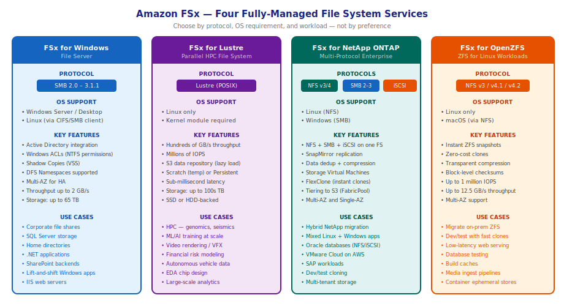
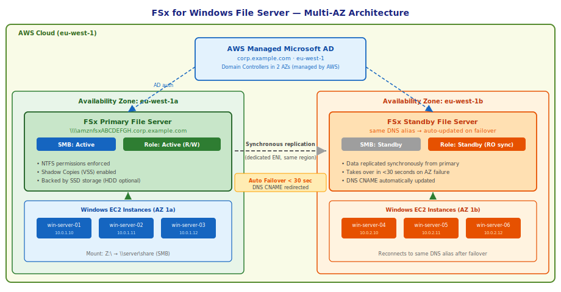
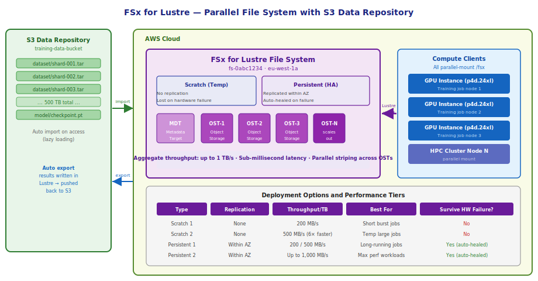
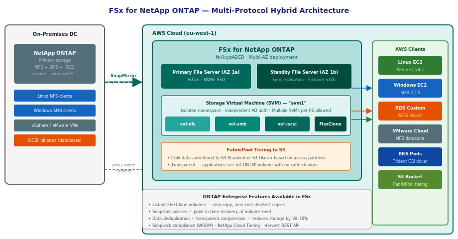
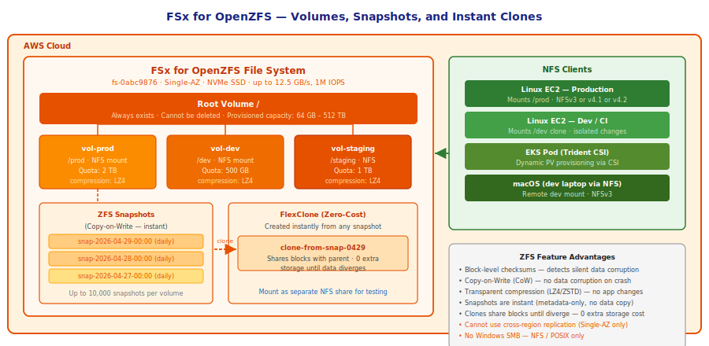

# Part 5: Amazon FSx Deep Dive

---

## Table of Contents

1. [What FSx Is — and Why It Exists](#1-what-fsx-is--and-why-it-exists)
2. [The Four FSx Variants at a Glance](#2-the-four-fsx-variants-at-a-glance)
3. [FSx for Windows File Server](#3-fsx-for-windows-file-server)
4. [FSx for Lustre](#4-fsx-for-lustre)
5. [FSx for NetApp ONTAP](#5-fsx-for-netapp-ontap)
6. [FSx for OpenZFS](#6-fsx-for-openzfs)
7. [Choosing Between EFS and FSx](#7-choosing-between-efs-and-fsx)
8. [Hands-On: FSx for Windows File Server](#8-hands-on-fsx-for-windows-file-server)
9. [Hands-On: FSx for Lustre with S3 Data Repository](#9-hands-on-fsx-for-lustre-with-s3-data-repository)
10. [Backup and DR Across FSx Types](#10-backup-and-dr-across-fsx-types)
11. [Pricing Model](#11-pricing-model)
12. [Key Points to Remember](#12-key-points-to-remember)
13. [Self-Check Questions](#13-self-check-questions)

---

## 1. What FSx Is — and Why It Exists

EFS is AWS's own network file system for Linux. It works well for the most common shared-storage use case: many Linux EC2 instances reading and writing files over NFS. But EFS deliberately covers one protocol (NFSv4.1) and one operating system (Linux). The moment you step outside that boundary — Windows shares, high-performance parallel I/O, NetApp feature parity, or ZFS semantics — EFS cannot help.

FSx fills each of those gaps with a separate, fully managed service. The name "FSx" is not a protocol or a technology; it is AWS's brand for **managed third-party file systems**. Each FSx variant runs a real, commercially supported file system engine under the hood — Microsoft's Windows Server storage stack, Intel and DDN's Lustre, NetApp ONTAP, and OpenZFS. AWS manages the hardware, OS patching, high availability, and backups. You get the file system features without running the servers.

The decision to use FSx (rather than EFS) is almost always driven by a specific requirement: Windows SMB access, massively parallel HPC throughput, multi-protocol ONTAP features, or ZFS copy-on-write semantics. If none of those requirements apply, EFS is the right choice for Linux workloads.

---

## 2. The Four FSx Variants at a Glance



| | FSx for Windows | FSx for Lustre | FSx for NetApp ONTAP | FSx for OpenZFS |
|:--|:--|:--|:--|:--|
| **Protocol** | SMB 2.0–3.1.1 | Lustre (POSIX) | NFS + SMB + iSCSI | NFS v3/4.1/4.2 |
| **OS** | Windows, Linux (SMB) | Linux only | Linux + Windows | Linux, macOS |
| **HA model** | Multi-AZ (active/standby) | Single-AZ | Multi-AZ or Single-AZ | Multi-AZ or Single-AZ |
| **Max throughput** | 2 GB/s | 1+ TB/s aggregate | 4 GB/s per FS | 12.5 GB/s |
| **Max storage** | 65 TB | Hundreds of TB | 192 TB (scalable) | 512 TB |
| **Snapshots** | Shadow Copies (VSS) | None natively | ONTAP snapshots | ZFS snapshots (instant) |
| **AD integration** | Native (required) | Not supported | Via SVM CIFS server | Not supported |
| **S3 integration** | No | Yes (data repository) | Via FabricPool tiering | No |
| **Killer feature** | Windows ACLs + AD | Parallel HPC I/O | Multi-protocol + FlexClone | CoW snapshots + instant clones |
| **Primary migration source** | On-prem Windows shares | On-prem Lustre / HPC clusters | On-prem NetApp ONTAP | On-prem ZFS appliances |

---

## 3. FSx for Windows File Server

### What it is

FSx for Windows File Server is a fully managed Windows file system built on Windows Server storage. It exposes an SMB share — the same protocol used by every Windows computer to access network drives. Any application that works with a Windows network drive (mapped as `Z:\` or accessed via `\\server\share`) works with FSx for Windows without any code changes.

### Architecture



The critical architectural decisions are:

**Active Directory integration** is mandatory. FSx for Windows joins a domain — either AWS Managed Microsoft AD or your own on-premises AD connected via VPN or Direct Connect. This means file access is controlled by Windows ACLs (NTFS permissions) using the same users and groups as the rest of your Windows environment. There is no concept of "S3-style" bucket policies or IAM here — it is pure Windows security.

**Multi-AZ deployment** runs a primary file server in one AZ and a synchronous standby in a second AZ. Replication happens over a dedicated network link. On primary failure (or AZ outage), the standby is promoted automatically and the file system's DNS name is updated. This failover takes under 30 seconds. Clients that reconnect to the same DNS name transparently land on the new primary.

**Single-AZ deployment** stores data on redundant storage within one AZ. Cheaper, but no AZ-level HA. Use for dev/test or non-critical workloads.

### Storage and throughput

FSx for Windows uses SSD storage by default (also offers HDD-backed option for cost savings on infrequently accessed data). You choose throughput capacity at creation time — from 8 MB/s up to 2 GB/s — and can modify it after creation without downtime.

The relationship between storage and throughput is independent. You can have 1 TB of storage with 2 GB/s throughput, or 64 TB with 64 MB/s. This makes FSx for Windows much more flexible than EBS, where performance and size are coupled for some volume types.

### Shadow Copies (Volume Shadow Copy Service)

VSS is Windows' built-in point-in-time snapshot mechanism. FSx for Windows supports VSS-based shadow copies out of the box. You configure a schedule (e.g., daily at midnight) and a retention limit (e.g., 14 copies), and FSx automatically takes shadow copies. End users can right-click any file or folder in Windows Explorer → **Previous Versions** and restore directly — without involving an administrator or a backup service.

Shadow copies are stored within the file system's storage capacity, so they consume space. If shadow copies grow large, they start displacing data. Monitor `FreeStorageCapacity` in CloudWatch.

### DFS Namespaces

FSx for Windows supports Distributed File System (DFS) Namespaces, which let you create a single virtual path (e.g., `\\company\data`) that maps to one or more FSx file shares behind the scenes. This is the standard enterprise pattern for building a unified namespace across multiple file servers. You configure DFS Namespaces on a Windows EC2 instance (or on-premises AD server) pointing to the FSx share.

### Access from Linux

Despite being an SMB server, FSx for Windows can be mounted from Linux using the `cifs-utils` package:

```bash
sudo yum install -y cifs-utils
sudo mount -t cifs //fs-xxxxx.corp.example.com/share /mnt/windows-share \
  -o username=domain\\user,password=pass,domain=corp.example.com
```

Linux clients get access to the share but do NOT get Windows ACL enforcement at the kernel level — they operate under the SMB delegation of the domain user's permissions.

---

## 4. FSx for Lustre

### What it is

Lustre is an open-source parallel file system that was designed from the ground up for high-performance computing. It is the file system behind some of the world's fastest supercomputers. FSx for Lustre gives you a fully managed Lustre cluster — the same system, without managing the nodes, networking, or storage hardware.

The defining characteristic of Lustre is **parallel I/O**. Where NFS (EFS) sends file data through a single server, Lustre stripes each file across many Object Storage Targets (OSTs) simultaneously. Reads and writes from multiple clients hit different OSTs at the same time, so aggregate throughput scales with the number of OSTs. A Lustre file system with 20 OSTs and 100 compute nodes achieves throughput that no NFS-based system can approach.

### Architecture



The internal components of a Lustre file system:

- **MDT (Metadata Target)**: stores file names, directories, permissions, and the striping layout (which OSTs hold which parts of each file). Every file operation starts with an MDT lookup.
- **OSTs (Object Storage Targets)**: store the actual file data. Files are automatically striped across multiple OSTs. The stripe count and stripe size are configurable per file or directory.
- **Clients**: EC2 instances with the Lustre kernel module installed. Each client communicates directly with the relevant OSTs for data — no single-server bottleneck.

### S3 Data Repository

This is FSx for Lustre's most powerful feature for AWS workloads. You link the Lustre file system to an S3 bucket. Objects in S3 appear as files in the Lustre namespace immediately — but the data is not copied eagerly. It is **lazy-loaded**: when a compute node first reads a file, FSx pulls it from S3 into the Lustre OSTs. Subsequent reads are served from fast NVMe storage.

When jobs write output files, FSx can automatically export them back to S3 asynchronously (or on-demand using `hsm_release`). This means your permanent data lives in S3 (durable, cheap), while Lustre acts as a high-speed scratch layer for computation.

```
Workflow for an ML training job:

1. Training dataset: 50 TB stored in s3://ml-datasets/
2. Create FSx for Lustre, link to the S3 bucket
3. Files appear immediately in /fsx/ — but no data transferred yet
4. Start training job — 100 GPU nodes read /fsx/shard-*.tar
5. FSx lazy-loads each shard from S3 on first access
6. Subsequent reads: served from NVMe at full Lustre speed
7. Checkpoints written to /fsx/checkpoints/ → auto-exported to S3
8. Delete the Lustre file system when training ends (data safe in S3)
```

This pattern keeps costs low: you only pay for Lustre while the compute job runs, and permanent storage stays in S3.

### Deployment types

| Type | Replication | Throughput per TB | Survives hardware failure | Use When |
|:-----|:-----------|:-----------------|:--------------------------|:---------|
| **Scratch 1** | None | 200 MB/s | No | Short, cheap burst jobs |
| **Scratch 2** | None | 500 MB/s | No | Faster scratch, same no-HA |
| **Persistent 1** | Within AZ | 50–200 MB/s | Yes (auto-healed) | Long-running jobs, production |
| **Persistent 2** | Within AZ | 125–1,000 MB/s | Yes (auto-healed) | Max-performance production |

Scratch file systems have no replication. If a storage server loses a disk, data on that server is gone. This sounds dangerous, but for HPC workloads reading from S3, the data is always recoverable from S3 — the Lustre layer is disposable.

### Mounting Lustre on EC2

```bash
# Install Lustre client (Amazon Linux 2023)
sudo amazon-linux-extras install -y lustre

# Mount the file system
sudo mkdir -p /fsx
sudo mount -t lustre -o relatime,flock \
  fs-0abc1234.fsx.eu-west-1.amazonaws.com@tcp:/fsx-mountname /fsx

# Verify
df -h /fsx
lfs df /fsx          # shows per-OST usage
```

### When NOT to use Lustre

Lustre is tuned for large sequential I/O and parallel access from many clients. For small random I/O (databases), single-client workloads, or anything requiring Windows support, use a different service. Lustre is also Linux-only — the client kernel module does not run on Windows.

---

## 5. FSx for NetApp ONTAP

### What it is

NetApp ONTAP is the operating system that runs NetApp storage appliances — a dominant force in enterprise on-premises storage for 30 years. FSx for NetApp ONTAP delivers ONTAP's full feature set as a managed AWS service. For organizations running NetApp on-premises and migrating to AWS, it offers a path where the storage admin's existing skills, tooling, and workflows transfer directly.

The unique value proposition is **multi-protocol access**. A single FSx for ONTAP file system serves NFS (Linux), SMB (Windows), and iSCSI (block devices) simultaneously from the same pool of storage. No other AWS storage service can do this.

### Architecture



### Storage Virtual Machines (SVMs)

A Storage Virtual Machine is an isolated namespace within the ONTAP file system. Each SVM has its own NFS exports, SMB shares, iSCSI LUNs, and security context. You can create multiple SVMs on one file system — for example, one SVM per tenant in a multi-tenant environment, or one SVM for Windows workloads and one for Linux.

Each SVM has its own Active Directory join (for SMB/CIFS) and its own set of volumes. From a user's perspective, an SVM looks like an independent storage system.

### Volumes and FlexClone

ONTAP volumes are the unit of storage within an SVM. Each volume has its own capacity limit, performance policy, snapshot schedule, and export policy. Volumes can be resized online without downtime.

**FlexClone** is ONTAP's copy-on-write cloning mechanism. Creating a clone of a volume is instantaneous regardless of the volume's size — it takes milliseconds whether the source is 10 GB or 100 TB. The clone initially shares all data blocks with the parent volume, consuming zero additional storage. As the clone diverges (new data written), only the changed blocks are stored separately. This is the standard pattern for creating disposable test environments from production data:

```
Production vol-prod: 10 TB of application data
Clone for QA team: instant, zero extra storage
Clone for load test: instant, zero extra storage
Clone for dev-1: instant, zero extra storage
Clone for dev-2: instant, zero extra storage

Each developer has their own full copy of production data.
Combined extra storage consumed: 0 GB (until they write new data).
```

### SnapMirror — Hybrid Cloud Replication

SnapMirror is ONTAP's built-in replication protocol. If your organization has on-premises NetApp ONTAP, you can configure SnapMirror to replicate volumes from on-premises to FSx for NetApp ONTAP asynchronously. This is the standard AWS migration path for NetApp workloads: replicate first, cut over when ready, with no downtime and no data loss window longer than the last replication cycle.

SnapMirror also works between two FSx for ONTAP file systems in different AWS regions — serving as cross-region disaster recovery.

### FabricPool Tiering to S3

ONTAP supports storage tiering via FabricPool: cold data blocks within ONTAP volumes are automatically offloaded to an S3 bucket. The tiering is fully transparent — applications read and write through the ONTAP volume with no code changes. Cold blocks are physically stored in S3 but appear as part of the volume. This reduces storage costs for workloads with a hot/cold data access pattern.

### iSCSI for Block Workloads

The iSCSI target in ONTAP presents storage as a block device (LUN) to initiators. An EC2 instance with the `open-iscsi` initiator treats the FSx LUN like a local EBS volume — it must be formatted and mounted. This is used for workloads that need block-level storage but want ONTAP's snapshot, replication, and cloning features that EBS snapshots alone cannot match.

---

## 6. FSx for OpenZFS

### What it is

OpenZFS is the open-source evolution of Sun Microsystems' ZFS file system, now maintained by the OpenZFS project. ZFS was designed around a core philosophy: the file system should be the last line of defense against silent data corruption. It achieves this through end-to-end checksums on every block — every read verifies the checksum against the stored value, detecting and reporting (or auto-correcting with redundancy) any bit rot, firmware bugs, or storage hardware errors.

FSx for OpenZFS delivers OpenZFS as a managed service. It is the right choice when you are migrating from on-premises ZFS storage (FreeNAS, TrueNAS, Oracle Solaris ZFS), or when you specifically need ZFS's snapshot-and-clone semantics for development workflows.

### Architecture



### Volume hierarchy

Every FSx for OpenZFS file system has a root volume. You create child volumes beneath it, each with its own:
- Quota (maximum storage limit)
- Reservation (guaranteed minimum storage)
- Compression algorithm (LZ4 for speed, ZSTD for compression ratio)
- NFS export policy
- Snapshot schedule

Child volumes inherit settings from the parent by default. The hierarchy is a management tool, not a performance boundary — all volumes share the same underlying NVMe SSD pool.

### Snapshots and Clones

ZFS snapshots are **copy-on-write** and **instantaneous**. Creating a snapshot writes zero bytes of data — it simply records a pointer to the current state of the volume's block tree. The snapshot costs no storage until the live volume starts modifying blocks that the snapshot also references. As blocks in the live volume change, ZFS copies the old block to the snapshot's "frozen" reference before writing the new data. This means:

- Snapshot creation: milliseconds, regardless of volume size
- Snapshot storage: only the changed blocks since the snapshot was taken
- Maximum snapshots per volume: 10,000

Clones are writable volumes created from a snapshot. They start with zero additional storage and diverge from the parent only as they receive writes. The use case is immediate: you have a 5 TB production database volume, and you want to give four developers independent copies for feature testing. You take a snapshot, create four clones in under a second, and each developer mounts their clone. Combined extra storage is 0 GB until they start writing.

### Performance

FSx for OpenZFS is the highest-performance FSx option for single-file-system workloads:

- Up to **1 million IOPS** (with SSD-enabled caching)
- Up to **12.5 GB/s** throughput
- Sub-millisecond latencies

This outperforms EFS General Purpose and matches what EBS can provide, while still being a network file system accessible from multiple clients simultaneously.

### Limitations to know

- **NFS only** — no SMB, no iSCSI, no Windows support.
- **Single-AZ originally** — Multi-AZ is now supported, but most older documentation shows Single-AZ. The Multi-AZ variant uses a standby in a second AZ, similar to FSx for Windows.
- **No S3 data repository** — unlike Lustre, there is no built-in link to S3. Back up using AWS Backup.
- **No cross-region replication** built in — use AWS Backup cross-region copy instead.

---

## 7. Choosing Between EFS and FSx

Part 1 introduced the high-level decision. Here is the full decision logic with edge cases:

**Start with EFS if:**
- Workloads are Linux-only
- You need elastic capacity (grows/shrinks automatically with no provisioning)
- Workloads need to span all AZs without per-AZ configuration
- Budget matters — EFS Standard is cheaper per GB than FSx for most general workloads
- You need Lambda, ECS, or Fargate integration (EFS access points are native)

**Move to FSx when a specific constraint forces it:**

| Constraint | FSx Variant |
|:-----------|:------------|
| Windows clients need SMB access or Windows ACLs | FSx for Windows File Server |
| Active Directory user/group-based permissions required | FSx for Windows File Server |
| Workload requires parallel HPC throughput (100s GB/s) | FSx for Lustre |
| Large datasets in S3 that need POSIX filesystem access | FSx for Lustre (S3 data repository) |
| On-premises NetApp ONTAP migration | FSx for NetApp ONTAP |
| Application needs NFS and SMB access to the same data | FSx for NetApp ONTAP |
| Need instant zero-cost clones of large volumes | FSx for NetApp ONTAP (FlexClone) |
| Need block storage (iSCSI) with snapshot/clone features | FSx for NetApp ONTAP |
| Migrating from on-premises ZFS (TrueNAS, FreeNAS) | FSx for OpenZFS |
| Need ZFS checksums + copy-on-write for data integrity | FSx for OpenZFS |
| Need fastest possible NFS (sub-ms, 12.5 GB/s) | FSx for OpenZFS |

One important nuance: FSx for NetApp ONTAP and FSx for OpenZFS both support NFS and can serve Linux workloads. They are not wrong choices for Linux — they provide more features than EFS. The trade-off is that they require upfront capacity provisioning (unlike EFS's elastic model) and are more complex to operate.

---

## 8. Hands-On: FSx for Windows File Server

### Objective

Create an FSx for Windows File Server joined to AWS Managed Microsoft AD, mount it on a Windows EC2 instance as a network drive, create a file, and verify it is accessible across the domain.

### Step 1: Create AWS Managed Microsoft AD

- **AWS Directory Service console → Directories → Set up directory**.
- Directory type: **AWS Managed Microsoft AD**.
- Edition: **Standard** (for labs; use Enterprise in production).
- DNS name: `corp.example.com`
- Admin password: set a strong password and note it.
- VPC and subnets: select two subnets in different AZs (required for Managed AD HA).
- **Create directory**. Wait ~20–30 minutes for the directory to become **Active**.
- Note the **Directory ID** (e.g., `d-90676bce01`).

### Step 2: Create the FSx for Windows File System

- **FSx console → Create file system → Amazon FSx for Windows File Server**.
- Deployment type: **Multi-AZ**.
- Storage type: **SSD**.
- Storage capacity: **32 GB** (minimum for lab).
- Throughput capacity: **8 MB/s** (minimum).
- VPC: same VPC as the AD directory.
- Preferred subnet: subnet in AZ 1 (primary).
- Standby subnet: subnet in AZ 2.
- Windows authentication: **AWS Managed Microsoft Active Directory**.
- Directory: select the directory you just created.
- File system administrators group: leave as default (`AWS Delegated Administrators`).
- Encryption: **aws/fsx** (default KMS key).
- **Create file system**. Wait 15–30 minutes for state to become **Available**.

After creation, note the **DNS name** (e.g., `amznfsxABCD1234.corp.example.com`) and the default share path (`\\amznfsxABCD1234.corp.example.com\share`).

### Step 3: Launch a Windows EC2 Instance Joined to the Domain

- **EC2 console → Launch instance**.
- AMI: **Windows Server 2022**.
- Instance type: `t3.medium`.
- IAM role: attach an instance profile with `AmazonSSMManagedInstanceCore` (for Session Manager access without RDP keys).
- Network: same VPC, same subnet as the FSx primary.
- **Advanced details → Domain join directory**: select `corp.example.com`.
- **Launch**.

The instance automatically joins the domain on first boot (takes ~5 minutes). You can connect via **Session Manager** or RDP using domain credentials.

### Step 4: Mount the FSx Share as a Network Drive

Connect to the instance via Session Manager or RDP (use `corp.example.com\Admin` with the password set in Step 1).

Open PowerShell as Administrator:

```powershell
# Map the FSx share as drive Z:
net use Z: \\amznfsxABCD1234.corp.example.com\share /persistent:yes

# Verify
Get-PSDrive Z
```

Or via File Explorer: **This PC → Map Network Drive → Z:** → path `\\amznfsxABCD1234.corp.example.com\share`.

### Step 5: Write a File and Verify NTFS Permissions

```powershell
# Write a file to the share
"Hello from FSx for Windows!" | Out-File Z:\hello.txt

# Verify
Get-Content Z:\hello.txt

# Check NTFS ACL on the share
Get-Acl Z:\ | Format-List
```

### Step 6: Configure Shadow Copies

Shadow copies (VSS snapshots) are configured via a PowerShell command sent through the FSx API or via a Windows remote script.

```powershell
# Enable shadow copies on the file system
# (Run on a domain-joined Windows EC2 with the appropriate permissions)
$FSxDNS = "amznfsxABCD1234.corp.example.com"
Invoke-Command -ComputerName $FSxDNS -ScriptBlock {
    Set-FSxShadowStorage -FSxDriveLetter D -MaxShadowStoragePercent 10
    $schedule = New-Object -ComObject Schedule.Service
    # ... schedule daily at midnight
}
```

In practice, shadow copy schedules are set via the AWS CLI or console under the file system's **Administration** tab.

### Step 7: Verify Multi-AZ Failover (Optional)

- Note which AZ the preferred file server is in (**Administration tab → Preferred file server AZ**).
- To test failover: **Administration → Migrate file server to a different Availability Zone** → confirm.
- The file system enters **UPDATING** state for ~30 seconds, then returns to **Available**.
- Files written before failover are accessible immediately after — synchronous replication means no data loss.

---

## 9. Hands-On: FSx for Lustre with S3 Data Repository

### Objective

Create an FSx for Lustre file system linked to an S3 bucket. Upload files to S3, access them through the Lustre mount on EC2, write output files, and verify they are exported back to S3.

### Step 1: Create an S3 Bucket with Sample Data

```bash
# Create bucket
aws s3 mb s3://my-lustre-data-<suffix> --region eu-west-1

# Upload sample dataset files
for i in $(seq 1 5); do
  dd if=/dev/urandom bs=1M count=100 | \
    aws s3 cp - s3://my-lustre-data-<suffix>/input/shard-00${i}.bin
done
```

This creates 5 × 100 MB files simulating a dataset (500 MB total).

### Step 2: Create the FSx for Lustre File System

- **FSx console → Create file system → Amazon FSx for Lustre**.
- Deployment type: **Scratch 2** (for this lab; use Persistent for production).
- Storage capacity: **1,200 GB** (minimum for Scratch 2).
- Throughput per unit of storage: leave as default.
- VPC and subnet: same as your EC2 instance.
- **Data repository association**:
  - S3 repository: `s3://my-lustre-data-<suffix>`
  - File system path: `/` (maps S3 bucket root to Lustre root)
  - Import policy: **New, changed, deleted objects** (keeps Lustre in sync with S3 changes)
  - Export policy: **New, changed, deleted files** (automatically exports new Lustre files back to S3)
- **Create file system**. Wait ~5 minutes.

Note the **Mount name** (a short alphanumeric string like `fsx3abc4`).

### Step 3: Launch and Configure an EC2 Instance

Launch an Amazon Linux 2023 instance in the same subnet.

Connect via SSH or Session Manager, then install the Lustre client:

```bash
sudo dnf install -y lustre-client
```

### Step 4: Mount the Lustre File System

```bash
# Get your file system DNS name from the console:
# e.g., fs-0abc1234.fsx.eu-west-1.amazonaws.com

FSX_DNS="fs-0abc1234.fsx.eu-west-1.amazonaws.com"
MOUNT_NAME="fsx3abc4"    # from FSx console

sudo mkdir -p /fsx
sudo mount -t lustre \
  -o relatime,flock \
  ${FSX_DNS}@tcp:/${MOUNT_NAME} /fsx

# Verify mount
df -h /fsx
```

### Step 5: Verify Lazy Loading from S3

```bash
# List the input files — they appear immediately (metadata from S3)
ls -lh /fsx/input/

# The files exist in the namespace but the data is not yet local
# Check how much data is actually present on Lustre:
lfs df /fsx          # shows storage used per OST

# Read (trigger lazy loading of) one file:
time cat /fsx/input/shard-001.bin > /dev/null
# First read: slower — data is pulled from S3
# Second read: faster — served from Lustre NVMe cache

time cat /fsx/input/shard-001.bin > /dev/null
```

You can observe the difference in read times between the first access (S3 pull) and subsequent accesses (local Lustre).

### Step 6: Pre-load Files Proactively (Avoid Lazy-Load Latency)

For workloads where you need all data available before the job starts, use `lfs hsm_restore` to pre-populate:

```bash
# Pre-load all files in input/ to Lustre storage eagerly
nohup find /fsx/input -type f -print0 | \
  xargs -0 lfs hsm_restore &

# Monitor progress
lfs hsm_state /fsx/input/shard-001.bin
# States: released (in S3 only), restored (in Lustre), dirty (modified locally)
```

### Step 7: Write Output and Verify S3 Export

```bash
# Simulate job output
echo "Job completed at $(date)" > /fsx/output/results.txt
dd if=/dev/urandom bs=1M count=50 of=/fsx/output/model-weights.bin

# Wait for auto-export (or trigger manually)
# With export policy set to "New, changed, deleted files", FSx exports automatically.

# Verify in S3 (allow 1-2 minutes for export):
aws s3 ls s3://my-lustre-data-<suffix>/output/
```

Both `results.txt` and `model-weights.bin` should appear in S3. The Lustre file system acted as a high-speed scratch layer; the permanent copy lives in S3.

### Step 8: Release Files from Lustre Cache (Free Space)

After a job completes, you can release files from Lustre storage (keeping them in S3) to reclaim space:

```bash
# Release a file from Lustre (data stays safely in S3)
lfs hsm_release /fsx/input/shard-001.bin

# Verify it is released (in S3 only)
lfs hsm_state /fsx/input/shard-001.bin
# Output: /fsx/input/shard-001.bin: (0x0000000d) released exists archived
```

---

## 10. Backup and DR Across FSx Types

All FSx variants integrate with **AWS Backup**. The behaviour differs slightly between types:

| FSx Type | Backup Mechanism | Point-in-Time Recovery | Cross-Region Copy | Restore Target |
|:---------|:----------------|:----------------------|:-----------------|:---------------|
| FSx for Windows | AWS Backup (VSS-consistent) | Yes | Yes | New FSx file system |
| FSx for Lustre (Persistent only) | AWS Backup | Yes | Yes | New FSx file system |
| FSx for NetApp ONTAP | AWS Backup + native ONTAP snapshots | Yes | Yes (Backup) | New FSx or new volume |
| FSx for OpenZFS | AWS Backup + ZFS snapshots | Yes | Yes (Backup) | New FSx file system |

**FSx for Lustre Scratch** file systems cannot be backed up with AWS Backup. Scratch is by definition disposable — use the S3 data repository as your durable storage layer, and re-create the Lustre file system when the job resumes.

### Recommended backup strategy per type

**FSx for Windows**: Enable AWS Backup with a daily backup policy and 35-day retention. Also enable VSS shadow copies for user-level self-service restores. Combine both — shadow copies for recent accidental deletes, AWS Backup for disaster recovery.

**FSx for Lustre**: For Persistent deployments: enable AWS Backup. For Scratch deployments: link to S3 (the S3 bucket is your backup). Do not pay for AWS Backup on Scratch.

**FSx for NetApp ONTAP**: Use both native ONTAP snapshot policies (frequent, hourly, daily) for fast on-volume restores, and AWS Backup for cross-region DR. For on-premises DR, configure SnapMirror to replicate volumes to FSx from your on-premises ONTAP.

**FSx for OpenZFS**: Enable ZFS snapshot schedules for fast point-in-time recovery (per-volume). Enable AWS Backup for cross-AZ or cross-region DR.

---

## 11. Pricing Model

All FSx variants use a **provisioned capacity** model — you pay for the storage you allocate, not just what you use (unlike EFS's elastic billing). The exception is FSx for Lustre when linked to S3 — you provision the Lustre scratch/persistent capacity, but the permanent data lives in S3 billed separately.

| FSx Type | What You Pay For |
|:---------|:----------------|
| FSx for Windows | Storage (GB/month) + Throughput capacity (MB/s/month) + Backup storage |
| FSx for Lustre | Storage (GB/month, by deployment type) + Backup storage (Persistent only) |
| FSx for NetApp ONTAP | SSD storage + capacity pool (tiered) + Throughput capacity + Backup storage |
| FSx for OpenZFS | Storage (GB/month) + Throughput capacity (MB/s/month) + Backup storage |

### Cost optimisation by type

**FSx for Windows**:
- Use HDD storage for file shares that are accessed infrequently — ~45% cheaper than SSD.
- Set the minimum viable throughput capacity and increase it only when needed (modifiable without downtime).
- Shadow copy storage counts toward your provisioned capacity — monitor and cap it.

**FSx for Lustre**:
- Delete Scratch file systems when jobs are not running. You pay per hour of existence.
- Link to S3 and release cold files with `hsm_release` to avoid storing them on the Lustre tier.
- Scratch 2 costs less per GB than Persistent — use it for short jobs.

**FSx for NetApp ONTAP**:
- Enable FabricPool tiering: cold data moves to S3 at a fraction of the SSD cost.
- Enable data deduplication and compression — ONTAP typically achieves 30–70% data reduction, which directly reduces your billable SSD storage.
- Use FlexClone for test environments instead of provisioning separate volumes.

**FSx for OpenZFS**:
- Enable LZ4 compression on all volumes — it reduces storage consumption at negligible CPU cost.
- Use snapshots and clones for test environments instead of creating new file systems.

---

## 12. Key Points to Remember

1. **FSx is not a single service — it is four separate file systems.** Each has a different protocol, OS requirement, and use case. Choosing the wrong one is a real mistake.

2. **FSx for Windows requires Active Directory.** You cannot create an FSx for Windows file system without joining it to a domain. Plan your AD setup (AWS Managed Microsoft AD or on-premises) before creating the file system.

3. **FSx for Lustre Scratch is not durable.** Hardware failures lose data. Always back Scratch deployments with an S3 data repository. For jobs that cannot afford data loss, use Persistent deployment type.

4. **FSx for Lustre is Linux-only.** The Lustre kernel module has no Windows client. Do not plan Lustre for mixed-OS environments.

5. **FSx for NetApp ONTAP is the only multi-protocol option.** If you need both NFS (Linux) and SMB (Windows) access to the same data, ONTAP is the only AWS storage service that provides this. EFS + FSx for Windows as separate systems cannot share the same data over different protocols.

6. **FlexClone (ONTAP) and ZFS clones (OpenZFS) are instant and zero-cost.** This changes how you think about dev/test environments — stop copying data to create test instances, just clone.

7. **FSx for OpenZFS is the fastest NFS option on AWS.** At 12.5 GB/s and 1 million IOPS, it exceeds EFS General Purpose and EFS Max I/O. Use it when latency or throughput on a single file system is the bottleneck.

8. **Backup strategy differs by FSx type.** FSx for Lustre Scratch cannot be backed up with AWS Backup at all. Know which types support which backup mechanisms before an incident.

9. **FSx for Windows Multi-AZ failover is automatic and transparent.** DNS is updated automatically. Clients reconnecting to the same DNS name land on the new primary. No manual intervention and no application change is needed.

10. **All FSx types live within your VPC.** They have ENIs in your subnets with IP addresses from your CIDR. Security groups on those ENIs control access — just like EFS mount targets. Always verify the security group allows the correct port (445 for SMB, 988 for Lustre, 111/2049 for NFS).

---

## 13. Self-Check Questions

**1. Your application team wants to lift-and-shift a Windows file server from on-premises to AWS. The server is joined to Active Directory and has 200 users mapping drives. Which service do you use?**

> FSx for Windows File Server. It supports SMB, joins Active Directory (AWS Managed Microsoft AD or on-prem AD via VPN/Direct Connect), and supports Windows ACLs. Users remap their network drives to the new DNS name with no application or workflow changes.

---

**2. A genomics research team needs to run a 500-node HPC cluster that processes a 200 TB dataset stored in S3. They need maximum parallel read throughput. What storage do you use?**

> FSx for Lustre with an S3 data repository. Create a Persistent 2 deployment for HA, link it to the S3 bucket, and mount it on all 500 nodes. The lazy-loading data repository pulls data from S3 on first access and serves subsequent reads at full Lustre speed. Aggregate throughput scales with file system size and number of OSTs.

---

**3. A company runs NetApp ONTAP on-premises. They want to migrate to AWS with minimal disruption — same tools, same admin workflows, same features. What do you recommend?**

> FSx for NetApp ONTAP. Configure SnapMirror to replicate volumes from on-premises ONTAP to FSx for ONTAP. Migrate in waves: replicate, verify, cut over. Administrators use the same ONTAP CLI, REST API, and tooling (NetApp Cloud Manager, ONTAP System Manager) against the FSx instance. No skill retooling required.

---

**4. A development team wants each developer to have their own full copy of a 10 TB production database to run integration tests. They complain that copying the volume takes 6 hours. How do you fix this?**

> Use FSx for NetApp ONTAP FlexClone or FSx for OpenZFS ZFS clone. Both create a writable copy of a volume instantaneously — milliseconds regardless of size — by sharing blocks with the parent snapshot. Each developer's clone costs zero additional storage until they start writing test data. The 6-hour copy process is eliminated entirely.

---

**5. Can you mount FSx for Lustre on a Windows EC2 instance?**

> No. The Lustre client is a Linux kernel module. There is no Lustre client for Windows. FSx for Lustre is Linux-only. For Windows HPC workloads, use FSx for Windows File Server (SMB) or FSx for NetApp ONTAP (SMB + NFS).

---

**6. You have FSx for OpenZFS and you accidentally delete 50 GB of files from a volume. How do you recover?**

> If you have a ZFS snapshot that predates the deletion, you can restore the entire volume from the snapshot (via the FSx console or API), or mount the snapshot as a read-only clone and copy just the deleted files back to the live volume. ZFS snapshots are instantaneous, so restoring from them is also fast.

---

**7. What is the difference between FSx for Lustre Scratch and Persistent deployment types?**

> Scratch file systems have no data replication — if the underlying storage hardware fails, data on that component is lost. They are designed for short-lived jobs where the source data lives in S3 and can be reloaded. Persistent file systems replicate data within the AZ and automatically heal from hardware failures. Persistent costs more per GB and is appropriate for long-running jobs, production pipelines, or when the data cannot be regenerated.

---

**8. Your FSx for Windows file system is running out of storage. Can you add capacity without downtime?**

> Yes. FSx for Windows supports online storage scaling — you can increase the storage capacity while the file system is in use and clients are mounted. Throughput capacity can also be adjusted online. Downward scaling is not supported — you can only increase storage, not shrink it.

---

## References

- [FSx for Windows File Server Documentation](https://docs.aws.amazon.com/fsx/latest/WindowsGuide/what-is.html)
- [FSx for Lustre Documentation](https://docs.aws.amazon.com/fsx/latest/LustreGuide/what-is.html)
- [FSx for NetApp ONTAP Documentation](https://docs.aws.amazon.com/fsx/latest/ONTAPGuide/what-is-fsx-ontap.html)
- [FSx for OpenZFS Documentation](https://docs.aws.amazon.com/fsx/latest/OpenZFSGuide/what-is-fsx.html)
- [Choosing a file system](https://docs.aws.amazon.com/fsx/latest/WindowsGuide/other-fsx.html)
- [FSx Pricing](https://aws.amazon.com/fsx/pricing/)
- [AWS Backup for FSx](https://docs.aws.amazon.com/fsx/latest/WindowsGuide/using-backups.html)
- [FSx for Lustre S3 Data Repository](https://docs.aws.amazon.com/fsx/latest/LustreGuide/fsx-data-repositories.html)
- [NetApp ONTAP FlexClone](https://docs.aws.amazon.com/fsx/latest/ONTAPGuide/managing-volumes.html)
